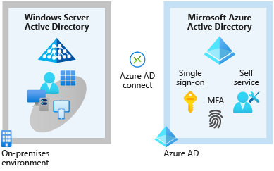
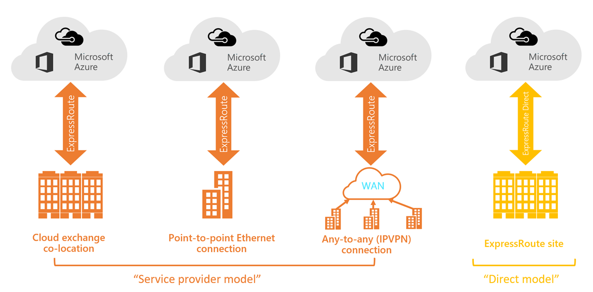
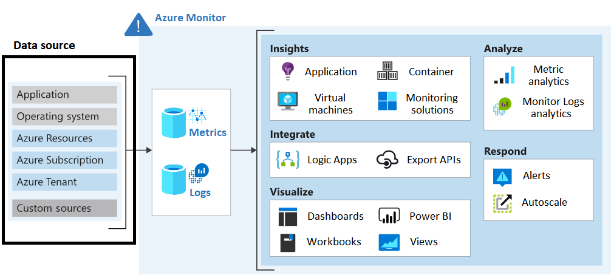
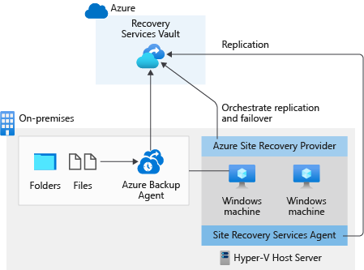
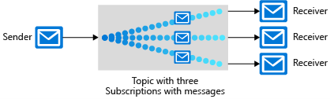
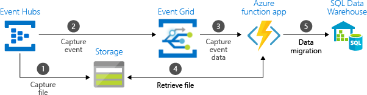
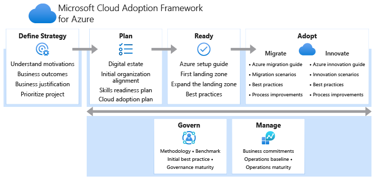
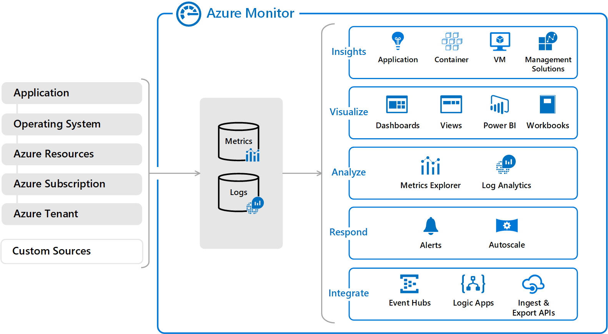
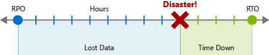
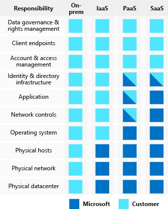

<!-- TOC start (generated with https://github.com/derlin/bitdowntoc) -->

# Table of Contents 

  * [Build a cloud governance strategy on Azure](#build-a-cloud-governance-strategy-on-azure)
  * [Cloud Adoption Framework](#cloud-adoption-framework)
  * [Microsoft Azure Well-Architected Framework](#microsoft-azure-well-architected-framework)
  * [Azure identity services ](#azure-identity-services)
  * [Azure compute services](#azure-compute-services)
  * [Azure message queues](#azure-message-queues)
  * [Azure networking services](#azure-networking-services)
  * [Azure Storage services](#azure-storage-services)
  * [Azure database and analytics services](#azure-database-and-analytics-services)
  * [Design governance ](#design-governance)
  * [Authentication and authorization solutions](#authentication-and-authorization-solutions)
  * [Logging and monitoring](#logging-and-monitoring)
  * [High availability and disaster recovery (HADR) ](#high-availability-and-disaster-recovery-hadr)
  * [Backup and disaster recovery](#backup-and-disaster-recovery)
  * [Data storage](#data-storage)
  * [Data storage solution for relational data](#data-storage-solution-for-relational-data)
  * [Data integration](#data-integration)
  * [Azure compute service](#azure-compute-service)
  * [Application architecture](#application-architecture)
  * [Azure Well-Architected Framework](#azure-well-architected-framework)
  * [Microsoft Cloud Adoption Framework](#microsoft-cloud-adoption-framework)

<!-- TOC end -->

# Contents: Cloud Development Challenge

1. [Describe core Azure architectural components](https://learn.microsoft.com/en-us/training/modules/azure-architecture-fundamentals/?WT.mc_id=cloudskillschallenge_71858d04-7069-436b-860c-a432f5bf3540&ns-enrollment-type=Collection&ns-enrollment-id=ykznh4nr46px)
1. [Build a cloud governance strategy on Azure](https://learn.microsoft.com/en-us/training/modules/build-cloud-governance-strategy-azure/?WT.mc_id=cloudskillschallenge_71858d04-7069-436b-860c-a432f5bf3540&ns-enrollment-type=Collection&ns-enrollment-id=ykznh4nr46px)
1. [Microsoft Cloud Adoption Framework for Azure](https://learn.microsoft.com/en-us/training/modules/microsoft-cloud-adoption-framework-for-azure/?WT.mc_id=cloudskillschallenge_71858d04-7069-436b-860c-a432f5bf3540&ns-enrollment-type=Collection&ns-enrollment-id=ykznh4nr46px)
1. [Introduction to the Microsoft Azure Well-Architected Framework](https://learn.microsoft.com/en-us/training/modules/azure-well-architected-introduction/?WT.mc_id=cloudskillschallenge_71858d04-7069-436b-860c-a432f5bf3540&ns-enrollment-type=Collection&ns-enrollment-id=ykznh4nr46px)
1. [Secure access to your applications by using Azure identity services](https://learn.microsoft.com/en-us/training/modules/secure-access-azure-identity-services/?WT.mc_id=cloudskillschallenge_71858d04-7069-436b-860c-a432f5bf3540&ns-enrollment-type=Collection&ns-enrollment-id=ykznh4nr46px)
1. [Explore Azure compute services](https://learn.microsoft.com/en-us/training/modules/azure-compute-fundamentals/?WT.mc_id=cloudskillschallenge_71858d04-7069-436b-860c-a432f5bf3540&ns-enrollment-type=Collection&ns-enrollment-id=ykznh4nr46px)
1. [Discover Azure message queues](https://learn.microsoft.com/en-us/training/modules/discover-azure-message-queue/?WT.mc_id=cloudskillschallenge_71858d04-7069-436b-860c-a432f5bf3540&ns-enrollment-type=Collection&ns-enrollment-id=ykznh4nr46px)
1. [Explore Azure networking services](https://learn.microsoft.com/en-us/training/modules/azure-networking-fundamentals/?WT.mc_id=cloudskillschallenge_71858d04-7069-436b-860c-a432f5bf3540&ns-enrollment-type=Collection&ns-enrollment-id=ykznh4nr46px)
1. [Explore Azure Storage services](https://learn.microsoft.com/en-us/training/modules/azure-storage-fundamentals/?WT.mc_id=cloudskillschallenge_71858d04-7069-436b-860c-a432f5bf3540&ns-enrollment-type=Collection&ns-enrollment-id=ykznh4nr46px)
1. [Explore Azure database and analytics services](https://learn.microsoft.com/en-us/training/modules/azure-database-fundamentals/?WT.mc_id=cloudskillschallenge_71858d04-7069-436b-860c-a432f5bf3540&ns-enrollment-type=Collection&ns-enrollment-id=ykznh4nr46px)
1. [Design governance](https://learn.microsoft.com/en-us/training/modules/design-governance/?WT.mc_id=cloudskillschallenge_71858d04-7069-436b-860c-a432f5bf3540&ns-enrollment-type=Collection&ns-enrollment-id=ykznh4nr46px)
1. [Design authentication and authorization solutions](https://learn.microsoft.com/en-us/training/modules/design-authentication-authorization-solutions/?WT.mc_id=cloudskillschallenge_71858d04-7069-436b-860c-a432f5bf3540&ns-enrollment-type=Collection&ns-enrollment-id=ykznh4nr46px)
1. [Design a solution to log and monitor Azure resources](https://learn.microsoft.com/en-us/training/modules/design-solution-to-log-monitor-azure-resources/?WT.mc_id=cloudskillschallenge_71858d04-7069-436b-860c-a432f5bf3540&ns-enrollment-type=Collection&ns-enrollment-id=ykznh4nr46px)
1. [Describe high availability and disaster recovery strategies](https://learn.microsoft.com/en-us/training/modules/describe-high-availability-disaster-recovery-strategies/?WT.mc_id=cloudskillschallenge_71858d04-7069-436b-860c-a432f5bf3540&ns-enrollment-type=Collection&ns-enrollment-id=ykznh4nr46px)
1. [Design a solution for backup and disaster recovery](https://learn.microsoft.com/en-us/training/modules/design-solution-for-backup-disaster-recovery/?WT.mc_id=cloudskillschallenge_71858d04-7069-436b-860c-a432f5bf3540&ns-enrollment-type=Collection&ns-enrollment-id=ykznh4nr46px)
1. [Design a data storage solution for non-relational data](https://learn.microsoft.com/en-us/training/modules/design-data-storage-solution-for-non-relational-data/?WT.mc_id=cloudskillschallenge_71858d04-7069-436b-860c-a432f5bf3540&ns-enrollment-type=Collection&ns-enrollment-id=ykznh4nr46px)
1. [Design a data storage solution for relational data](https://learn.microsoft.com/en-us/training/modules/design-data-storage-solution-for-relational-data/?WT.mc_id=cloudskillschallenge_71858d04-7069-436b-860c-a432f5bf3540&ns-enrollment-type=Collection&ns-enrollment-id=ykznh4nr46px)
1. [Design data integration](https://learn.microsoft.com/en-us/training/modules/design-data-integration/?WT.mc_id=cloudskillschallenge_71858d04-7069-436b-860c-a432f5bf3540&ns-enrollment-type=Collection&ns-enrollment-id=ykznh4nr46px)
1. [Design an Azure compute solution](https://learn.microsoft.com/en-us/training/modules/design-compute-solution/?WT.mc_id=cloudskillschallenge_71858d04-7069-436b-860c-a432f5bf3540&ns-enrollment-type=Collection&ns-enrollment-id=ykznh4nr46px)
1. [Design an application architecture](https://learn.microsoft.com/en-us/training/modules/design-application-architecture/?WT.mc_id=cloudskillschallenge_71858d04-7069-436b-860c-a432f5bf3540&ns-enrollment-type=Collection&ns-enrollment-id=ykznh4nr46px)
1. [Design network solutions](https://learn.microsoft.com/en-us/training/modules/design-network-solutions/?WT.mc_id=cloudskillschallenge_71858d04-7069-436b-860c-a432f5bf3540&ns-enrollment-type=Collection&ns-enrollment-id=ykznh4nr46px)
1. [Design migrations](https://learn.microsoft.com/en-us/training/modules/design-migrations/?WT.mc_id=cloudskillschallenge_71858d04-7069-436b-860c-a432f5bf3540&ns-enrollment-type=Collection&ns-enrollment-id=ykznh4nr46px)
1. [Microsoft Azure Well-Architected Framework - Cost optimization](https://learn.microsoft.com/en-us/training/modules/azure-well-architected-cost-optimization/?WT.mc_id=cloudskillschallenge_71858d04-7069-436b-860c-a432f5bf3540&ns-enrollment-type=Collection&ns-enrollment-id=ykznh4nr46px)
1. [Microsoft Azure Well-Architected Framework - Operational excellence](https://learn.microsoft.com/en-us/training/modules/azure-well-architected-operational-excellence/?WT.mc_id=cloudskillschallenge_71858d04-7069-436b-860c-a432f5bf3540&ns-enrollment-type=Collection&ns-enrollment-id=ykznh4nr46px)
1. [Microsoft Azure Well-Architected Framework - Performance efficiency](https://learn.microsoft.com/en-us/training/modules/azure-well-architected-performance-efficiency/?WT.mc_id=cloudskillschallenge_71858d04-7069-436b-860c-a432f5bf3540&ns-enrollment-type=Collection&ns-enrollment-id=ykznh4nr46px)
1. [Microsoft Azure Well-Architected Framework - Reliability](https://learn.microsoft.com/en-us/training/modules/azure-well-architected-reliability/?WT.mc_id=cloudskillschallenge_71858d04-7069-436b-860c-a432f5bf3540&ns-enrollment-type=Collection&ns-enrollment-id=ykznh4nr46px)
1. [Microsoft Azure Well-Architected Framework - Security](https://learn.microsoft.com/en-us/training/modules/azure-well-architected-security/?WT.mc_id=cloudskillschallenge_71858d04-7069-436b-860c-a432f5bf3540&ns-enrollment-type=Collection&ns-enrollment-id=ykznh4nr46px)
1. [Getting started with the Microsoft Cloud Adoption Framework for Azure](https://learn.microsoft.com/en-us/training/modules/cloud-adoption-framework-getting-started/?WT.mc_id=cloudskillschallenge_71858d04-7069-436b-860c-a432f5bf3540&ns-enrollment-type=Collection&ns-enrollment-id=ykznh4nr46px)
1. [Prepare for successful cloud adoption with a well-defined strategy](https://learn.microsoft.com/en-us/training/modules/cloud-adoption-framework-strategy/?WT.mc_id=cloudskillschallenge_71858d04-7069-436b-860c-a432f5bf3540&ns-enrollment-type=Collection&ns-enrollment-id=ykznh4nr46px)
1. [Prepare for cloud adoption with a data-driven plan](https://learn.microsoft.com/en-us/training/modules/cloud-adoption-framework-plan/?WT.mc_id=cloudskillschallenge_71858d04-7069-436b-860c-a432f5bf3540&ns-enrollment-type=Collection&ns-enrollment-id=ykznh4nr46px)
1. [Choose the best Azure landing zone to support your requirements for cloud operations](https://learn.microsoft.com/en-us/training/modules/cloud-adoption-framework-ready/?WT.mc_id=cloudskillschallenge_71858d04-7069-436b-860c-a432f5bf3540&ns-enrollment-type=Collection&ns-enrollment-id=ykznh4nr46px)
1. [Migrate to Azure through repeatable processes and common tools](https://learn.microsoft.com/en-us/training/modules/cloud-adoption-framework-migrate/?WT.mc_id=cloudskillschallenge_71858d04-7069-436b-860c-a432f5bf3540&ns-enrollment-type=Collection&ns-enrollment-id=ykznh4nr46px)
1. [Address tangible risks with the Govern methodology of the Cloud Adoption Framework for Azure](https://learn.microsoft.com/en-us/training/modules/cloud-adoption-framework-govern/?WT.mc_id=cloudskillschallenge_71858d04-7069-436b-860c-a432f5bf3540&ns-enrollment-type=Collection&ns-enrollment-id=ykznh4nr46px)
1. [Ensure stable operations and optimization across all supported workloads deployed to the cloud](https://learn.microsoft.com/en-us/training/modules/cloud-adoption-framework-manage/?WT.mc_id=cloudskillschallenge_71858d04-7069-436b-860c-a432f5bf3540&ns-enrollment-type=Collection&ns-enrollment-id=ykznh4nr46px)
1. [Innovate applications by using Azure cloud technologies](https://learn.microsoft.com/en-us/training/modules/innovate-applications-with-azure-cloud-technologies/?WT.mc_id=cloudskillschallenge_71858d04-7069-436b-860c-a432f5bf3540&ns-enrollment-type=Collection&ns-enrollment-id=ykznh4nr46px)
1. [Prepare for cloud security by using the Microsoft Cloud Adoption Framework for Azure](https://learn.microsoft.com/en-us/training/modules/cloud-adoption-framework-security/?WT.mc_id=cloudskillschallenge_71858d04-7069-436b-860c-a432f5bf3540&ns-enrollment-type=Collection&ns-enrollment-id=ykznh4nr46px)

## Build a cloud governance strategy on Azure

- Resource groups are also a scope for applying role-based access control (RBAC) permissions. 

- All subscriptions within a single management group must trust the same Azure AD tenant.

- Azure RBAC doesn't enforce access permissions at the application or data level. Application security must be handled by your application.

- Azure role-based access control (Azure RBAC) > IAM
Lock > Under Settings, select Locks, and then select Add.

- Azure Policy enables you to define both individual policies and groups of related policies, known as initiatives. 

- Initiatives enable you <strong>to group several related policy definitions</strong> to simplify assignments and management because you work with a group as a single item. 

- Instead of having to configure features like Azure Policy for each new subscription, with Azure Blueprints you can define a repeatable set of governance tools and standard Azure resources that your organization requires. 

- Azure role-based access control (Azure RBAC) enables you to create roles that define access permissions.
- Resource locks prevent resources from being accidentally deleted or changed.
- Resource tags provide extra information, or metadata, about your resources.
- Azure Policy is a service in Azure that enables you to create, assign, and manage policies that control or audit your resources.
- Azure Blueprints enables you to define a repeatable set of governance tools and standard Azure resources that your organization requires.- 

## Cloud Adoption Framework

- Key takeaways
Here are the six key takeaways:

1. The three main components of the Cloud Adoption Framework (plan, ready, and adopt) can be applied to different stages for cloud adopters. They should be revisited often because cloud adoption is an ongoing journey, not a destination.

1. A modernization trigger is an event that initiates the cloud adoption journey for an enterprise. The most common modernization triggers include datacenter contracts expiring, the need to deliver applications and features faster, urgent capacity needs, a software or hardware refresh, the need to address security threats, compliance, enabling new business opportunities, and software end of support.

1. The Plan phase focuses on aligning technology decisions to business priorities, with clear business outcomes and setting the proper cloud rationalization approach.

1. Readying your people, organization process, and environment for cloud adoption are critical factors in the success of your cloud adoption journey.

1. Adopting the cloud technologies defined in your plan and for which you have readied your organization depends on what you're actually doing. Are you migrating or innovating with a new workload to the cloud?

1. Governing and managing your cloud environment is as critical to your successful cloud adoption as any other stage. As such, it should be considered and executed properly.

- Resources

  **Microsoft Cloud Adoption Framework for Azure:**

  - [Microsoft Cloud Adoption Framework for Azure documentation](https://learn.microsoft.com/en-us/azure/cloud-adoption-framework/overview)

  **Financial planning:**

  - [Total cost of ownership (TCO) calculator](https://azure.microsoft.com/pricing/tco/calculator/)
  - [Azure pricing calculator](https://azure.microsoft.com/pricing/calculator/)
  - [Microsoft Cost Management](https://azure.microsoft.com/services/cost-management/)
  - [Create a financial model for cloud transformation](https://learn.microsoft.com/en-us/azure/cloud-adoption-framework/strategy/financial-models)

  **Skills readiness paths:**

  - [Azure fundamentals part 1: describe core Azure concepts](https://learn.microsoft.com/en-us/training/paths/az-900-describe-cloud-concepts/)
  - [Microsoft certified: Azure solutions architect expert](https://learn.microsoft.com/en-us/certifications/azure-solutions-architect/?wt.mc_id=learningredirect_certs-web-wwl)
  - [Solutions architect: learning path](https://learn.microsoft.com/en-us/training/browse/?roles=solution-architect&resource_type=learning%20path)

  **Cloud migration:**

  - [Migration in documentation](https://learn.microsoft.com/en-us/azure/cloud-adoption-framework/migrate/)
  - [Migration considerations](https://learn.microsoft.com/en-us/azure/cloud-adoption-framework/migrate/migration-considerations/)
  - [Migration tools decision guide](https://learn.microsoft.com/en-us/azure/cloud-adoption-framework/decision-guides/migrate-decision-guide/)

  **Cloud governance:**

  - [Governance benchmark tool](https://cafbaseline.com/)
  - [Governance in the Cloud Adoption Framework](https://learn.microsoft.com/en-us/azure/cloud-adoption-framework/govern/)
  - [Azure Blueprints samples](https://learn.microsoft.com/en-us/azure/governance/blueprints/samples/)

  **Cloud adoption plan:**

  - Review [sample business outcomes](https://learn.microsoft.com/en-us/azure/cloud-adoption-framework/strategy/business-outcomes/).
  - Review [approaches to digital estate planning](https://learn.microsoft.com/en-us/azure/cloud-adoption-framework/digital-estate/approach).
  - Document those findings in the provided [business outcome template](https://archcenter.blob.core.windows.net/cdn/business-outcome-template.xlsx) to share with internal partners during the transformation journey.
  - Identify the [learning metrics](https://learn.microsoft.com/en-us/azure/cloud-adoption-framework/strategy/learning-metrics) that best represent progress toward the identified business outcomes.
  - Establish a [financial model](https://learn.microsoft.com/en-us/azure/cloud-adoption-framework/strategy/financial-models) that aligns with the outcomes and learning metrics.
  - Document and incorporate the [digital estate](https://learn.microsoft.com/en-us/azure/cloud-adoption-framework/digital-estate/) in the current environment to populate the financial model.

## Microsoft Azure Well-Architected Framework

- [Azure Architecture Center](https://learn.microsoft.com/en-us/azure/architecture/framework)

The Azure Well-Architected Framework is a set of guiding tenets to build high-quality solutions on Azure. There's no one-size-fits-all approach to designing an architecture, but there are some universal concepts that apply regardless of the architecture, technology, or cloud provider.

These concepts aren't all-inclusive, but focusing on them can help you build a reliable, secure, and flexible foundation for your application.

The Azure Well-Architected Framework consists of five pillars:

  1. Cost optimization
  1. Operational excellence
  1. Performance efficiency
  1. Reliability
  1. Security

Scaling up is adding more resources to a single instance. Also known as vertical scaling.

Scaling out is adding more instances. Also known as horizontal scaling.


Security layers


Shared security responsibility


Recovery point objective (RPO): The maximum duration of acceptable data loss. RPO is measured in units of time, not volume. Examples are "30 minutes of data," "four hours of data," and so on. RPO is about limiting and recovering from data loss, not data theft.

Recovery time objective (RTO): The maximum duration of acceptable downtime, where your specification defines "downtime". For example, if the acceptable downtime duration is eight hours if there's a disaster, then your RTO is eight hours.

## Azure identity services 

- What is authentication?

  Authentication is the process of establishing the identity of a person or service that wants to access a resource. It involves the act of challenging a party for legitimate credentials and provides the basis for creating a security principal for identity and access control. It establishes whether the user is who they say they are.

- What is authorization?

  Authentication establishes the user's identity, but authorization is the process of establishing what level of access an authenticated person or service has. It specifies what data they're allowed to access and what they can do with it.

  

- How does Azure AD compare to Active Directory?

  Active Directory is related to Azure AD, but they have some key differences.

  Microsoft introduced Active Directory in Windows 2000 to give organizations the ability to manage multiple on-premises infrastructure components and systems by using a single identity per user.

  For on-premises environments, Active Directory running on Windows Server provides an identity and access management service that's managed by your own organization. Azure AD is Microsoft's cloud-based identity and access management service. With Azure AD, you control the identity accounts, but Microsoft ensures that the service is available globally. If you've worked with Active Directory, Azure AD will be familiar to you.

  When you secure identities on-premises with Active Directory, Microsoft doesn't monitor sign-in attempts. When you connect Active Directory with Azure AD, Microsoft can help protect you by detecting suspicious sign-in attempts at no extra cost. For example, Azure AD can detect sign-in attempts from unexpected locations or unknown devices.

- What services does Azure AD provide?

  Azure AD provides services such as:

  1. Authentication

  This includes verifying identity to access applications and resources. It also includes providing functionality such as self-service password reset, multifactor authentication, a custom list of banned passwords, and smart lockout services.

  2. Single sign-on

  SSO enables you to remember only one username and one password to access multiple applications. A single identity is tied to a user, which simplifies the security model. As users change roles or leave an organization, access modifications are tied to that identity, which greatly reduces the effort needed to change or disable accounts.

  3. Application management

  You can manage your cloud and on-premises apps by using Azure AD. Features like Application Proxy, SaaS apps, the My Apps portal (also called the access panel), and single sign-on provide a better user experience.

  4. Device management

  Along with accounts for individual people, Azure AD supports the registration of devices. Registration enables devices to be managed through tools like Microsoft Intune. It also allows for device-based Conditional Access policies to restrict access attempts to only those coming from known devices, regardless of the requesting user account.

- How can I connect Active Directory with Azure AD?

  There are a few ways to connect your existing Active Directory installation with Azure AD. Perhaps the most popular method is to use Azure AD Connect.

  Azure AD Connect synchronizes user identities between on-premises Active Directory and Azure AD. Azure AD Connect synchronizes changes between both identity systems, so you can use features like SSO, multifactor authentication, and self-service password reset under both systems. Self-service password reset prevents users from using known compromised passwords.

  

- What's multifactor authentication?

  Multifactor authentication is a process where a user is prompted during the sign-in process for an additional form of identification. 

  These elements fall into three categories:

  ```cmd
    Something the user knows:
    This might be an email address and password.

    Something the user has: 
    This might be a code that's sent to the user's mobile phone.

    Something the user is:
    This is typically some sort of biometric property, such as a fingerprint or face scan that's used on many mobile devices.
  ```

  These services provide Azure AD Multi-Factor Authentication capabilities:

    1. Azure Active Directory
    1. Multifactor authentication for Office 365

- What's Conditional Access?

  Conditional Access is a tool that Azure Active Directory uses to allow (or deny) access to resources based on identity signals. These signals include who the user is, where the user is, and what device the user is requesting access from.

  Conditional Access is useful when you need to:

  1. Require multifactor authentication to access an application.
  1. Require access to services only through approved client applications.
  1. Require users to access your application only from managed devices.
  1. Block access from untrusted sources, such as access from unknown or unexpected locations.

  To use Conditional Access, you need an Azure AD Premium P1 or P2 license. If you have a Microsoft 365 Business Premium license, you also have access to Conditional Access features.

- Summary

  - Authentication (AuthN) establishes the user's identity.
  - Authorization (AuthZ) establishes the level of access that an authenticated user has.
  - Single sign-on (SSO) enables a user to sign in one time and use that credential to access multiple resources and applications.
  - Azure Active Directory (Azure AD) is a cloud-based identity and access management service. - - - Azure AD enables an organization to control access to apps and resources based on its business requirements.
  - Azure AD Multi-Factor Authentication provides additional security for identities by requiring two or more elements to fully authenticate. In general, multifactor authentication can include something the user knows, something the user has, and something the user is.
  - Conditional Access is a tool that Azure AD uses to allow or deny access to resources based on identity signals such as the user's location.

## Azure compute services

- Some of the most prominent services are:

  - Virtual machines:
  Virtual machines are software emulations of physical computers. They include a virtual processor, memory, storage, and networking resources. 

  - Virtual machine scale sets: 
  Virtual machine scale sets are an Azure compute resource that you can use to deploy and manage a set of identical VMs.

  - Containers and Kubernetes:
  Container Instances and Azure Kubernetes Service are Azure compute resources that you can use to deploy and manage containers. 

  - App Service:
  With Azure App Service, you can quickly build, deploy, and scale enterprise-grade web, mobile, and API apps running on any platform. 

  - Functions (or serverless computing): 
  Functions are ideal when you're concerned only about the code running your service and not the underlying platform or infrastructure. 

- Scale VMs in Azure

  - VMs are an ideal choice when you need:

    1. Total control over the operating system (OS).
    1. The ability to run custom software.
    1. To use custom hosting configurations.

  - Virtual machine scale sets: Virtual machine scale sets let you create and manage a group of identical, load-balanced VMs.
  - Azure Batch: Azure Batch enables large-scale parallel and high-performance computing (HPC) batch jobs with the ability to scale to tens, hundreds, or thousands of VMs.

- Azure App Service

  - With App Service, you can host most common app service styles like:

    1. Web apps
    1. API apps
    1. WebJobs
    1. Mobile apps

  - App Service handles most of the infrastructure decisions you deal with in hosting web-accessible apps:

    1. Deployment and management are integrated into the platform.
    1. Endpoints can be secured.
    1. Sites can be scaled quickly to handle high traffic loads.
    1. The built-in load balancing and traffic manager provide high availability.

- Containers and Kubernetes:

  - Azure Container Instances

  Azure Container Instances offers the fastest and simplest way to run a container in Azure without having to manage any virtual machines or adopt any additional services. It's a platform as a service (PaaS) offering that allows you to upload your containers, which it runs for you.

  - Azure Kubernetes Service

  The task of automating, managing, and interacting with a large number of containers is known as orchestration. Azure Kubernetes Service is a complete orchestration service for containers with distributed architectures and large volumes of containers.

- Azure Functions

  - Serverless computing is the abstraction of servers, infrastructure, and operating systems. With serverless computing, Azure takes care of managing the server infrastructure and the allocation and deallocation of resources based on demand. Infrastructure isn't your responsibility.

  - Azure has two implementations of serverless compute:

    1. Azure Functions: Functions can execute code in almost any modern language. (Normally stateless, but Durable Functions provide state.)
    1. Azure Logic Apps: Logic apps are designed in a web-based designer and can execute logic triggered by Azure services without writing any code. (Stateful)

- Azure Virtual Desktop 

  - Azure Virtual Desktop is a desktop and application virtualization service that runs on the cloud. It enables your users to use a cloud-hosted version of Windows from any location. Azure Virtual Desktop works across devices like Windows, Mac, iOS, Android, and Linux. It works with apps that you can use to access remote desktops and apps. You can also use most modern browsers to access Azure Virtual Desktop-hosted experiences.

## Azure message queues

- Azure supports two types of queue mechanisms: Service Bus queues and Storage queues.

- Service Bus queues are part of a broader Azure messaging infrastructure that supports queuing, publish/subscribe, and more advanced integration patterns. They're designed to integrate applications or application components that may span multiple communication protocols, data contracts, trust domains, or network environments. 

  1. As a solution architect/developer,  **you should consider using Storage queues**  when:
    - Your solution needs to receive messages without having to poll the queue. With Service Bus, you can achieve it by using a long-polling receive operation using the TCP-based protocols that Service Bus supports.
    - Your solution requires the queue to provide a guaranteed first-in-first-out (FIFO) ordered delivery.
    - Your solution needs to support automatic duplicate detection.
    - You want your application to process messages as parallel long-running streams (messages are associated with a stream using the  **session ID**  property on the message). In this model, each node in the consuming application competes for streams, as opposed to messages. When a stream is given to a consuming node, the node can examine the state of the application stream state using transactions.
    - Your solution requires transactional behavior and atomicity when sending or receiving multiple messages from a queue.
    - Your application handles messages that can exceed 64 KB but won't likely approach the 256-KB limit.

  2. Service Bus offers a standard and premium tier. The premium tier of Service Bus Messaging addresses common customer requests around scale, performance, and availability for mission-critical applications. The premium tier is recommended for production scenarios.
  3. The primary wire protocol for Service Bus is Advanced Messaging Queueing Protocol (AMQP) 1.0, an open ISO/IEC standard. [AMQP protocol guide](https://learn.microsoft.com/en-us/azure/service-bus-messaging/service-bus-amqp-protocol-guide)
  4. The messaging entities that form the core of the messaging capabilities in Service Bus are queues, topics and subscriptions, and rules/actions.
  5. You can specify two different modes in which Service Bus receives messages: Receive and delete or Peek lock.
  6. To create a first-in, first-out (FIFO) guarantee in Service Bus, use sessions. Message sessions enable joint and ordered handling of unbounded sequences of related messages.

- Storage queues are part of the Azure Storage infrastructure. They allow you to store large numbers of messages. You access messages from anywhere in the world via authenticated calls using HTTP or HTTPS. A queue message can be up to 64 KB in size. A queue may contain millions of messages, up to the total capacity limit of a storage account. Queues are commonly used to create a backlog of work to process asynchronously. 

  1. As a solution architect/developer,  **you should consider using Storage queues**  when:
  - Your application must store over 80 gigabytes of messages in a queue.
  - Your application wants to track progress for processing a message in the queue. It's useful if the worker processing a message crashes. Another worker can then use that information to continue from where the prior worker left off.
  - You require server side logs of all of the transactions executed against your queues.
  2. Azure Queue Storage is a service for storing large numbers of messages. You access messages from anywhere in the world via authenticated calls using HTTP or HTTPS. A queue message can be up to 64 KB in size. A queue may contain millions of messages, up to the total capacity limit of a storage account. Queues are commonly used to create a backlog of work to process asynchronously.

## Azure networking services

You can think of an Azure network as an extension of your on-premises network with resources that link other Azure resources.

Azure virtual networks provide the following key networking capabilities:

1. Isolation and segmentation
1. Internet communications
1. Communicate between Azure resources
1. Communicate with on-premises resources
1. Route network traffic
1. Filter network traffic
1. Connect virtual networks

- Communicate between Azure resources

You can enable Azure resources to communicate securely with each other, in one of two ways:

  1. Virtual networks : Virtual networks can connect not only VMs but other Azure resources, such as the App Service Environment for Power Apps, Azure Kubernetes Service, and Azure Virtual Machine Scale Sets.
  1. Service endpoints : You can use service endpoints to connect to other Azure resource types, such as Azure SQL databases and storage accounts. This approach enables you to link multiple Azure resources to virtual networks to improve security and provide optimal routing between resources.

- Communicate with on-premises resources

Azure virtual networks enable you to link resources together in your on-premises environment and within your Azure subscription. In effect, you can create a network that spans both your local and cloud environments. There are three mechanisms for you to achieve this connectivity:

  1. Point-to-site virtual private networks : The typical approach to a virtual private network (VPN) connection is from a computer outside your organization, back into your corporate network. In this case, the client computer initiates an encrypted VPN connection to connect that computer to the Azure virtual network.
  1. Site-to-site virtual private networks : A site-to-site VPN links your on-premises VPN device or gateway to the Azure VPN gateway in a virtual network. In effect, the devices in Azure can appear as being on the local network. The connection is encrypted and works over the internet.
  1. Azure ExpressRoute : For environments where you need greater bandwidth and even higher levels of security, Azure ExpressRoute is the best approach. ExpressRoute provides a dedicated private connectivity to Azure that doesn't travel over the internet. (You can learn more about ExpressRoute in a separate unit later in this module.)

- Route network traffic

By default, Azure routes traffic between subnets on any connected virtual networks, on-premises networks, and the internet. You can also control routing and override those settings, as follows:

  1. Route tables : A route table allows you to define rules about how traffic should be directed. You can create custom route tables that control how packets are routed between subnets.
  1. Border Gateway Protocol : Border Gateway Protocol (BGP) works with Azure VPN gateways, Azure Route Server, or ExpressRoute to propagate on-premises BGP routes to Azure virtual networks.

- Filter network traffic

Azure virtual networks enable you to filter traffic between subnets by using the following approaches:

  1. Network security groups : A network security group is an Azure resource that can contain multiple inbound and outbound security rules. You can define these rules to allow or block traffic, based on factors such as source and destination IP address, port, and protocol.
  1. Network virtual appliances : A network virtual appliance is a specialized VM that can be compared to a hardened network appliance. A network virtual appliance carries out a particular network function, such as running a firewall or performing wide area network (WAN) optimization.

- Connect virtual networks

You can link virtual networks together by using virtual network peering. Peering enables resources in each virtual network to communicate with each other. These virtual networks can be in separate regions, allowing you to create a global interconnected network through Azure.

User-defined routes (UDR) are a significant update to Azure’s Virtual Networks that allows for greater control over network traffic flow. This method allows network administrators to control the routing tables between subnets within a VNet, and between VNets.

  

- Virtual Network

  - Address space: When you set up a virtual network, you define the internal address space in Classless Interdomain Routing (CIDR) format. This address space needs to be unique within your subscription and any other networks that you connect to. Let's assume you choose an address space of 10.0.0.0/24 for your first virtual network. The addresses defined in this address space range from 10.0.0.1 to 10.0.0.254. You then create a second virtual network and choose an address space of 10.0.0.0/8. The addresses in this address space range from 10.0.0.1 to 10.255.255.254. Some of the addresses overlap and can't be used for the two virtual networks. But you can use 10.0.0.0/16, with addresses that range from 10.0.0.1 to 10.0.255.254, and 10.1.0.0/16, with addresses that range from 10.1.0.1 to 10.1.255.254. You can assign these address spaces to your virtual networks because there's no address overlap.

  - Subnet: Within each virtual network address range, you can create one or more subnets that partition the virtual network's address space. Routing between subnets then depends on the default traffic routes. You also can define custom routes. Alternatively, you can define one subnet that encompasses all the virtual networks' address ranges.

  - Service endpoints: Here, you enable service endpoints. Then you select from the list which Azure service endpoints you want to enable. Options include Azure Cosmos DB, Azure Service Bus, Azure Key Vault, and so on.

  - NAT gateway: A NAT gateway is a fully managed and highly resilient Network Address Translation (NAT) service. You can configure a subnet to use a static outbound IP address when accessing the internet. For more information about NAT gateway, see Azure Virtual Network NAT overview

  - Network security group: Network security groups have security rules that enable you to filter the type of network traffic that can flow in and out of virtual network subnets and network interfaces. You create the network security group separately. Then you associate it with each subnet in the virtual network.

  - Route table: Azure automatically creates a route table for each subnet within an Azure virtual network and adds system default routes to the table. You can add custom route tables to modify traffic between subnets and virtual networks.

  - Subnet Delegation: You can designate the subnet to be used by a dedicate service.

  - Summary

    1. Address spaces: You can add more address spaces to the initial definition.
    1. Connected devices: View a list of all connected host in the virtual network.
    1. Subnets: You can add more subnets.
    1. DDos protection: You can enable or disable the Standard DDos protection plan.
    1. Firewall: Configure firewall settings with Azure Firewall service for the virtual network.
    1. Security: Provides security recommendation you can apply to your virtual network.
    1. Network Manager: View connectivity and security admin configuration the virtual network is associated to.
    1. DNS servers: Configure the internal or external DNS servers that the resources in the virtual network use.
    1. Peerings: Link virtual networks in peering arrangements.
    1. Service endpoints: Enable service endpoints and apply them to multiple subnets.
    1. Private endpoints: View a list of private endpoints enabled in a subnet.

- Azure VPN Gateway

  VPNs use an encrypted tunnel within another network. They're typically deployed to connect two or more trusted private networks to one another over an untrusted network (typically the public internet). Traffic is encrypted while traveling over the untrusted network to prevent eavesdropping or other attacks.

A VPN gateway is a type of virtual network gateway. Azure VPN Gateway instances are deployed in a dedicated subnet of the virtual network and enable the following connectivity:

1. Connect on-premises datacenters to virtual networks through a site-to-site connection.
1. Connect individual devices to virtual networks through a point-to-site connection.
1. Connect virtual networks to other virtual networks through a network-to-network connection.

All data transfer is encrypted inside a private tunnel as it crosses the internet. You can deploy only one VPN gateway in each virtual network, but you can use one gateway to connect to multiple locations, which includes other virtual networks or on-premises datacenters.

  

When you deploy a VPN gateway, you specify the VPN type: either policy-based or route-based. The main difference between these two types of VPNs is how traffic to be encrypted is specified. In Azure, both types of VPN gateways use a preshared key as the only method of authentication. Both types also rely on Internet Key Exchange (IKE) in either version 1 or version 2 and Internet Protocol Security (IPSec). IKE is used to set up a security association (an agreement of the encryption) between two endpoints. This association is then passed to the IPSec suite, which encrypts and decrypts data packets encapsulated in the VPN tunnel.

1. Policy-based VPN gateways specify statically the IP address of packets that should be encrypted through each tunnel. This type of device evaluates every data packet against those sets of IP addresses to choose the tunnel where that packet is going to be sent through.

    - Support for IKEv1 only. 
    - Use of static routing

1. If defining which IP addresses are behind each tunnel is too cumbersome, route-based gateways can be used. With route-based gateways, IPSec tunnels are modeled as a network interface or virtual tunnel interface. IP routing (either static routes or dynamic routing protocols) decides which of the tunnel interfaces to use when sending each packet. Route-based VPNs are the preferred connection method for on-premises devices.

    - Supports IKEv2
    - Uses any-to-any (wildcard) traffic selectors
    - Can use dynamic routing protocols

1. The following diagram shows this combination of resources and their relationships to help you better understand what's required to deploy a VPN gateway.

    

    The virtual network gateway can be either a VPN or ExpressRoute gateway, but this unit only deals with VPN virtual network gateways. 

    local network gateway to define the on-premises network's configuration, such as where the VPN gateway connects and what it connects to. 

1. Fault-tolerant configuration.

    Active/Standby and Active/Active

      

- Azure ExpressRoute

There are several benefits to using ExpressRoute as the connection service between Azure and on-premises networks.


1. Layer 3 connectivity between your on-premises network and the Microsoft Cloud through a connectivity provider. Connectivity can be from an any-to-any (IPVPN) network, a point-to-point 1. Ethernet connection, or through a virtual cross-connection via an Ethernet exchange.
Connectivity to Microsoft cloud services across all regions in the geopolitical region.
1. Global connectivity to Microsoft services across all regions with the ExpressRoute premium add-on.
1. Dynamic routing between your network and Microsoft via BGP.
1. Built-in redundancy in every peering location for higher reliability.
1. Connection uptime SLA.
1. QoS support for Skype for Business.

ExpressRoute enables direct access to the following services in all regions:

1. Microsoft Office 365
1. Microsoft Dynamics 365
1. Azure compute services, such as Azure Virtual Machines
1. Azure cloud services, such as Azure Cosmos DB and Azure Storage

ExpressRoute uses the Border Gateway Protocol (BGP) routing protocol. 

ExpressRoute supports the following models that you can use to connect your on-premises network to the Microsoft cloud:



**ExpressRoute does provide private connectivity, but it isn't encrypted.**

## Azure Storage services

- Disk Storage provides disks for Azure virtual machines. Disk Storage provides disks for Azure virtual machines. 

- Azure Blob Storage is an object storage solution for the cloud. It can store massive amounts of data, such as text or binary data. Azure Blob Storage is unstructured, meaning that there are no restrictions on the kinds of data it can hold. Storing up to 8 TB of data for virtual machines.

- Azure Files offers fully managed file shares in the cloud that are accessible via the industry standard Server Message Block and Network File System protocols. Azure file shares can be mounted concurrently by cloud or on-premises deployments of Windows, Linux, and macOS. Azure Files ensures the data is encrypted at rest, and the SMB protocol ensures the data is encrypted in transit.

- Blob access tiers

    1. Hot access tier: Optimized for storing data that is accessed frequently (for example, images for your website).
    1. Cool access tier: Optimized for data that is infrequently accessed and stored for at least 30 days (for example, invoices for your customers).
    1. Archive access tier: Appropriate for data that is rarely accessed and stored for at least 180 days, with flexible latency requirements (for example, long-term backups).

- Azure Blob Storage is your best option for storing disaster recovery files and archives.

## Azure database and analytics services

1. Azure Cosmos DB
    1. Azure Cosmos DB is a globally distributed, multi-model database service. 
    1. Azure Cosmos DB is flexible. At the lowest level, Azure Cosmos DB stores data in atom-record-sequence (ARS) format. The data is then abstracted and projected as an API, which you specify when you're creating your database. Your choices include SQL, MongoDB, Cassandra, Tables, and Gremlin. 
    1. Azure Cosmos DB supports schemaless data, which lets you build highly responsive and "Always On" applications to support constantly changing data.  
1. Azure SQL Database
    1. Azure SQL Database is a platform as a service (PaaS) database engine. It handles most of the database-management functions — such as upgrading, patching, backups, and monitoring — without user involvement. SQL Database provides 99.99 percent availability. 
1. Azure SQL Managed Instance
    1. Azure SQL Database and Azure SQL Managed Instance offer many of the same features; however, Azure SQL Managed Instance provides several options that might not be available to Azure SQL Database. 
    1. **Azure SQL Database only uses the default SQL_Latin1_General_CP1_CI_AS server collation.**
    1. [Features comparison: Azure SQL Database and Azure SQL Managed Instance.](https://learn.microsoft.com/en-us/azure/azure-sql/database/features-comparison/)
1. Azure Database for MySQL
    1. Azure Database for MySQL is a relational database service in the cloud, and it's based on the MySQL Community Edition database engine, versions 5.6, 5.7, and 8.0. With it, you have a 99.99 percent availability service-level agreement from Azure, powered by a global network of Microsoft-managed datacenters. This helps keep your app running 24/7.
1. Azure Database for PostgreSQL
    1. Azure Database for PostgreSQL is available in two deployment options: Single Server and Hyperscale (Citus).
    1. The Hyperscale (Citus) option horizontally scales queries across multiple machines by using sharding. Its query engine parallelizes incoming SQL queries across these servers for faster responses on large datasets. It serves applications that require greater scale and performance, generally workloads that are approaching, or already exceed, 100 GB of data. The Hyperscale (Citus) deployment option supports multi-tenant applications, real-time operational analytics, and high-throughput transactional workloads.
1. Azure Synapse Analytics
    1. Azure Synapse Analytics (formerly Azure SQL Data Warehouse) is a limitless analytics service that brings together enterprise-data warehousing and big-data analytics. You can query data on your terms by using either serverless or provisioned resources at scale. You have a unified experience to ingest, prepare, manage, and serve data for immediate business intelligence and machine learning needs.
1. Azure HDInsight
    1. You can run popular open-source frameworks and create cluster types such as Apache Spark, Apache Hadoop, Apache Kafka, Apache HBase. HDInsight also supports a broad range of scenarios such as extraction, transformation, and loading (ETL), data warehousing, machine learning, and IoT.
1. Azure Databricks
    1. You can run popular open-source frameworks and create cluster types such as Apache Spark, Apache Hadoop, Apache Kafka, Apache HBase. HDInsight also supports a broad range of scenarios such as extraction, transformation, and loading (ETL), data warehousing, machine learning, and IoT.
1. Azure Data Lake Analytics
    1. The analytics service can handle jobs of any scale instantly by setting the dial for how much power you need. You only pay for your job when it's running, making it more cost-effective.

## Design governance 

- A typical Azure hierarchy has four levels: management groups, subscriptions, resource groups, and resources. 

- 

1. Management groups help you manage access, policy, and compliance for multiple subscriptions.

    1. Management groups can be used to aggregate policy and initiative assignments via Azure Policy.

    1. A management group tree can support up to six levels of depth. This limit doesn't include the tenant root level or the subscription level.

    1. Azure role-based access control authorization for management group operations isn't enabled by default.

    1. By default, all new subscriptions are placed under the root management group.

1. Subscriptions are logical containers that serve as units of management and scale. Subscriptions are also billing boundaries.

    1. There are several types of subscriptions. [Link](https://azure.microsoft.com/support/legal/offer-details/)

    1. Subscriptions can provide separate billing environments, such as development, test, and production.

    1. Policies for individual subscriptions can help satisfy different compliance standards.

    1. You can organize specialized workloads to scale beyond the limits of an existing subscription.

    1. By using subscriptions, you can manage and track costs for your organizational structure.

1. Resource groups are logical containers into which Azure resources are deployed and managed.

    1. Resource groups have their own location (region) assigned. This region is where the metadata is stored.

    1. If the resource group's region is temporarily unavailable, you can't update resources in the resource group because the metadata is unavailable. The resources in other regions still function as expected, but you can't update them.

    1. Resources in the resource group can be in different regions.

    1. A resource can connect to resources in other resource groups. You can have a web application that connects to a database in a different resource group.

    1. Resources can be moved between resource groups with some exceptions.

    1. You can add a resource to or remove a resource from a resource group at any time.

    1. Resource groups can't be nested.

    1. Each resource must be in one, and only one, resource group.

    1. Resource groups can't be renamed.

1. Resources are instances of services that you create. For example, virtual machines, storage, and SQL databases.

    1. A resource tag consists of a name-value pair. For example, env = production or env = dev, test.

    1. You can assign one or more tags to each Azure resource, resource group, or subscription.

    1. Resource tags can be added, modified, and deleted. These actions can be done with PowerShell, the Azure CLI, Azure Resource Manager (ARM) templates, the REST API, or the Azure portal.

    1. Tags can be applied to a resource group. However, tags applied to a resource group aren't inherited by the resources in the group.

    

1. Azure policy

    1. Azure Policy lets you define both individual policies and groups of related policies, called initiatives. Azure Policy comes with many built-in policy and initiative definitions.

    1. Azure policies are inherited down the hierarchy.

    1. You can scope and enforce Azure policies at different levels in the organizational hierarchy.

    1. Azure Policy evaluates all resources in Azure and Arc-enabled resources (specific resource types that are hosted outside of Azure).

    1. Azure Policy highlights resources that aren't compliant with the current policies.

    1. Use Azure Policy to prevent noncompliant resources from being created, and automatically remediate noncompliant resources.

    1. Azure Policy integrates with **Azure DevOps** by applying pre-deployment and post-deployment policies.

1. Azure Role-based access control (RBAC)

    - RBAC is an allow model. An allow model means when a user is assigned a specific role, Azure RBAC allows the user to perform the actions associated with that role. A role assignment could grant a user read permissions to a resource group. To have write permissions, the role would need to explicitly allow write access.

    1. Allow one user to manage virtual machines in a subscription, and allow another user to manage virtual networks.

    1. Allow members of a database administrator group to manage SQL databases in a subscription.

    1. Allow a user to manage all resources in a resource group, such as virtual machines, websites, and subnets.

    1. Allow an application to access all resources in a resource group.

1. Azure Blueprints lets you define a repeatable set of governance tools and standard Azure resources that your organization requires.

    

    1. Azure Blueprints orchestrates the deployment of various resource templates and other artifacts.

    1. With Azure Blueprints, the relationship between the blueprint definition (what should be deployed) and the blueprint assignment (what was deployed) is preserved.

    1. Azure creates a record that associates a resource with the blueprint that defines it. This connection helps you track and audit your deployments.

    - Azure Policy is a default allow and explicit deny system focused on resource properties for deployment and for already existing resources. Azure Policy supports cloud governance by validating that resources within a subscription adhere to requirements and standards. You can include an Azure policy as an artifact in a blueprint definition. A policy in a blueprint enables the creation of the correct pattern or design during assignment of the blueprint. 

1. Landing zones

    - An Azure landing zone provides an infrastructure environment for hosting your workloads. Landing zones ensure key foundational principles are put in place before you deploy services.

    To use an analogy, shared city utilities like water, gas, and electricity are available to new homes before they're built. In the same manner, the network, identity and access management, policies, and monitoring configuration for landing zones must be ready before you try to deploy. These "utilities" for landing zones need to be active and ready to help streamline the application migration process.

    1. Landing zones are defined by management groups and subscriptions that are designed to scale according to business needs and priorities.

    

    1. Diagram of a management group and subscription organization that uses landing zones.

    1. Azure policies are associated with landing zones to ensure continued compliance with the organization platform.

    1. Landing zones are pre-provisioned through code.

    1. A landing zone can be scoped to support application migrations and development to scale across the organization's full IT portfolio.

    1. The Azure landing zone accelerator can be deployed into the same Azure AD tenant for an existing Azure architecture. The accelerator is an Azure-portal-based deployment.


## Authentication and authorization solutions

1. Identity and access management (IAM)

    1. Consider using Azure Active Directory. Develop with Azure AD for a solution that combines core directory services, application access management, and identity protection. Azure AD provides an identity and access management system for Tailwind Traders employees that can operate in a cloud or hybrid environment.

    1. Consider your business-to-business (B2B) requirements. Support collaboration for guest users and external business partners of Tailwind Traders, such as suppliers and vendors. Build your solution with Azure AD B2B (business-to-business) to support business-to-business operations.

    1. Consider your business-to-customer scenarios. Control how Tailwind Traders customers sign up, sign in, and manage their profiles when they use your apps. Use Azure AD B2C (business-to-customer) to develop an Azure AD solution that supports customer-focused operations.

1. Azure AD also offers a hybrid identity solution for identity management in Tailwind Traders hybrid environments. 

1. Consider password hash synchronization. Enable password hash synchronization to sync user password hashes from an on-premises Azure AD instance to a cloud-based Azure AD instance. This sync helps to protect Tailwind Traders against leaked credentials being replayed from previous sign-ins.

1. **With Azure AD B2B, the external partner uses their own identity management solution. Azure AD isn't required.**

    

1. **Azure AD B2C provides secure authentication for your customers by using their preferred identity providers.**

    1. Azure AD B2C stores custom attributes about customers so you can use the information in your apps.
    1. You can use branded registration and custom UI sign-in experiences.
    1. Consider allowing users to sign in with their social identities. 

    

1. Conditional Access

    1. Conditional Access is a tool that Azure Active Directory uses to allow (or deny) access to resources. When a user signs in, Conditional Access examines who the user is, where the user is, and from what device the user is requesting access. Based on these signals, Conditional Access can allow access, enforce multifactor authentication (MFA), or deny access.

    1. To use Conditional Access, you need an Azure AD Premium P1 or P2 license. If you have a Microsoft 365 Business Premium license, you also have access to Conditional Access features.

    

1. Identity Protection

    - Identity Protection is a tool that allows organizations to accomplish three key tasks:

    1. Automate the detection and remediation of identity-based risks.

    1. Investigate risks by using data in the Azure portal.

    1. Export risk detection data to other tools.

    Identity Protection then aggregates the user's risk. If the risk level meets the Identity Protection policy threshold, the user can be blocked or challenged by MFA. If the user risk level is acceptable, they're granted access.

    

    - Identity Protection provides risk policy detection that includes any identified suspicious actions related to user accounts in the directory.

    - Two risk policies are evaluated: user risk and sign-in risk:

    

    A user risk policy represents the probability a given identity or account is compromised. A scenario would be where a user's valid credentials are leaked.

    A sign-in risk policy can identify anonymous IP and atypical locations. Secondary MFA can then be required.

1. Access reviews

    - When an employee is first hired, they need initial access to corporate resources and apps. For each position they hold, they can have specific access requirements and privileges. When the employee leaves the company, their access is removed.

    - To ensure employees and users always have the correct access, you can perform an access review. An Azure Active Directory access review is a planned review of the access needs, rights, and history of user access.

    - There are three types of reviewers:

      1. Resource owners: The business owners of a resource.

      1. Delegates: A group of individuals selected by the access reviews admin.

      1. End user: A user who self-attests to their need for continued access.

    - When you create an access review, admins can choose one or more reviewers. All reviewers can start and carry out a review, and choose to grant the user continued access to a resource or remove their access.

1. Service principals for application

    - You need to understand the two ways an app can be represented in Azure AD: as an application object, or by a service principal.

      1. Application objects: Although there are exceptions, an app object can be considered the definition for an app. An app object allows the service to know how to issue tokens to the app based on the object settings. The app object exists only in its home directory, even if it's a multi-tenant app that supports service principals in other directories.

      1. Service principals: The service principal for an app can be considered an instance of an app. Service principals generally reference an app object. One app object can be referenced by multiple service principals across directories.

    

    - **There are three types of service principals that you can use for your organization: application, managed identity, and legacy.**

      1. Application: An application service principal is a local representation, or app instance, of a global app object in a single tenant or directory. This service principal is a concrete instance created from the app object that inherits certain properties from the object. The principal is created in each tenant where the app is used, and references the globally unique object. 

      1. Managed identity: This type of service principal represents a managed identity, which eliminates the need to manage credentials. Managed identities provide an identity for applications to use when connecting to resources that support Azure AD authentication. 

      1. Legacy: A legacy service principal represents a legacy app that was created before app registrations were introduced, or an app created through a legacy configuration experience. A legacy service principal can have credentials, service principal names, reply URLs, and other properties that an authorized user can edit. A legacy service principal doesn't have an associated app registration.

    - **An app object has a 1:1 relationship with the software app, and a 1:many relationship with its service principal object(s).**

1. Managed identities

    - A managed identity combines Azure AD authentication and Azure role-based access control (RBAC).

    - When you use managed identities, you don't need to rotate credentials or worry about expiring certifications. Azure handles credential rotation and expiration in the background. To configure an app to use a managed identity, you use the provided token to call the service.

    - There are two types of managed identities:

      1. System-assigned: Some Azure services allow you to enable a managed identity directly on a service instance. When you enable a system-assigned managed identity, an identity is created in Azure AD that's tied to the lifecycle of that service instance. When the resource is deleted, Azure automatically deletes the identity. By design, only that Azure resource can use that identity to request tokens from Azure AD.

      1. User-assigned: You can create a managed identity as a standalone Azure resource. Create a user-assigned managed identity and assign it to one or more instances of an Azure service. A user-assigned identity is managed separately from the resources that use it.

1. Azure Key Vault

    - Key Vault is available in two service tiers:

      1. Standard tier lets you encrypt your data with a software key.
      2. Premium tier offers hardware security module (HSM)-protected keys.

## Logging and monitoring

1. Azure Monitor

    - Azure Monitor is based on a common monitoring data platform that enables you to view, analyze, and work with data gathered from your resources. The platform offers many features that support two primary components: Logs and Metrics.

    - Azure Monitor Logs lets you collect and organize data from resources that you monitor. You configure what data is gathered and how it's organized in the platform. Other features in Azure Monitor automatically store their data in Logs. You can use the stored data with your collected data to help monitor the performance of your environment.

    - Azure Monitor Metrics captures numerical data from your monitored resources and stores the results in a time-organized database. Metrics are collected at intervals you specify. You can use metrics to check how your system is performing at a particular time or under certain circumstances.

    

    

    1. Data from multiple resources can be collected into Azure Monitor and analyzed together by using a common set of tools.

    1. Logs enable complex analysis by using log queries.

    1. Metrics support near-real-time scenarios like priority alerts and responding to critical issues.

    1. Monitoring data can be sent to other locations to support certain scenarios, such as tracking and reporting.

    1. Sources of monitoring data from Azure applications can be organized into tiers, and each tier can be accessed in different ways.

        1. The highest tiers are for your application itself.
        1. The lower tiers are components of the Azure platform.

1. Azure Monitor Logs (Log Analytics) workspaces

    - Data in an Azure Monitor Logs workspace is organized into tables. Each table stores different kinds of data and has its own unique set of properties based on the resource that's generating the data. 

    - A workspace enables you to configure settings like pricing tier, retention, and data capping based on administrative boundaries or geographic locations.

    - With **Azure role-based access control (Azure RBAC)**, you can grant users and groups only the amount of access they need to work with monitoring data in a workspace.

1. Azure Workbooks and Azure insights

    - Azure Workbooks is a feature of Azure Monitor. Workbooks provide a flexible canvas for data analysis and the creation of rich visual reports within the Azure portal. Customers use Workbooks to explore the usage of an app, to do root cause analysis, put together an operational playbook, and many other tasks.

    - Workbooks are currently compatible with the following data sources:

      - Logs
      - Metrics
      - Azure Resource Graph
      - Alerts
      - Workload Health
      - Azure Resource Health
      - Azure Data Explorer
    
    - Azure insights provide a customized monitoring experience for particular applications and services.

    - Azure insights collect and analyze both logs and metrics.

1. Azure Data Explorer 

    - Azure Data Explorer is a platform for big data that helps you analyze high volumes of data in near real time. Azure Data Explorer comes equipped with features to help you configure an end-to-end solution for ingesting and managing your data, running queries, and generating visualizations.

    

## High availability and disaster recovery (HADR) 

- Recovery Time Objective (RTO) is the maximum amount of time available to bring resources online after an outage or problem. If that process takes longer than the RTO, there could be consequences such as financial penalties, work not able to be done, and so on. 

- Recovery Point Objective (RPO) is the point in time to which a database should be recovered and equates to the maximum amount of data loss that the business is willing to accept. 

- Azure provides three main options to enhance availability for IaaS deployments:

  1. Availability Sets

  Availability sets are separated into both **fault domains and update domains** to support both updates to the underlying Azure Infrastructure. Fault domains are sets of servers within a data center, which use the same power source and network There can be up to three fault domains in a data center as depicted in the image below by FD 0, 1, and 2. Update domains, denoted by UD in the image below, indicate groups of virtual machines and underlying physical hardware that can be rebooted at the same time. Different update domains ensure separation.

  

  2. Availability Zones

  Availability zones account for data center-level failure in Azure. Each Azure region consists of many data centers with low latency network connections between them. 
  
  3. Azure Site Recovery

  Azure Site Recovery provides enhanced availability for VMs at the Azure level and can work with VMs hosting SQL Server. Azure Site Recovery replicates a VM from one Azure region to another to create a disaster recovery solution for that VM.

- PaaS is different when it comes to availability; you can only configure the options that Azure provides.

  - For the SQL Server-based options of Azure SQL Database and Azure SQL Database Managed Instance, the options are active geo-replication (Azure SQL Database only) and autofailover groups (Azure SQL Database or Azure SQL Database Managed Instance).

## Backup and disaster recovery

- Azure backup services to design solutions that support business continuity (BC) and disaster recovery (DR), or BCDR.

- A primary goal for BCDR is to ensure business applications are reliable.

  1. Applications must be resilient to component failure.
  1. Applications must be highly available, which means they can run in a healthy state with no significant downtime.

- Availability metrics 
  - Mean time to recovery (MTTR): Determines the average time it takes to restore a component after a failure.
  - Mean time between failures (MTBF): Identifies how long a component can reasonably expect to last between outages.

- Recovery metrics

  - Recovery time objective (RTO): Defines the maximum acceptable time one of the apps can be unavailable following an incident.
  - Recovery point objective (RPO): Defines the maximum duration of data loss that's acceptable during a disaster.
  - Recovery level objective (RLO): Specifies the granularity of the required recovery, such as recovering a web app, a website, or a specific resource.

- Azure Backup

    
  
  1. The following diagram shows a high-level view of the soft delete feature for containers and blobs, and blob versions.

      

  1. Azure Files provides the capability to take share snapshots of file shares. Share snapshots give you an extra level of security, and help reduce the risk of data corruption or accidental deletion. You can also use share snapshots as a general backup for disaster recovery.

  1. Azure Backup provides independent and isolated backups for Azure virtual machines. You can use Azure Backup to take snapshot backups and restore the data on your virtual machines if there's data corruption or accidental deletion.

  1. A robust plan includes automated backup for Azure SQL Database and Azure SQL Managed Instance. Database backups should enable database restoration to a specific point in time within the configured retention period.

- Azure Site Recovery provides BCDR features for your applications in Azure, on-premises, and in other cloud providers. The service offers plans to help automate your disaster recovery.

- Use Azure Site Recovery with Azure Backup



In this scenario, Azure Backup periodically backs up the files and folders on your Windows machine to Azure. This process ensures they data is secure and retrievable even if the whole on-premises environment stops functioning. Separately, Azure Site Recovery is used to protect your running workloads and keep them running. Because Site Recovery can replicate frequently, the RTO for your workloads can be reduced.

- Azure Backup is designed to provide scheduled backups to a storage vault.

- **Azure Site Recovery is designed to provide continuous replication to a secondary region.**

## Data storage

- Consider Azure Blob Storage. Store vast amounts of unstructured data by using Azure Blob Storage. Blob stands for Binary Large Object. Blob Storage is often used for images and multimedia files.

- Consider Azure Files. Provide fully managed file shares in the cloud with Azure Files. This storage data is accessible via the industry standard Server Message Block (SMB) protocol, Network File System (NFS) protocol, and the Azure Files REST API.

- Consider Azure managed disks. Support Azure Virtual Machines by using Azure managed disks. These disks are block-level storage volumes that are managed by Azure. Managed disks perform like physical disks in an on-premises server, but in a virtual environment.

- Consider Azure Queue Storage. Use Azure Queue Storage to store large numbers of messages. Queue Storage is commonly used to create a backlog of work to process asynchronously.

- Data redundancy

  - Azure Storage offers two options for how your data is replicated in the primary region: locally redundant storage and zone-redundant storage.

  

  - Azure Storage offers two options for copying your data to a secondary region: geo-redundant storage and geo-zone-redundant storage.

- Azure Blob Storage supports two forms of immutability policies for implementing immutable storage: **Time-based retention policies & Legal hold policies**

- Azure managed disks: Each data disk has a maximum capacity of **32,767 GB**. There are several encryption types available for your managed disks.

## Data storage solution for relational data

- Azure SQL Database is a PaaS deployment option of Azure SQL that abstracts both the OS and the SQL Server instance. An Azure SQL database is a fully managed service. 

- SQL Database is the only deployment option that supports scenarios that require very large databases (currently up to 100 TB) or autoscaling for unpredictable workloads (serverless).

- You can create a SQL Database elastic database pool, where all databases in the pool share the same set of compute and storage resources.

- There are two primary pricing options for SQL Database: DTU and vCore. A serverless option is also available for a single database. 

  1. vCore: A vCore is a virtual core. You choose the number of virtual cores and have greater control over your compute costs. This option supports the Azure Hybrid Benefit for SQL Server and reserved capacity (pay in advance).

  1. DTU: A DTU (Database Transaction Unit) is a combined measure of compute, storage, and I/O resources.

  1. vCore: A vCore is a virtual core. You choose the number of virtual cores and have greater control over your compute costs. This option supports the Azure Hybrid Benefit for SQL Server and reserved capacity (pay in advance).

- Azure SQL Managed Instance is a PaaS deployment option of Azure SQL. As with Azure SQL Database, Azure SQL Managed Instance is a fully managed service. It provides an instance of SQL Server, but removes much of the overhead of managing a virtual machine.

- You can use SQL Managed Instance to do **lift-and-shift migrations** to Azure without having to redesign your applications.

- Azure SQL Managed Instance is ideal for customers interested in **instance-scoped** features, such as SQL Server Agent, Common language runtime (CLR), Database Mail, Distributed transactions, and Machine Learning Services.

- Things to consider when choosing database availability

  |                                    |                                  |                                                                                                   |
  |------------------------------------|----------------------------------|---------------------------------------------------------------------------------------------------|
  |**SQL Database ****vCore**** tiers**|**SQL Managed Instance DTU tiers**|**Database availability support**                                                                  |
  |**General Purpose**                 |**Standard** or **Basic**         |Provides balanced compute and storage options for business workloads                               |
  |**Business Critical**               |**Premium**                       |Meets low latency requirements and enables highest resilience to failures for business applications|
  |**Hyperscale**                      |No applicable tier                |Offers highly scalable storage and meets read-scale requirements for business workloads            |

- There are different encryption methods for each of data state. The following table summarizes the methods.

|                   |                                                           |                                                         |
|-------------------|-----------------------------------------------------------|---------------------------------------------------------|
|**Data state**     |**Encryption method**                                      |**Encryption level**                                     |
|**Data at rest**   |Transparent data encryption (TDE)                          |Always encrypted                                         |
|**Data in motion** |Secure Socket Layers and Transport Layer Security (SSL/TLS)|Always encrypted                                         |
|**Data in process**|Dynamic data masking                                       |Specific data is unencrypted, Remaining data is encrypted|

- Azure SQL Edge is an optimized relational database engine geared for IoT and IoT Edge deployments. Azure SQL Edge is built on the same engine as SQL Server and Azure SQL. 

## Data integration

- Azure Data Factory is a cloud-based data integration service that can help you create and schedule data-driven workflows. You can use Azure Data Factory to orchestrate data movement and transform data at scale. The data-driven workflows, or pipelines, ingest data from disparate data stores. Azure Data Factory is an ETL data integration process, which stands for extract, transform, and load. This integration process combines data from multiple data sources into a single data store.

- Azure Data Factory has the following components that work together to provide the platform for data movement and data integration.

  

- The following diagram shows how unplanned data and streaming data are bulk ingested or unplanned ingested in **Azure Data Lake Storage**.

  

- Azure Databricks has a Control plane and a Data plane:

- Azure Databricks offers three environments for developing data intensive applications.**Databricks SQL, Databricks Data Science & Engineering, Databricks Machine Learning.**

- The Azure Synapse Analytics architecture includes a control node and a pool of compute nodes.

  

- Azure Synapse uses a technology named PolyBase that enables you to retrieve and query data from relational and non-relational sources. You can save the data read in as SQL tables within the Azure Synapse service.

- Azure Synapse Analytics is composed of the five elements: Azure Synapse SQL pool, Azure Synapse Spark pool, Azure Synapse Pipelines, Azure Synapse Link, Azure Synapse Studio.

- Azure Synapse Link: This component allows you to connect to Azure Cosmos DB. You can use it to perform near real-time analytics over the operational data stored in an Azure Cosmos DB database.

- Azure Stream Analytics supports processing events in three data formats: CSV, JSON, and Avro.

- The following illustration shows the Stream Analytics pipeline, and how data is ingested, analyzed, and sent for presentation or action.

  

## Azure compute service

- Lift and shift: For lift and shift workload migrations, consider compute services that don't require application redesigns or code changes.

- Azure offers three hosting options across the compute services.

  

- Azure compute service decision flowchart

  

## Application architecture

- Azure Service Bus publish-subscribe topics 

  

- Azure Event Hubs supports real time data ingestion and microservices batching on the same stream.

- You can send and receive events in many different languages. Messages can also be received from Azure Event Hubs by using Apache Storm.

- Event Hubs implements a **pull model** that differentiates it from other messaging services like Azure Service Bus queues.

  1. Event Hubs holds each message in its cache and allows it to be read.
  1. When a message is read from Event Hubs, it's not deleted. The message remains for other consumers.

  

- Azure Event Grid is a fully managed event routing service that runs on Azure Service Fabric. 

  1. Azure Event Grid aggregates all your events and provides routing from any source to any destination.

  1. Event Grid distributes events from sources like Azure Blob Storage accounts and Azure Media Services.

  1. Events are distributed to handlers like Azure Functions and Azure DevOps Webhooks.

  

- Azure Cache for Redis provides an in-memory data store based on the Redis software. Redis brings a critical low-latency and high-throughput data storage solution to modern applications.

- Azure API Management is a cloud service platform that lets you publish, secure, maintain, and analyze all your APIs. 

- **Azure API Management doesn't host your actual APIs. Your APIs remain where they were originally deployed.** Azure API Management serves as a front door for your APIs. 

- Azure Resource Manager (ARM) templates are files that define the infrastructure and configuration for your deployment. When you write an ARM template, you take a declarative approach to your resource provisioning. ARM templates describe each resource in the deployment, but they don't describe how to deploy the resources.

- Bicep is an ARM template language that's used to declaratively deploy Azure resources. Bicep is a domain-specific language, which means that it's designed for a specific scenario or domain. Bicep is used to create ARM templates.

- Azure Automation delivers a cloud-based automation and configuration service that supports consistent management across your Azure and non-Azure environments. Azure Automation gives you complete control in three service areas: process automation, configuration management, and update management. 

- Azure App Configuration provides a service to centrally manage application settings and feature flags. You can use App Configuration to store all the settings for your application and secure their accesses in one place.

  

- Load Balancing

  

- **Azure Private Link enables you to access Azure PaaS services (such as Azure Storage and SQL Database) and Azure hosted customer-owned/partner services over a private endpoint in your virtual network.** Traffic between your virtual network and the service travels the Microsoft backbone network.

- Azure Bastion is a fully platform-managed PaaS service that you implement inside your virtual network. Azure Bastion provides secure and seamless RDP/SSH connectivity to your virtual machines directly in the Azure portal over TLS. Azure Bastion helps protect against port scanning. RDP ports, SSH ports, and public IP addresses aren't publicly exposed for your virtual machines.

- **A hub-spoke network topology** is a way to isolate workloads while sharing services such as identity and security. The hub is a virtual network in Azure that acts as a central point of connectivity to your on-premises network. Spokes are virtual networks that peer with the hub. Shared services are deployed in the hub, while individual workloads are deployed as spokes. [Hub-spoke topology with Azure Virtual WAN](https://learn.microsoft.com/en-us/azure/architecture/networking/hub-spoke-vwan-architecture)

- The following table compares the benefits and challenges of the network connectivity options.


|           |                                                                                                                                                                  |                                                                                                                                                                                                                                                                                                                  |                                                                                                                                                                                                         |                                                                                                                                                                                                                                                                                                                                  |
|-----------|------------------------------------------------------------------------------------------------------------------------------------------------------------------|------------------------------------------------------------------------------------------------------------------------------------------------------------------------------------------------------------------------------------------------------------------------------------------------------------------|---------------------------------------------------------------------------------------------------------------------------------------------------------------------------------------------------------|----------------------------------------------------------------------------------------------------------------------------------------------------------------------------------------------------------------------------------------------------------------------------------------------------------------------------------|
|**Compare**|**Azure VPN Gateway**                                                                                                                                             |**Azure ExpressRoute**                                                                                                                                                                                                                                                                                            |**ExpressRoute + VPN failover**                                                                                                                                                                          |**Azure Virtual WAN + hub-spoke**                                                                                                                                                                                                                                                                                                 |
|Benefits   |- Simple to configure- High bandwidth available (up to 10 Gbps depending on VPN Gateway SKU)                                                                      |- High bandwidth available (up to 10 Gbps depending on connectivity provider)- Supports dynamic scaling of bandwidth to help reduce costs during periods of lower demand (not supported by all connectivity providers)- Enables direct organizational access to national clouds (depends on connectivity provider)|- High availability if ExpressRoute circuit fails (fallback connection on lower bandwidth network                                                                                                        |- Reduced operational overhead by replacing existing hubs with fully managed service- Cost savings by using managed service, which removes need for NVA- Improved security via centrally managed secured hubs with Azure Firewall and Virtual WAN- Separates concerns between central IT (SecOps, InfraOps) and workloads (DevOps)|
|Challenges |- Requires on-premises VPN device                                                                                                                                 |- Can be complex to set up- Requires working with third-party connectivity provider- Provider responsible for provisioning network connection- Requires high-bandwidth routers on-premises                                                                                                                        |- Complex to configure- Must set up both VPN connection and ExpressRoute circuit- Requires redundant hardware (VPN appliances)- Requires redundant Azure VPN Gateway connection for which you pay charges|Note: Azure Virtual WAN is designed to reduce previously listed connectivity challenges.                                                                                                                                                                                                                                          |
|Scenarios  |Hybrid apps with light traffic between on-premises hardware and the cloudAble to trade slightly extended latency for flexibility and processing power of the cloud|Hybrid apps running large-scale, mission-critical workloads that require high degree of scalability                                                                                                                                                                                                               |Hybrid apps that require higher bandwidth of ExpressRoute and highly available network connectivity                                                                                                      |Connectivity among workloads requires central control and access to shared servicesEnterprise requires central control over security aspects like a firewall and segregated management for workloads in each spoke                                                                                                                |

## Azure Well-Architected Framework

  

 - The Azure Import/Export service migrates large quantities of data between an on-premises location and an Azure storage account. By using the Import/Export service, you send and receive physical disks that contain your data between your on-premises location and an Azure datacenter. You ship data that's stored on your own disk drives. These disk drives can be Serial ATA (SATA) hard-disk drives (HDDs) or solid-state drives (SSDs).

 - Azure Data Box provides a quick, reliable, and inexpensive method for moving large volumes of data to Azure. By using Data Box, you can send terabytes of data into and out of Azure. 

 - With your list of services captured, you can use the [Azure Pricing Calculator](https://azure.microsoft.com/pricing/calculator/) to create estimates of your application's cost. You can use the calculator to create, save, and share estimates for all Azure services.

 - The following illustration shows the available monitoring services assembled into logical groups. 

   

 - Azure Traffic Manager could help. Traffic Manager is a DNS-based load balancer that you can use to distribute traffic within and across Azure regions. 

    1. Priority: You specify an ordered list of front-end instances. If the one with the highest priority is unavailable, Traffic Manager routes the user to the next available instance.
    1. Weighted: You set a weight against each front-end instance. Traffic Manager then distributes traffic according to those defined ratios.
    1. Performance: Traffic Manager routes users to the closest front-end instance based on network latency.
    1. Geographic: You set up geographical regions for front-end deployments and route your users based on data-sovereignty mandates or localization of content.
  
  - Azure Monitor

   

  - SLA

  |       |                     |                      |                     |
  |-------|---------------------|----------------------|---------------------|
  |**SLA**|**Downtime per week**|**Downtime per month**|**Downtime per year**|
  |99%    |1.68 hours           |7.2 hours             |3.65 days            |
  |99.9%  |10.1 minutes         |43.2 minutes          |8.76 hours           |
  |99.95% |5 minutes            |21.6 minutes          |4.38 hours           |
  |99.99% |1.01 minutes         |4.32 minutes          |52.56 minutes        |
  |99.999%|6 seconds            |25.9 seconds          |5.26 minutes         |

  - RPO & RTO
    
    

  - Zero Trust model

    - Zero Trust model, which states that you should never assume trust, but instead continually validate trust. 

    - The common principles that help define a security posture are confidentiality, integrity, and availability, known collectively as CIA. Confidentiality, Integrity, Availability.

    - Security layers

      

      |     |                   |                                                      |               |
      |-----|-------------------|------------------------------------------------------|---------------|
      |**#**|**Ring**           |**Example**                                           |**Principle**  |
      |1    |Data               |Data encryption at rest in Azure Blob Storage         |Integrity      |
      |2    |Application        |SSL/TLS encrypted sessions                            |Integrity      |
      |3    |Compute            |Regular application of OS and layered software patches|Availability   |
      |4    |Network            |Network security rules                                |Confidentiality|
      |5    |Perimeter          |DDoS protection                                       |Availability   |
      |6    |Identity and access|Azure Active Directory user authentication            |Integrity      |
      |7    |Physical security  |Azure datacenter biometric access controls            |Confidentiality|

    - Shared responsibilities

      

  - Synchronize directories with Azure AD Connect

      

  - Service principals

    1. An identity is just a thing that can be authenticated. Obviously, this includes users with usernames and passwords, but it can also include applications or other servers, which might authenticate with secret keys or certificates. As a bonus definition, an account is data associated with an identity.

    2. **A principal** is an identity that acts with certain roles or claims. Consider the use of Sudo on a Bash prompt or on Windows via **Run as administrator.** In both of those cases, you're still signed in as the same identity as before, but you've changed your role.

  - Security Development Lifecycle

      
  
  - Microsoft Defender for Cloud is a service that's now enabled by default for all Azure subscriptions. It's tightly integrated with other Azure application-level services, such as Azure Application Gateway and Azure Web Application Firewall.

## Microsoft Cloud Adoption Framework

- [Ready methodology](https://learn.microsoft.com/en-us/azure/cloud-adoption-framework/ready/)

- [Cloud Adoption Strategy Evaluator](https://learn.microsoft.com/en-us/assessments/?mode=pre-assessment&session=local)

- OKR

  1. Objective: Clarity and intent

  1. Key results: Measures of success within a quarter

  1. Here are the key principles of OKRs:

    - Aspire and inspire: Teams establish their best possible results in a given quarter, focus efforts on great outcomes, and use retrospectives to learn and iterate.

    - Outcome focus: Quarterly key results provide clarity on where value is created. Being aware of where value is created helps teams and the organization drive business impacts faster.

    - Global and local: Teams localize OKRs into their nouns, verbs, and numbers that enrich OKRs with the team's expertise and insights.

    - Transparent: OKRs, alignment, and progress are visible to everyone through OKR software, which simplifies collaboration and supports making good decisions faster.

  1. How OKRs add value to an organization

      

- [Power BI template](https://raw.githubusercontent.com/microsoft/CloudAdoptionFramework/master/strategy/azure-virtual-machine-cost-estimator.pbix)

- [Excel file that feeds data into the Power BI template](https://view.officeapps.live.com/op/view.aspx?src=https%3A%2F%2Fraw.githubusercontent.com%2Fmicrosoft%2FCloudAdoptionFramework%2Fmaster%2Fstrategy%2Fon-premises-compute-unit-lists.xlsx&wdOrigin=BROWSELINK)

- [Azure DevOps homepage](https://azure.microsoft.com/services/devops/)

- Completion of the [getting-started Learn module about the Cloud Adoption Framework.](https://learn.microsoft.com/en-us/azure/cloud-adoption-framework/get-started/)

- The Cloud Adoption Framework provides a [governance benchmark tool](https://cafbaseline.com/) to help you identify gaps in the governance disciplines and corporate policy in your organization.

- Landing zone

    |           |                                                                                                                                                                                                                                                                                                                                                                                                                                                                                                            |                                                                                                                                                                                                                                                                                                                                                                                                                                                                                                                                  |
    |-----------|------------------------------------------------------------------------------------------------------------------------------------------------------------------------------------------------------------------------------------------------------------------------------------------------------------------------------------------------------------------------------------------------------------------------------------------------------------------------------------------------------------|----------------------------------------------------------------------------------------------------------------------------------------------------------------------------------------------------------------------------------------------------------------------------------------------------------------------------------------------------------------------------------------------------------------------------------------------------------------------------------------------------------------------------------|
    |**On-ramp**|**Description**                                                                                                                                                                                                                                                                                                                                                                                                                                                                                             |**Further guidance**                                                                                                                                                                                                                                                                                                                                                                                                                                                                                                              |
    |Start      |For organizations that are at the beginning of their cloud adoption journey (called greenfield) and want to implement a new cloud environment, based on best practices and proven architectural patterns.Start with the conceptual architecture of Azure landing zones to understand the recommended end state.Next, explore each of the design areas. Use the areas to understand the considerations and decisions that you need to design and implement the landing zone that best fits your requirements.|[What is an Azure landing zone?](https://learn.microsoft.com/en-us/azure/cloud-adoption-framework/ready/landing-zone/)[Azure landing zone design areas](https://learn.microsoft.com/en-us/azure/cloud-adoption-framework/ready/landing-zone/design-areas)                                                                                                                                                                                                                                                                         |
    |Align      |For organizations that have an existing environment that needs modification to align to the target architecture and best practices for an Azure landing zone (called brownfield).Use the transition from brownfield guidance to understand the decision points and technical approach to refactoring environments to align with the guidance in the Ready methodology.                                                                                                                                      |[Refactor a landing zone](https://learn.microsoft.com/en-us/azure/cloud-adoption-framework/ready/landing-zone/refactor)[Transition existing Azure environments to the Azure landing zone conceptual architecture](https://learn.microsoft.com/en-us/azure/cloud-adoption-framework/ready/enterprise-scale/transition)[Scenarios: Transitioning existing Azure environments to the Azure landing zone conceptual architecture](https://learn.microsoft.com/en-us/azure/cloud-adoption-framework/ready/landing-zone/align-scenarios)|
    |Enhance    |For environments that are already in line with best practices but the organization wants to add more controls or features.Explore articles about enhancing the key ongoing processes for cloud environments, such as management, governance, and security.                                                                                                                                                                                                                                                  |[Enhance guidance for management](https://learn.microsoft.com/en-us/azure/cloud-adoption-framework/ready/considerations/landing-zone-operations)[Enhance guidance for governance](https://learn.microsoft.com/en-us/azure/cloud-adoption-framework/ready/considerations/landing-zone-governance)[Enhance guidance for security](https://learn.microsoft.com/en-us/azure/cloud-adoption-framework/ready/considerations/landing-zone-security)                                                                                      |

- Govern methodology

    

- Governance disciplines

  - The following table summarizes each discipline from the Govern methodology in the Cloud Adoption Framework:

    [Cost Management discipline](https://learn.microsoft.com/en-us/azure/cloud-adoption-framework/govern/cost-management/): Cost is a primary concern for cloud users. Develop policies for cost control for all cloud platforms.    

    [Security Baseline discipline](https://learn.microsoft.com/en-us/azure/cloud-adoption-framework/govern/security-baseline/): Security is a complex subject that's unique to each company. Once security requirements are established, cloud-governance policies and enforcement apply those requirements across network, data, and asset configurations. 

    [Identity Baseline discipline](https://learn.microsoft.com/en-us/azure/cloud-adoption-framework/govern/identity-baseline/): Inconsistencies in the application of identity requirements can increase the risk of breach. The Identity Baseline discipline focuses ensuring that identity is consistently applied across cloud-adoption efforts.

    [Resource Consistency discipline](https://learn.microsoft.com/en-us/azure/cloud-adoption-framework/govern/resource-consistency/): Cloud operations depend on consistent resource configuration. Through governance tooling, resources can be configured consistently to manage risks related to onboarding, drift, discoverability, and recovery.

    [Deployment Acceleration discipline](https://learn.microsoft.com/en-us/azure/cloud-adoption-framework/govern/deployment-acceleration/): Centralization, standardization, and consistency in approaches to deployment and configuration improve governance practices. When provided through cloud-based governance tooling, they create a cloud factor that can accelerate deployment activities.

- Move forward with your governance journey by following the most suitable Govern methodology guide in the Cloud Adoption Framework.

  - For standard enterprises:

    [Improve the Security Baseline discipline (standard enterprise)](https://learn.microsoft.com/en-us/azure/cloud-adoption-framework/govern/guides/standard/security-baseline-improvement)

    [Improve the Resource Consistency discipline (standard enterprise)](https://learn.microsoft.com/en-us/azure/cloud-adoption-framework/govern/guides/standard/resource-consistency-improvement)

    [Improve the Cost Management discipline (standard enterprise)](https://learn.microsoft.com/en-us/azure/cloud-adoption-framework/govern/guides/standard/cost-management-improvement)

    [Multicloud improvement (standard enterprise)](https://learn.microsoft.com/en-us/azure/cloud-adoption-framework/govern/guides/standard/multicloud-improvement)

  - For complex enterprises:

    [Improve the Security Baseline discipline (complex enterprise)](https://learn.microsoft.com/en-us/azure/cloud-adoption-framework/govern/guides/complex/security-baseline-improvement)

    [Improve the Resource Consistency discipline (complex enterprise)](https://learn.microsoft.com/en-us/azure/cloud-adoption-framework/govern/guides/complex/resource-consistency-improvement)

    [Improve the Cost Management discipline (complex enterprise)](https://learn.microsoft.com/en-us/azure/cloud-adoption-framework/govern/guides/complex/cost-management-improvement)

    [Multicloud improvement (complex enterprise)](https://learn.microsoft.com/en-us/azure/cloud-adoption-framework/govern/guides/complex/multicloud-improvement).

    [Improve the Identity Baseline discipline (complex enterprise)](https://learn.microsoft.com/en-us/azure/cloud-adoption-framework/govern/guides/complex/identity-baseline-improvement)

    [Multiple layers of governance (complex enterprise)](https://learn.microsoft.com/en-us/azure/cloud-adoption-framework/govern/guides/complex/multiple-layers-of-governance)

- Some of the most common enhancements to a management baseline:

|                                    |                                                                                                                         |                                                                                                                       |
|------------------------------------|-------------------------------------------------------------------------------------------------------------------------|-----------------------------------------------------------------------------------------------------------------------|
|**Tool**                            |**Description**                                                                                                          |**Link to more information**                                                                                           |
|Azure Resource Graph                |Visibility into changes to Azure resources that might help detect negative effects sooner or remediate faster            |[Azure Resource Graph product page](https://azure.microsoft.com/features/resource-graph/)                              |
|IT Service Management Connector     |Automated ITSM connection to create awareness sooner and enrich work items                                               |[IT Service Management Connector overview](https://learn.microsoft.com/en-us/azure/azure-monitor/alerts/itsmc-overview)|
|Azure Automation                    |Automation of:  Responses to changes  Resource-specific scaling or sizing issues  Operations across multiple clouds|[Azure Automation product page](https://azure.microsoft.com/services/automation/)                                      |
|Azure Automation State Configuration|Code-based configuration of guest operating systems to reduce configuration drifting and quickly find errors             |[State Configuration overview](https://learn.microsoft.com/en-us/azure/automation/automation-dsc-overview)             |
|Microsoft Defender for Cloud        |Extended protection to include recovery triggers for security breaches                                                   |[Microsoft Defender for Cloud product page](https://azure.microsoft.com/services/security-center/)                     |

- Security responsibilities (functions)

This diagram depicts the specific organizational functions within security. It represents an ideal view of a complete enterprise security team and might be an aspirational view for some security teams. Each function can be performed by one or more people. Each person can perform one or more functions based on factors like culture, budget, and available resources.

  

  

- Several tools and controls are available to help you quickly achieve a security baseline:

  [Microsoft Defender for Cloud](https://learn.microsoft.com/en-us/azure/defender-for-cloud/defender-for-cloud-introduction): Provides the tools needed to harden your resources, track your security posture, protect against cyberattacks, and streamline security management.

  [Azure Active Directory (Azure AD)](https://learn.microsoft.com/en-us/security/benchmark/azure/baselines/aad-security-baseline): The default identity and access management service. Azure AD provides an identity security score to help you assess your identity security posture relative to Microsoft's recommendations.

  [Microsoft Sentinel](https://learn.microsoft.com/en-us/azure/sentinel/overview): A cloud-native SIEM that provides intelligent security analytics for your entire enterprise, powered by AI.

  [Azure Distributed Denial of Service (DDoS) standard protection plan](https://learn.microsoft.com/en-us/azure/ddos-protection/ddos-protection-overview) (optional): Provides enhanced DDoS mitigation features to defend against DDoS attacks.

  [Azure Firewall](https://learn.microsoft.com/en-us/azure/firewall/overview): A cloud-native and intelligent network firewall security service that provides threat protection for your cloud workloads running in Azure.

  [Web Application Firewall](https://azure.microsoft.com/services/web-application-firewall/): A cloud-native service that protects web apps from common web-hacking techniques such as SQL injection and security vulnerabilities such as cross-site scripting.

  [Privileged Identity Management (PIM)](https://learn.microsoft.com/en-us/azure/active-directory/privileged-identity-management/pim-configure): A service in Azure AD that enables you to manage, control, and monitor access to important resources in your organization.

  [Microsoft Intune](https://learn.microsoft.com/en-us/mem/intune/fundamentals/what-is-intune): A cloud-based service that focuses on mobile device management and mobile application management.
