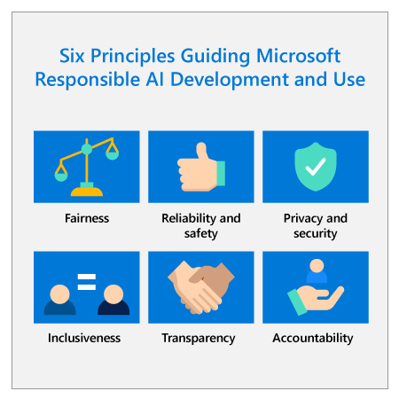
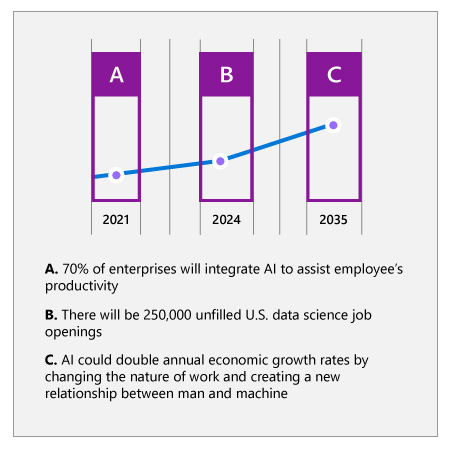

# Table of Contents 

<!-- TOC start (generated with https://github.com/derlin/bitdowntoc) -->

  * [Azure AI Fundamentals Exercises](#azure-ai-fundamentals-exercises)
  * [What is AI?](#what-is-ai)
  * [Azure Open AI](#azure-open-ai)
  * [Types of machine learning](#types-of-machine-learning)
  * [Azure Machine Learning](#azure-machine-learning)
  * [Computer vision ](#computer-vision)
  * [Azure Bot Service](#azure-bot-service)
  * [Analyze text with the Language service](#analyze-text-with-the-language-service)
  * [Introduction to Anomaly Detector](#introduction-to-anomaly-detector)
  * [Form Recognizer service](#form-recognizer-service)
  * [Azure Cognitive Search](#azure-cognitive-search)
  * [Responsible AI](#responsible-ai)
    + [Fairness](#fairness)
    + [Reliability and Safety](#reliability-and-safety)
    + [Privacy and Security](#privacy-and-security)
    + [Inclusiveness](#inclusiveness)
    + [Transparency](#transparency)
    + [Accountability](#accountability)
  * [Azure OpenAI Service](#azure-openai-service)
  * [Cognitive Services](#cognitive-services)
  * [Secure Cognitive Services](#secure-cognitive-services)
  * [Monitor Cognitive Services](#monitor-cognitive-services)
  * [Deploy cognitive services in containers](#deploy-cognitive-services-in-containers)
  * [Addressing future labor and workplace needs](#addressing-future-labor-and-workplace-needs)

<!-- TOC end -->

# Contents: Azure AI

1. [Get started with AI on Azure](https://learn.microsoft.com/en-us/training/modules/get-started-ai-fundamentals)
1. [Introduction to Azure OpenAI Service](https://learn.microsoft.com/en-us/training/modules/explore-azure-openai)
1. [Use Automated Machine Learning in Azure Machine Learning](https://learn.microsoft.com/en-us/training/modules/use-automated-machine-learning)
1. [Create a regression model with Azure Machine Learning designer](https://learn.microsoft.com/en-us/training/modules/create-regression-model-azure-machine-learning-designer)
1. [Create a classification model with Azure Machine Learning designer](https://learn.microsoft.com/en-us/training/modules/create-classification-model-azure-machine-learning-designer)
1. [Create a clustering model with Azure Machine Learning designer](https://learn.microsoft.com/en-us/training/modules/create-clustering-model-azure-machine-learning-designer)
1. [Analyze images with the Computer Vision service](https://learn.microsoft.com/en-us/training/modules/analyze-images-computer-vision)
1. [Build a bot with the Language Service and Azure Bot Service](https://learn.microsoft.com/en-us/training/modules/build-faq-chatbot-qna-maker-azure-bot-service)
1. [Introduction to Anomaly Detector](https://learn.microsoft.com/en-us/training/modules/intro-to-anomaly-detector)
1. [Analyze receipts with the Form Recognizer service](https://learn.microsoft.com/en-us/training/modules/analyze-receipts-form-recognizer)
1. [Introduction to Azure Cognitive Search](https://learn.microsoft.com/en-us/training/modules/intro-to-azure-search)
1. [Identify guiding principles for responsible AI](https://learn.microsoft.com/en-us/training/modules/responsible-ai-principles)
1. [Get started with Azure OpenAI Service](https://learn.microsoft.com/en-us/training/modules/get-started-openai)
1. [Build natural language solutions with Azure OpenAI Service](https://learn.microsoft.com/en-us/training/modules/build-language-solution-azure-openai)
1. [Apply prompt engineering with Azure OpenAI Service](https://learn.microsoft.com/en-us/training/modules/apply-prompt-engineering-azure-openai)
1. [Analyze text with the Language service](https://learn.microsoft.com/en-us/training/modules/analyze-text-with-text-analytics-service)
1. [Create and consume Cognitive Services](https://learn.microsoft.com/en-us/training/modules/create-manage-cognitive-services)
1. [Secure Cognitive Services](https://learn.microsoft.com/en-us/training/modules/secure-cognitive-services)
1. [Monitor Cognitive Services](https://learn.microsoft.com/en-us/training/modules/monitor-cognitive-services)
1. [Deploy cognitive services in containers](https://learn.microsoft.com/en-us/training/modules/investigate-container-for-use-cognitive-services)
1. [Identify governing practices for responsible AI](https://learn.microsoft.com/en-us/training/modules/responsible-ai-governing-practices)
1. [Discuss practices for responsible AI at Microsoft](https://learn.microsoft.com/en-us/training/modules/microsoft-responsible-ai-practices)

## Azure AI Fundamentals Exercises

- https://microsoftlearning.github.io/AI-900-AIFundamentals/

## What is AI?

- Simply put, AI is the creation of software that imitates human behaviors and capabilities. Key workloads include:

    1. Machine learning - This is often the foundation for an AI system, and is the way we "teach" a computer model to make predictions and draw conclusions from data.
    1. Anomaly detection - The capability to automatically detect errors or unusual activity in a system.
    1. Computer vision - The capability of software to interpret the world visually through cameras, video, and images.
    1. Natural language processing - The capability for a computer to interpret written or spoken language, and respond in kind.
    1. Knowledge mining - The capability to extract information from large volumes of often unstructured data to create a searchable knowledge store.

## Azure Open AI

- Azure OpenAI's relationship to Azure AI services


- Azure OpenAI supports can be categorized by tasks they support:

    1. Generating Natural Language
    1. Text completion: generate and edit text
    1. Embeddings: search, classify, and compare text
    1. Generating Code: generate, edit, and explain code
    1. Generating Images: generate and edit images

## Types of machine learning

There are two general approaches to machine learning, supervised and unsupervised machine learning. In both approaches, you train a model to make predictions.

- The supervised machine learning approach requires you to start with a dataset with known label values. Two types of supervised machine learning tasks include regression and classification.

    1. Regression: used to predict a continuous value; like a price, a sales total, or some other measure.
    1. Classification: used to determine a class label; an example of a binary class label is whether a patient has diabetes or not; an example of multi-class labels is classifying text as positive, negative, or neutral.

- The unsupervised machine learning approach starts with a dataset without known label values. One type of unsupervised machine learning task is clustering.

    1. Clustering: used to determine labels by grouping similar information into label groups; like grouping measurements from birds into species.

## Azure Machine Learning

- Azure Machine Learning studio: Azure Machine Learning studio is a web portal for machine learning solutions in Azure.

- Azure Machine Learning compute

    1. Compute Instances: Development workstations that data scientists can use to work with data and models.
    1. Compute Clusters: Scalable clusters of virtual machines for on-demand processing of experiment code.
    1. Inference Clusters: Deployment targets for predictive services that use your trained models.
    1. Attached Compute: Links to existing Azure compute resources, such as Virtual Machines or Azure Databricks clusters.

- Azure Automated Machine Learning

    1. Azure Machine Learning includes an automated machine learning capability that automatically tries multiple pre-processing techniques and model-training algorithms in parallel. These automated capabilities use the power of cloud compute to find the best performing supervised machine learning model for your data.

    1. Understand the AutoML process
        1. Prepare data: Identify the features and label in a dataset. Pre-process, or clean and transform, the data as needed.
        1. Train model: Split the data into two groups, a training and a validation set. Train a machine learning model using the training data set. Test the machine learning model for performance using the validation data set.
        1. Evaluate performance: Compare how close the model's predictions are to the known labels.
        1. Deploy a predictive service: After you train a machine learning model, you can deploy the model as an application on a server or device so that others can use it.

- Regression is a form of machine learning used to understand the relationships between variables to predict a desired outcome. Regression predicts a numeric label or outcome based on variables, or features. For example, an automobile sales company might use the characteristics of a car (such as engine size, number of seats, mileage, and so on) to predict its likely selling price. In this case, the characteristics of the car are the features, and the selling price is the label.

    1. Evaluate performance

        1. Mean Absolute Error (MAE): The average difference between predicted values and true values. This value is based on the same units as the label, in this case dollars. The lower this value is, the better the model is predicting.
        1. Root Mean Squared Error (RMSE): The square root of the mean squared difference between predicted and true values. The result is a metric based on the same unit as the label (dollars). When compared to the MAE (above), a larger difference indicates greater variance in the individual errors (for example, with some errors being very small, while others are large).
        1. Relative Squared Error (RSE): A relative metric between 0 and 1 based on the square of the differences between predicted and true values. The closer to 0 this metric is, the better the model is performing. Because this metric is relative, it can be used to compare models where the labels are in different units.
        1. Relative Absolute Error (RAE): A relative metric between 0 and 1 based on the absolute differences between predicted and true values. The closer to 0 this metric is, the better the model is performing. Like RSE, this metric can be used to compare models where the labels are in different units.
        1. Coefficient of Determination (R2): This metric is more commonly referred to as R-Squared, and summarizes how much of the variance between predicted and true values is explained by the model. **The closer to 1 this value is, the better the model is performing.**

- Classification is an example of a supervised machine learning technique in which you train a model using data that includes both the features and known values for the label, so that the model learns to fit the feature combinations to the label. Then, after training has been completed, you can use the trained model to predict labels for new items for which the label is unknown.

    1. Using clinical data to predict whether a patient will become sick or not.
    1. Using historical data to predict whether text sentiment is positive, negative, or neutral.
    1. Using characteristics of small businesses to predict if a new venture will succeed.
    1. **Confusion matrix**

        The confusion matrix is a tool used to assess the quality of a classification model's predictions. It compares predicted labels against actual labels.

        

        - True Positive: The model predicts the patient has diabetes, and the patient does actually have diabetes.

        - False Positive: The model predicts the patient has diabetes, but the patient doesn't actually have diabetes.

        - False Negative: The model predicts the patient doesn't have diabetes, but the patient actually does have diabetes.

        - True Negative: The model predicts the patient doesn't have diabetes, and the patient actually doesn't have diabetes.

        Metrics that can be derived from the confusion matrix include:

        - Accuracy: The number of correct predictions (true positives + true negatives) divided by the total number of predictions.
        - Precision: The number of the cases classified as positive that are actually positive: the number of true positives divided by (the number of true positives plus false positives).
        - Recall: The fraction of positive cases correctly identified: the number of true positives divided by (the number of true positives plus false negatives).
        - F1 Score: An overall metric that essentially combines precision and recall.

        Of these metrics, accuracy may be the most intuitive. However, you need to be careful about using accuracy as a measurement of how well a model performs. Using the model that predicts 15% of patients have diabetes, when actually 25% of patients have diabetes, we can calculate the following metrics:

        - The accuracy of the model is: (10+70)/ 100 = 80%.

        - The precision of the model is: 10/(10+5) = 67%.

        - The recall of the model is 10/(10+15) = 40%
    
    1. ROC curve and AUC metric

        - Another term for recall is True positive rate, and it has a corresponding metric named False positive rate, which measures the number of negative cases incorrectly identified as positive compared between the number of actual negative cases. 
        
        - Plotting these metrics against each other for every possible threshold value between 0 and 1 results in a curve, known as the **ROC curve (ROC stands for receiver operating characteristic, but most data scientists just call it a ROC curve).** In an ideal model, the curve would go all the way up the left side and across the top, so that it covers the full area of the chart. The larger the area under the curve, of AUC metric, (which can be any value from 0 to 1), the better the model is performing. 

            

- Clustering is a form of machine learning that is used to group similar items into clusters based on their features. For example, a researcher might take measurements of penguins, and group them based on similarities in their proportions.

    1. Clustering is an example of unsupervised machine learning, in which you train a model to separate items into clusters based purely on their characteristics, or features. There is no previously known cluster value (or label) from which to train the model.
    1. Cluster customer attribute data into segments for marketing analysis.
    1. Cluster geographic coordinates into regions of high traffic in a city for a ride-share application.
    1. Cluster written feedback into topics to prioritize customer service changes.
    1. When the experiment run has finished, select Job details. Right click on the Evaluate Model module and select Preview data, then select Evaluation results. These metrics can help data scientists assess how well the model separates the clusters. They include a row of metrics for each cluster, and a summary row for a combined evaluation. The metrics in each row are:

        - Average Distance to Other Center: This indicates how close, on average, each point in the cluster is to the centroids of all other clusters.
        - Average Distance to Cluster Center: This indicates how close, on average, each point in the cluster is to the centroid of the cluster.
        - Number of Points: The number of points assigned to the cluster.
        - Maximal Distance to Cluster Center: The maximum of the distances between each point and the centroid of that point’s cluster. If this number is high, the cluster may be widely dispersed. This statistic in combination with the - Average Distance to Cluster Center helps you determine the cluster’s spread.

## Computer vision 

- Computer vision is one of the core areas of artificial intelligence (AI), and focuses on creating solutions that enable AI applications to "see" the world and make sense of it.

    1. Content Organization: Identify people or objects in photos and organize them based on that identification. Photo recognition applications like this are commonly used in photo storage and social media applications.
    1. Text Extraction: Analyze images and PDF documents that contain text and extract the text into a structured format.
    1. Spatial Analysis: Identify people or objects, such as cars, in a space and map their movement within that space.

- You can use either of the following resource types:

    1. Computer Vision: A specific resource for the Computer Vision service. Use this resource type if you don't intend to use any other cognitive services, or if you want to track utilization and costs for your Computer Vision resource separately.

    1. Cognitive Services: A general cognitive services resource that includes Computer Vision along with many other cognitive services; such as Text Analytics, Translator Text, and others. Use this resource type if you plan to use multiple cognitive services and want to simplify administration and development.

- The Computer Vision service provides many capabilities that you can use to analyze images, including generating a descriptive caption, extracting relevant tags, identifying objects, determining image type and metadata, detecting human faces, known brands, and celebrities, and others.

## Azure Bot Service

- Bots can be designed to work across multiple channels, including email, social media platforms, and even voice calls. Regardless of the channel used, bots typically manage conversation flows using a combination of natural language and constrained option responses that guide the user to a resolution.

- A knowledge base of question and answer pairs - usually with some built-in natural language processing model to enable questions that can be phrased in multiple ways to be understood with the same semantic meaning.
A bot service that provides an interface to the knowledge base through one or more channels.

- Language service. The Language service includes a custom question answering feature that enables you to create a knowledge base of question and answer pairs that can be queried using natural language input.
 Note

- The question answering capability in the Language service is a newer version of the QnA Maker service - which is still available as a separate service.

- Azure Bot service. This service provides a framework for developing, publishing, and managing bots on Azure.

## Analyze text with the Language service

- Text analytics is a process where an artificial intelligence (AI) algorithm, running on a computer, evaluates these same attributes in text, to determine specific insights. A person will typically rely on their own experiences and knowledge to achieve the insights. A computer must be provided with similar knowledge to be able to perform the task. 

- Determine the language of a document or text (for example, French or English).
- Perform sentiment analysis on text to determine a positive or negative sentiment.
- Extract key phrases from text that might indicate its main talking points.
- Identify and categorize entities in the text. Entities can be people, places, organizations, or even everyday items such as dates, times, quantities, and so on.

## Introduction to Anomaly Detector


- In the graphic depicting the time series data, there is a light shaded area that indicates the boundary, or sensitivity range. The solid blue line is used to indicate the measured values. When a measured value is outside of the shaded boundary, an orange dot is used to indicate the value is considered an anomaly.

- Anomaly Detector is a part of the Decision Services category within Azure Cognitive Services. It is a cloud-based service that enables you to monitor time series data, and to detect anomalies in that data.

- The Anomaly Detector service identifies anomalies that exist outside the scope of a boundary. The boundary is set using a sensitivity value. By default, the upper and lower boundaries for anomaly detection are calculated using concepts known as expectedValue, upperMargin, and lowerMargin. The upper and lower boundaries are calculated using these three values. If a value exceeds either boundary, it will be identified as an anomaly. You can adjust the boundaries by applying a marginScale to the upper and lower margins as demonstrated by the following formula.

- **upperBoundary = expectedValue + (100 - marginScale) * upperMargin**

- The Anomaly Detector service accepts data in JSON format. You can use any numerical data that you have recorded over time. 

- The Anomaly Detector service supports batch processing of time series data and last-point anomaly detection for real-time data.

- Batch detection involves applying the algorithm to an entire data series at one time. The concept of time series data involves evaluation of a data set as a batch. Use your time series to detect any anomalies that might exist throughout your data. This operation generates a model using **your entire time series data**, with each point analyzed using the same model.

- Real-time detection uses streaming data by comparing previously seen data points to the last data point to determine if your latest one is an anomaly. This operation generates a model using the data points you send, and determines if the target (current) point is an anomaly.

## Form Recognizer service

- Azure's Form Recognizer service can solve for this issue by digitizing fields from forms using optical character recognition (OCR). Azure's OCR technologies extract the contents and structure from forms, such as key, value pairs.

- Form Recognizer supports automated document processing through: A pre-built receipt model that is provided out-of-the-box, and Custom models.

- Use the following guidelines to get the best results when using a custom model.

    1. Images must be JPEG, PNG, BMP, PDF, or TIFF formats
    1. File size must be less than 50 MB
    1. Image size between 50 x 50 pixels and 10000 x 10000 pixels
    1. For PDF documents, no larger than 17 inches x 17 inches

## Azure Cognitive Search

- Azure Cognitive Search provides the infrastructure and tools to create search solutions that extract data from various structured, semi-structured, and non-structured documents.

- Data from any source: Azure Cognitive Search accepts data from any source provided in JSON format, with auto crawling support for selected data sources in Azure.

- Full text search and analysis: Azure Cognitive Search offers full text search capabilities supporting both simple query and full Lucene query syntax.

- AI powered search: Azure Cognitive Search has Cognitive AI capabilities built in for image and text analysis from raw content.

- Multi-lingual: Azure Cognitive Search offers linguistic analysis for 56 languages to intelligently handle phonetic matching or language-specific linguistics. Natural language processors available in Azure Cognitive Search are also used by Bing and Office.

- Geo-enabled: Azure Cognitive Search supports geo-search filtering based on proximity to a physical location.

- Configurable user experience: Azure Cognitive Search has several features to improve the user experience including autocomplete, autosuggest, pagination, and hit highlighting.

- The data format that Cognitive Search supports is JSON. Regardless of where your data originates, if you can provide it as a JSON document, the search engine can index it.

- You can attach a skillset that applies a sequence of AI skills to enrich the data, making it more searchable. 

- Index Schema

    ```json
    {
    "name": "index",
    "fields": [
        {
        "name": "content", "type": "Edm.String", "analyzer": "standard.lucene", "fields": []
        }
        {
        "name": "keyphrases", "type": "Collection(Edm.String)", "analyzer": "standard.lucene", "fields": []
        },
        {
        "name": "imageTags", "type": "Collection(Edm.String)", "analyzer": "standard.lucene", "fields": []
        },
    ]
    }
    ```

- Use an indexer to build an index

    1. Push method: JSON data is pushed into a search index via either the REST API or the .NET SDK. Pushing data has the most flexibility as it has no restrictions on the data source type, location, or frequency of execution.

    1. Pull method: Search service indexers can pull data from popular Azure data sources, and if necessary, export that data into JSON if it isn't already in that format.

- A knowledge store is persistent storage of enriched content. The purpose of a knowledge store is to store the data generated from AI enrichment in a container. For example, you may want to save the results of an AI skillset that generates captions from images.

- query sample: `coffee (-"busy" + "wifi")`

## Responsible AI



###     Fairness
- Understand the scope, spirit, and potential uses of the AI system by asking questions such as, how is the system intended to work? Who is the system designed to work for? Will it work for everyone equally? How can it harm others?
- Attract a diverse pool of talent. Ensure the design team reflects the world in which we live by including team members that have different backgrounds, experiences, education and perspectives.
- Identify bias in datasets by evaluating where the data came from, understanding how it was organized, and testing to ensure it is represented. Bias can be introduced at every stage in creation, from collection to modeling to operation.
- Identify bias in machine learning algorithms by leveraging tools and techniques that improve the transparency and intelligibility of models. Examples of these tools can be found in the next unit.
- Leverage human review and domain expertise. Train employees to understand the meaning and implications of AI results to ensure that they are ultimately accountable for decisions that leverage AI, especially when AI is used to inform consequential decisions about people. Finally, include relevant subject matter experts (such as those with consumer credit expertise for a credit scoring AI system) in the design process and in deployment decisions.
- Research and employ best practices, analytical techniques, and tools from other institutions and enterprises to help detect, prevent, and address bias in AI systems.

### Reliability and Safety
- Understand your organization’s AI Maturity by taking Microsoft’s AI Ready Assessment accessible from the link in the resources section. Use the results to determine which AI technologies will fit your organization’s current maturity level and how your organization can best take advantage of AI.
- Develop processes for auditing AI systems in order to evaluate the quality and suitability of data and models, monitor ongoing performance, and verify that systems are behaving as intended based on established performance measures.
- Provide detailed explanation of system operation including design specifications, information about training data, training failures that occurred and potential inadequacies with training data, and the inferences and significant predictions generated.
- Design for unintended circumstances such as accidental system interactions, the introduction of malicious data, or cyberattacks.
- Involve domain experts in the design and implementation processes, especially when AI is being used to help make consequential decisions about people.
- Conduct rigorous testing during AI system development and deployment to ensure that systems can respond safely to unanticipated circumstances, don’t have unexpected performance failures, and don’t evolve in unexpected ways. AI systems involved in high-stakes scenarios that affect human safety or large populations should be tested both in lab and real-world scenarios.
- Evaluate when and how an AI system should seek human input for impactful decisions or during critical situations. Consider how an AI system should transfer control to a human in a manner that is meaningful and intelligible. Design AI systems to ensure humans have the necessary level of input on highly impactful decisions.
- Develop a robust feedback mechanism for users to report performance issues so that they can be resolved quickly.

### Privacy and Security
- Comply with relevant data protection, privacy, and transparency laws like GDPR or the California Privacy Act by investing resources in developing compliance technologies and processes or working with a technology leader during the development of AI systems. Develop processes to continually check that the AI systems are satisfying all aspects of these laws.
- Design AI systems to maintain the integrity of personal data so that they can only use personal data during the time it’s required and for the defined purposes that have been shared with customers. Delete inadvertently collected personal data or data that is no longer relevant to the defined purpose.
- Protect AI systems from bad actors by designing AI systems in accordance with secure development and operations foundations, using role-based access, and protecting personal and confidential data that is transferred to third parties. Design AI systems to identify abnormal behaviors and to prevent manipulation and malicious attacks. Learn more about how to protect against new AI-specific security threats by reading our paper, Securing the Future of Artificial Intelligence and Machine Learning at Microsoft accessible in the resources section of this module.
- Design AI systems with appropriate controls for customers to make choices about how and why their data is collected and used.
- Ensure your AI system maintains anonymity by de-identifying personal data.
- Conduct privacy and security reviews for all AI systems.
- Research and implement industry best practices for tracking relevant information about customer data, accessing and using that data, and auditing access and use.

### Inclusiveness
- Comply with laws regarding accessibility and inclusiveness such as the Americans with Disabilities Act, the Communications and Video Accessibility Act, and the European Union laws and U.S. regulations that mandate the procurement of accessible technology.
- Use the Inclusive Design toolkit, available in the resources section of this module, to help system developers understand and address potential barriers in a product environment that could unintentionally exclude people.
- Have people with disabilities test your systems to help you determine whether the system can be used as intended by the broadest possible audience.
- Consider commonly used accessibility standards to help ensure your system is accessible for people of all abilities.

### Transparency
- Share key characteristics of datasets to help developers understand if a specific dataset is appropriate for their use case. For more information on tools and techniques for increasing transparency, please see the next unit, Governance and external engagements.
- Improve model intelligibility by leveraging simpler models and generating intelligible explanations of the model’s behavior. Techniques to simplify models without sacrificing accuracy and tools to generate explanations of model’s behaviors can be found in the next unit.
- Train employees on how to interpret AI outputs and ensure that they remain accountable for making consequential decisions based on the results.

### Accountability
- Set up internal review boards to provide oversight and guidance on the responsible development and deployment of AI systems.
- Ensure your employees are trained to use and maintain the solution in a responsible and ethical manner and understand when the solution may require additional technical support.
- Keep humans with requisite expertise in the loop by reporting to them and involving them in decisions about model execution. When automation of decisions is required, ensure they are able to inspect, identify, and resolve challenges with model output and execution.
- Put in place a clear system of accountability and governance to conduct remediation or correction activities if models are seen as behaving in an unfair or potentially harmful manner.

## Azure OpenAI Service

- Azure OpenAI Service brings these generative AI models to the Azure platform, enabling you to develop powerful AI solutions that benefit from the security, scalability, and integration of other services provided by the Azure cloud platform.

- Azure OpenAI Service is currently in limited access. Users need to apply for service access at https://aka.ms/oai/access.

- You can access the Azure OpenAI Studio through the Azure portal after creating a resource, or at https://oai.azure.com by logging in with your Azure OpenAI resource instance. 

- Model families

    |          |                                                                                                                                                                                                     |                                                                                                 |
    |----------|-----------------------------------------------------------------------------------------------------------------------------------------------------------------------------------------------------|-------------------------------------------------------------------------------------------------|
    |**Family**|**Description**                                                                                                                                                                                      |**Base models within the Family**                                                                |
    |GPT-4     |Models that generate natural language and code. These models are currently in preview. For access, existing Azure OpenAI customers can apply by [filling out this form](https://aka.ms/oai/get-gpt4).|gpt-4, gpt-4-32k                                                                                 |
    |GPT-3     |Models that can understand and generate natural language.                                                                                                                                            |text-davinci-003, text-curie-001, text-babbage-001, text-ada-001, gpt-35-turbo                   |
    |Codex     |Models that can understand and generate code, including translating natural language to code.                                                                                                        |code-davinci-002, code-cushman-001                                                               |
    |Embeddings|Embeddings are further broken down into three families of models for different functionalities: similarity, text search, and code search.                                                            |[See the list](https://learn.microsoft.com/en-us/azure/cognitive-services/openai/concepts/models)|

- Prompt types

|                                                  |                                      |                                                                                                    |
|--------------------------------------------------|--------------------------------------|----------------------------------------------------------------------------------------------------|
|**Task type**                                     |**Prompt example**                    |**Completion example**                                                                              |
|Classifying content                               |Tweet: I enjoyed the trip.Sentiment:  |Positive                                                                                            |
|Generating new content                            |List ways of traveling                |1. Bike2. Car ...                                                                                   |
|Holding a conversation                            |A friendly AI assistant               |[See examples](https://learn.microsoft.com/en-us/azure/cognitive-services/openai/how-to/completions)|
|Transformation (translation and symbol conversion)|English: HelloFrench:                 |bonjour                                                                                             |
|Summarizing content                               |Provide a summary of the content{text}|The content shares methods of machine learning.                                                     |
|Picking up where you left off                     |One way to grow tomatoes              |is to plant seeds.                                                                                  |
|Giving factual responses                          |How many moons does Earth have?       |One                                                                                                 |

- Azure OpenAI (AOAI) offers both C# and Python SDKs and a REST API that developers can use to add AI functionality to their applications. 

- <|im_start|>user
What is Azure OpenAI?
<|im_end|>

```json
{"role": "system", "content": "You are a helpful assistant, teaching people about AI."},
{"role": "user", "content": "Does Azure OpenAI support multiple languages?"},
{"role": "assistant", "content": "Yes, Azure OpenAI supports several languages, and can translate between them."},
{"role": "user", "content": "Do other Azure Cognitive Services support translation too?"}
```

```json
{"role": "system", "content": "You are an assistant designed to write intriguing job descriptions. "},
{"role": "user", "content": "Write a job description for the following job title: 'Business Intelligence Analyst'. It should include responsibilities, required qualifications, and highlight benefits like time off and flexible hours."}
```

- Completion is available for all gpt-3 generation models, while ChatCompletion is the only supported option for gpt-4 models and is the preferred endpoint when using the gpt-35-turbo model. 

- Response quality from large language models (LLMs) in Azure OpenAI depends on the quality of the prompt provided. Improving prompt quality through various techniques is called prompt engineering.

- Prompt engineering is the process of designing and optimizing prompts to better utilize LLMs. **Providing relevant, specific, unambiguous, and well structured prompts can help the model better understand the context and generate more accurate responses.**

- While both Completion and ChatCompletion can both achieve similar results, **ChatCompletion provides the most flexibility in building your prompts, and is optimized for chat scenarios.**

- Try adjusting these parameters with the same prompt to see how they impact the response. It's recommended to change either temperature or top_p at a time, but not both.

- A specific technique for formatting instructions is to split the instructions at the beginning or end of the prompt, and have the user content contained within --- or ### blocks.

```
Translate the text into French

---
What's the weather going to be like today?
---
```

- Chain of thought: For example, asking the model `What sport is easiest to learn but hardest to master?` results in response with an answer, and a small explanation of why. However, when prompted with `What sport is easiest to learn but hardest to master? Give a step by step approach of your thoughts, ending in your answer`, the response is a complete explanation of how it arrived at its answer.

## Cognitive Services

|            |          |               |                 |
|------------|----------|---------------|-----------------|
|**Language**|**Speech**|**Vision**     |**Decision**     |
|Language    |Speech    |Computer Vision|Anomaly Detector |
|Translator  |          |Custom Vision  |Content Moderator|
|            |          |Face           |Personalizer     |

- Azure Form Recognizer: an optical character recognition (OCR) solution that can extract semantic meaning from forms, such as invoices, receipts, and others.
- Azure Metrics Advisor: A service built on the Anomaly Detector cognitive service that simplifies real-time monitoring and response to critical metrics.
- Azure Video Analyzer for Media: A comprehensive video analysts solution build on the Video Indexer cognitive service.
- Azure Immersive Reader: A reading solution that supports people of all ages and abilities.
- Azure Bot Service: A cloud service for delivering conversational AI solutions, or *bots*.
- Azure Cognitive Search: A cloud-scale search solution that uses cognitive services to extract insights from data and documents.

## Secure Cognitive Services

- You can regenerate keys by using the visual interface in the Azure portal, or by using the az cognitiveservices account keys regenerate Azure command-line interface (CLI) command.

- Protect keys with Azure Key Vault

- When using the REST interface, some Cognitive Services support (or even require) token-based authentication.

- Some Cognitive Services support Azure Active Directory authentication

- Apply network access restrictions: By default, Cognitive Services are accessible from all networks. Some individual Cognitive Services resources (such as Text Analytics, Face, Computer Vision, and others) can be configured to restrict access to specific network addresses - either public Internet addresses or addresses on virtual networks.

## Monitor Cognitive Services

- Microsoft Azure provides alerting support for resources through the creation of alert rules. You use alert rules to configure notifications and alerts for your resources based on events or metric thresholds.

- Azure Monitor collects metrics for Azure resources at regular intervals so that you can track indicators of resource utilization, health, and performance. The specific metrics gathered depend on the Azure resource.

- Azure Log Analytics - a service that enables you to query and visualize log data within the Azure portal.
- Azure Storage - a cloud-based data store that you can use to store log archives (which can be exported for analysis in other tools as needed).

## Deploy cognitive services in containers

- Container deployment

    1. A Docker* server.
    1. An Azure Container Instance (ACI).
    1. An Azure Kubernetes Service (AKS) cluster.

- There are container images for Azure Cognitive Services in the Microsoft Container Registry that you can use to deploy a containerized service that encapsulates an individual cognitive service API.

- For the Language service, each of the three core features maps to a separate image:

    1. Key Phrase Extraction:	mcr.microsoft.com/azure-cognitive-services/keyphrase
    1. Language Detection:	mcr.microsoft.com/azure-cognitive-services/language
    1. Sentiment Analysis v3 (English):	mcr.microsoft.com/azure-cognitive-services/sentiment:3.0-en

## Addressing future labor and workplace needs



