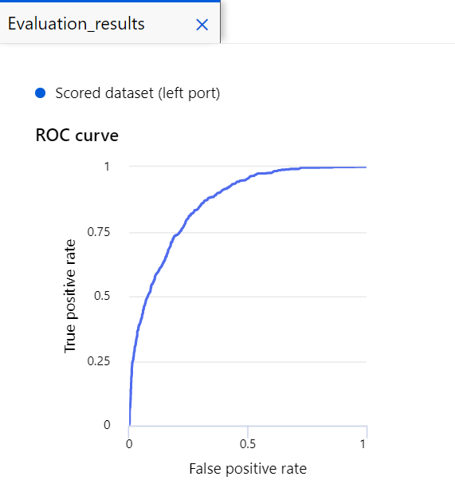

# Table of Contents 

<!-- TOC start (generated with https://github.com/derlin/bitdowntoc) -->

  * [Azure AI Fundamentals Exercises](#azure-ai-fundamentals-exercises)
  * [What is AI?](#what-is-ai)
  * [Azure Open AI](#azure-open-ai)
  * [Types of machine learning](#types-of-machine-learning)
  * [Azure Machine Learning](#azure-machine-learning)
  * [Computer vision ](#computer-vision)

<!-- TOC end -->

# Contents: Azure AI

1. [Get started with AI on Azure](https://learn.microsoft.com/en-us/training/modules/get-started-ai-fundamentals/?WT.mc_id=cloudskillschallenge_12f32cf8-2cd8-42e1-97dd-001b4a042766&ns-enrollment-type=Collection&ns-enrollment-id=e6kjawo10x63)
1. [Introduction to Azure OpenAI Service](https://learn.microsoft.com/en-us/training/modules/explore-azure-openai/?WT.mc_id=cloudskillschallenge_12f32cf8-2cd8-42e1-97dd-001b4a042766&ns-enrollment-type=Collection&ns-enrollment-id=e6kjawo10x63)
1. [Use Automated Machine Learning in Azure Machine Learning](https://learn.microsoft.com/en-us/training/modules/use-automated-machine-learning/?WT.mc_id=cloudskillschallenge_12f32cf8-2cd8-42e1-97dd-001b4a042766&ns-enrollment-type=Collection&ns-enrollment-id=e6kjawo10x63)
1. [Create a regression model with Azure Machine Learning designer](https://learn.microsoft.com/en-us/training/modules/create-regression-model-azure-machine-learning-designer/?WT.mc_id=cloudskillschallenge_12f32cf8-2cd8-42e1-97dd-001b4a042766&ns-enrollment-type=Collection&ns-enrollment-id=e6kjawo10x63)
1. [Create a classification model with Azure Machine Learning designer](https://learn.microsoft.com/en-us/training/modules/create-classification-model-azure-machine-learning-designer/?WT.mc_id=cloudskillschallenge_12f32cf8-2cd8-42e1-97dd-001b4a042766&ns-enrollment-type=Collection&ns-enrollment-id=e6kjawo10x63)
1. [Create a clustering model with Azure Machine Learning designer](https://learn.microsoft.com/en-us/training/modules/create-clustering-model-azure-machine-learning-designer/?WT.mc_id=cloudskillschallenge_12f32cf8-2cd8-42e1-97dd-001b4a042766&ns-enrollment-type=Collection&ns-enrollment-id=e6kjawo10x63)
1. [Analyze images with the Computer Vision service](https://learn.microsoft.com/en-us/training/modules/analyze-images-computer-vision/?WT.mc_id=cloudskillschallenge_12f32cf8-2cd8-42e1-97dd-001b4a042766&ns-enrollment-type=Collection&ns-enrollment-id=e6kjawo10x63)
1. [Build a bot with the Language Service and Azure Bot Service](https://learn.microsoft.com/en-us/training/modules/build-faq-chatbot-qna-maker-azure-bot-service/?WT.mc_id=cloudskillschallenge_12f32cf8-2cd8-42e1-97dd-001b4a042766&ns-enrollment-type=Collection&ns-enrollment-id=e6kjawo10x63)
1. [Introduction to Anomaly Detector](https://learn.microsoft.com/en-us/training/modules/intro-to-anomaly-detector/?WT.mc_id=cloudskillschallenge_12f32cf8-2cd8-42e1-97dd-001b4a042766&ns-enrollment-type=Collection&ns-enrollment-id=e6kjawo10x63)
1. [Analyze receipts with the Form Recognizer service](https://learn.microsoft.com/en-us/training/modules/analyze-receipts-form-recognizer/?WT.mc_id=cloudskillschallenge_12f32cf8-2cd8-42e1-97dd-001b4a042766&ns-enrollment-type=Collection&ns-enrollment-id=e6kjawo10x63)
1. [Introduction to Azure Cognitive Search](https://learn.microsoft.com/en-us/training/modules/intro-to-azure-search/?WT.mc_id=cloudskillschallenge_12f32cf8-2cd8-42e1-97dd-001b4a042766&ns-enrollment-type=Collection&ns-enrollment-id=e6kjawo10x63)
1. [Identify guiding principles for responsible AI](https://learn.microsoft.com/en-us/training/modules/responsible-ai-principles/?WT.mc_id=cloudskillschallenge_12f32cf8-2cd8-42e1-97dd-001b4a042766&ns-enrollment-type=Collection&ns-enrollment-id=e6kjawo10x63)
1. [Get started with Azure OpenAI Service](https://learn.microsoft.com/en-us/training/modules/get-started-openai/?WT.mc_id=cloudskillschallenge_12f32cf8-2cd8-42e1-97dd-001b4a042766&ns-enrollment-type=Collection&ns-enrollment-id=e6kjawo10x63)
1. [Build natural language solutions with Azure OpenAI Service](https://learn.microsoft.com/en-us/training/modules/build-language-solution-azure-openai/?WT.mc_id=cloudskillschallenge_12f32cf8-2cd8-42e1-97dd-001b4a042766&ns-enrollment-type=Collection&ns-enrollment-id=e6kjawo10x63)
1. [Apply prompt engineering with Azure OpenAI Service](https://learn.microsoft.com/en-us/training/modules/apply-prompt-engineering-azure-openai/?WT.mc_id=cloudskillschallenge_12f32cf8-2cd8-42e1-97dd-001b4a042766&ns-enrollment-type=Collection&ns-enrollment-id=e6kjawo10x63)
1. [Analyze text with the Language service](https://learn.microsoft.com/en-us/training/modules/analyze-text-with-text-analytics-service/?WT.mc_id=cloudskillschallenge_12f32cf8-2cd8-42e1-97dd-001b4a042766&ns-enrollment-type=Collection&ns-enrollment-id=e6kjawo10x63)
1. [Create and consume Cognitive Services](https://learn.microsoft.com/en-us/training/modules/create-manage-cognitive-services/?WT.mc_id=cloudskillschallenge_12f32cf8-2cd8-42e1-97dd-001b4a042766&ns-enrollment-type=Collection&ns-enrollment-id=e6kjawo10x63)
1. [Secure Cognitive Services](https://learn.microsoft.com/en-us/training/modules/secure-cognitive-services/?WT.mc_id=cloudskillschallenge_12f32cf8-2cd8-42e1-97dd-001b4a042766&ns-enrollment-type=Collection&ns-enrollment-id=e6kjawo10x63)
1. [Monitor Cognitive Services](https://learn.microsoft.com/en-us/training/modules/monitor-cognitive-services/?WT.mc_id=cloudskillschallenge_12f32cf8-2cd8-42e1-97dd-001b4a042766&ns-enrollment-type=Collection&ns-enrollment-id=e6kjawo10x63)
1. [Deploy cognitive services in containers](https://learn.microsoft.com/en-us/training/modules/investigate-container-for-use-cognitive-services/?WT.mc_id=cloudskillschallenge_12f32cf8-2cd8-42e1-97dd-001b4a042766&ns-enrollment-type=Collection&ns-enrollment-id=e6kjawo10x63)
1. [Identify governing practices for responsible AI](https://learn.microsoft.com/en-us/training/modules/responsible-ai-governing-practices/?WT.mc_id=cloudskillschallenge_12f32cf8-2cd8-42e1-97dd-001b4a042766&ns-enrollment-type=Collection&ns-enrollment-id=e6kjawo10x63)
1. [Discuss practices for responsible AI at Microsoft](https://learn.microsoft.com/en-us/training/modules/microsoft-responsible-ai-practices/?WT.mc_id=cloudskillschallenge_12f32cf8-2cd8-42e1-97dd-001b4a042766&ns-enrollment-type=Collection&ns-enrollment-id=e6kjawo10x63)

## Azure AI Fundamentals Exercises

- https://microsoftlearning.github.io/AI-900-AIFundamentals/

## What is AI?

- Simply put, AI is the creation of software that imitates human behaviors and capabilities. Key workloads include:

    1. Machine learning - This is often the foundation for an AI system, and is the way we "teach" a computer model to make predictions and draw conclusions from data.
    1. Anomaly detection - The capability to automatically detect errors or unusual activity in a system.
    1. Computer vision - The capability of software to interpret the world visually through cameras, video, and images.
    1. Natural language processing - The capability for a computer to interpret written or spoken language, and respond in kind.
    1. Knowledge mining - The capability to extract information from large volumes of often unstructured data to create a searchable knowledge store.

## Azure Open AI

- Azure OpenAI's relationship to Azure AI services

- Azure OpenAI supports can be categorized by tasks they support:

    1. Generating Natural Language
    1. Text completion: generate and edit text
    1. Embeddings: search, classify, and compare text
    1. Generating Code: generate, edit, and explain code
    1. Generating Images: generate and edit images

## Types of machine learning

There are two general approaches to machine learning, supervised and unsupervised machine learning. In both approaches, you train a model to make predictions.

- The supervised machine learning approach requires you to start with a dataset with known label values. Two types of supervised machine learning tasks include regression and classification.

    1. Regression: used to predict a continuous value; like a price, a sales total, or some other measure.
    1. Classification: used to determine a class label; an example of a binary class label is whether a patient has diabetes or not; an example of multi-class labels is classifying text as positive, negative, or neutral.

- The unsupervised machine learning approach starts with a dataset without known label values. One type of unsupervised machine learning task is clustering.

    1. Clustering: used to determine labels by grouping similar information into label groups; like grouping measurements from birds into species.

## Azure Machine Learning

- Azure Machine Learning studio: Azure Machine Learning studio is a web portal for machine learning solutions in Azure.

- Azure Machine Learning compute

    1. Compute Instances: Development workstations that data scientists can use to work with data and models.
    1. Compute Clusters: Scalable clusters of virtual machines for on-demand processing of experiment code.
    1. Inference Clusters: Deployment targets for predictive services that use your trained models.
    1. Attached Compute: Links to existing Azure compute resources, such as Virtual Machines or Azure Databricks clusters.

- Azure Automated Machine Learning

    1. Azure Machine Learning includes an automated machine learning capability that automatically tries multiple pre-processing techniques and model-training algorithms in parallel. These automated capabilities use the power of cloud compute to find the best performing supervised machine learning model for your data.

    1. Understand the AutoML process
        1. Prepare data: Identify the features and label in a dataset. Pre-process, or clean and transform, the data as needed.
        1. Train model: Split the data into two groups, a training and a validation set. Train a machine learning model using the training data set. Test the machine learning model for performance using the validation data set.
        1. Evaluate performance: Compare how close the model's predictions are to the known labels.
        1. Deploy a predictive service: After you train a machine learning model, you can deploy the model as an application on a server or device so that others can use it.

- Regression is a form of machine learning used to understand the relationships between variables to predict a desired outcome. Regression predicts a numeric label or outcome based on variables, or features. For example, an automobile sales company might use the characteristics of a car (such as engine size, number of seats, mileage, and so on) to predict its likely selling price. In this case, the characteristics of the car are the features, and the selling price is the label.

    1. Evaluate performance

        1. Mean Absolute Error (MAE): The average difference between predicted values and true values. This value is based on the same units as the label, in this case dollars. The lower this value is, the better the model is predicting.
        1. Root Mean Squared Error (RMSE): The square root of the mean squared difference between predicted and true values. The result is a metric based on the same unit as the label (dollars). When compared to the MAE (above), a larger difference indicates greater variance in the individual errors (for example, with some errors being very small, while others are large).
        1. Relative Squared Error (RSE): A relative metric between 0 and 1 based on the square of the differences between predicted and true values. The closer to 0 this metric is, the better the model is performing. Because this metric is relative, it can be used to compare models where the labels are in different units.
        1. Relative Absolute Error (RAE): A relative metric between 0 and 1 based on the absolute differences between predicted and true values. The closer to 0 this metric is, the better the model is performing. Like RSE, this metric can be used to compare models where the labels are in different units.
        1. Coefficient of Determination (R2): This metric is more commonly referred to as R-Squared, and summarizes how much of the variance between predicted and true values is explained by the model. **The closer to 1 this value is, the better the model is performing.**

- Classification is an example of a supervised machine learning technique in which you train a model using data that includes both the features and known values for the label, so that the model learns to fit the feature combinations to the label. Then, after training has been completed, you can use the trained model to predict labels for new items for which the label is unknown.

    1. Using clinical data to predict whether a patient will become sick or not.
    1. Using historical data to predict whether text sentiment is positive, negative, or neutral.
    1. Using characteristics of small businesses to predict if a new venture will succeed.
    1. **Confusion matrix**

        The confusion matrix is a tool used to assess the quality of a classification model's predictions. It compares predicted labels against actual labels.

        

        - True Positive: The model predicts the patient has diabetes, and the patient does actually have diabetes.

        - False Positive: The model predicts the patient has diabetes, but the patient doesn't actually have diabetes.

        - False Negative: The model predicts the patient doesn't have diabetes, but the patient actually does have diabetes.

        - True Negative: The model predicts the patient doesn't have diabetes, and the patient actually doesn't have diabetes.

        Metrics that can be derived from the confusion matrix include:

        - Accuracy: The number of correct predictions (true positives + true negatives) divided by the total number of predictions.
        - Precision: The number of the cases classified as positive that are actually positive: the number of true positives divided by (the number of true positives plus false positives).
        - Recall: The fraction of positive cases correctly identified: the number of true positives divided by (the number of true positives plus false negatives).
        - F1 Score: An overall metric that essentially combines precision and recall.

        Of these metrics, accuracy may be the most intuitive. However, you need to be careful about using accuracy as a measurement of how well a model performs. Using the model that predicts 15% of patients have diabetes, when actually 25% of patients have diabetes, we can calculate the following metrics:

        - The accuracy of the model is: (10+70)/ 100 = 80%.

        - The precision of the model is: 10/(10+5) = 67%.

        - The recall of the model is 10/(10+15) = 40%
    
    1. ROC curve and AUC metric

        - Another term for recall is True positive rate, and it has a corresponding metric named False positive rate, which measures the number of negative cases incorrectly identified as positive compared between the number of actual negative cases. 
        
        - Plotting these metrics against each other for every possible threshold value between 0 and 1 results in a curve, known as the **ROC curve (ROC stands for receiver operating characteristic, but most data scientists just call it a ROC curve).** In an ideal model, the curve would go all the way up the left side and across the top, so that it covers the full area of the chart. The larger the area under the curve, of AUC metric, (which can be any value from 0 to 1), the better the model is performing. 

            

- Clustering is a form of machine learning that is used to group similar items into clusters based on their features. For example, a researcher might take measurements of penguins, and group them based on similarities in their proportions.

    1. Clustering is an example of unsupervised machine learning, in which you train a model to separate items into clusters based purely on their characteristics, or features. There is no previously known cluster value (or label) from which to train the model.
    1. Cluster customer attribute data into segments for marketing analysis.
    1. Cluster geographic coordinates into regions of high traffic in a city for a ride-share application.
    1. Cluster written feedback into topics to prioritize customer service changes.
    1. When the experiment run has finished, select Job details. Right click on the Evaluate Model module and select Preview data, then select Evaluation results. These metrics can help data scientists assess how well the model separates the clusters. They include a row of metrics for each cluster, and a summary row for a combined evaluation. The metrics in each row are:

        - Average Distance to Other Center: This indicates how close, on average, each point in the cluster is to the centroids of all other clusters.
        - Average Distance to Cluster Center: This indicates how close, on average, each point in the cluster is to the centroid of the cluster.
        - Number of Points: The number of points assigned to the cluster.
        - Maximal Distance to Cluster Center: The maximum of the distances between each point and the centroid of that point’s cluster. If this number is high, the cluster may be widely dispersed. This statistic in combination with the - Average Distance to Cluster Center helps you determine the cluster’s spread.

## Computer vision 

- Computer vision is one of the core areas of artificial intelligence (AI), and focuses on creating solutions that enable AI applications to "see" the world and make sense of it.

    1. Content Organization: Identify people or objects in photos and organize them based on that identification. Photo recognition applications like this are commonly used in photo storage and social media applications.
    1. Text Extraction: Analyze images and PDF documents that contain text and extract the text into a structured format.
    1. Spatial Analysis: Identify people or objects, such as cars, in a space and map their movement within that space.

- You can use either of the following resource types:

    1. Computer Vision: A specific resource for the Computer Vision service. Use this resource type if you don't intend to use any other cognitive services, or if you want to track utilization and costs for your Computer Vision resource separately.

    1. Cognitive Services: A general cognitive services resource that includes Computer Vision along with many other cognitive services; such as Text Analytics, Translator Text, and others. Use this resource type if you plan to use multiple cognitive services and want to simplify administration and development.

- The Computer Vision service provides many capabilities that you can use to analyze images, including generating a descriptive caption, extracting relevant tags, identifying objects, determining image type and metadata, detecting human faces, known brands, and celebrities, and others.