# Table of Contents 

<!-- TOC start (generated with https://github.com/derlin/bitdowntoc) -->

  * [Introduction to Azure Cosmos DB for NoSQL](#introduction-to-azure-cosmos-db-for-nosql)
  * [Understand the SDK / Query](#understand-the-sdk--query)

<!-- TOC end -->

# Contents: Azure Cosmos DB Developer

1. [Introduction to Azure Cosmos DB for NoSQL](https://learn.microsoft.com/en-us/training/modules/introduction-to-azure-cosmos-db-sql-api)
1. [Try Azure Cosmos DB for NoSQL](https://learn.microsoft.com/en-us/training/modules/try-azure-cosmos-db-sql-api)
1. [Plan Resource Requirements](https://learn.microsoft.com/en-us/training/modules/plan-resource-requirements)
1. [Configure Azure Cosmos DB for NoSQL database and containers](https://learn.microsoft.com/en-us/training/modules/configure-azure-cosmos-db-sql-api)
1. [Move data into and out of Azure Cosmos DB for NoSQL](https://learn.microsoft.com/en-us/training/modules/move-data-azure-cosmos-db-sql-api)
1. [Use the Azure Cosmos DB for NoSQL SDK](https://learn.microsoft.com/en-us/training/modules/use-azure-cosmos-db-sql-api-sdk)
1. [Configure the Azure Cosmos DB for NoSQL SDK](https://learn.microsoft.com/en-us/training/modules/configure-azure-cosmos-db-sql-api-sdk)
1. [Implement Azure Cosmos DB for NoSQL point operations](https://learn.microsoft.com/en-us/training/modules/implement-azure-cosmos-db-sql-api-point-operations)
1. [Perform cross-document transactional operations with the Azure Cosmos DB for NoSQL](https://learn.microsoft.com/en-us/training/modules/perform-cross-document-transactional-operations-azure-cosmos-db-sql-api)
1. [Process bulk data in Azure Cosmos DB for NoSQL](https://learn.microsoft.com/en-us/training/modules/process-bulk-data-azure-cosmos-db-sql-api)
1. [Query the Azure Cosmos DB for NoSQL](https://learn.microsoft.com/en-us/training/modules/query-azure-cosmos-db-sql-api)
1. [Author complex queries with the Azure Cosmos DB for NoSQL](https://learn.microsoft.com/en-us/training/modules/author-complex-queries-azure-cosmos-db-sql-api)
1. [Define indexes in Azure Cosmos DB for NoSQL](https://learn.microsoft.com/en-us/training/modules/define-indexes-azure-cosmos-db-sql-api)
1. [Customize indexes in Azure Cosmos DB for NoSQL](https://learn.microsoft.com/en-us/training/modules/customize-indexes-azure-cosmos-db-sql-api)
1. [Consume an Azure Cosmos DB for NoSQL change feed using the SDK](https://learn.microsoft.com/en-us/training/modules/consume-azure-cosmos-db-sql-api-change-feed-use-sdk)
1. [Handle events with Azure Functions and Azure Cosmos DB for NoSQL change feed](https://learn.microsoft.com/en-us/training/modules/handle-events-azure-functions-azure-cosmos-db-sql-api-change-feed)
1. [Search Azure Cosmos DB for NoSQL data with Azure Cognitive Search](https://learn.microsoft.com/en-us/training/modules/search-azure-cosmos-db-sql-api-data-azure-cognitive-search)
1. [Implement a non-relational data model](https://learn.microsoft.com/en-us/training/modules/implement-non-relational-data-model)
1. [Design a data partitioning strategy](https://learn.microsoft.com/en-us/training/modules/design-data-partitioning-strategy)
1. [Customize an indexing policy in Azure Cosmos DB for NoSQL](https://learn.microsoft.com/en-us/training/modules/choose-indexes-azure-cosmos-db-sql-api)
1. [Measure index performance in Azure Cosmos DB for NoSQL](https://learn.microsoft.com/en-us/training/modules/measure-index-azure-cosmos-db-sql-api)
1. [Implement integrated cache in Azure Cosmos DB for NoSQL](https://learn.microsoft.com/en-us/training/modules/implement-integrated-cache)
1. [Measure performance in Azure Cosmos DB for NoSQL](https://learn.microsoft.com/en-us/training/modules/measure-performance-azure-cosmos-db-sql-api)
1. [Monitor responses and events in Azure Cosmos DB for NoSQL](https://learn.microsoft.com/en-us/training/modules/monitor-responses-events-azure-cosmos-db-sql-api)
1. [Implement backup and restore for Azure Cosmos DB for NoSQL](https://learn.microsoft.com/en-us/training/modules/implement-backup-restore-for-azure-cosmos-db-sql-api)
1. [Implement security in Azure Cosmos DB for NoSQL](https://learn.microsoft.com/en-us/training/modules/implement-security-azure-cosmos-db-sql-api)
1. [Write management scripts for Azure Cosmos DB for NoSQL](https://learn.microsoft.com/en-us/training/modules/write-scripts-for-azure-cosmos-db-sql-api)
1. [Create resource template for Azure Cosmos DB for NoSQL](https://learn.microsoft.com/en-us/training/modules/create-resource-template-for-azure-cosmos-db-sql-api)
1. [Build multi-item transactions with the Azure Cosmos DB for NoSQL](https://learn.microsoft.com/en-us/training/modules/build-multi-item-transactions-azure-cosmos-db-sql-api)
1. [Expand query and transaction functionality in Azure Cosmos DB for NoSQL](https://learn.microsoft.com/en-us/training/modules/expand-query-transaction-functionality-azure-cosmos-db-sql-api)


## Introduction to Azure Cosmos DB for NoSQL

- NoSQL databases were designed to address needs such as:

    1. High volumes of data.
    1. Data with many different sources and forms.
    1. Dynamic data schemas that store different types of data.
    1. Using high-velocity and/or real-time data.

- You define NoSQL databases by the common characteristics they share rather than by a specific formal definition. These characteristics include:

    1. A nonrelational data store.
    1. Being designed to scale out.
    1. Not enforcing a specific schema.

- Azure Cosmos DB for NoSQL has a few advantages such as:

    1. Guaranteed speed at any scale—even through bursts—with instant, limitless elasticity, fast reads, and multi-master writes, anywhere in the world.
    1. Fast, flexible app development with SDKs for popular languages, a native NoSQL API along with APIs for MongoDB, Cassandra, and Gremlin, and no-ETL (extract, transform, load) analytics.
    1. Ready for mission-critical applications with guaranteed business continuity, 99.999-percent availability, and enterprise-grade security.
    1. Fully managed and cost-effective serverless database with instant, automatic scaling that responds to application needs.

        
    
    - Every Azure Cosmos DB for NoSQL container is required to specify a partition key path. Behind the scenes, Azure Cosmos DB for NoSQL uses this path to logically partition data using partition key values. For example, consider the following JSON document:

        ```json
        {
        "id": "35b5bf7d-5f0e-4209-b7cb-8c5c70c3bb59",
        "deviceDisplayName": "shared-printer",
        "acquiredYear": 2019,
        "department": {
            "name": "information-technology",
            "metadata": {
            "location": "floor-5-unit-27"
            }
        },
        "queuedDocuments": [
            {
            "sender": "user-293749329",
            "sentTime": "2019-07-26T05:12:37",
            "pages": 5,
            "spoolRef": "3f4b759c-3230-4269-a88e-de7620ad91c0"
            },
            {
            "device": {
                "type": "mobile"
            },
            "sentTime": "2019-11-12T13:08:42",
            "spoolRefs": [
                "6a86682c-be5a-4a4a-bacd-96c4d1c7ece6",
                "79e78fe2-93aa-4688-89db-a7278b034aa6"
            ]
            }
        ]
        }
        ```

    - If your container specifies a partition key path of /department/name, then the partition key value of this document would be information-technology. Behind the scenes, Azure Cosmos DB for NoSQL automatically manages the physical resources necessary to support your data workload.

    - Selecting a partition key path for a container can be one of the most important design decisions for a new workload. Review the choosing a partition key documentation for a deeper technical explanation and best practices.

        

    - As a fast NoSQL database with a flexible API, Azure Cosmos DB for NoSQL is well suited for high-performance applications with global ambition. Speed and flexibility make Azure Cosmos DB for NoSQL great for web, retail, IoT, gaming, and mobile applications. Azure Cosmos DB for NoSQL is a good fit for applications that require flexibility, low response time, and transactions at massive volume or velocity.

    - Containers can also store JavaScript based stored procedures, triggers and user-defined-functions (UDFs)

        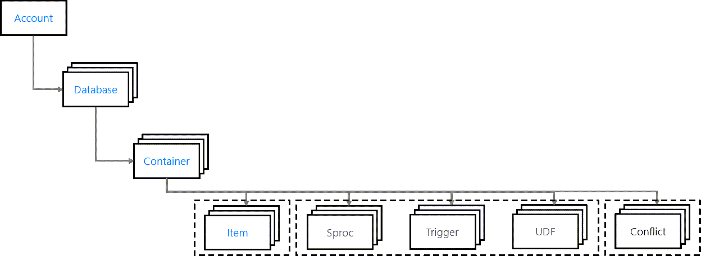

    - API Selection

        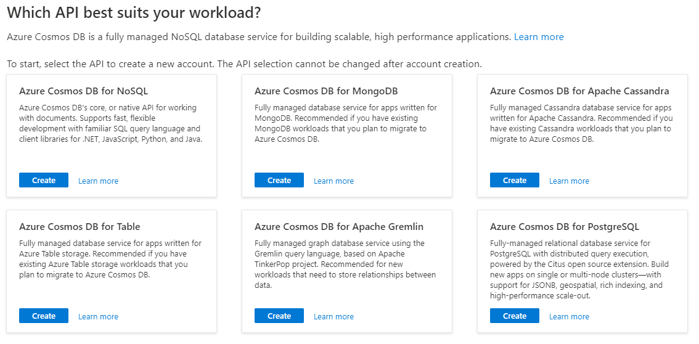
    
    - When configuring Azure Cosmos DB, you can provision throughput at either or both the database and container levels.

        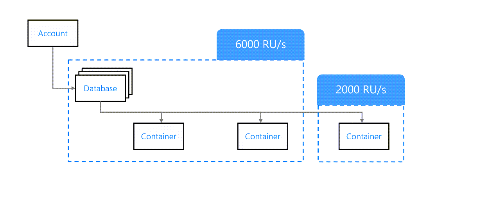

    - RU: Request units are a rate-based currency. They are used to make it simple to talk about physical resources like memory, CPU, and IO when performing requests in Azure Cosmos DB. Request units are used to measure both foreground and background activities.

        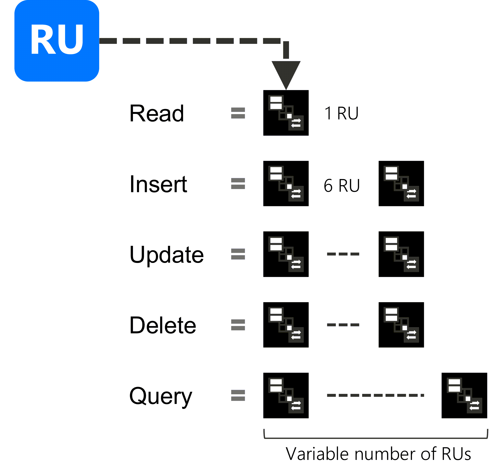
    
    - Time-to-live (TTL): Azure Cosmos DB allows you to set the length of time documents live in the database before being automatically purged. A document's "time-to-live" (TTL) is measured in seconds from the last modification and can be set at the container level with the ability to override on a per-item basis.

    - Once set at the container level, Azure Cosmos DB will automatically purge documents at the specified time since they were last modified. The TTL value is defined as an integer in seconds.

    - Azure Cosmos DB serverless is a consumption-based model where each request consumes request units. The consumption model eliminates the need to pre-provision throughput request units ahead of time. 

    - Serverless is great for applications with unpredictable or bursty traffic. 

    - Azure Cosmos DB for NoSQL is available as a linked service within Azure Data Factory. This type of linked service is supported both as a source of data ingest and as a target (sink) of data output. For both, the configuration is identical. You can configure the service using the Azure portal, or alternatively using a JSON object.

    - The Kafka Connect connectors for Azure Cosmos DB is available as an open-source project on GitHub at microsoft/kafka-connect-cosmosdb. Instructions for downloading and installing the JAR file manually are available at the repository.

    - Azure Stream Analytics supports multiple output sinks including Azure Cosmos DB for NoSQL. **As of this time, only the NoSQL API is supported.**

## Understand the SDK / Query

- The class used for the SDK
    1. Microsoft.Azure.Cosmos.CosmosClient:	Client-side logical representation of an Azure Cosmos DB account and the primary class used for the SDK

    1. Microsoft.Azure.Cosmos.Database	Logically represents a database client-side and includes common operations for database management

    1. Microsoft.Azure.Cosmos.Container	Logically represents a container client-side and includes common operations for container management

- `dotnet add package Microsoft.Azure.Cosmos`

- The ConsistencyLevel enumeration has multiple potential values including:

    ```
    Bounded Staleness
    ConsistentPrefix
    Eventual
    Session
    Strong
    ```

- Enable offline development: **The Azure Cosmos DB emulator** is a local environment that is useful to develop and test applications locally without incurring the costs or complexity of an Azure subscription. The emulator is available to run in Windows, Linux, or as a Docker container image.

- As an application developer, it's important to understand the HTTP status codes where retrying your request makes sense. These codes include, but are not limited to:
    ```
    429: Too many requests
    449: Concurrency error
    500: Unexpected service error
    503: Service unavailable
    ```

- [Azure Cosmos DB libraries for .NET](https://learn.microsoft.com/en-us/dotnet/api/overview/azure/cosmosdb)

- Bulk execution must be enabled by creating a new instance of the CosmosClientOptions class and setting the AllowBulkExecution property of that instance to true.

    ```csharp
    CosmosClientOptions options = new () 
    { 
        AllowBulkExecution = true 
    };
    ```

- Azure Cosmos DB for NoSQL uses the already popular Structured Query Language (SQL) syntax to perform queries over semi-structured data. 

- Join & Subquery

    ```sql
    SELECT 
        p.id,
        p.name,
        t.name AS tag
    FROM 
        products p
    JOIN
        t IN p.tags
    ```

    ```sql
    SELECT 
    p.id,
    p.name,
    t.name AS tag
    FROM 
        products p
    JOIN
        (SELECT VALUE t FROM t IN p.tags WHERE t.class = 'trade-in') AS t
    ```

- Variable

    ```csharp
    string sql = "SELECT p.name, t.name AS tag FROM products p JOIN t IN p.tags WHERE p.price >= @lower AND p.price <= @upper"
    QueryDefinition query = new (sql)
        .WithParameter("@lower", 500)
        .WithParameter("@upper", 1000);
    ```

- Paginate

    ```csharp
    FeedIterator<Product> iterator = container.GetItemQueryIterator<Product>(query, requestOptions: options);
    ```

- To conceptualize our container’s index, we tend to think of the index as a union of all trees for each item in the container. Altogether, this creates an inverted index which gives our database engine something fast and efficient to traverse when performing query operations. Each node in the tree has metadata indicating which items in our index matches that specific node.

    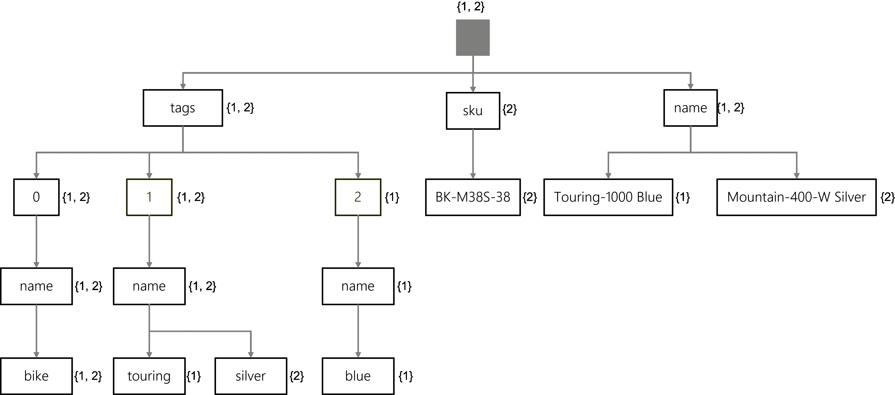

    `SELECT p.id FROM products p WHERE p.name = 'Touring-1000 Blue'`

    You can walk through a similar traversal:

    1. Starting at the root, all items match.
    1. Moving to the name property, Still, all items match.
    1. Finally, ending at the Touring-1000 Blue node, Only the #1 item matches.

    The search results are that the #1 item (Touring-1000 Blue) matches, and the SQL query will return only the id field from this item.

    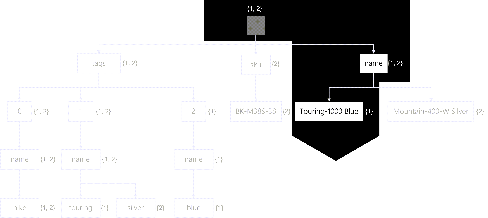

    All data in Azure Cosmos DB for NoSQL containers is indexed by default. This occurs because the container includes a default indexing policy that’s applied to all newly created items. The default indexing policy consists of the following settings:

    1. The inverted index is updated for all create, update, or delete operations on an item
    1. All properties for every item is automatically indexed
    1. Range indexes are used for all strings or numbers

- Composite indexes

    `SELECT * FROM products p WHERE p.name = "Road Saddle" AND p.price > 50`

    This query includes two filters:

    An equality filter that checks the value of the name property for equivalency to the string Road Saddle.

    A range filter that checks to see if the value of the price property is greater than the number 50.

    If the query is able to use a composite index, that includes both the name and price properties. That composite index could be:

    (name ASC, price ASC)
    (name DESC, price ASC)

- The .NET SDK for Azure Cosmos DB for NoSQL ships with a change feed processor that simplifies the task of reading changes from the feed. The change feed processor also natively supports distributed scenarios where event processing responsibilities are shared across multiple consumer client applications in an efficient manner.

    - The change feed processor includes four core components:

    1. Monitored container:	This container is monitored for any insert or update operations. These changes are then reflected in the feed.
    1. Lease container:	The lease container serves as a storage mechanism to manage state across multiple change feed consumers (clients).
    1. Host:	The host is a client application instance that listens for and reacts to changes from the change feed.
    1. Delegate:	The delegate is code within the client application that will implement business logic for each batch of changes.

- To configure an **Azure Function to use an Azure Cosmos DB for NoSQL binding**, you should first create an app setting in the function instance with the connection string of the Azure Cosmos DB account. If you are using the Azure portal, this can be done automatically on your behalf. Once you have the app setting with the connection string, you can leverage the setting in bindings for your Azure Function.

- **Azure Cognitive Search can crawl data from the Azure Cosmos DB for NoSQL.**

    - An Azure Cognitive Search instance is comprised of a few core components:

    1. Indexes that contain JSON documents that are searchable
    1. Indexers to crawl data from various data sources and insert them into indexes
    1. Data Sources that connect Azure Cognitive Search to various data platforms

    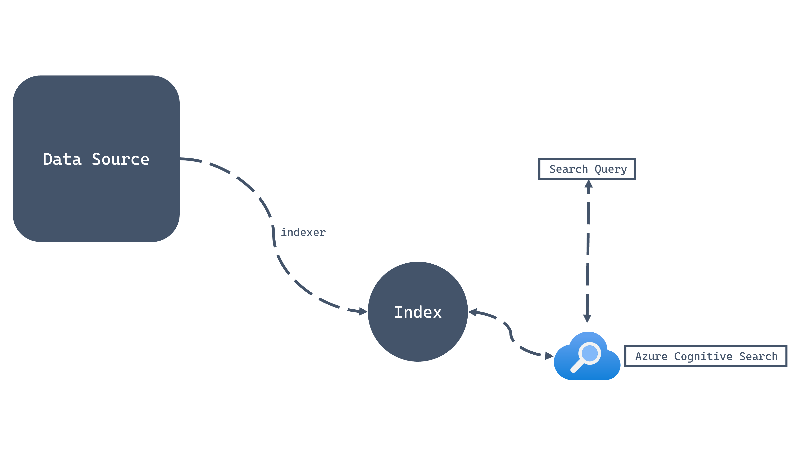

    - Each field in the index should be configured to enable or disable features when searching. These optional features allow extra search functionality on specific fields when it makes sense. 

    1. Retrievable:	Configures the field to be projected in search result sets
    1. Filterable:	Accepts OData-style filtering on the field
    1. Sortable:	Enables sorting using the field
    1. Facetable:	Allows field to be dynamically aggregated and grouped
    1. Searchable:	Allows search queries to match terms in the field

- ER Diagram

    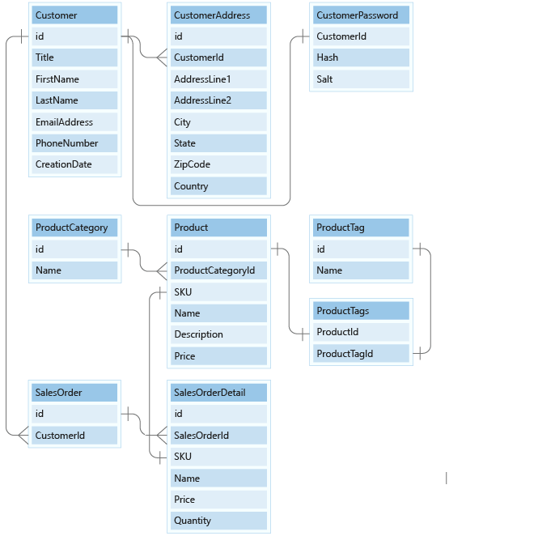

    - NoSQL databases are often used when a relational database can't meet the desired performance, scale, or availability needs of the application.

    - Remember that data in JSON documents is stored in Azure Cosmos DB databases within containers that are in turn distributed across physical partitions and where the data is routed to the appropriate physical partition based on the value of a **partition key.**

    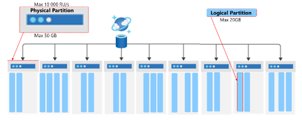

- Azure Cosmos DB has a feature called **change feed** that can manage referential integrity. Change feed is an API that lives within every Azure Cosmos DB container. Whenever you insert or update data to Azure Cosmos DB, change feed streams these changes to an API that you can listen to. When an event is triggered, you can use change feed to execute code that responds to the changed data.

- Design a data partitioning strategy 

    - The Product table need to optimize, it has the many-to-many relationship your product table has with product tags.

        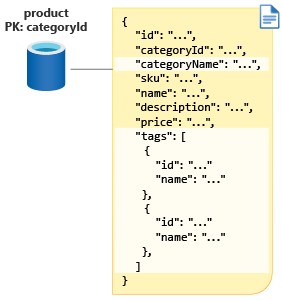

    1. Denormalization: Remember that, in NoSQL databases, there are no joins between containers, so joins aren't an option for you. Also remember that, for NoSQL databases, the objective is to reduce the number of requests by modeling data so that you can fetch your application data in as few requests as possible.

        - To denormalize your data in this instance, you add more properties, such as the name of the category and the name of each tag in your tags array. By adding these properties, you can now retrieve all the data you need to return to your clients in only a single request.

        

    1. Referential integrity:  However, when data is denormalized like this, you need a way to maintain referential integrity between the master data in the productCategory and productTag containers, and the product container.

        -  However, when data is denormalized like this, you need a way to maintain referential integrity between the master data in the productCategory and productTag containers, and the product container.

        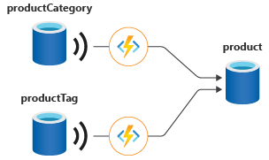
    
    1. Combine multiple entities in the same container: The customer container has a partition key of ID and salesOrder has a partition key of customerId. When data share a partition key and have similar access patterns, they're candidates for being stored in the same container. As a NoSQL database, Azure Cosmos DB is schema agnostic, so mixing entities with different schema is not only possible but, under these conditions, it's also another best practice. But to combine the data from these two containers, you'll need to make more changes to your schema.

        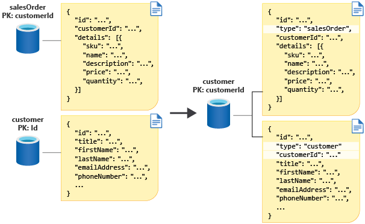

        First, you need to add a customerId property to each customer document. Customers will now have the same value for ID and customerId. Next, you need a way to distinguish a sales order from a customer in the container. So you'll add a discriminator property you'll call type that has a value of customer and salesOrder for each entity.

        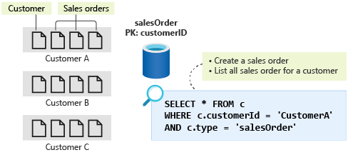
    
        With these changes, you can now store both the customer data and sales order data in your new customer container. Each customer is in its own logical partition and will have one customer item with all its sales orders. For your second operation here, you now have a query you can run to list all sales orders for a customer.

    1. Denormalizing aggregates: Before your new model is complete, one last operation to look at is to query your top 10 customers by the number of sales orders. In your current model, you first do a group by on each customer and sum for sales orders in your customer container. You then sort in descending order and take the top 10 results. Even though customers and sales orders sit in the same container, this type of query is not something you can currently do.

        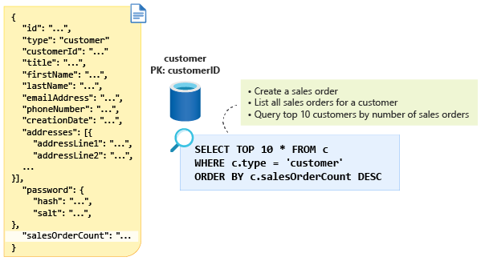

        The solution here is to denormalize the aggregate value in a new property, salesOrderCount, in the customer document. You can get the data you want by using this property in a query such as the one shown in the following diagram:
    
    1. Here then is your final design. With the merging of the product categories and tags, you've gone from nine relational tables to just three containers. 

        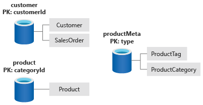

- Index usage

    - The query engine evaluates query filters and then traverses the index of your container. The query engine will automatically try to use the most efficient of the following three methods of evaluating filters:

        | Method | Description | RU implication |
        |--------|-------------|----------------| 
        | Index seek | The query engine will seek an exact match on a field’s value by traversing directly to that value and looking up how many items match. Once the matched items are determined, the query engine will return the items as the query result. | The RU charge is constant for the lookup. The RU charge for loading and returning items is linear based on the number of items. | 
        | Index scan | The query engine will find all possible values for a field and then perform various comparisons only on the values. Once matches are found, the query engine will load and return the items as the query result. | The RU charge is still constant for the lookup, with a slight increase over the index seek based on the cardinality of the indexed properties. The RU charge for loading and returning items is still linear based on the number of items returned. | 
        | Full scan | The query engine will load the items, in their entirety, to the transactional store to evaluate the filters. | This type of scan does not use the index; however, the RU charge for loading items is based on the number of items in the entire container. | 

    - Review read-heavy index patterns: Some applications' workloads are read-centric, requiring SQL queries that filter on many different fields in each item. These read-centric workloads benefit from having an inverted index that includes as many fields as possible to maximize query performance and minimize request unit charges.

    - Write-heavy index patterns: The drawback to this approach is that you will need to update the index anytime you change your schema.

- Enable integrated cache

    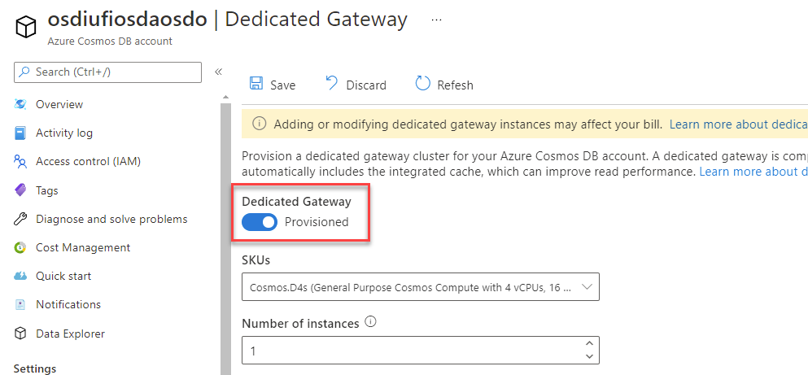

    - Creating a dedicated gateway in your Azure Cosmos DB for NoSQL account
Updating your SDK code to use the gateway for requests

- Cosmos DB monitors its server-side counters using:

    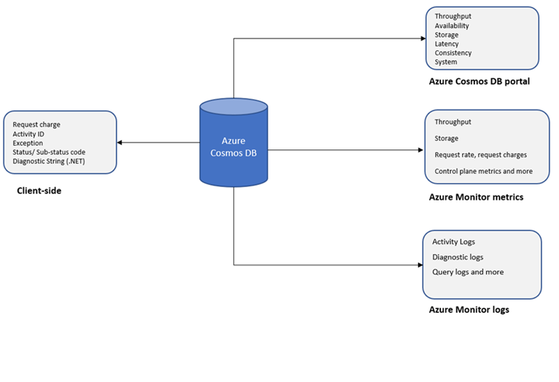

    1. Azure Monitor to monitor metrics: Azure Monitor collects Cosmos DB metrics by default. Metrics are collected every minute. The default retention period is 30 days. The collection includes throughput, storage availability, latency, consistency, and system level metrics. The dimension values for the metrics such as container name are case-insensitive.

    1. Azure Monitor to monitor diagnostic logs: Telemetries like events and traces are stored as logs. For example, changing the throughput properties of a container will be a logged event. Queries can then be run against these logs to analyze the data collected.

    1. The Azure Cosmos DB portal: The throughput, storage availability, latency, consistency, and system level metrics can be found under the Metrics tab of the Azure Cosmos DB account. The default retention period for these metrics is seven days.

    1. The Cosmos DB NoSQL API SDKs to programmatically monitor the account: Use the .NET, Java, Python, Node.js SDKs, and the headers in REST API to programmatically monitor a Cosmos DB account.

    ```bash
    AzureDiagnostics 
    | where TimeGenerated >= ago(1h)
    | where ResourceProvider=="MICROSOFT.DOCUMENTDB" and Category=="DataPlaneRequests" 
    | summarize OperationCount = count(), TotalRequestCharged=sum(todouble(requestCharge_s)) by OperationName
    | order by TotalRequestCharged desc
    ```
    Query that returns the count and the total request charged of the different Azure Cosmos DB operation types in the last hour.
    
- Backup

    1. A full backup is taken every 4 hours. Only the last two backups are stored by default. Both the backup interval and the retention period can be configured in the Azure portal. This configuration can be set during or after the Azure Cosmos DB account has been created.
    1. **If Azure Cosmos DB's containers or database are deleted, the existing container and database snapshots will be retained for 30 days.**
    1. Azure Cosmos DB backups are stored in Azure Blob storage.
    1. Backups are stored in the current write region or if using multi-region writes to one of the write regions to guarantee low latency.
    1. Snapshots of the backup are replicated to another region through geo-redundant storage (GRS). This replication, provides resiliency against regional disasters.
    1. **Backups can't be accessed directly. To restore the backup, a support ticket needs to be opened with the Azure Cosmos DB team.**
    1. Backups won't affect performance or availability. Furthermore, no RUs are consumed during the backup process.

- Security

    |                                             |                                                                                                                                                                                                                                                                                                                             |
    |---------------------------------------------|-----------------------------------------------------------------------------------------------------------------------------------------------------------------------------------------------------------------------------------------------------------------------------------------------------------------------------|
    |**Security Requirements**                    |**Azure Cosmos DB's security approach**                                                                                                                                                                                                                                                                                      |
    |Network security                             |Azure Cosmos DB supports policy driven IP-based access controls for inbound firewall support. Azure Cosmos DB alloys you to enable a combination of IPs and IP ranges. Only machines with the proper IPs or inside the IP ranges can access the Azure Cosmos DB resources, all other machines are blocked by Azure Cosmos DB.|
    |Authorization                                |Azure Cosmos DB uses hash-based message authentication code (HMAC) for authorization. You can use either a primary key, or a resource token allowing fine-grained access to a resource such as a document.                                                                                                                   |
    |Users and permissions                        |Using the primary key for the account, you can create user resources and permission resources per database. The resource token is then used during authentication to provide or deny access to the resource.                                                                                                                 |
    |Active Directory integration (Azure RBAC)    |You can also provide or restrict access to the Cosmos account, database, container, and offers (throughput) using Access control (IAM) in the Azure portal. IAM provides role-based access control and integrates with Active Directory. You can use built in roles or custom roles for individuals and groups.              |
    |Global replication                           |In the context of security, global replication ensures data protection against regional failures.                                                                                                                                                                                                                            |
    |Regional failovers                           |If you have replicated your data in more than one data center, Azure Cosmos DB automatically rolls over your operations should a regional data center go offline.                                                                                                                                                            |
    |Local replication                            |Even within a single data center, Azure Cosmos DB automatically replicates data for high availability giving you the choice of consistency levels.                                                                                                                                                                           |
    |Restore deleted data                         |The automated online backups can be used to recover data you may have accidentally deleted up to \~30 days after the event.                                                                                                                                                                                                  |
    |Protect and isolate sensitive data           |Documents and backups are now encrypted at rest. Personal data and other confidential data can be isolated to specific containers, and read-write or read-only access can be limited to specific users.                                                                                                                      |
    |Monitor for attacks                          |By using audit logging and activity logs, you can monitor your account for normal and abnormal activity.                                                                                                                                                                                                                     |
    |Respond to attacks                           |Once you have contacted Azure support to report a potential attack, a 5-step incident response process is kicked off to restore normal service security and operations as quickly as possible after an issue is detected and an investigation is started.                                                                    |
    |Geo-fencing                                  |Azure Cosmos DB ensures data governance for sovereign regions (for example, Germany, China, US Gov).                                                                                                                                                                                                                         |
    |Protected facilities                         |Data in Azure Cosmos DB is stored on SSDs in Azure's protected data centers.                                                                                                                                                                                                                                                 |
    |HTTPS/SSL/TLS encryption                     |All connections to Azure Cosmos DB support HTTPS. Azure Cosmos DB also supports TLS 1.2.                                                                                                                                                                                                                                     |
    |Encryption at rest                           |All data stored into Azure Cosmos DB is encrypted at rest.                                                                                                                                                                                                                                                                   |
    |Patched servers                              |As a managed database, Azure Cosmos DB eliminates the need to manage and patch servers. That's done for you automatically.                                                                                                                                                                                                   |
    |Administrative accounts with strong passwords|Security via TLS and HMAC secre                                                                                                                                                                                                                                                                                              |

- Use role-based access control (RBAC)

    |                              |                                                                                                                                                                                                                       |
    |------------------------------|-----------------------------------------------------------------------------------------------------------------------------------------------------------------------------------------------------------------------|
    |**Built-in role**             |**Description**                                                                                                                                                                                                        |
    |DocumentDB Account Contributor|Can manage Azure Cosmos DB accounts.                                                                                                                                                                                   |
    |Cosmos DB Account Reader      |Can read Azure Cosmos DB account data.                                                                                                                                                                                 |
    |Cosmos Backup Operator        |Can submit a restore request from the Azure portal for a periodic backup-enabled database or a container. Can modify the backup interval and retention on the Azure portal. Can't access any data or use Data Explorer.|
    |CosmosRestoreOperator         |Can perform a restore action for an Azure Cosmos DB account with continuous backup mode.                                                                                                                               |
    |Cosmos DB Operator            |Can provision Azure Cosmos accounts, databases, and containers. Can't access any data or use Data Explorer.                                                                                                            |


- When creating Bicep files or Azure Resource Manager templates (ARM templates), you need to understand what resource types are available, and what values to use in your template.

  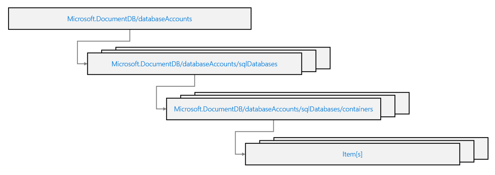

- In a database, a transaction is typically defined as a sequence of point operations grouped together into a single unit of work. It's expected that a transaction provides ACID guarantees:

    1. Atomicity guarantees that all the work done inside a transaction is treated as a single unit where either all of it is committed or none.
    1. Consistency makes sure that the data is always in a healthy internal state across transactions.
    1. Isolation guarantees that no two transactions interfere with each other – generally, most commercial systems provide multiple isolation levels that can be used based on the application's needs.
    1. Durability ensures that any change that's committed in the database will always be present.

    In Azure Cosmos DB for NoSQL, a stored procedure executes one or more operations as a single unit of work within the same scope. Stored procedures are registered in containers, and run within the scope of that specific container.

    **Stored procedures are scoped to a single logical partition. You cannot execute a stored procedure that performs operations across logical partition key values.**

- User-defined functions (UDFs) are used to extend the Azure Cosmos DB for NoSQL’s query language grammar and implement custom business logic. **UDFs can only be called from inside queries as they enhance and extend the SQL query language.**

    ```javascript
    function addTax(preTax) {
        return preTax * 1.15;
    }
    ```

    ```sql
    SELECT 
        p.name,
        p.price,
        udf.addTax(p.price) AS priceWithTax
    FROM
        products p
    ```
- Pre-trigger / Post-Trigger


