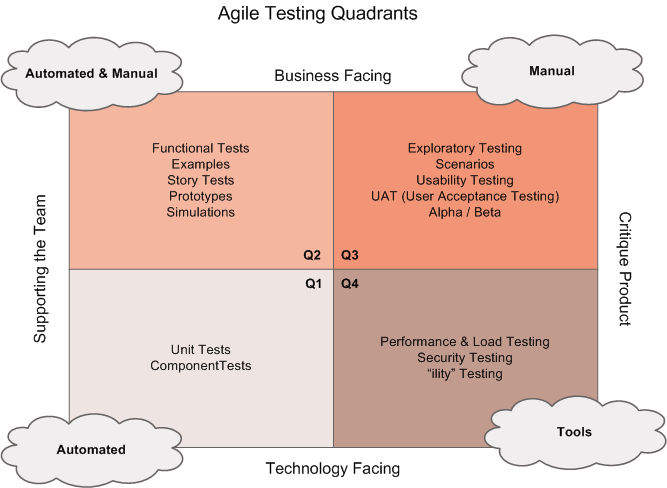
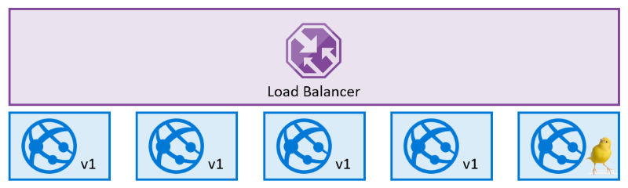

# Table of Contents 

<!-- TOC start (generated with https://github.com/derlin/bitdowntoc) -->

  * [What is DevOps?](#what-is-devops)
  * [Identify project metrics and key performance indicators (KPIs)](#identify-project-metrics-and-key-performance-indicators-kpis)
  * [Choose the DevOps tools](#choose-the-devops-tools)
  * [Introduction to source control](#introduction-to-source-control)
  * [Explore Azure Pipelines](#explore-azure-pipelines)
  * [Manage Azure Pipeline agents and pools, Integrate with Azure Pipelines](#manage-azure-pipeline-agents-and-pools-integrate-with-azure-pipelines)
  * [Continuous integration ](#continuous-integration)
  * [Manage Git branches and workflows](#manage-git-branches-and-workflows)
  * [Explore Git hooks](#explore-git-hooks)
  * [Inner source](#inner-source)
  * [GitHub Actions](#github-actions)
  * [Design a container build strategy](#design-a-container-build-strategy)
  * [Continuous delivery (CD) ](#continuous-delivery-cd)
  * [Create a release pipeline](#create-a-release-pipeline)
  * [Provision and test environments](#provision-and-test-environments)
  * [Provision and test environments contd.](#provision-and-test-environments-contd)
    + [Use and manage task and variable groups](#use-and-manage-task-and-variable-groups)
    + [Automate inspection of health](#automate-inspection-of-health)
  * [Deployment patterns](#deployment-patterns)
  * [Integrate with Configuration](#integrate-with-configuration)
    + [Identity management systems](#identity-management-systems)
    + [Azure App Configuration](#azure-app-configuration)
    + [Infrastructure as code ](#infrastructure-as-code)
  * [Define dependency/package management ](#define-dependencypackage-management)
  * [Continuous monitoring](#continuous-monitoring)
  * [Share knowledge with development teams](#share-knowledge-with-development-teams)
  * [Secure DevOps](#secure-devops)

<!-- TOC end -->

# Contents: DevOps

1. [Introduction to DevOps](https://learn.microsoft.com/en-us/training/modules/introduction-to-devops)
1. [Choose the right project](https://learn.microsoft.com/en-us/training/modules/choose-right-project)
1. [Describe team structures](https://learn.microsoft.com/en-us/training/modules/describe-team-structures)
1. [Choose the DevOps tools](https://learn.microsoft.com/en-us/training/modules/migrate-to-devops)
1. [Plan Agile with GitHub Projects and Azure Boards](https://learn.microsoft.com/en-us/training/modules/plan-agile-github-projects-azure-boards)
1. [Introduction to source control](https://learn.microsoft.com/en-us/training/modules/introduction-to-source-control)
1. [Describe types of source control systems](https://learn.microsoft.com/en-us/training/modules/describe-types-of-source-control-systems)
1. [Work with Azure Repos and GitHub](https://learn.microsoft.com/en-us/training/modules/work-azure-repos-github)
1. [Explore Azure Pipelines](https://learn.microsoft.com/en-us/training/modules/explore-azure-pipelines)
1. [Manage Azure Pipeline agents and pools](https://learn.microsoft.com/en-us/training/modules/manage-azure-pipeline-agents-pools)
1. [Describe pipelines and concurrency](https://learn.microsoft.com/en-us/training/modules/describe-pipelines-concurrency)
1. [Explore continuous integration](https://learn.microsoft.com/en-us/training/modules/explore-continuous-integration)
1. [Implement a pipeline strategy](https://learn.microsoft.com/en-us/training/modules/implement-pipeline-strategy)
1. [Integrate with Azure Pipelines](https://learn.microsoft.com/en-us/training/modules/integrate-azure-pipelines)
1. [Introduction to GitHub Actions](https://learn.microsoft.com/en-us/training/modules/introduction-to-github-actions)
1. [Learn continuous integration with GitHub Actions](https://learn.microsoft.com/en-us/training/modules/learn-continuous-integration-github-actions)
1. [Design a container build strategy](https://learn.microsoft.com/en-us/training/modules/design-container-build-strategy)
1. [Introduction to continuous delivery](https://learn.microsoft.com/en-us/training/modules/introduction-to-continuous-delivery)
1. [Create a release pipeline](https://learn.microsoft.com/en-us/training/modules/create-release-pipeline-devops)
1. [Explore release recommendations](https://learn.microsoft.com/en-us/training/modules/explore-release-strategy-recommendations)
1. [Provision and test environments](https://learn.microsoft.com/en-us/training/modules/configure-provision-environments)
1. [Manage and modularize tasks and templates](https://learn.microsoft.com/en-us/training/modules/manage-modularize-tasks-templates)
1. [Automate inspection of health](https://learn.microsoft.com/en-us/training/modules/automate-inspection-health)
1. [Introduction to deployment patterns](https://learn.microsoft.com/en-us/training/modules/introduction-to-deployment-patterns)
1. [Implement blue-green deployment and feature toggles](https://learn.microsoft.com/en-us/training/modules/implement-blue-green-deployment-feature-toggles)
1. [Implement canary releases and dark launching](https://learn.microsoft.com/en-us/training/modules/implement-canary-releases-dark-launching)
1. [Implement A/B testing and progressive exposure deployment](https://learn.microsoft.com/en-us/training/modules/implement-test-progressive-exposure-deployment)
1. [Integrate with identity management systems](https://learn.microsoft.com/en-us/training/modules/integrate-identity-management-systems)
1. [Manage application configuration data](https://learn.microsoft.com/en-us/training/modules/manage-application-configuration-data)
1. [Explore infrastructure as code and configuration management](https://learn.microsoft.com/en-us/training/modules/explore-infrastructure-code-configuration-management)
1. [Create Azure resources using Azure Resource Manager templates](https://learn.microsoft.com/en-us/training/modules/create-azure-resources-using-azure-resource-manager-templates)
1. [Create Azure resources by using Azure CLI](https://learn.microsoft.com/en-us/training/modules/create-azure-resources-by-using-azure-cli)
1. [Explore Azure Automation with DevOps](https://learn.microsoft.com/en-us/training/modules/explore-azure-automation-devops)
1. [Implement Desired State Configuration (DSC)](https://learn.microsoft.com/en-us/training/modules/implement-desired-state-configuration-dsc)
1. [Implement Bicep](https://learn.microsoft.com/en-us/training/modules/implement-bicep)
1. [Explore package dependencies](https://learn.microsoft.com/en-us/training/modules/explore-package-dependencies)
1. [Understand package management](https://learn.microsoft.com/en-us/training/modules/understand-package-management)
1. [Migrate consolidating and secure artifacts](https://learn.microsoft.com/en-us/training/modules/migrate-consolidating-secure-artifacts)
1. [Implement a versioning strategy](https://learn.microsoft.com/en-us/training/modules/implement-versioning-strategy)
1. [Introduction to GitHub Packages](https://learn.microsoft.com/en-us/training/modules/introduction-github-packages)
1. [Implement tools to track usage and flow](https://learn.microsoft.com/en-us/training/modules/implement-tools-track-usage-flow)
1. [Develop monitor and status dashboards](https://learn.microsoft.com/en-us/training/modules/develop-monitor-status-dashboards)
1. [Share knowledge within teams](https://learn.microsoft.com/en-us/training/modules/share-knowledge-within-teams)
1. [Design processes to automate application analytics](https://learn.microsoft.com/en-us/training/modules/design-processes-automate-application-analytics)
1. [Manage alerts, blameless retrospectives and a just culture](https://learn.microsoft.com/en-us/training/modules/manage-alerts-blameless-retrospectives-just-culture)
1. [Introduction to Secure DevOps](https://learn.microsoft.com/en-us/training/modules/introduction-to-secure-devops)
1. [Implement open-source software](https://learn.microsoft.com/en-us/training/modules/implement-open-source-software-azure)
1. [Software Composition Analysis](https://learn.microsoft.com/en-us/training/modules/software-composition-analysis)
1. [Static analyzers](https://learn.microsoft.com/en-us/training/modules/static-analyzers)
1. [OWASP and Dynamic Analyzers](https://learn.microsoft.com/en-us/training/modules/owasp-and-dynamic-analyzers)
1. [Security Monitoring and Governance](https://learn.microsoft.com/en-us/training/modules/security-monitoring-and-governance)

## What is DevOps?

The contraction of "Dev" and "Ops" refers to replacing siloed Development and Operations. The idea is to create multidisciplinary teams that now work together with shared and efficient practices and tools. Essential DevOps practices include agile planning, continuous integration, continuous delivery, and monitoring of applications. DevOps is a constant journey.


- Greenfield projects:
A greenfield project will always appear to be a more accessible starting point. A blank slate offers the chance to implement everything the way that you want.

- Brownfield projects:
Usually, brownfield projects come with:

    1. The baggage of existing codebases.
    1. Existing teams.
    1. A significant amount of technical debt.

- Systems of record:
Systems that provide the truth about data elements are often-called systems of record. These systems have historically evolved slowly and carefully. 

- Systems of engagement:
Many organizations have other systems that are more exploratory. These often use experimentation to solve new problems. Systems of engagement are modified regularly.

- In discussions around continuous delivery, we usually categorize users into three general buckets:

    1. Canary users voluntarily test bleeding edge features as soon as they're available.
    1. Early adopters who voluntarily preview releases, considered more refined than the code that exposes canary users.
    1. Users who consume the products after passing through canary and early adopters.

- Waterfall
Traditional software development practices involve:

    1. Determining a problem.
    1. Analyzing the requirements.
    1. Building and testing the required code.
    1. The delivery outcome to users.

- Agile

    - Agile software development methods are based on releases and iterations:

    1. One release might consist of several iterations.
    1. Each iteration is like a small independent project.
    1. After being estimated and prioritization:
        1. Features, bug fixes, enhancements, and refactoring width are assigned to a release.
        1. And then assigned again to a specific iteration within the release, generally on a priority basis.
    1. At the end of each iteration, there should be tested working code.
    1. In each iteration, the team must focus on the outcomes of the previous iteration and learn from them.

    - 12 Principles Behind the Agile Manifesto | Agile Alliance.

        - Our highest priority is to satisfy the customer through the early and continuous delivery of valuable software.
        - Welcome changing requirements, even late in development. Agile processes harness change for the customer's competitive advantage.
        - Deliver working software frequently, from a couple of months to a couple of weeks, with a preference for a shorter timescale.
        - Businesspeople and developers must work together daily throughout the project.
        - Build projects around motivated individuals. Give them the environment and support they need and trust them to get the job done.
        - The most efficient and effective method of conveying information to and within a development team is face-to-face conversation.
        - Working software is the primary measure of progress.
        - Agile processes promote sustainable development. The sponsors, developers, and users should be able to maintain a constant pace indefinitely.
        - Continuous attention to technical excellence and good design enhances agility.
        - Simplicity - the art of maximizing the amount of work not done - is essential.
        - The best architectures, requirements, and designs emerge from self-organizing teams.
        - The team regularly reflects on how to become more effective, then tunes and adjusts its behavior accordingly.

## Identify project metrics and key performance indicators (KPIs)

-  Faster outcomes
    1. Deployment Frequency. Increasing the frequency of deployments is often a critical driver in DevOps Projects.
    1. Deployment Speed. It is necessary to reduce the time that they take.
    1. Deployment Size. How many features, stories, and bug fixes are being deployed each time?
    1. Lead Time. How long does it take from the creation of a work item until it is completed?

-  Efficiency
    1. Server to Admin Ratio. Are the projects reducing the number of administrators required for a given number of servers?
    1. Staff Member to Customers Ratio. Is it possible for fewer staff members to serve a given number of customers?
    1. Application Usage. How busy is the application?
    1. Application Performance. Is the application performance improving or dropping? (Based upon application metrics)?

-  Quality and security
    1. Deployment failure rates. How often do deployments (or applications) fail?
    1. Application failure rates. How often do application failures occur, such as configuration failures, performance timeouts, and so on?
    1. Mean time to recover. How quickly can you recover from a failure?
    1. Bug report rates. You do not want customers finding bugs in your code. Is the amount they are seeing increasing or lowering?
    1. Test pass rates. How well is your automated testing working?
    1. Defect escape rate. What percentage of defects are being found in production?
    1. Availability. What percentage of time is the application truly available for customers?
    1. Service level agreement achievement. Are you meeting your service level agreements (SLAs)?
    1. Mean time to detection. If there is a failure, how long does it take for it to be detected?

-  Culture
    1. Employee morale. Are employees happy with the transformation and where the organization is heading? Are they still willing to respond to further changes? This metric can be challenging to measure but is often done by periodic, anonymous employee surveys.
    1. Retention rates. Is the organization losing staff?

## Choose the DevOps tools

1. What does Azure DevOps provide?

    - Azure DevOps includes a range of services covering the complete development life cycle.

        1. Azure Boards: agile planning, work item tracking, visualization, and reporting tool.
        1. Azure Pipelines: a language, platform, and cloud-agnostic CI/CD platform-supporting containers or Kubernetes.
        1. Azure Repos: provides cloud-hosted private git repos.
        1. Azure Artifacts: provides integrated package management with support for Maven, npm, Python, and NuGet package feeds from public or private sources.
        1. Azure Test Plans: provides an integrated planned and exploratory testing solution.

    - Azure Boards

        

        
    
    - Github Project boards

        

1. What does GitHub provide?

    - GitHub provides a range of services for software development and deployment.

        1. Codespaces: Provides a cloud-hosted development environment (based on Visual Studio Code) that can be operated from within a browser or external tools. Eases cross-platform development.
        1. Repos: Public and private repositories based upon industry-standard Git commands.
        1. Actions: Allows for the creation of automation workflows. These workflows can include environment variables and customized scripts.
        1. Packages: The majority of the world's open-source projects are already contained in GitHub repositories. GitHub makes it easy to integrate with this code and with other third-party offerings.
        1. Security: Provides detailed code scanning and review features, including automated code review assignment.

1. Jira is a commonly used work management tool.

    In the Visual Studio Marketplace, Solidify offers a tool for Jira to Azure DevOps migration. It migrates in two phases. Jira issues are exported to files, and then the files are imported to Azure DevOps.

## Introduction to source control

- The State of DevOps Report 2021 highlights version control in almost all stages of DevOps evolution.

    

    

- A Source control system (or version control system) allows developers to collaborate on code and track changes. Use version control to save your work and coordinate code changes across your team. Source control is an essential tool for multi-developer projects.

- The version control system saves a snapshot of your files (history) so that you can review and even roll back to any version of your code with ease. Also, it helps to resolve conflicts when merging contributions from multiple sources.

- "Code does not exist unless it is committed into source control. Source control is the fundamental enabler of continuous delivery."

    

- Explore best practices for source control

    1. Make small changes. In other words, commit early and commit often. Be careful not to commit any unfinished work that could break the build.
    1. Do not commit personal files. It could include application settings or SSH keys. Often personal files are committed accidentally but cause problems later when other team members work on the same code.
    1. Update often and right before pushing to avoid merge conflicts.
    1. Verify your code change before pushing it to a repository; ensure it compiles and tests are passing.
    1. Pay close attention to commit messages, as it will tell you why a change was made. Consider committing messages as a mini form of documentation for the change.
    1. Link code changes to work items. It will concretely link what was created to why it was created—or modified by providing traceability across requirements and code changes.
    1. No matter your background or preferences, be a team player and follow agreed conventions and workflows. Consistency is essential and helps ensure quality, making it easier for team members to pick up where you left off, review your code, debug, and so on.

- Understand centralized source control

    

    - Team Foundation Version Control (TFVC) is a centralized version control system.
    - Typically, team members have only one version of each file on their dev machines. Historical data is maintained only on the server. Branches are path-based and created on the server.

- Understand distributed source control

    

    - Git (distributed): Git is a distributed version control system. Each developer has a copy of the source repository on their development system. Developers can commit each set of changes on their dev machine. Branches are lightweight. 

    - In TFVC, each developer gets a working copy that points back to a single central repository. Git, however, is a distributed version control system. Instead of a working copy, each developer gets their local repository, complete with an entire history of commits.

    

    - Trunk-based development: One of the most significant advantages of Git is its branching capabilities. Unlike centralized version control systems, Git branches are cheap and easy to merge.

    - There are three common objections I often hear to migrating to Git:
        1. I can overwrite history.
        1. I have large files.
        1. There is a steep learning curve.

- Work with Azure Repos and GitHub

    Azure Repos is a set of version control tools that you can use to manage your code.

    Azure Repos provides two types of version control:

    1. Git: distributed version control
    1. Team Foundation Version Control (TFVC): centralized version control

    - Web hooks and API integration: Add validations and extensions from the marketplace or build your own-using web hooks and REST APIs.
    - Semantic code search: Quickly find what you are looking for with a code-aware search that understands classes and variables.

    GitHub is the largest open-source community in the world. Microsoft owns GitHub.

    1. Automate from code to cloud: Cycle your production code faster and simplify your workflow with GitHub Packages and built-in CI/CD using GitHub Actions.
    1. Securing software together: GitHub plays a role in securing the world's code—developers, maintainers, researchers, and security teams. 
    1. Seamless code review: Code review is the surest path to better code and is fundamental to how GitHub works. Built-in review tools make code review an essential part of your team's process.

    Codespaces is a cloud-based development environment that GitHub hosts. It is essentially an online implementation of Visual Studio Code.

    There are some limitations here (that apply only when migrating source type TFVC) to a single branch and only **180 days of history.**

- Explore monorepo versus multiple repos

    There are two philosophies on organizing your repos: Monorepo or multiple repos.

    1. Monorepos is a source control pattern where all the source code is kept in a single repository. It's super simple to give all your employees access to everything in one shot. Just clone it down, and done.
    1. Multiple repositories refer to organizing your projects into their separate repository.

    - [GitHub changelog generator](https://github.com/github-changelog-generator/github-changelog-generator)

        ```bash
        github_changelog_generator -u github-changelog-generator -p TimerTrend-3.0
        ```
    - The fundamental difference between the monorepo and multiple repos philosophies boils down to a difference about what will allow teams working together on a system to go faster. 
    - Allow teams working together on a system to go faster.
    - The multiple repos view, in extreme form, is that if you let every subteam live in its repo. They have the flexibility to work in their area however they want, using whatever libraries, tools, development workflow, and so on, will maximize their productivity.

## Explore Azure Pipelines

- Azure Pipelines is a cloud service that automatically builds and tests your code project and makes it available to other users. It works with just about any language or project type.

- Azure Pipelines combines continuous integration (CI) and continuous delivery (CD) to test and build your code and ship it to any target constantly and consistently.

    

- Version control systems: Azure Pipelines integrates with GitHub, GitLab, Azure Repos, Bitbucket, and Subversion.

- Application types: You can use Azure Pipelines with most application types, such as Java, JavaScript, Python, .NET, PHP, Go, XCode, and C++.

- Deployment targets: Use Azure Pipelines to deploy your code to multiple targets. Targets including: Container registries, Virtual machines, Azure services, or any on-premises or cloud target such: Microsoft Azure, Google Cloud, Amazon Web Services (AWS).

- Package formats: To produce packages that others can consume, you can publish NuGet, npm, or Maven packages to the built-in package management repository in Azure Pipelines.

    

- Agent: When your build or deployment runs, the system begins one or more jobs. An agent is installable software that runs a build or deployment job.

- Artifact: An artifact is a collection of files or packages published by a build. Artifacts are made available for the tasks, such as distribution or deployment.

- Job: A build contains one or more jobs. Most jobs run on an agent. A job represents an execution boundary of a set of steps. All the steps run together on the same agent. For example, you might build two configurations - x86 and x64. In this case, you have one build and two jobs.

- Stage: Stages are the primary divisions in a pipeline: "build the app," "run integration tests," and "deploy to user acceptance testing" are good examples of stages.

- Task:　A task is the building block of a pipeline. For example, a build pipeline might consist of build and test tasks. A release pipeline consists of deployment tasks. Each task runs a specific job in the pipeline.

- Release: When you use the visual designer, you can create a release or a build pipeline. A release is a term used to describe one execution of a release pipeline. It's made up of deployments to multiple stages.

## Manage Azure Pipeline agents and pools, Integrate with Azure Pipelines

- Microsoft-hosted agent
With a Microsoft-hosted agent, maintenance and upgrades are automatically done. Each time a pipeline is run, a new virtual machine (instance) is provided. The virtual machine is discarded after one use.

- Self-hosted agent
An agent that you set up and manage on your own to run build and deployment jobs is a self-hosted agent. You can use a self-hosted agent in Azure Pipelines. A self-hosted agent gives you more control to install dependent software needed for your builds and deployments.

- In Azure DevOps, there are four types of jobs available:
    1. Agent pool jobs: The most common types of jobs. The jobs run on an agent that is part of an agent pool.

    1. Container jobs: Similar jobs to Agent Pool Jobs run in a container on an agent part of an agent pool.

    1. Deployment group jobs: Jobs that run on systems in a deployment group.

    1. Agentless jobs: Jobs that run directly on the Azure DevOps. They don't require an agent for execution. It's also-often-called Server Jobs.

- An agent pool defines the sharing boundary for all agents in that pool. In Azure Pipelines, pools are scoped to the entire organization so that you can share the agent machines across projects.

- Azure Pipelines provides a pre-defined agent pool-named Azure Pipelines with Microsoft-hosted agents.

- The agents must have connectivity to the target on-premises environments and access to the Internet to connect to Azure Pipelines or Azure DevOps Server, as shown in the following diagram.

    

- Can I install multiple self-hosted agents on the same machine?
Yes. This approach can work well for agents who run jobs that don't consume many shared resources. 

- Do self-hosted agents have any performance advantages over Microsoft-hosted agents?
In many cases, yes. A Microsoft-hosted agent can take longer to start your build. While it often takes just a few seconds for your job to be assigned to a Microsoft-hosted agent, it can sometimes take several minutes for an agent to be allocated, depending on the load on our system.

- In Azure Pipelines, roles are defined on each agent pool. Membership in these roles governs what operations you can do on an agent pool.

- Parallel jobs: 
At the organization level, you can configure the number of parallel jobs that are made available.

- **At the organization level**, you can configure the number of parallel jobs that are made available.

- There are differences between **Organization and Project agent pools.**

- Benefits of using the Visual Designer
    - The visual designer is great for new users in continuous integration (CI) and continuous delivery (CD).
    - The visual representation of the pipelines makes it easier to get started.
    - The visual designer is in the same hub as the build results. This location makes it easier to switch back and forth and make changes.

- Benefits of using YAML
    - The pipeline is versioned with your code and follows the same branching structure. You get validation of your changes through code reviews in pull requests and branch build policies.
    - Every branch you use can modify the build policy by adjusting the azure-pipelines.yml file.
    - A change to the build process might cause a break or result in an unexpected outcome. Because the change is in version control with the rest of your codebase, you can more easily identify the issue.

    ```yaml
    name: 1.0$(Rev:.r)

    # simplified trigger (implied branch)
    trigger:

    - main

    # equivalents trigger
    # trigger:
    #  branches:
    #    include:
    #    - main

    variables:
    name: John

    pool:
    vmImage: ubuntu-latest

    jobs:
        - job: helloworld
    steps:
        - checkout: self
        - script: echo "Hello, $(name)"
    
    resources:
        pipelines: [ pipeline ]
        repositories: [ repository ]
        containers: [ container ]
    ```
    - This hierarchy is reflected in the structure of a YAML file like:

    ```yaml

    Pipeline
        Stage A
            Job 1
                Step 1.1
                Step 1.2
                ...
            Job 2
                Step 2.1
                Step 2.2
                ...
        Stage B
            ...
    ```

## Continuous integration 

- Continuous integration relies on four key elements for successful implementation: a Version Control System, Package Management System, Continuous Integration System, and an Automated Build Process.

1. A version control system manages changes to your source code over time.
    - [Git](https://git-scm.com/)
    - [Apache Subversion](https://subversion.apache.org/)
    - [Team Foundation Version Control](https://learn.microsoft.com/en-us/azure/devops/repos/tfvc/overview)
1. A package management system is used to install, uninstall, and manage software packages.
    - [NuGet](https://www.nuget.org/)
    - [Node Package Manager (NPM)](https://www.npmjs.com/)
    - [Chocolatey](https://chocolatey.org/)
    - [HomeBrew](https://brew.sh/)
    - [RPM](http://rpm.org/)
1. A continuous integration system merges all developer working copies to shared mainline several times a day.
    - [Azure DevOps](https://azure.microsoft.com/services/devops)
    - [TeamCity](https://www.jetbrains.com/teamcity/)
    - [Jenkins](https://jenkins.io/)
1. An automated build process creates a software build, including compiling, packaging, and running automated tests.
    - [Apache Ant](http://ant.apache.org/)
    - [NAnt2](https://nant2.github.io/)
    - [Gradle](https://gradle.org/)

- Continuous integration (CI) provides many benefits to the development process, including:
    - Improving code quality based on rapid feedback
    - Triggering automated testing for every code change
    - Reducing build times for quick feedback and early detection of problems (risk reduction)
    - Better managing technical debt and conducting code analysis
    - Reducing long, complex, and bug-inducing merges
    - Increasing confidence in codebase health long before production deployment

## Manage Git branches and workflows

- Common branch workflows: 
Most popular Git workflows will have some sort of centralized repo that individual developers will push and pull from.

- Trunk-based development: Trunk-based development is a logical extension of Centralized Workflow. The core idea behind the Feature Branch Workflow is that all feature development should take place in a dedicated branch instead of the main branch.

- The trunk-based development Workflow assumes a central repository, and the main represents the official project history. Instead of committing directly to their local main branch, developers create a new branch every time they start work on a new feature.

    

- Forking workflow: Instead of using a single server-side repository to act as the "central" codebase, it gives every developer a server-side repository. It means that each contributor has two Git repositories: A private local one, A public server-side one.

- Azure DevOps CLI: It's an extension of the Azure CLI for working with Azure DevOps and Azure DevOps Server designed to seamlessly integrate with Git, CI pipelines, and Agile tools. With the Azure DevOps CLI, you can contribute to your projects without leaving the command line. CLI runs on Windows, Linux, and Mac.

- Git Pull Request Merge Conflict: This open-source extension created by Microsoft DevLabs allows you to review and resolve the pull request merge conflicts on the web. 

- The forking workflow is most often seen in public open-source projects. 

- The main advantage of the forking workflow is that contributions can be integrated without the need for everybody to push to a single central repository. evelopers push to their server-side repositories, and only the project maintainer can push to the official repository.

- The forking workflow typically will be intended for merging into the original project maintainer's repository.

- The forking workflow 

    - A developer 'forks' an 'official' server-side repository. It creates their server-side copy.
    - The new server-side copy is cloned to their local system.
    - A Git remote path for the 'official' repository is added to the local clone.
    - A new local feature branch is created.
    - The developer makes changes to the new branch.
    - New commits are created for the changes.
    - The branch gets pushed to the developer's server-side copy.
    - The developer opens a pull request from the new branch to the 'official' repository.
    - The pull request gets approved for merge and is merged into the original server-side repository.

    - The maintainer pulls the contributor's changes into their local repository.
    - Checks to make sure it doesn't break the project.
    - Merges it into their local main branch.
    - Pushes the main branch to the official repository on the server.

- Forked repositories are created using the standard git clone command. Forked repositories are generally "server-side clones" managed and hosted by a Git service provider such as Azure Repos.

- There's no unique Git command to create forked repositories.

- A clone operation is essentially a copy of a repository and its history.

## Explore Git hooks

- Git hooks are a mechanism that allows code to be run before or after certain Git lifecycle events.

- The only criteria are that hooks must be stored in the .git/hooks folder in the repo root. Also, they must be named to match the related events (Git 2.x):
    - applypatch-msg
    - pre-applypatch
    - post-applypatch
    - pre-commit
    - prepare-commit-msg
    - commit-msg
    - post-commit
    - pre-rebase
    - post-checkout
    - post-merge
    - pre-receive
    - update
    - post-receive
    - post-update
    - pre-auto-gc
    - post-rewrite
    - pre-push

- Navigate to the repo .git\hooks directory. 
- How could Git hooks stop you from accidentally leaking Amazon AWS access keys to GitHub? You can invoke a script at pre-commit. Using Git hooks to scan the increment of code being committed into your local repository for specific keywords: Replace the code in this pre-commit shell file with the following code.

    ```bash
    #!C:/Program\ Files/Git/usr/bin/sh.exe
    matches=$(git diff-index --patch HEAD | grep '^+' | grep -Pi 'password|keyword2|keyword3')
    if [ ! -z "$matches" ]
    then
        cat <<\EOT
    Error: Words from the blocked list were present in the diff:
    EOT
        echo $matches
        exit 1
    fi
    ```

## Inner source

- Inner source – sometimes called "internal open source" – brings all the benefits of open-source software development inside your firewall.

- It uses the same processes that are popular throughout the open-source software communities.But it keeps your code safe and secure within your organization.

- Microsoft uses the inner source approach heavily.

- forking workflow steps: Create a fork, clone it locally, make your changes locally, push them to a branch, create and complete a PR to the upstream, and sync your fork to the latest from upstream.

## GitHub Actions

- Actions are the mechanism used to provide workflow automation within the GitHub environment.

    1. GitHub tracks events that occur. Events can trigger the start of workflows.

    1. Workflows can also start on cron-based schedules and can be triggered by events outside of GitHub.

    1. They can be manually triggered.

    1. Workflows are the unit of automation. They contain Jobs.

    1. Jobs use Actions to get work done.

- GitHub has published the source code for self-hosted runners as open-source, and you can find it here: https://github.com/actions/runner

```yaml
name: dotnet Build

on: [push]

jobs:
    build:
        runs-on: ubuntu-latest
        strategy:
            matrix:
                node-version: [10.x]
        steps:

        - uses: actions/checkout@main
        - uses: actions/setup-dotnet@v1
            with:
                dotnet-version: '3.1.x'

        - run: dotnet build awesomeproject

# On: Specifies what will occur when code is pushed.
# Jobs: There's a single job called build.
# Strategy: It's being used to specify the Node.js version.
# Steps: Are doing a checkout of the code and setting up dotnet.
# Run: Is building the code.
```

- Workflow badges: Badges are added by using URLs. The URLs are formed as follows: https://github.com/<OWNER>/<REPOSITORY>/actions/workflows/<WORKFLOW_FILE>/badge.svg

## Design a container build strategy

- Containers and VMs are similar in their goals: to isolate an application and its dependencies into a self-contained unit that can run anywhere. They remove the need for physical hardware. The main difference between containers and VMs is in their architectural approach. 

    

```
Docker build - You create an image by executing a Dockerfile.
Docker pull - You retrieve the image, likely from a container registry.
Docker run - You execute the container. An instance is created of the image.
```

- multi-stage Dockerfiles

    ```docker
    FROM mcr.microsoft.com/dotnet/core/aspnetcore:3.1 AS base
    WORKDIR /app
    EXPOSE 80
    EXPOSE 443

    FROM mcr.microsoft.com/dotnet/core/sdk:3.1 AS build
    WORKDIR /src
    COPY ["WebApplication1.csproj", ""]
    RUN dotnet restore "./WebApplication1.csproj"
    COPY . .
    WORKDIR "/src/."
    RUN dotnet build "WebApplication1.csproj" -c Release -o /app/build

    FROM build AS publish
    RUN dotnet publish "WebApplication1.csproj" -c Release -o /app/publish

    FROM base AS final
    WORKDIR /app
    COPY --from=publish /app/publish .
    ENTRYPOINT ["dotnet", "WebApplication1.dll"]
    ```

## Continuous delivery (CD) 

-  Continuous delivery (CD) is a set of processes, tools, and techniques for rapid, reliable, and continuous software development and delivery.

- The eight principles of continuous delivery:
    - The process for releasing/deploying software must be repeatable and reliable.
    - Automate everything!
    - If something is difficult or painful, do it more often.
    - Keep everything in source control.
    - Done means "released."
    - Build quality in!
    - Everybody has responsibility for the release process.
    - Improve continuously.

    

## Create a release pipeline

- The existing UI-based release management solution in Azure DevOps is referred to as classic release.

- You'll find a list of capabilities and availability in YAML pipelines vs. classic build and release pipelines in the following table.

|                     |        |                 |                   |                                                                                                                                                           |
|---------------------|--------|-----------------|-------------------|-----------------------------------------------------------------------------------------------------------------------------------------------------------|
|**Feature**          |**YAML**|**Classic Build**|**Classic Release**|**Notes**                                                                                                                                                  |
|Agents               |Yes     |Yes              |Yes                |Specifies a required resource on which the pipeline runs.                                                                                                  |
|Approvals            |Yes     |No               |Yes                |Defines a set of validations required before completing a deployment stage.                                                                                |
|Artifacts            |Yes     |Yes              |Yes                |Supports publishing or consuming different package types.                                                                                                  |
|Caching              |Yes     |Yes              |No                 |Reduces build time by allowing outputs or downloaded dependencies from one run to be reused in later runs. In Preview, available with Azure Pipelines only.|
|Conditions           |Yes     |Yes              |Yes                |Specifies conditions to be met before running a job.                                                                                                       |
|Container jobs       |Yes     |No               |No                 |Specifies jobs to run in a container.                                                                                                                      |
|Demands              |Yes     |Yes              |Yes                |Ensures pipeline requirements are met before running a pipeline stage. Requires self-hosted agents.                                                        |
|Dependencies         |Yes     |Yes              |Yes                |Specifies a requirement that must be met to run the next job or stage.                                                                                     |
|Deployment groups    |Yes     |No               |Yes                |Defines a logical set of deployment target machines.                                                                                                       |
|Deployment group jobs|No      |No               |Yes                |Specifies a job to release to a deployment group.                                                                                                          |
|Deployment jobs      |Yes     |No               |No                 |Defines the deployment steps. Requires Multi-stage pipelines experience.                                                                                   |
|Environment          |Yes     |No               |No                 |Represents a collection of resources targeted for deployment. Available with Azure Pipelines only.                                                         |
|Gates                |No      |No               |Yes                |Supports automatic collection and evaluation of external health signals before completing a release stage. Available with Azure Pipelines only.            |
|Jobs                 |Yes     |Yes              |Yes                |Defines the execution sequence of a set of steps.                                                                                                          |
|Service connections  |Yes     |Yes              |Yes                |Enables a connection to a remote service that is required to execute tasks in a job.                                                                       |
|Service containers   |Yes     |No               |No                 |Enables you to manage the lifecycle of a containerized service.                                                                                            |
|Stages               |Yes     |No               |Yes                |Organizes jobs within a pipeline.                                                                                                                          |
|Task groups          |No      |Yes              |Yes                |Encapsulates a sequence of tasks into a single reusable task. If using YAML, see templates.                                                                |
|Tasks                |Yes     |Yes              |Yes                |Defines the building blocks that make up a pipeline.                                                                                                       |
|Templates            |Yes     |No               |No                 |Defines reusable content, logic, and parameters.                                                                                                           |
|Triggers             |Yes     |Yes              |Yes                |Defines the event that causes a pipeline to run.                                                                                                           |
|Variables            |Yes     |Yes              |Yes                |Represents a value to be replaced by data to pass to the pipeline.                                                                                         |
|Variable groups      |Yes     |Yes              |Yes                |Use to store values that you want to control and make available across multiple pipelines.                                                                 |

- A release pipeline takes artifacts and releases them through stages and finally into production.

    

- Release approvals don't control how but control if you want to deliver multiple times a day.

- Although manual approval is a great mechanism to control the release, it isn't always helpful.

- Release gates give you more control over the start and completion of the deployment pipeline.
They're often set up as pre-deployment and post-deployment conditions.

- Using stage you can pause and validate the pipeline with various checks.

## Provision and test environments

- Instead of automating all your manual tests into automated UI tests, you need to rethink your testing strategy. As Lisa Crispin describes in her book Agile Testing, you can divide your tests into multiple categories.

    

- Source: https://lisacrispin.com/2011/11/08/using-the-agile-testing-quadrants

    - Business facing - the tests are more functional and often executed by end users of the system or by specialized testers that know the problem domain well.
    - Supporting the Team - it helps a development team get constant feedback on the product to find bugs fast and deliver a product with quality build-in.
    - Technology facing - the tests are rather technical and non-meaningful to business people. They're typical tests written and executed by the developers in a development team.
    - Critique Product - tests that are there to validate the workings of a product on its functional and non-functional requirements.

    - A few of the principles we can use are:

        1. Tests should be written at the lowest level possible.
        1. Write once, run anywhere, including the production system.
        1. The product is designed for testability.
        1. Test code is product code; only reliable tests survive.
        1. Test ownership follows product ownership.
    
    - By testing at the lowest level possible, you'll find many tests that don't require infrastructure or applications to be deployed.

- Shift-Left: The goal for shifting left is to move quality upstream by performing tests early in the pipeline. It represents the phrase "fail fast, fail often" combining test and process improvements reduces the time it takes for tests to be run and the impact of failures later on.

    1. Unit tests: These tests need to be fast and reliable.
    One team at Microsoft runs over 60,000 unit tests in parallel in less than 6 minutes, intending to get down to less than a minute.
    1. Functional tests: Must be independent.
    1. Defining a test taxonomy is an essential aspect of DevOps. The developers should understand the suitable types of tests in different scenarios.
        - L0 tests are a broad class of fast in-memory unit tests. It's a test that depends on code in the assembly under test and nothing else.
        - L1 tests might require assembly plus SQL or the file system.
        - L2 tests are functional tests run against testable service deployments. It's a functional test category that requires a service deployment but may have critical service dependencies stubbed out somehow.
        - L3 tests are a restricted class of integration tests that run against production. They require a complete product deployment.

- Azure Load Testing: The service simulates traffic for your applications, helping you to optimize application performance, scalability, or capacity.
You can create a load test using existing test scripts based on Apache JMeter. Azure Load Testing abstracts the infrastructure to run your JMeter script and load test your application

## Provision and test environments contd.

### Use and manage task and variable groups

- A task group allows you to encapsulate a sequence of tasks, already defined in a build or a release pipeline, into a single reusable task that can be added to a build or release pipeline, just like any other task.

- Variables give you a convenient way to get critical bits of data into various parts of the pipeline.
As the name suggests, the contents of a variable may change between releases, stages of jobs of your pipeline.

- A variable group stores values that you want to make available across multiple builds and release pipelines.

### Automate inspection of health

- Service hooks enable you to do tasks on other services when your Azure DevOps Services projects happen.

- For example, create a card in Trello when a work item is created.
Or send a push notification to your team's mobile devices when a build fails.

- Azure DevOps includes built-in support for the following Service Hooks:

    |                      |               |                    |                  |                 |
    |----------------------|---------------|--------------------|------------------|-----------------|
    |                      |               |                    |                  |                 |
    |**Build and release.**|**Collaborate**|**Customer support**|**Plan and track**|**Integrate**    |
    |AppVeyor              |Campfire       |UserVoice           |Trello            |Azure Service Bus|
    |Bamboo                |Flowdock       |Zendesk             |                  |Azure Storage    |
    |Jenkins               |HipChat        |                    |                  |Web Hooks        |
    |MyGet                 |Hubot          |                    |                  |Zapier           |
    |Slack                 |               |                    |                  |                 |

- There are four notification types that you can manage in Azure DevOps:

    1. Personal notifications.
    1. Team notifications.
    1. Project notifications.
    1. Global notifications.

- Traceability, auditability, and security

## Deployment patterns

1. Blue-green deployments.
1. Canary releases.
1. Dark launching.
1. A/B testing.
1. Progressive exposure or ring-based deployment.
1. Feature toggles.

- Blue-green deployment

    Blue-green deployment is a technique that reduces risk and downtime by running two identical environments. These environments are called blue and green.

    Only one of the environments is live, with the live environment serving all production traffic.

    

    For this example, blue is currently live, and green is idle.

- Feature Flags allow you to change how our system works without making significant changes to the code. Only a small configuration change is required. In many cases, it will also only be for a few users.

- Feature toggles are also known as feature flippers, feature flags, feature switches, conditional features, and so on. **In the purest form, a feature toggle is an IF statement.**

- Feature toggles: In the purest form, a feature toggle is an IF statement.

- Canary releases

    A canary release is a way to identify potential problems without exposing all your end users to the issue at once.

    The idea is that you tell a new feature only to **a minimal subset of users.**

    

    Azure Traffic Manager: 
    Azure Traffic Manager is a DNS-based traffic load balancer that enables you to distribute traffic optimally to services across global Azure regions while providing high availability and responsiveness.

- Dark launching

    Dark launching is in many ways like canary releases.

    However, the difference here's that you're looking to assess users' responses to new features in your frontend rather than testing the performance of the backend. 
    
    Usually, these users aren't aware they're being used as test users for the new feature, and often you don't even highlight the new feature to them, as such the term "Dark" launching.

- A/B testing (also known as split testing or bucket testing) 

    A/B testing (also known as split testing or bucket testing) compares two versions of a web page or app against each other to determine which one does better.

    A/B testing is mainly an experiment where two or more page variants are shown to users at random.

    

- Progressive exposure deployment, also called ring-based deployment, was first discussed in Jez Humble's Continuous Delivery book. **Deployment pattern extension of Canary Release.**

- The Microsoft Windows team, for example, uses these rings.

    

## Integrate with Configuration

### Identity management systems

- To use SSO, you need to connect your identity provider to GitHub at the organization level.
GitHub offers both SAML and SCIM support.

- Managed identities.

    Imagine that you need to connect from an Azure Data Factory (ADF) to an Azure SQL Database. What identity should ADF present to the database?

    Many Azure services expose their own identity. It isn't an identity that you need to manage. For example, you don't need to worry about password policies and so on.

    There are two types of managed identities:

    1. System-assigned - It's the types of identities described above. Many, but not all, services expose these identities.
    1. User-assigned - you can create a managed identity as an Azure resource. It can then be assigned to one or more instances of a service.

### Azure App Configuration

- Azure App Configuration is a service for central management of application settings and feature flags.

- Azure App Configuration service stores all the settings for your application and secures their access in one place. App Configuration complements Azure Key Vault, which is used to store application secrets. 

- **While you can store configuration and secrets together, it violates our separation of concern principle, so the recommendation is to use a different store for persisting secrets.**

### Infrastructure as code 

- Infrastructure as code and configuration management

- Configuration management refers to automated configuration management, typically in version-controlled scripts, for an application and all the environments needed to support it. 

- The term configuration as code can also be used to mean configuration management. However, it isn't used as widely, and in some cases, infrastructure as code is used to describe both provisioning and configuring machines. The term infrastructure as code is also sometimes used to include configuration as code, but not vice versa.

- Two of the main methods of approach are:

    1. Declarative (functional). The declarative approach states what the final state should be. When run, the script or definition will initialize or configure the machine to have the finished state declared without defining how that final state should be achieved.

    1. Imperative (procedural). In the imperative approach, the script states the how for the final state of the machine by executing the steps to get to the finished state. It defines what the final state needs to be but also includes how to achieve that final state. It also can consist of coding concepts such as for, *if-then, loops, and matrices.

- Imperative (procedural). In the imperative approach, the script states the how for the final state of the machine by executing the steps to get to the finished state. It defines what the final state needs to be but also includes how to achieve that final state. It also can consist of coding concepts such as for, *if-then, loops, and matrices.

- Azure Resource Manager templates are written in JSON, which allows you to express data stored as an object (such as a virtual machine) in text.

- Azure CLI is a command-line program you use to connect to Azure and execute administrative commands on Azure resources.

- Azure Automation: Azure Automation is an Azure service that provides a way for users to automate the manual, long-running, error-prone, and frequently repeated tasks commonly done in a cloud and enterprise environment.

- Azure Automation: Runbooks serve as repositories for your custom scripts and workflows.
They also typically reference Automation shared resources such as credentials, variables, connections, and certificates.
Runbooks can also contain other runbooks, allowing you to build more complex workflows.

- Desired State Configuration (DSC)
    1. Configuration drift is the process of a set of resources changing over time from their original deployment state. It can be because of changes made manually by people or automatically by processes or programs.

    1. Desired State Configuration (DSC) is a configuration management approach that you can use for configuration, deployment, and management of systems to ensure that an environment is maintained in a state that you specify (defined state) and doesn't deviate from that state.

    1. DSC helps eliminate configuration drift and ensures the state is maintained for compliance, security, and performance.

    1. Windows PowerShell DSC is a management platform in PowerShell that provides desired State.

- Azure Automation State configuration DSC is an Azure cloud-based implementation of PowerShell DSC, available as part of Azure Automation.

- The general process for how Azure Automation State configuration works is as follows:

    

- DSC consists of three primary components: Configurations, Resources, and Local Configuration Manager (LCM).

- Bicep: Azure Bicep is the next revision of ARM templates designed to solve some of the issues developers were facing when deploying their resources to Azure. It's an Open Source tool and, in fact, a domain-specific language (DSL) that provides a means to declaratively codify infrastructure, which describes the topology of cloud resources such as VMs, Web Apps, and networking interfaces. It also encourages code reuse and modularity in designing the infrastructure as code files.

    ```bicep
    @minLength(3)
    @maxLength(11)
    param storagePrefix string

    param storageSKU string = 'Standard_LRS'
    param location string = resourceGroup().location

    var uniqueStorageName = '${storagePrefix}${uniqueString(resourceGroup().id)}'

    resource stg 'Microsoft.Storage/storageAccounts@2019-04-01' = {
        name: uniqueStorageName
        location: location
        sku: {
            name: storageSKU
        }
        kind: 'StorageV2'
        properties: {
            supportsHttpsTrafficOnly: true
        }

        resource service 'fileServices' = {
            name: 'default'

            resource share 'shares' = {
                name: 'exampleshare'
            }
        }
    }

    module webModule './webApp.bicep' = {
        name: 'webDeploy'
        params: {
            skuName: 'S1'
            location: location
        }
    }

    output storageEndpoint object = stg.properties.primaryEndpoints
    ```

## Define dependency/package management 

- There are many aspects of a dependency management strategy.

    1. Standardization: Managing dependencies benefit from a standardized way of declaring and resolving them in your codebase.
    Standardization allows a repeatable, predictable process and usage that can be automated as well.

    1. Package formats and sources: The distribution of dependencies can be performed by a packaging method suited for your solution's dependency type.
    Each dependency is packaged using its usable format and stored in a centralized source.
    Your dependency management strategy should include the selection of package formats and corresponding sources where to store and retrieve packages.

    1. Versioning: Just like your own code and components, the dependencies in your solution usually evolve.
    While your codebase grows and changes, you need to consider the changes in your dependencies as well.
    It requires a versioning mechanism for the dependencies to be selective of the version of a dependency you want to use.

- There are two ways of componentization commonly used.

    1. Source componentization: The first way of componentization is focused on source code. It refers to splitting the source code in the codebase into separate parts and organizing it around the identified components.
    It works if the source code isn't shared outside of the project. Once the components need to be shared, it requires distributing the source code or the produced binary artifacts created from it.

    1. Package componentization: The second way uses packages. Distributing software components is performed utilizing packages as a formal way of wrapping and handling the components.
    A shift to packages adds characteristics needed for proper dependency management, like tracking and versioning packages in your solution.

- Package management
    - A package is a formalized way of creating a distributable unit of software artifacts that can be consumed from another software solution.
    - NuGet, NPM, PyPI, Maven, Docker
    - The centralized storage for packages is commonly called a `package feed`.

- The artifact management is called Azure Artifacts and was previously known as Package management. It offers public and private feeds for software packages of various types.

- An artifact is a deployable component of your application. Azure Pipelines can work with a wide variety of artifact sources and repositories.

- Understand versioning of artifacts: The version has the form of Major.Minor.Patch corresponds to the three types of changes.

- Feeds in Azure Artifacts have three different views by default. These views are added when a new feed is created. The three views are:

    1. Local. The @Local view contains all release and prerelease packages and the packages downloaded from upstream sources.
    1. Prerelease. The @Prerelease view contains all packages that have a label in their version number.
    1. Release. The @Release view contains all packages that are considered official releases.

- Azure Artifacts has the notion of promoting packages to views to indicate that a version is of a certain quality level.

- GitHub Packages is a software package hosting service that allows you to host your packages, containers, and other dependencies. 

## Continuous monitoring

- Continuous monitoring refers to the process and technology required to incorporate monitoring across each phase of your DevOps and IT operations lifecycles.

- Azure Monitor is the unified monitoring solution in Azure that provides full-stack observability across applications and infrastructure in the cloud and on-premises.

- Kusto Query Language (KQL): 
Kusto is the primary way to query Log Analytics. It provides both a query language and a set of control commands. Kusto can be used directly within Azure Data Explorer.

- Application Insights

- Azure dashboards are the primary dashboarding technology for Azure.
They're handy in providing a single pane of glass over your Azure infrastructure and services allowing you to identify critical issues quickly.

  

- Azure Monitor integrates with Power BI to provide logs visualization in real-time.

## Share knowledge with development teams

- Azure DevOps project wikis

  

- Work item integration functionality allows you to easily create work items in Azure DevOps that have relevant Application Insights data embedded in them.

- Azure Pipelines with Microsoft Teams integration: You can run the @azure pipelines subscribe [pipeline url] command to subscribe to an Azure Pipeline. Create and Unlink only works with the Azure Boards integration.

- Smart detection notification: Application Insights automatically analyzes the performance of your web application and can warn you about potential problems. 

- Blameless retrospective: Having a Just Culture means that you're making an effort to balance safety and accountability. It means that by investigating mistakes, focusing on the situational aspects of a failure's mechanism.

## Secure DevOps

- DevOps is about working faster. Security is about-emphasizing thoroughness. Security concerns are typically addressed at the end of the cycle. It can potentially create unplanned work right at the end of the pipeline. Secure DevOps integrates DevOps with security into a set of practices designed to meet the goals of both DevOps and safety effectively.

  

- Two essential features of Secure DevOps Pipelines that aren't found in standard DevOps Pipelines are:

    1. Package management and the approval process associated with it. The previous workflow diagram details other steps for adding software packages to the Pipeline and the approval processes that packages must go through before they're used. These steps should be enacted early in the Pipeline to identify issues sooner in the cycle.

    1. Source Scanner is also an extra step for scanning the source code. This step allows for security scanning and checking for vulnerabilities that aren't present in the application code. The scanning occurs after the app is built before release and pre-release testing. Source scanning can identify security vulnerabilities earlier in the cycle.

  

-  Static code analysis

    1. SonarQube.
    1. Visual Studio Code Analysis and the Roslyn Security Analyzers.
    1. Checkmarx - A Static Application Security Testing (SAST) tool.
    1. BinSkim - A binary static analysis tool that provides security and correctness results for Windows portable executables and many more.

- There are five major threat modeling steps: Threat modeling is a core element of the Microsoft Security Development Lifecycle (SDL). It's an engineering technique you can use to help you identify threats, attacks, vulnerabilities, and countermeasures that could affect your application.

    1. Defining security requirements.
    1. Creating an application diagram.
    1. Identifying threats.
    1. Mitigating threats.
    1. Validating that threats have been mitigated.

   

- "Open-source software is a type of computer software in which source code is released under a license in which the copyright holder grants users the rights to study, change, and distribute the software to anyone and for any purpose."
    
   

- According to the open-source definition of OpenSource.org, a license shouldn't:

    1. Discriminate against persons or groups.
    1. Discriminate against fields of endeavor.
    1. Be specific to a product.
    1. Restrict other software.

- There are multiple licenses used in open-source.

   

   1. On the left side, there are the "attribution" licenses. They're permissive and allow practically every type of use by the software that consumes it. 
   1. The middle of the spectrum shows the "downstream" or "weak copyleft" licenses. It also requires that it must do so under the same license terms when the covered code is distributed.

- Two crucial areas of the Secure DevOps pipeline are Package management and Open-Source Software OSS components.

- OWASP and Dynamic Analyzers

- The Open Web Application Security Project (OWASP) is a global charitable organization focused on improving software security.

- OWASP regularly publishes a set of Secure Coding Practices. Their guidelines currently cover advice in the following areas:
    - Input Validation
    - Output Encoding
    - Authentication and Password Management
    - Session Management
    - Access Control
    - Cryptographic Practices
    - Error Handling and Logging
    - Data Protection
    - Communication Security
    - System Configuration
    - Database Security
    - File Management
    - Memory Management
    - General Coding Practices

- OWASP ZAP penetration test: 
ZAP is a free penetration testing tool for beginners to professionals. ZAP includes an API and a weekly docker container image to integrate into your deployment process.

- Microsoft Defender for Cloud is a monitoring service that provides threat protection across all your services both in Azure and on-premises. Microsoft Defender can:

- Azure Policy is an Azure service that you can create, assign, and manage policies.
Policies enforce different rules and effects over your Azure resources, ensuring that your resources stay compliant with your standards and SLAs.

- Remediation: 
Resources found not to follow a deployIfNotExists or modify policy condition can be put into a compliant state through Remediation. Remediation instructs Azure Policy to run the deployIfNotExists effect or the tag operations of the policy on existing resources.

- `Locks` help you prevent accidental deletion or modification of your Azure resources. You can manage locks from within the Azure portal. You can set a lock level to CanNotDelete or ReadOnly:

    1. CanNotDelete means that authorized users can read and modify a resource, but they can't delete it.
    1. ReadOnly means that authorized users can read a resource, but they can't modify or delete it.

- Azure Blueprints provides a declarative way to orchestrate deployment for various resource templates and artifacts, including:

    1. Role assignments
    1. Policy assignments
    1. Azure Resource Manager templates
    1. Resource groups

- Microsoft Defender for Identity (formerly Azure Advanced Threat Protection, also known as Azure ATP) is a cloud-based security solution that identifies and detects:

    1. Advanced threats.
    1. Compromised identities.
    1. Malicious insider actions directed at your organization.

- **Microsoft Defender is available as part of the Microsoft Enterprise Mobility + Security E5 offering and a standalone license.**