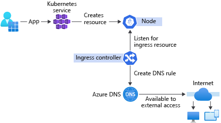

# Table of Contents 

  * [Github](#github)

# Contents: Developer Tools 

1. [Introduction to GitHub](https://learn.microsoft.com/en-us/training/modules/introduction-to-github)
1. [Migrate your repository by using GitHub best practices](https://learn.microsoft.com/en-us/training/modules/migrate-repository-github)
1. [Upload your project by using GitHub best practices](https://learn.microsoft.com/en-us/training/modules/upload-project-github)
1. [Manage repository changes by using pull requests on GitHub](https://learn.microsoft.com/en-us/training/modules/manage-changes-pull-requests-github)
1. [Settle competing commits by using merge conflict resolution on GitHub](https://learn.microsoft.com/en-us/training/modules/resolve-merge-conflicts-github)
1. [Search and organize repository history by using GitHub](https://learn.microsoft.com/en-us/training/modules/search-organize-repository-history-github)
1. [Manage an InnerSource program by using GitHub](https://learn.microsoft.com/en-us/training/modules/manage-innersource-program-github)
1. [Communicate effectively on GitHub by using Markdown](https://learn.microsoft.com/en-us/training/modules/communicate-using-markdown)
1. [Maintain a secure repository by using GitHub best practices](https://learn.microsoft.com/en-us/training/modules/maintain-secure-repository-github)
1. [Automate DevOps processes by using GitHub Apps](https://learn.microsoft.com/en-us/training/modules/automate-devops-github-apps)
1. [Automate GitHub by using GitHub Script](https://learn.microsoft.com/en-us/training/modules/automate-github-using-github-script)
1. [Manage software delivery by using a release based workflow on GitHub](https://learn.microsoft.com/en-us/training/modules/release-based-workflow-github)
1. [Build continuous integration (CI) workflows by using GitHub Actions](https://learn.microsoft.com/en-us/training/modules/github-actions-ci)
1. [Build and deploy applications to Azure by using GitHub Actions](https://learn.microsoft.com/en-us/training/modules/github-actions-cd)
1. [Implement a code workflow in your build pipeline by using Git and GitHub](https://learn.microsoft.com/en-us/training/modules/implement-code-workflow)
1. [Introduction to cloud-native apps on Azure](https://learn.microsoft.com/en-us/training/modules/introduction-to-cloud-native-apps)
1. [Orchestrate containers for cloud-native apps with AKS](https://learn.microsoft.com/en-us/training/modules/cloud-native-apps-orchestrate-containers)
1. [Build a basic cloud-native service using PostgreSQL and Node.js](https://learn.microsoft.com/en-us/training/modules/cloud-native-build-basic-service)
1. [Stream internet-of-things (IoT) data to a cloud-native app with IoT Central](https://learn.microsoft.com/en-us/training/modules/cna-stream-iot-data)
1. [Build an IoT service for your cloud-native apps by using IoT Central](https://learn.microsoft.com/en-us/training/modules/cna-build-iot-service)
1. [Deploy and maintain cloud-native apps with GitHub actions and Azure Pipelines](https://learn.microsoft.com/en-us/training/modules/cna-deploy-maintain)
1. [Authenticate and authorize multi-tenant apps using Azure Active Directory (Azure AD)](https://learn.microsoft.com/en-us/training/modules/cna-set-up-azure-ad-use-scale)
1. [Create an open-source program by using GitHub best practices](https://learn.microsoft.com/en-us/training/modules/create-open-source-program-github)
1. [Contribute to an open-source project on GitHub](https://learn.microsoft.com/en-us/training/modules/contribute-open-source)

## Github

- GitHub is a development platform that enables you to host and review code, manage projects, and build software alongside 50 million developers.

- Git is a distributed version control system (DVCS) that allows multiple developers or other contributors to work on a project. It provides a way to work with one or more local branches and push them to a remote repository. Git is responsible for everything GitHub-related that happens locally on your computer. 

- GitHub is a cloud platform that uses Git as its core technology. It simplifies the process of collaborating on projects and provides a website, command-line tools, and overall flow that allows developers and users to work together. 

- Key features provided by GitHub include:

    1. Issues
    1. Discussions
    1. Pull requests
    1. Notifications
    1. Labels
    1. Actions
    1. Forks
    1. Projects

- If you have source code in Subversion, Mercurial, Team Foundation Version Control (TFVC), or another Git repository, you can move it to GitHub using GitHub Importer. **GitHub Importer** is a tool that quickly imports source code repositories, including commits and revision history, to GitHub for you.

- Source code migration tools

    You can use external tools to move your projects to GitHub. We recommend using GitHub Importer to import projects from Subversion, Mercurial, Team Foundation Version Control (TFVC), or another Git repository. You can also use these external tools to convert your project to Git.

    1. Importing from Subversion
        We recommend these tools for converting Subversion repositories to Git:
        `git-svn / svn2git`

    1. Importing from Mercurial
        We recommend `hg-fast-export` for converting Mercurial repositories to Git.

    1. Importing from TFVC
        We recommend `git-tfs` for moving changes between TFVC and Git.

- Avoiding merge conflicts

    1. Pull early and often: The git pull command pulls down any base branch commits that have not yet been applied to your current branch. It's conceptually similar to the Get Latest command that many version-control systems use to allow you to update your local code to the latest version. When you pull updates for your branch, you're merging down all of the changes that have happened since the branch was created (or last pulled).

    1. Tidying history with git rebase: The git rebase (or git pull --rebase) command rewrites your branch history to use the current HEAD commit of the base branch as its base. 

- The global search lets you use the complete search syntax to search across all of GitHub. [the complete search syntax](https://help.github.com/github/searching-for-information-on-github/searching-on-github)

- Despite its ominous name, `git blame` is a command that displays the commit history for a file. It makes it easy for you to see who made what changes and when. This makes it much easier to track down other people who have worked on a file in order to seek out their input or participation.

- Some Git systems alias `git praise` onto `git blame` to avoid the implication of judgment.

- **InnerSource** is the practice of applying open-source patterns to projects with a limited audience. For example, a company may establish an InnerSource program that mirrors the structure of a typical open-source project, except that it's only accessible to the employees of that company. In effect, it's an open-source program behind your company's firewall.

- GitHub-Flavored Markdown (GFM), which are syntax extensions that allow you to integrate GitHub features into content.

- Communicate a security policy with `SECURITY.md`

    The community benefits of GitHub are substantial, but they also carry potential risks. The fact that anyone can propose bug fixes publicly comes with certain responsibilities. The most important is the responsible disclosure of information that could lead to security exploits before their underlying bugs can be fixed. Developers looking to report or address security issues look for a SECURITY.md file in the root of a repository in order to responsibly disclose their concerns. Providing guidance in this file will ultimately speed up the resolution of these critical issues.

- `GitHub Security Advisories` allow repository maintainers to privately discuss and fix a security vulnerability in a project. After collaborating on a fix, repository maintainers can publish the security advisory to publicly disclose the security vulnerability to the project's community. 

- You can create a `branch protection rule` to enforce certain workflows for one or more branches, such as requiring an approving review or passing status checks for all pull requests merged into the protected branch.

- By adding a `CODEOWNERS` file to your repository, you can assign individual team members or entire teams as code owners to paths in your repository. These code owners are then required for pull-request reviews on any changes to files in a path that they are configured for.

- Automated dependency alerts
    Even with a visual dependency graph, it can still be overwhelming to stay on top of the latest security considerations for every dependency a project has. To reduce this overhead, GitHub provides automated dependency alerts that watch your dependency graphs for you.

- Automated dependency updates with Dependabot

- Automated code scanning

    Similar to how Dependabot scans your repository for dependency alerts, you can use code scanning to analyze and find security vulnerabilities and errors in the code in a GitHub repository. Code scanning has several benefits; you can use it to find, triage, and prioritize fixes for existing problems or potential security vulnerabilities. It's also useful to help prevent developers from introducing any new security problems into the code.

- Another automated scanning feature within a GitHub repository is secret scanning. 

- OAuth Apps

    OAuth Apps provide a way to access GitHub data on behalf of a `user`. Because it's acting on behalf of the user, it's important to note that it will consume a GitHub licensed seat. `The access level is limited by the scope of the token (user, org, repository).`

- GitHub Apps

    By contrast, GitHub Apps are installed in your personal account, organizations you own, or specific repositories in which you have admin access. GitHub Apps are installed and interact with GitHub as a service, not an individual user as with OAuth Apps. One benefit of GitHub Apps is that, unlike OAuth apps, GitHub Apps do not consume a GitHub licensed seat.

    GitHub Apps access data on behalf of the `application itself` through a Private Key that's used to sign a JWT Token (JSON Web Token). 

- GitHub Script is a workflow action that provides you with access to the GitHub API from within your GitHub Actions. It offers convenient support for any API usage available in `octokit/rest.js.`

- GitHub Script is an action that provides an authenticated `octokit` client and allows JavaScript to be written directly in a workflow file. It runs in Node.js, so you have the power of that platform available when writing scripts.

- What can octokit/rest.js do?
The short answer is that it can do virtually anything with respect to automating GitHub. 

- How is using GitHub Script different from octokit/rest.js?
The main difference in usage is that GitHub Script provides you with a preauthenticated octokit/rest.js client named github.

    ```yaml
    name: Learning GitHub Script

    on:
    issues:
        types: [opened]
    
    jobs:
    comment:
        runs-on: ubuntu-latest
        steps:
        - uses: actions/github-script@0.8.0
        with:
        github-token: ${{secrets.GITHUB_TOKEN}}
        script: |
            github.issues.createComment({
                issue_number: context.issue.number,
                owner: context.repo.owner,
                repo: context.repo.repo,
                body: "🎉 You've created this issue comment using GitHub Script!!!"
            })
    ```

- **git cherry-pick**: This command allows you to select specific commits to apply to a different branch.

- `Artifacts` are stored in storage space on GitHub. The space is free for public repositories and some amount is free for private repositories, depending on the account. GitHub stores your artifacts for 90 days

- With kubectl and AKS, you can also leverage other open-source tools. A popular example is Argo CD - a continuous delivery tool for Kubernetes that provides incredible visualizations for what's happening with your Kubernetes infrastructure. Argo CD can increase your confidence and trust in systems, as you can show a deployment rollout or scaling operation happening in real time.

    

- Ingress controllers provide the capability to deploy and expose your applications to the world, without the need to configure network-related services.

- Ingress controllers allow requests to be served from a single DNS output. When a new service is deployed, ingress controllers create a DNS record for you.

    

- CQRS separates the models for reading and writing data. This process involves dividing a system's operations into two separate categories:

    1. Commands that change the state of a system.
    1. Queries that only return results, without affecting the state of the system.

- Azure IoT Central is a fully managed cloud service that simplifies implementing a wide range of IoT capabilities, including telemetry collection, processing, analytics, and secure device management.

    1. Helps you minimize custom development efforts and administrative overhead.
    1. Allows you to use cloud agility and scalability.
    1. Supports built-in integration with many other Azure services.
    1. Helps you bridge the gap between IoT devices and cloud-native applications, which accelerates their integration.
    1. Promotes reusability by:
        1. Using templates.
        1. Combining several platform as a service (PaaS) Azure IoT services, such as IoT Hub and Azure Time Series Insights into an easy-to-use software as a service (SaaS) offering.

- Open-source goals

    To recap, there are three dimensions to participation in open-source software:

    1. Consumers, who study or use the repositories of others.
    1. Contributors, who are actively involved in the improvement of the repositories of others.
    1. Producers, who build and maintain their own repositories that are open to others.

    There are five process levels within each dimension.

    

    1. Ad hoc, which have no process in place. Success depends on individual efforts.
    1. Managed, which have a partially documented process. Success depends on discipline.
    1. Defined, which have a documented, standardized, and integrated process. Success depends on automation.
    1. Measured, which have a quantitatively managed process. Success depends on measuring metrics against business goals.
    1. Optimized, which have a process that is continually and reliably improving through both incremental and innovative changes. Success depends on reducing the risk of change.

- Head to GitHub search

You can also use GitHub search to explore topics and related projects. Head to GitHub search, and enter your topic word. [Head to GitHub search](https://github.com/search)