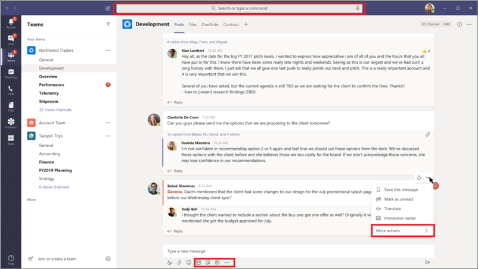
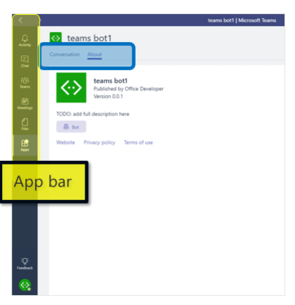
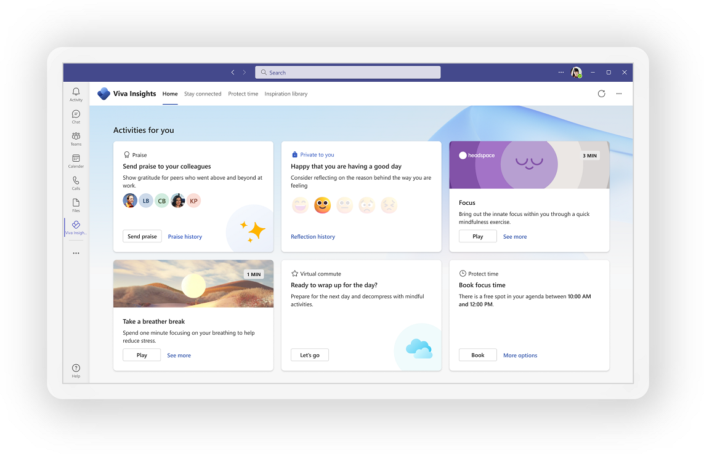

# Table of Contents 

<!-- TOC start (generated with https://github.com/derlin/bitdowntoc) -->

  * [Building apps for Microsoft Teams](#building-apps-for-microsoft-teams)
    + [What makes up a Microsoft Teams app?](#what-makes-up-a-microsoft-teams-app)
    + [Where can the Teams client be extended?](#where-can-the-teams-client-be-extended)
    + [Teams, channels, and group chats](#teams-channels-and-group-chats)
    + [Personal apps](#personal-apps)
    + [Messages](#messages)
    + [Writing messages](#writing-messages)
    + [Meeting apps](#meeting-apps)
  * [User interface (UI) elements](#user-interface-ui-elements)
    + [Cards and card actions](#cards-and-card-actions)
    + [Task modules (dialogs)](#task-modules-dialogs)
    + [Deep links](#deep-links)
    + [Web content pages](#web-content-pages)
  * [What are messaging extensions?](#what-are-messaging-extensions)
  * [What is a Microsoft Teams tab?](#what-is-a-microsoft-teams-tab)
  * [How are bots in Microsoft Teams unique?](#how-are-bots-in-microsoft-teams-unique)
  * [Teams App modules](#teams-app-modules)

  - Additional Chapters (Not in the challenge)
    * [What is Microsoft 365?](#what-is-microsoft-365)

<!-- TOC end -->

# Contents: DevOps Microsoft 365 Developer

1. [Introduction to building apps for Microsoft Teams](https://learn.microsoft.com/en-us/training/modules/intro-microsoft-teams-apps)
1. [Task-oriented interactions in Microsoft Teams with messaging extensions](https://learn.microsoft.com/en-us/training/modules/msteams-messaging-extensions)
1. [Create embedded web experiences with tabs for Microsoft Teams](https://learn.microsoft.com/en-us/training/modules/embedded-web-experiences)
1. [Create interactive conversational bots for Microsoft Teams](https://learn.microsoft.com/en-us/training/modules/msteams-conversation-bots)
1. [Collect Input in Microsoft Teams with Task Modules](https://learn.microsoft.com/en-us/training/modules/msteams-task-modules)
1. [Connect web services to Microsoft Teams with webhooks and Office 365 Connectors](https://learn.microsoft.com/en-us/training/modules/msteams-webhooks-connectors)
1. [Microsoft Teams - Use the teamwork Microsoft Graph endpoint](https://learn.microsoft.com/en-us/training/modules/msteams-teamwork-endpoint)
1. [Microsoft Teams - Authentication and Single Sign-on](https://learn.microsoft.com/en-us/training/modules/msteams-sso)
1. [Create interactive meeting apps for Microsoft Teams](https://learn.microsoft.com/en-us/training/modules/msteams-meetings-apps)
1. [Get started building apps for Microsoft Teams by using Teams Toolkit for Visual Studio Code](https://learn.microsoft.com/en-us/training/modules/teams-toolkit-vsc-introduction)
1. [Build a bot by using Teams Toolkit for Visual Studio Code](https://learn.microsoft.com/en-us/training/modules/teams-toolkit-vsc-create-bot)
1. [Build a Microsoft Teams tab app by using Teams Toolkit for Visual Studio Code](https://learn.microsoft.com/en-us/training/modules/teams-toolkit-vsc-tab-app)
1. [Add chat to a Microsoft Teams app by using the Teams JavaScript client library](https://learn.microsoft.com/en-us/training/modules/teams-toolkit-vsc-integrate-chat)
1. [Deploy a Microsoft Teams app to Azure by using Teams Toolkit for Visual Studio Code](https://learn.microsoft.com/en-us/training/modules/teams-toolkit-vsc-deploy-apps)
1. [Show a user's emails in an ASP.NET Core app with Microsoft Graph](https://learn.microsoft.com/en-us/training/modules/msgraph-dotnet-core-show-user-emails)
1. [Access a user's calendar events in an ASP.NET Core app with Microsoft Graph](https://learn.microsoft.com/en-us/training/modules/msgraph-dotnet-core-access-user-events)
1. [Download and upload files in an ASP.NET Core app with Microsoft Graph](https://learn.microsoft.com/en-us/training/modules/msgraph-dotnet-core-manage-files)
1. [Show a user's emails in a JavaScript app with Microsoft Graph](https://learn.microsoft.com/en-us/training/modules/msgraph-show-user-emails)
1. [Access a user's calendar events in a JavaScript app with Microsoft Graph](https://learn.microsoft.com/en-us/training/modules/msgraph-access-user-events)
1. [Download and upload files in a JavaScript app with Microsoft Graph](https://learn.microsoft.com/en-us/training/modules/msgraph-manage-files)

## Building apps for Microsoft Teams

### What makes up a Microsoft Teams app?
Apps built on the Microsoft Teams Platform consist of three primary components:

 - The Microsoft Teams client provides the extensions points and UI elements your app will use to engage your users.
 - Your Teams app package is installed in Microsoft Teams. It contains a small icon, a large icon, and a manifest JSON file. The manifest file contains the metadata for your app (like the name of the app, the developer's name, and so on), which extensibility points your app uses (like tabs and messaging extensions), and pointers to your web services that power your app (like the ID for your bot, or your tab's URL).
 - Your web services that you host provide the APIs and logic that power your app.

It's important to keep in mind that the Microsoft Teams Platform isn't a hosting service; the web services powering your app must be hosted by you and accessible by HTTPS over the internet.

### Where can the Teams client be extended?

There are multiple places where the Microsoft Teams client can be extended to allow users to interact with your app. Depending on your scenario, you may choose to focus on a single extension point (like a personal conversational bot), or combine multiple extension points.

### Teams, channels, and group chats

Teams, channels, and group chats allow multiple people to collaborate. Apps that extend context make themselves available to all members of the group or conversation, typically focusing on enabling other collaborative workflows or unlocking new social interactions. Your app will have access to APIs allowing it to get information about the members in the conversation, the channels in a team, and metadata about the team or conversation.

They can be expanded with:
- Conversational, call, and online media bots interacting with members of the conversation through chat, and responding to events (like a new member being added, or a channel being renamed). All conversations with a bot in this context are visible to all members of the channel or group, so you'll need to ensure the conversation is relevant to everyone.
- Channel and group chat tabs providing a full-screen embedded web experience configured for the channel or group chat it's installed in. All members will interact on the same shared web-app, so a stateless single page app experience is typical.
- Webhooks and connectors enabling external services to post messages to the conversation. You can take advantage of cards and card actions to create rich, actionable messages. Webhooks provide a simple, unauthenticated, one-way method to post messages to a channel, while Connectors provide a slightly more robust back-and-forth experience.

### Personal apps
Personal apps are the portion of your Teams app focusing on interactions with a single user. The experience is unique to each individual user. This portion of your app can be pinned to the left-navigation rail - enabling one-click access for your users.

They can contain:
 - Conversational, call, and online media bots having a one-to-one conversation with the user. Because this is a private conversation, if your app needs to have a multi-turn conversation with a user, or provide a notification relevant only to a single user, it's typically best to have that interaction in a personal app.
 - Personal Tabs providing a full-screen embedded web experience.

### Messages
Messages are the heart of collaboration in Teams. With a messaging extension action command, your app can allow users to invoke your app's API from a message, sending the contents of the message to your app for processing or action. Your app can respond by presenting a form (a task module) to the user to collect more information, send a reply to the original message, or send a message directly to the user.

### Writing messages
Your app can help users craft more effective messages by enabling them to search, or take action, in an external system, and insert the results in a rich, structured format complete with actionable buttons.
There are three ways your app can help users create better messages:
 - Messaging Extension - action commands present your user with a modal form (a task module), submit the results of the form to your app, then either insert a message into the conversation directly, or create part of a message the user can edit before sending to the conversation.
 - Messaging Extension - search commands allowing them to quickly search an external system, preview the results of that search, then insert the result into the chat as a rich card.
 - Messaging Extension - link unfurling allows your app to monitor web domains you're interested in. When a URL containing that domain is pasted into the compose message box, your app's API will be invoked, allowing you to add a rich card to the message with additional information about the item being linked to.

### Meeting apps
Meetings enable collaboration, partnership, informed communication, and shared feedback. The meeting app can deliver a user experience for each stage of the meeting lifecycle.
Meeting lifecycle includes pre-meeting, in-meeting, and post-meeting app experience, depending on the attendee's status.

## User interface (UI) elements
Also, to extensibility points, the Microsoft Teams Platform provides flexible UI elements for apps to take advantage of. These elements allow you to create rich experiences that feel native to the Teams client.

### Cards and card actions
Cards are user-interface containers defined by schematized JSON, that can contain multiple properties and attachments. They can contain formatted text, media, controls (like drop-down boxes and radio buttons), and buttons that trigger card actions. Card actions can send payloads to your app's API, open a link, start authentication flows, or send messages to conversations. The Microsoft Teams Platform supports multiple types of cards including Adaptive Cards, Hero Cards, Thumbnail Cards and more. They can be combined into Card Collections and displayed in a list or carousel.

### Task modules (dialogs)
Task modules allow you to create modal popup experiences in your Teams application. Inside the popup you can run your own custom HTML/JavaScript code, show an &lt;iframe&gt; such as a YouTube or Microsoft Stream video or display an Adaptive card. They're especially useful for starting and completing tasks or displaying rich information like videos or Power BI dashboards. A popup experience is often more natural for users starting and completing tasks compared to a tab or a conversation-based bot experience.

### Deep links
Your app can create URL deep links to help navigate your user through your app, and the Teams client. You can create a deep link for most entities within Teams, and some (like a new meeting request) allow you to pre-populate information using query strings in the URL. For example, your conversational bot could send a message to a channel with a deep link to a task module that results in a card being sent as a one-to-one message to a user, that in turn contains a deep link to create a new meeting with a specific user at a certain date/time. Use deep links to connect across the various extension points available to your app, keeping your user in the correct context.

### Web content pages
A web content page is a webpage you host that can be embedded in a tab or a task module. To enable your webpage to be embedded in a Microsoft Teams client, it must:
 - Be hosted on an HTTPS endpoint.
 - Support being embedded in an &lt;iframe&gt; by the Teams client.
 - Include the Microsoft Teams JavaScript client SDK, and invoke the SDK's initialize() method on page load.

## What are messaging extensions?
Messaging extensions allow users to interact with your web service through buttons and forms in the Microsoft Teams client. They can search, or start actions, in an external system from the compose message area, the command box, or directly from a message. You can then send the results of that interaction back to the Microsoft Teams client, typically in the form of a richly formatted card.



## What is a Microsoft Teams tab?
By using a Microsoft Teams tab, you can display rich interactive web content within Microsoft Teams clients. There are two approaches to creating a custom tab. You can take an existing web-app experience and adapt it to a custom tab. You also can build a custom tab from scratch.

Microsoft Teams tabs are web applications that are hosted by the provider or developer of the application. A tab in Microsoft Teams displays the specified web app within an `<iframe>` in the Microsoft Teams client.

- Tab Scope

    

    1. Team scope: Tabs in channels can be used by teams to interact with your shared experience. These tabs are referred to as channel tabs and were previously known as configurable tabs. When these tabs are added to a team, a user configures the content of your tab experience when the tab is first added to a channel.

    1. Group chat: Channel tabs also can be used in group chats. These are conversations between two or more users.

    1. Personal scope: With personal tabs, users can interact with your experience privately. The content in a personal tab is only relevant to individual users.

- With the [Developer Portal for Microsoft Teams](https://learn.microsoft.com/en-us/microsoftteams/platform/concepts/build-and-test/teams-developer-portal), you can create or integrate your own Microsoft Teams apps, whether you develop custom apps for your enterprise or SaaS applications for teams around the world by streamlining the creation of the manifest and package for your app and providing useful tools like the Card Editor and a React control library. 

- You have two options to create the project and resources necessary to implement Microsoft Teams tabs: Node.js or .NET.

    1. The Teams Toolkit makes it simple to get started with app development for Microsoft Teams using Visual Studio and Visual Studio Code. You can do the following things with the Teams Toolkit:

    1. The Microsoft Teams Yeoman Generator is a community-managed solution that developers can use to create Node.js-based projects. 

## How are bots in Microsoft Teams unique?

- Bots created using the Microsoft Bot Framework are diverse and can be used in multiple platforms. Bots developed for Microsoft Teams contain some differences from other platforms. The primary difference in bots developed for Microsoft Teams is in how activities are handled.

- The Microsoft Teams activity handler derives from the Bot Framework's activity handler to route all Teams activities before allowing any non-Teams-specific activities to be handled.

- Bots for Microsoft Teams are built on the Microsoft Bot Framework. Microsoft recommends you use either C# or Node.js to take advantage of our SDKs. These packages extend the basic Bot Builder SDK classes and methods:

    - Team Member Events
        - teamMemberAdded
        - teamMemberRemoved
    - Channel Events
        - channelCreated
        - channelRenamed
        - channelDeleted
    - Team Events
        - teamRenamed

## Teams App modules

- Task modules are modals that you can populate with either an Adaptive Card or an embedded web/content page for use in your custom Microsoft Teams app's user experience for workflows that require data input. Task modules allow you to gather information in a Teams-aware popup.

- Webhooks and connectors are a simple way to connect your web services to channels and teams inside Microsoft Teams. Outgoing webhooks allow your users to send text messages from a channel to your web services. Connectors allow users to subscribe to receive notifications and messages from your web services. There are two types of connectors available in Microsoft Teams: incoming webhooks and Office 365 connectors.

- Microsoft Teams is the ultimate hub for teamwork and intelligent communications. Microsoft Teams delivers chat-based collaboration, meetings, calling, and enterprise voice features. Developers can tap into the power of Microsoft Teams with Microsoft Graph to integrate your custom applications

- In Microsoft Teams, there are two different authentication flows for the app. Perform `a traditional web-based authentication flow` in a content page embedded in a tab, a configuration page, or a task module. If the app contains a conversational bot, `use the OAuthPrompt flow`, and optionally the Azure Bot Framework's token service to authenticate a user as part of a conversation. 

- Microsoft Teams meetings apps are based on the following concepts:

    1. Meeting lifecycle has different stages: pre-meeting, in-meeting, and post-meeting.
    1. There are three distinct participant roles in a meeting: organizer, presenter, and attendee.
    1. There are various user types in a meeting: in-tenant, guest, federated, and anonymous users.

- Teams Toolkit for Visual Studio Code helps you build capabilities for Microsoft Teams, such as: Bots, Tabs, Message extensions

- Teams Toolkit for Visual Studio Code makes it easy for you to build bots for Microsoft Teams. By using scenario-based app templates, you can create and run a bot in minutes without doing any manual configuration.

- Bots are highly flexible and can be installed in many locations in Microsoft Teams, such as:

    1. Chats
    1. Channels
    1. Meetings
    1. Personal apps

- Tabs in Microsoft Teams allow you to display content like webpages, documents, or custom app features directly in your personal workspace, group chats, or team channels.

- The Microsoft Teams JavaScript client library is a collection of APIs that are accessed through JavaScript functions. The library can help you integrate native and custom Teams features into Teams applications. By using the library's ready-made functions, you can:

    1. Access Teams APIs to create or manage teams, channels, and other objects within the Teams environment.
    1. Allow users to interact with third-party services.
    1. Allow users to access your app securely by using the authentication API.

    ```js
    yarn add @microsoft/teams-js

    <script src="https://res.cdn.office.net/teams-js/2.7.1/js/MicrosoftTeams.min.js "></script>
    ```

- This exercise makes it easy for you to create a basic web app. To get the initial starting app code that you'll use, browse to `https://github.com/microsoftdocs/mslearn-m365-microsoftgraph-dotnetcorerazor` and choose from one of the following options:

## What is Microsoft 365?

- Office 365 is a cloud-based service that includes apps such as Word, Excel, PowerPoint, and Outlook along with services such as Microsoft Exchange, SharePoint, Teams and OneDrive. Microsoft 365 is a cloud-based service that includes the same Office apps and services, plus Windows 10, and Enterprise Mobility + Security.

- Windows 365?

    You may be familiar with Windows operating system, the most current versions being Windows 10 and Windows 11. Windows 365 isn't exactly an operating system and isn't installed on a PC like Windows. Windows 365 is a cloud-based service that automatically creates a new type of Windows virtual machine, called Cloud PCs, for your end users. Windows 365 securely streams your Windows desktop, apps, settings, and content from the Microsoft cloud to a Cloud PC so you can access a personalized Windows 10 or Windows 11 experience from any Windows, iOS, or Android device. With a Cloud PC, Windows evolves from a device-based operating system (OS) to hybrid personalized computing.

- Sign up for the Microsoft 365 Developer Program to explore Microsoft 365. The Microsoft 365 Developer Program includes a Microsoft 365 E5 developer subscription that you can use to create your own sandbox and develop solutions. This program is independent of your production environment. The program includes 25 user licenses and lasts for 90 days. You can build Microsoft Teams apps, Office add-ins for Word, Excel, PowerPoint, or Outlook, or SharePoint add-ins, using Microsoft Graph, the SharePoint Framework, Power Apps, and more.

    [Developer Program | Microsoft 365 Dev Center](https://developer.microsoft.com/microsoft-365/dev-program)

- Microsoft 365 Apps is a cloud-connected version of Office, an always up-to-date suite of the core desktop apps. Microsoft 365 Apps are available in both Microsoft 365 Apps for business and Microsoft 365 Apps for enterprise subscriptions. It includes the applications that you're familiar with, including **Access (PC only), Excel, Microsoft Teams, OneDrive, OneNote, Outlook, PowerPoint, Publisher (PC only), and Word.** You can use these applications to connect with services such as Microsoft Exchange Online and SharePoint Online.

- **Microsoft Project and Visio aren't included with Microsoft 365 Apps, but are available from other subscription plans.**

    - Microsoft Teams can help you bring everyone together in one place to meet, chat, call, and collaborate. For more information, see Video Conferencing, Meetings, Calling | Microsoft Teams.
    - Word can help you create impressive documents and improve your writing with built-in intelligent features like Microsoft Editor and Researcher. For more information, see Microsoft Word - Word Processing Software | Microsoft 365.
    Excel can help you simplify complex data and create easy-to-read spreadsheets and visualizations. For more information, see Microsoft Excel Spreadsheet Software | Microsoft 365.
    - PowerPoint can help you create polished presentations that stand out with intelligent features like Presenter Coach and PowerPoint Designer. For more information, see Microsoft PowerPoint Slide Presentation Software | Microsoft 365.
    - Outlook can help you manage your email, calendar, tasks, and contacts together in one place. For more information, see Microsoft Outlook Personal Email and Calendar | Microsoft 365.
    - OneNote can help you with your note taking needs by organizing your notes into tabs and subsections creating a single digital notebook. For more information, see Microsoft OneNote Digital Note Taking App | Microsoft 365.
    - OneDrive can help you save, access, edit and share files and photos wherever you are. For more information, see Personal Cloud Storage – Microsoft OneDrive.
    - Access (PC only) can help you create your own database apps easily without being a developer. For more information, see Database Software and Applications | Microsoft Access.
    - Publisher (PC only) can help you create polished, professional content from greeting cards, labels to newsletters and marketing materials. For more information, see Desktop Publishing Software | Download MS Publisher (microsoft.com).

- The work management solutions through Microsoft 365 allow your teams to work the way they want, giving organizations the results they need. The work management tools available include **Microsoft Project, Planner, Bookings, To Do, Forms, and Lists.**

    - Project is a powerful project management tool designed for more complex work efforts. Project for the web is Microsoft's most recent offering for cloud-based work and project management. Project for the web provides simple, powerful work management capabilities to meet most needs and roles. Tackle anything from small projects to large initiatives. Project managers and team members can use Project for the web to plan and manage work that may require dynamic scheduling, subtasks, and/or dependent tasks, regardless of team size.
    - Planner is an intuitive, collaborative task management tool that enables people to plan, manage, and complete task-based initiatives. Planner provides a simple and visual way for teams to organize their work. As a web-based tool, Planner is accessible from anywhere and available as a mobile app for both iOS and Android.
    - Bookings is an appointment scheduling and management system. Bookings simplify the process of scheduling and managing appointments. It includes a web-based booking calendar and integrates with Outlook to optimize your staff’s calendar and give your customers the flexibility to book a time that works best for them.
    - To Do is an intelligent task management app that makes it easy to plan and manage your day. Access To Do across devices including iOS, Android, Windows, and the web. Whether you need to complete a task for work, school or home, To Do empowers you to complete the most important things you need to get done, every day.
    - Forms is a simple, lightweight app that allows you to quickly and easily capture the information you need. Create surveys, quizzes, polls, questionnaires, registrations and more. Forms work from any web browser, on any device.
    - Lists is a smart information tracking app that gives you and your team a flexible way to organize information and work.
    - Clipchamp is an in-browser video creation and editing experience. Create compelling videos using its library of filters, styles, transitions, and stock media combined with the power of a multi-track audio and video compositing editor. To learn more about Clipchamp, see Clipchamp Video Editor | Microsoft 365.
    - Delve helps manage your Microsoft 365 profile. It lets you search for and discover content across Microsoft 365 based on personalized insights. To learn more about Delve, see What is Delve? (microsoft.com).
    - Dynamics 365 is a set of intelligent business applications that helps you run your entire business and deliver greater results through predictive, artificial intelligence (AI) driven insights. These applications unify customer relationship management (CRM) and enterprise resource planning (ERP) capabilities by delivering new purpose-built applications designed to connect customers, products, people, and operations. To learn more about Dynamics 365, see Business Applications | Microsoft Dynamics 365.
    - Dynamics 365 Customer Voice is an enterprise feedback management application you can use to easily keep track of the customer metrics that matter the most to your business. It adds rich insights by feeding real-time survey data into customer records and helps you stay informed on what customers value and how they view your products and services. To learn more about Customer Voice, see Customer Voice | Microsoft Dynamics 365.
    - Power BI is a cloud-based suite of business analytics tools that lets anyone connect to, visualize, and analyze data. Find and share meaningful insights with hundreds of data visualizations, built-in AI capabilities, tight Excel integration, and pre-built and custom data connectors. To learn more about Power BI, see Data Visualization | Microsoft Power BI.
    - Sway helps you express ideas using an interactive, web-based canvas. It can help you quickly and easily create professional, interactive, and visually appealing designs from images, text, documents, presentations, videos, maps, and more. To learn more about Sway, see Getting Started with Sway (microsoft.com).
    - Whiteboard is a freeform, digital canvas. It functions like a traditional whiteboard, but hosted virtually. It allows you to visualize ideas, processes and enhance learning with the use of drawing, adding shapes, colors or sticky notes. To learn more about Whiteboard, see Digital Online Whiteboard App - Microsoft Whiteboard.

- **Microsoft Viva** is an integrated employee experience platform (EXP) that empowers people and teams to be their best. An employee experience platform is a digital platform that helps organizations create a thriving culture with engaged employees and inspiring leaders. Microsoft Viva is powered by Microsoft 365 and designed for everyone to connect, learn, and grow. It's built right into Microsoft Teams and experienced through Microsoft 365, so employees can find what they need when they need it. Viva is easily customizable and extensible, accessible from anywhere, and integrates with the tools that organizations already use.

    - Microsoft Viva brings together all the tools employees need to be successful in today’s world of work into one unified solution across four unique experience areas:

        1. Connection. To keep everyone informed, included, and inspired.
        1. Insight. To improve productivity and wellbeing with actionable insights.
        1. Purpose. To align people's work to team and organizational goals.
        1. Growth. To help employees learn, grow, and succeed.

    - Connection

        1. Viva Connections is your gateway to a modern employee experience. Viva Connections offers organizations a branded company app for employees to find everything they need to get their jobs done and stay connected. It's a customizable app in Microsoft Teams that gives everyone a personalized "home" destination to discover relevant news, conversations, and quick access to the tools and resources they need to succeed. For more information on Viva Connections, see Viva Connections Employee Communication Solution | Microsoft Viva.

        1. Viva Engage powers the social layer of Microsoft Viva and Microsoft 365. Through communities, company-wide events, and open conversations, Viva Engage connects leaders and employees to openly share, ideate, problem solve, and contribute across boundaries. The Viva Engage app is integrated in Microsoft Teams that surfaces existing and new employee experiences powered by Yammer services. These new Viva Engage features will also appear in Yammer web, desktop and mobile apps. For more information on Viva Engage, see Employee Communication Platform | Microsoft Viva Engage.
    
    - Insight

        1. Viva Insights provides data-driven, privacy-protected insights and actionable recommendations that help everyone in the organization work smarter and achieve balance. Personal, manager, and leader insights are available within the Viva Insights app in Microsoft Teams or through the web app. It uses quantitative and qualitative data to empower individuals, managers, and leaders to improve organizational productivity and wellbeing. For more information on Viva Insights, see Microsoft Viva Insights | Microsoft Viva.

        
    
    - Purpose

        1. Viva Goals is a goal-setting and objectives and key results (OKR) management solution for your entire organization. Viva Goals allows you to connect your employees to your organization’s goals, stay aligned at scale, and drive business results to empower people and teams to understand their impact. Manage and surface goals with various interfaces and integrations, such as Microsoft Teams, web, mobile and email. For more information on Viva Goals, see Set Team and Company Goals | Microsoft Viva.
    
    - Growth

        1. Viva Learning is a centralized learning hub in Microsoft Teams that lets you seamlessly integrate learning and building skills into your day. Viva Learning brings enterprise learning into the flow of work by connecting content from your organization, Learning Management Systems, third-party providers, and Microsoft. Along with AI providing aggregation and recommendations, it also allows for easy sharing, assigning, and tracking capabilities. For more information on Viva Learning, see Employee Learning and Training | Microsoft Viva.

        1. Viva Topics delivers a knowledge discovery experience that helps people connect to information and experts across their organization. It uses artificial intelligence (AI) to automatically organize company-wide content and expertise into relevant topic cards. Clicking on a card opens a topic page with related documents, conversations, videos, and people. Viva Topics brings knowledge to your users in the Microsoft 365 apps they use every day. Experts can rapidly curate and share knowledge through simple, highly customizable web pages. For more information on Viva Topics, see Knowledge and Expertise | Microsoft Viva Topics.

- Microsoft provides the tools and services to enable you to simplify the management of all these devices through their **endpoint management** solutions.

    1. Microsoft Intune

        - Microsoft Intune is a cloud-based unified endpoint management solution. It manages user access and simplifies app and device management across your many devices, including mobile devices, desktop computers, and virtual endpoints. You can protect access and data on organization-owned and users personal devices. Microsoft Intune supports Android, Android Open Source Project (AOSP), iOS/iPadOS, macOS, and Windows client devices. It integrates with other services, including Azure Active Directory, on-premises Configuration Manager, mobile threat defense (MTD) apps and services, Win32 and custom LOB apps, and more. Intune has compliance and reporting features that support a Zero Trust security model.

        - Zero Trust is a security model consisting of three guiding principles: Verify explicitly, use least privilege access, and assume breach. To learn more about Zero Trust, visit Zero Trust implementation guidance.

    1. Configuration Manager
    Configuration Manager is an on-premises management solution to manage desktops, servers, and laptops that are on your network or internet-based. You can use Configuration Manager to manage data centers, apps, software updates, and operating systems. You can cloud-enable it to integrate with Intune, Azure Active Directory, Microsoft 365 Defender, and other cloud services. Use Configuration Manager to manage applications, OS deployments, software updates, monitor compliance, and more.

    1. Co-management
    Co-management **combines your existing on-premises Configuration Manager investment with the cloud-based features in Intune**, including using the web-based Endpoint Manager admin center. It helps you unlock more cloud-powered capabilities like conditional access. Co-management enables you to concurrently manage Windows 10 or later devices by using both Configuration Manager and Microsoft Intune. To learn about System Center Configuration Manager (SCCM) see What happened to SCCM?

    1. Tenant-attach
    If you need to manage a combination of both cloud and on-premises endpoints, you can use cloud attach to use both Intune and Configuration Manager. Cloud attach consists of tenant attach, co-management, and Endpoint analytics. Tenant-attach sets up synchronization between your Configuration Manager site and your Intune tenant. This synchronization provides you with a single view for all devices that you manage from the Microsoft Endpoint Manager admin center.

    1. Endpoint Analytics
    Endpoint Analytics is a cloud-native service that provides metrics and recommendations on the health and performance of your Windows client devices. Endpoint Analytics is part of the Microsoft Adoption Score. These analytics give you insights for measuring how your organization is working and the quality of the experience you're delivering to your users. Endpoint analytics can help identify policies or hardware issues that may be slowing down devices and help you proactively make improvements before end-users generate a help desk ticket.

    1. Windows Autopilot
    Windows Autopilot is a cloud-native service that sets up and pre-configures new devices, getting them ready for use. You can also use Windows Autopilot to reset, repurpose, and recover devices. It's designed to simplify the lifecycle of Windows devices, for both IT and end-users, from initial deployment through end of life. You can use Autopilot to preconfigure devices, automatically join devices to Azure Active Directory or enroll devices in Intune, customize out of box experience and more. You can also integrate Autopilot with Configuration Manager and co-management for more device configurations.

    1. Azure Active Directory (Azure AD)
    Azure AD is a cloud-native service that's used by Intune to manage the identities of users, devices, and groups. The Intune policies you create are assigned to these users, devices, and groups. When devices are enrolled in Intune, your users sign in to their devices with their Azure AD accounts.

    1. Endpoint Manager admin center
    This admin center is a one-stop web site to add users and groups, create and manage policies, and monitor your policies using report data. If you use Configuration Manager tenant-attach or co-management, you can see your on-premises devices and run some actions on these devices.

- Windows 365 and Azure Virtual Desktop services are both virtual desktop solutions, also known as Desktop-as-a-Service, but there are several important differences between the services. Let's explore some of those differences.

    1. Azure Virtual Desktop (AVD) is a modern and secure desktop and app virtualization solution that runs on the cloud. AVD allows users to connect to a Windows desktop running in the cloud. It's the only solution that delivers multi-session on Windows. AVD gives you the ability to access your desktop and applications from virtually anywhere. **Dedicated to a single user or used by multiple users, using FSLogix technology.**

    1. Windows 365 is a cloud-based service that automatically creates a new type of Windows virtual machine, known as Cloud PCs, for your end users. Windows 365 introduces a new way to experience Windows client to organizations of all sizes. Securely stream the full Windows experience including, apps, data, and settings, from the Microsoft cloud to any personal or corporate device. **Dedicated to a single user.**

- Windows-as-a-Service? **Windows-as-a-Service** is a new model for Windows. Instead of a major release every three or four years, features are released more frequently, such as semi-annually.

- **Windows Autopilot** is a cloud-native service that sets up and pre-configures new devices. Windows Autopilot allows IT professionals to customize the out-of-box experience (OOBE) for Windows PCs and provide end users with a fully configured new Windows device. Users can go through the deployment process independently, without the need to consult their IT administrator.

- **The Microsoft 365 admin center** is where you can manage your Microsoft 365 subscription. To access the admin center, go to admin.microsoft.com and sign in with your admin account.

    - The following list describes the common tasks that are done in the admin center:

        1. Manage users by adding, deleting, restoring users or resetting a user's password.
        1. Manage licenses by adding and removing license.
        1. Manage a Microsoft 365 group by creating a group, deleting a group, and editing the name or description.
        1. Manage billing.
        1. View or create service requests.
        1. Manage global settings for apps.
        1. View activity reports.
        1. View service health.

    - Each specialist admin center gives you more options for that specific area including reports. The following list describes some of the other admin centers and the reports available:

        1. Security - Microsoft 365 Defender. View information about security trends and track the protection status of your identities, data, devices, apps, and infrastructure.
        1. Compliance - Microsoft Purview. View status and trends for the compliance of your Microsoft 365 devices, data, identities, apps, and infrastructure.
        1. Endpoint Manager. View reports through Microsoft Intune on endpoint compliance, health, and trends in your organization.
        1. Azure Active Directory. View activity reports, which include registration and usage. These reports help you understand the behavior of users in your organization like registrations and sign-ins.
        1. Exchange. View reports of email flow within your organization and mailbox migration batches created for your organization.
        1. SharePoint. View reports on the security and compliance of your data in SharePoint. These reports include sharing links to identify potential oversharing and sensitivity labels applied to files to monitor sensitive content.
        1. Teams. View usage reports to gain insights and information on Teams usage. Your organization can use these reports to better understand usage patterns like how users are using Teams, and what devices they use to connect to Teams.


- **The Microsoft 365 user portal** gives you access to your email, calendar, and documents through Microsoft 365 apps like Office, Teams, Outlook, and more, on the web. You can access your data from anywhere with a device and internet access. Users can sign in with their email account and password through www.office.com. 