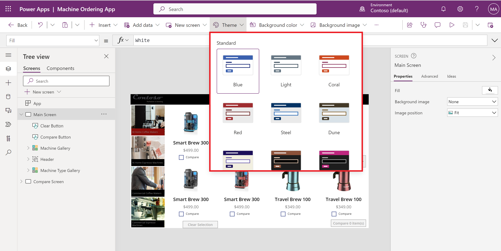
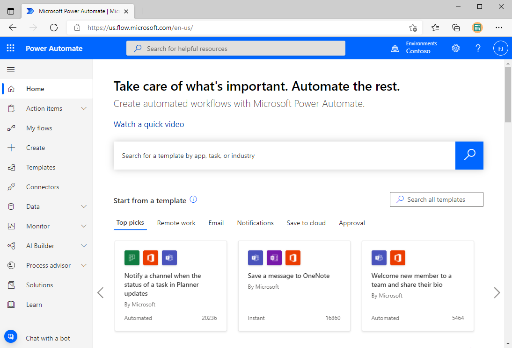
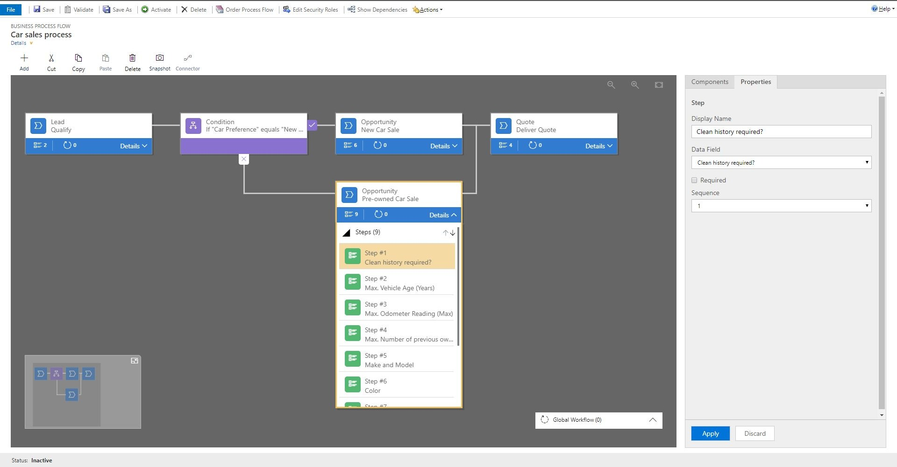
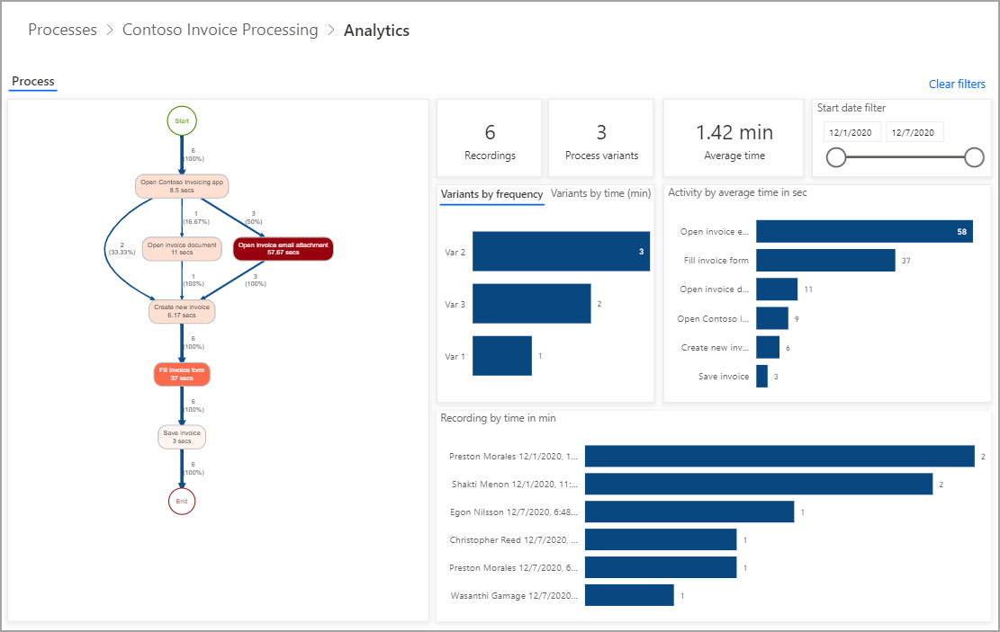
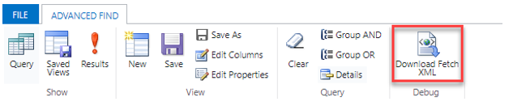
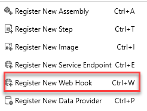
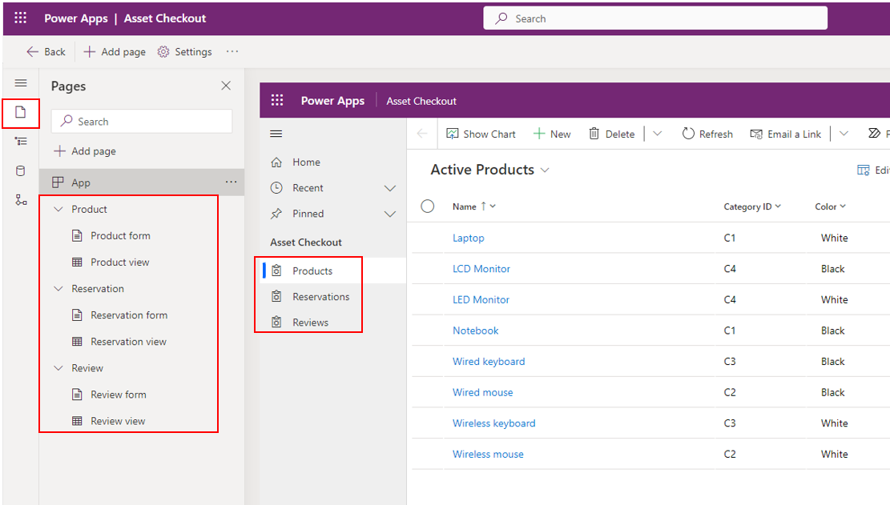
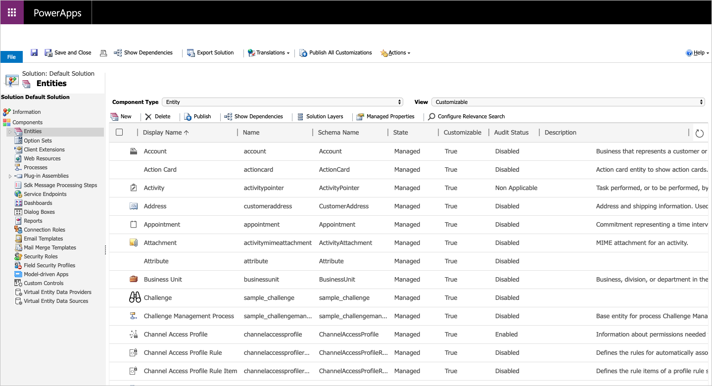

<!-- TOC start (generated with https://github.com/derlin/bitdowntoc) -->

# Table of Contents 

  * [Power Apps canvas apps](#power-apps-canvas-apps)
  * [Power Automate](#power-automate)
  * [AI Builder](#ai-builder)
  * [Dataverse Web API](#dataverse-web-api)
  * [Azure integration solution](#azure-integration-solution)
  * [Power Apps component framework](#power-apps-component-framework)
  * [Model-driven app](#model-driven-app)
  * [Dataverse Web API](#dataverse-web-api)
  * [Azure integration solution](#azure-integration-solution)
  * [Power Apps component framework](#power-apps-component-framework)
  * [Model-driven app](#model-driven-app)

<!-- TOC end -->

# Contents: Power Platform Developer
=======
# Part 4 - Power Platform Developer

1. [Get started with Power Apps canvas apps](https://learn.microsoft.com/en-us/training/modules/get-started-with-powerapps/?WT.mc_id=cloudskillschallenge_69681a7d-f052-4034-bf05-19a6dcf1bbec&ns-enrollment-type=Collection&ns-enrollment-id=jkqrho17wm61)
1. [Customize a canvas app in Power Apps](https://learn.microsoft.com/en-us/training/modules/customize-apps-in-powerapps/?WT.mc_id=cloudskillschallenge_69681a7d-f052-4034-bf05-19a6dcf1bbec&ns-enrollment-type=Collection&ns-enrollment-id=jkqrho17wm61)
1. [How to build the UI in a canvas app in Power Apps](https://learn.microsoft.com/en-us/training/modules/how-to-build-ui-canvas-app/?WT.mc_id=cloudskillschallenge_69681a7d-f052-4034-bf05-19a6dcf1bbec&ns-enrollment-type=Collection&ns-enrollment-id=jkqrho17wm61)
1. [Navigation in a canvas app in Power Apps](https://learn.microsoft.com/en-us/training/modules/navigation-canvas-app/?WT.mc_id=cloudskillschallenge_69681a7d-f052-4034-bf05-19a6dcf1bbec&ns-enrollment-type=Collection&ns-enrollment-id=jkqrho17wm61)
1. [Manage apps in Power Apps](https://learn.microsoft.com/en-us/training/modules/manage-apps-in-powerapps/?WT.mc_id=cloudskillschallenge_69681a7d-f052-4034-bf05-19a6dcf1bbec&ns-enrollment-type=Collection&ns-enrollment-id=jkqrho17wm61)
1. [Build a mobile-optimized app from Power Apps](https://learn.microsoft.com/en-us/training/modules/build-mobile-optimized/?WT.mc_id=cloudskillschallenge_69681a7d-f052-4034-bf05-19a6dcf1bbec&ns-enrollment-type=Collection&ns-enrollment-id=jkqrho17wm61)
1. [Get started with Power Automate](https://learn.microsoft.com/en-us/training/modules/get-started-flows/?WT.mc_id=cloudskillschallenge_69681a7d-f052-4034-bf05-19a6dcf1bbec&ns-enrollment-type=Collection&ns-enrollment-id=jkqrho17wm61)
1. [Build approval flows with Power Automate](https://learn.microsoft.com/en-us/training/modules/build-approval-flows/?WT.mc_id=cloudskillschallenge_69681a7d-f052-4034-bf05-19a6dcf1bbec&ns-enrollment-type=Collection&ns-enrollment-id=jkqrho17wm61)
1. [Build flows to manage user information](https://learn.microsoft.com/en-us/training/modules/manage-user-information/?WT.mc_id=cloudskillschallenge_69681a7d-f052-4034-bf05-19a6dcf1bbec&ns-enrollment-type=Collection&ns-enrollment-id=jkqrho17wm61)
1. [Power Automate's deep integration across multiple data sources](https://learn.microsoft.com/en-us/training/modules/multiple-data-sources/?WT.mc_id=cloudskillschallenge_69681a7d-f052-4034-bf05-19a6dcf1bbec&ns-enrollment-type=Collection&ns-enrollment-id=jkqrho17wm61)
1. [Use the Admin center to manage environments and data policies in Power Automate](https://learn.microsoft.com/en-us/training/modules/administer-flows/?WT.mc_id=cloudskillschallenge_69681a7d-f052-4034-bf05-19a6dcf1bbec&ns-enrollment-type=Collection&ns-enrollment-id=jkqrho17wm61)
1. [Use AI Builder in Power Automate](https://learn.microsoft.com/en-us/training/modules/ai-builder-power-automate/?WT.mc_id=cloudskillschallenge_69681a7d-f052-4034-bf05-19a6dcf1bbec&ns-enrollment-type=Collection&ns-enrollment-id=jkqrho17wm61)
1. [Optimize your business process with process advisor](https://learn.microsoft.com/en-us/training/modules/business-process-optimization-process-advisor/?WT.mc_id=cloudskillschallenge_69681a7d-f052-4034-bf05-19a6dcf1bbec&ns-enrollment-type=Collection&ns-enrollment-id=jkqrho17wm61)
1. [Work with Dataverse Web API](https://learn.microsoft.com/en-us/training/modules/common-data-service-web-api/?WT.mc_id=cloudskillschallenge_69681a7d-f052-4034-bf05-19a6dcf1bbec&ns-enrollment-type=Collection&ns-enrollment-id=jkqrho17wm61)
1. [Integrate Dataverse Azure solutions](https://learn.microsoft.com/en-us/training/modules/integrate-common-data-service-azure-solutions/?WT.mc_id=cloudskillschallenge_69681a7d-f052-4034-bf05-19a6dcf1bbec&ns-enrollment-type=Collection&ns-enrollment-id=jkqrho17wm61)
1. [Get started with Power Apps component framework](https://learn.microsoft.com/en-us/training/modules/get-started-component-framework/?WT.mc_id=cloudskillschallenge_69681a7d-f052-4034-bf05-19a6dcf1bbec&ns-enrollment-type=Collection&ns-enrollment-id=jkqrho17wm61)
1. [Build a Power Apps component](https://learn.microsoft.com/en-us/training/modules/build-power-app-component/?WT.mc_id=cloudskillschallenge_69681a7d-f052-4034-bf05-19a6dcf1bbec&ns-enrollment-type=Collection&ns-enrollment-id=jkqrho17wm61)
1. [Use advanced features with Power Apps component framework](https://learn.microsoft.com/en-us/training/modules/component-framework-advanced-topics/?WT.mc_id=cloudskillschallenge_69681a7d-f052-4034-bf05-19a6dcf1bbec&ns-enrollment-type=Collection&ns-enrollment-id=jkqrho17wm61)
1. [How to build your first model-driven app with Dataverse](https://learn.microsoft.com/en-us/training/modules/build-first-model-driven-app-dataverse/?WT.mc_id=cloudskillschallenge_69681a7d-f052-4034-bf05-19a6dcf1bbec&ns-enrollment-type=Collection&ns-enrollment-id=jkqrho17wm61)
1. [Create tables in Dataverse](https://learn.microsoft.com/en-us/training/modules/get-started-with-powerapps-common-data-service/?WT.mc_id=cloudskillschallenge_69681a7d-f052-4034-bf05-19a6dcf1bbec&ns-enrollment-type=Collection&ns-enrollment-id=jkqrho17wm61)
1. [Get started with model-driven apps in Power Apps](https://learn.microsoft.com/en-us/training/modules/get-started-with-model-driven-apps-in-powerapps/?WT.mc_id=cloudskillschallenge_69681a7d-f052-4034-bf05-19a6dcf1bbec&ns-enrollment-type=Collection&ns-enrollment-id=jkqrho17wm61)
<<<<<<< HEAD
1. [Configure forms, charts, and dashboards in model-driven apps](https://learn.microsoft.com/en-us/training/modules/configure-model-driven-apps-customer-engagement-apps/?WT.mc_id=cloudskillschallenge_69681a7d-f052-4034-bf05-19a6dcf1bbec&ns-enrollment-type=Collection&ns-enrollment-id=jkqrho17wm61)

## Power Apps canvas apps

- Power Apps Home Page - Apps start here, whether you build them from data, a sample app, or a blank screen.
- Power Apps Mobile - Run your apps on Microsoft Windows, Apple iOS, and Google Android devices.
- Power Apps Admin Center - Manage Power Apps environments and other components.
- Data sources, connections, and gateways
- Microsoft Dataverse
- Use the User() function to personalize the app. For example, create a Welcome screen and greet the user by using the User() function.
- There are several out-of-the box or default themes to choose from and these can be easily applied.
- You must select the form factor when you begin building your app. After you have selected tablet or phone, it can't be changed. With the tablet form factor, you can adjust the screen size.
- Navigate(Screen [, Transition [, UpdateContextRecord ]]): `Navigate(Screen2,ScreenTransition.Cover)`
- The `Back` function returns to the screen that was most recently displayed.

- App versioning

- Users and contributors need permissions to any data connections and gateways that a shared app uses. **Some permissions come implicitly with the app, but you must explicitly grant others.** If you create an app based on Microsoft Dataverse, you must also ensure that the users you share the app with have the appropriate permissions for the table or tables on which the app relies. 

- People who have Co-owner permission also need a Power Apps plan so that they'll be able to perform edits on the app.

- An environment is a container for apps and other resources, such as data connections and flows from Power Automate. It's a way to group items based on business requirements.

- `make.powerapps.com.`

- Build an app based on data in a Microsoft Excel workbook that's stored in Microsoft OneDrive for Business.



## Power Automate

- Power Automate is an online workflow service that automates actions across the most common apps and services. 

- You can use Power Automate to automate workflows between your favorite applications and services, sync files, get notifications, collect data, and much more.

- Shared flows extend the potential of Power Automate to groups of people. 

- **Shared connections can be used only in the flow in which they were created.**

- **Owners can use services in a flow, but they can't change the credentials for a connection that another owner created.**

- Each account can have up to:

    1. 600 flows.
    1. 50 custom connectors.
    1. 20 connections per application programming interface (API) and 100 connections total.

- You can install a gateway only in the default environment.

- Some external connectors, like Twitter, implement connection throttling to control the quality of service. 



- Business process flow



- **By default, the System Administrator and System Customizer security roles have access to new business process flows.**

- A connector, that is simply a wrapper around an API (Application Programming Interface), allows the underlying service to talk to Microsoft Power Automate.

- Enter the `statuscode eq 1` Open Data Protocol (OData) filter query and select Full name in the dynamic content pane. For more about filter and order by queries, see `MSDN: $filter` and `MSDN: $orderby`.

- **Process advisor** will map your process and give you insights on actions that are taking too long or have numerous variations.



## AI Builder

- Power Automate offers AI Builder actions that enable usage of all model types in flows. Adding AI Builder actions in your flow allows you to:

- Perform model inference by using outputs of upstream actions (email attachments received, SharePoint files dropped, created records in a Microsoft Dataverse table, and so on).

- Process model inference results in downstream actions (send by email, store in Dataverse records, message in Teams, and so on).

## Dataverse Web API

- The two main ways to interact with data and metadata in Microsoft Dataverse are the Web API and the organization service. You can use the organization service when writing plug-ins or workflow extensions by using the .NET Framework SDK assemblies that are provided by Microsoft. 

- Dataverse Web API is implemented as an OData (OASIS Open Data Protocol) service. 

- Fundamentally, OData protocol is a set of RESTful (REpresentational State Transfer) APIs, a time-tested industry standard for providing interoperability between systems. 

- **FetchXML** is a robust query language that allows for complex querying of Dataverse data. Microsoft provides a way for users to run FetchXML queries within a Web API query. This approach can be valuable if you encounter a scenario where FetchXML is a better fit for your particular query versus using OData query syntax.

- Microsoft Dataverse uses OAuth 2.0 as its authentication standard.

- All access to Dataverse is done in the context of a signed-in user. 

- **To connect Postman to Microsoft Dataverse, you must first ensure that you have an application registered in your Azure AD environment.**

- You can find the version number of your Web API endpoint by going to `your environment's Developer` resources in the maker portal.

- OData is a time-tested language for querying RESTful APIs.

    1. Create records
        ```
        POST [Organization URI]/api/data/v9.0/accounts HTTP/1.1
        Content-Type: application/json; charset=utf-8
        OData-MaxVersion: 4.0
        OData-Version: 4.0
        Accept: application/json

        {
            "name": "Sample Account",
            "creditonhold": false,
            "address1_latitude": 47.639583,
            "description": "This is the description of the sample account",
            "revenue": 5000000,
            "accountcategorycode": 1
        }
        ```

    1. Retrieve records

        The following sample retrieves an account with the ID of 00000000-0000-0000-0000-000000000001:

        ```
        GET [Organization URI]/api/data/v9.2/accounts(00000000-0000-0000-0000-000000000001)
        ```

- You can run FetchXML queries by using the following methods: Dataverse Web API, Organization service.

- If you're querying data against a model-driven app that is built on Dataverse, the simplest method for building FetchXML queries is to use Advanced Find, which contains a `Download FetchXML` function.

    

    ```xml
    <fetch mapping='logical'>  
    <entity name='account'>   
        <attribute name='accountid'/>   
        <attribute name='name'/>   
        <filter type='and'>   
            <condition attribute='address1_stateorprovince' operator='eq' value='WA' />   
        </filter>   
    </entity>   
    </fetch>
    ```
- Call Power Automate actions from the Web API

    ```json
    POST [Organization URI]/api/data/v9.2/WinOpportunity HTTP/1.1
    Accept: application/json
    Content-Type: application/json; charset=utf-8
    OData-MaxVersion: 4.0
    OData-Version: 4.0

    {
    "Status": 3,
    "OpportunityClose": {
    "subject": "Won Opportunity",
    "opportunityid@odata.bind": "[Organization URI]/api/data/v9.2/opportunities(b3828ac8-917a-e511-80d2-00155d2a68d2)"
    }
    }
    ```
- Call pre-built Dataverse actions

    Dataverse comes with a set of existing actions that you can use to perform common operations. Some of these actions might only apply to model-driven or Dynamics 365 apps. For example, the CalculatePrice action calculates the price in an opportunity/quote/order/invoice, so it would only apply to a Dynamics 365 Sales app where that functionality exists.

- Unbound vs. bound actions

    An action can be built as either unbound (meaning, it doesn't have a Dataverse entity correlated to it) or bound (meaning, the logic is tied to a specific entity record). SQL developers could
    consider these actions as similar to stored procedures (unbound actions) versus triggers (bound actions). 

- Within the context of Microsoft Dataverse, the logic that you're running will apply all appropriate role and object-based security based on the user whom you're impersonating.

- Delta links

    According to the OData 4.0 documentation, delta links are "opaque, service-generated links that the client uses to retrieve subsequent changes to a result." Microsoft has built this standard into change tracking in Dataverse to provide a common, standard method for interfacing with change data as it occurs over time.

## Azure integration solution

|                                                                                                                                                                           |                                                                      |
|---------------------------------------------------------------------------------------------------------------------------------------------------------------------------|----------------------------------------------------------------------|
|**IF YOU WANT TO...**                                                                                                                                                      |**USE THIS**                                                          |
|Create workflows and orchestrate business processes to connect hundreds of services in the cloud and on-premises.                                                          |[Logic Apps](https://azure.microsoft.com/services/logic-apps/)        |
|Connect on-premises and cloud-based applications and services to implement messaging workflows                                                                             |[Service Bus](https://azure.microsoft.com/services/service-bus/)      |
|Publish your APIs for internal and external developers to use when connecting to backend systems that are hosted anywhere.                                                 |[API Management](https://azure.microsoft.com/services/api-management/)|
|Connect supported Azure and third-party services by using a fully managed event-routing service with a publish-subscribe model that simplifies event-based app development.|[Event Grid](https://azure.microsoft.com/services/event-grid/)        |
|Continuously ingest data in real time from up to hundreds of thousands of sources and stream a million events per second.                                                  |[Event Hubs](https://azure.microsoft.com/services/event-hubs/)        |

- You will be using **Dataverse's Plug-in Registration Tool** to configure the publishing of your Dataverse data to your Service Bus. This tool is provided as part of Microsoft's Dataverse developer tooling, which is found at NuGet. 

    

## Power Apps component framework

- Code components are implemented using HTML, CSS, and TypeScript. While it is not required that you use any particular UI Framework, React and Fluent UI are popular choices.

- The Power Platform CLI (command-line interface) is a developer-focused command-line tooling that provides commands for building custom code.

- When you start to build your code component, you will use the CLI to scaffold your initial files using a template. The following is an example of initializing a component using the field template: `pac pcf init --namespace Contoso --name Slider --template field`

- `pac pcf push --publisher-prefix msl`

- Power Apps component framework exposes a formatting API that can be especially useful when you need to format various values in your application. 

- Use the Microsoft Dataverse web API in a Power Apps component. The Web API component is only supported in model-driven apps.

## Model-driven app

- Unlike canvas apps, where you build out an app screen-by-screen by adding logic and code as you go, model-driven apps can be created with a few simple steps. Model-driven apps use a component-focused approach to develop the app.

    

- Through model-driven apps, you can create business process flows.

- When you create a model-driven app, you can use all of the power of Dataverse to rapidly configure your forms, and process flows. Relationships set between tables are automatically available here and easy to use when building views.

- When creating a model-driven app, you use tables from Microsoft Dataverse as your building blocks.

- Dataverse data is stored in tables.

- Microsoft Dataverse is the cloud data platform for the Microsoft Power Platform that is easy to use, compliant, secure, scalable, and globally available. Using Microsoft Dataverse as the data store for your apps has many benefits:
    - Metadata: Properties you define on your data model are used by Power Apps, speeding up the building of apps.
    - Data access: You can control who can access which tables, rows, and columns.
    - Logic: Calculations and rules can be added to table columns.
    - Import and export: You can choose from multiple tools to manage your data, including Excel.
    - Audit: You can track who accesses and changes data.
    - Processes: Business processes can be added to ensure data quality and perform automation.
    - Managed data in the cloud: You don't need to perform backups or configure the database because this is performed for you by Microsoft.
    - Storage: You don't need to worry about how the data is stored because Microsoft takes care of this for you.
    - Skills: You don't need to be a DBA to manage Dataverse.
    - Secure: All data is encrypted at rest and in transit.
    - Integration: Dataverse is deeply integrated with Microsoft cloud services such as Microsoft 365 and Microsoft Azure.
    - Proven: Microsoft Dataverse is used by Dynamics 365 apps such as Dynamics 365 Sales and Dynamics 365 Customer Service.
    - Connectors: Microsoft Dataverse has connectors for Power Apps, Power Automate, and Power BI.

- Tables are the key building blocks of Microsoft Dataverse. In Dataverse, a table is more than just a database table with columns and relationships. A Dataverse table contains other components to support your apps and flows. Tables in Dataverse have the following properties:

    - Name: For example Pets and Skills
    - Rows: Fido and Max are instances of pets
    - Columns: Such as pet type, age, and breed
    - Relationships: Describe the links to other tables, such as this pet has these skills.
    - Alternate keys: Alternate column, or columns, to uniquely identify a row in the table
    - Forms: Forms used by model-driven apps to view and edit a table row
    - Views: Define the rows and columns for displaying table rows
    - Charts: Visualizations of table rows
    - Business rules: Logic that can be applied to columns in a table row
    - Metadata: Properties of the table that affect the capabilities of the table and how the table can be used by apps and flows


- Database tables have a primary key. A primary key uniquely identifies a single row in the table. In Dataverse, the primary key is a Globally Unique Identifier (GUID), a 32-character string such as 123e4567-e89b-12d3-a456-426655440000. The GUID for the primary key is generated automatically when a row is created in a Dataverse table. When creating a Dataverse table, this column is defaulted to `Name`.

- You cannot change the following after the table is created:

    1. Schema name
    1. Table type
    1. Table ownership

- Table types

    1. Standard: A table where you can store data and add to the navigation in model-driven apps. Most tables you create will be standard tables.

    1. Activity: Activity tables store interactions such as phone calls, tasks, and appointments. Dataverse has a set of activity tables. These tables share the same set of columns and share security privileges. Many of the table options, including the primary column, are fixed and can't be changed. Activity tables appear in the timeline on model-driven app forms.

    1. Virtual: Virtual tables connect to data from an external data source such as Microsoft Azure SQL Database or a SharePoint List.

- Microsoft Dataverse is more than a data store, it contains features to apply business logic to data and securing access to data.

- Configure tables and columns for auditing -
Auditing can be configured at three levels: environment, table, and column. 

- Dual-write is an out-of-the-box infrastructure that provides near-real-time interaction between Dataverse and Dynamics 365 finance and operations apps or Business Central apps.

- Virtual tables (also known as virtual entities) enable the integration of data residing in external systems by seamlessly representing that data as tables in Microsoft Dataverse, without replication of data and often without custom coding.

- Components of model-driven apps

1. Data components

    |             |                                                                                                                                                                                                                                                                                                                                                                             |                              |
    |-------------|-----------------------------------------------------------------------------------------------------------------------------------------------------------------------------------------------------------------------------------------------------------------------------------------------------------------------------------------------------------------------------|------------------------------|
    |**Component**|**Description**                                                                                                                                                                                                                                                                                                                                                              |**Designer**                  |
    |Table        |A container for records with properties that you track, such as a contact or account. Many standard tables are available. You can customize a non-system standard table (production table) or create a custom table from scratch.                                                                                                                                            |Power Apps table designer     |
    |Column       |A property that is associated with a table. A column is defined by a data type, which determines the type of data that can be entered or selected. Examples include text, number, date and time, currency, or lookup (creates a relationship with another table). Columns typically are used with forms, views, and searches.                                                |Power Apps table designer     |
    |Relationship |Table relationships define how tables can be related to each other. There are 1:N (one-to-many), N:1 (many-to-one), and N:N (many-to-many) types of relationships. For example, adding a lookup column to a table creates a new 1:N relationship between the two tables and lets you put that lookup column on a form.                                                       |Power Apps table designer     |
    |Choice column|This is a special type of column, which provides the user a set of predetermined options. Each option has a number value and label. When added to a form, this column displays a control for the user to select an option. There are two kinds of choices; choices, where the user can only select one option, and multi-select choices, which allow more than one selection.|Power Apps option set designer|

1. User interface components

    |             |                                                                                                                                                                                                                                                                                    |                 |
    |-------------|------------------------------------------------------------------------------------------------------------------------------------------------------------------------------------------------------------------------------------------------------------------------------------|-----------------|
    |**Component**|**Description**                                                                                                                                                                                                                                                                     |**Designer**     |
    |App          |Determines the application fundamentals such as components, properties, client type, and URL for your app.                                                                                                                                                                          |App designer     |
    |Site map     |Specifies the navigation for your app.                                                                                                                                                                                                                                              |Site map designer|
    |Form         |A set of data-entry columns for a given table that matches the items that your organization tracks for the table. For example, a set of data-entry columns where users input relevant information to track a customer's previous orders along with specific requested reorder dates.|Form designer    |
    |View         |Views define how a list of records for a specific table appears in your app. A view defines the columns shown, the width of each column, the sort behavior, and the default filters.                                                                                                |View designer    |

1. Logic 
    |                     |                                                                                                                                                                                                                                                                       |                              |
    |---------------------|-----------------------------------------------------------------------------------------------------------------------------------------------------------------------------------------------------------------------------------------------------------------------|------------------------------|
    |**Type of logic**    |**Description**                                                                                                                                                                                                                                                        |**Designer**                  |
    |Business process flow|An online process that walks users through a standard business process. For example, use a business process flow if you want everyone to handle customer service requests the same way, or to require staff to gain approval for an invoice before submitting an order.|Business process flow designer|
    |Workflow             |Workflows automate business processes without a user interface. Designers use workflows to initiate automation that doesn't require any user interaction.                                                                                                              |Workflow designer             |
    |Actions              |Actions are a type of process that lets you manually invoke actions, including custom actions, directly from a workflow.                                                                                                                                               |Process designer              |
    |Business rule        |Used to apply rule or recommendation logic to a form, such as to set column requirements, hide columns, or validate data. App designers use a simple interface to implement and maintain fast-changing and commonly used rules.                                        |Business rule designer        |
    |Power Automate Flow  |Power Automate is a cloud-based service that lets you create automated workflows between apps and services to get notifications, sync files, collect data, and more.                                                                                                   |Power Automate                |

1. Visualizations

    |                 |                                                                                                                                      |                  |
    |-----------------|--------------------------------------------------------------------------------------------------------------------------------------|------------------|
    |**Component**    |**Description**                                                                                                                       |**Designer**      |
    |Chart            |A single graphic visualization that can be displayed within a view, on a form, or be added to a dashboard.                            |Chart designer    |
    |Dashboard        |Functions as a palette for one or more graphic visualizations that provide an overview of actionable business data.                   |Dashboard designer|
    |Embedded Power BI|Add embedded Power BI tiles and dashboards to your app. Power BI is a cloud-based service that provides business intelligence insight.|                  |

1. Advanced model-driven apps

    `Switch to classic.`

    

- About predefined security roles

|                    |                                                                       |                                                                                                                                                                                                                                                                                                                                                                                                                            |
|--------------------|-----------------------------------------------------------------------|----------------------------------------------------------------------------------------------------------------------------------------------------------------------------------------------------------------------------------------------------------------------------------------------------------------------------------------------------------------------------------------------------------------------------|
|**Security role**   |**Privileges**                                                         |**Description**                                                                                                                                                                                                                                                                                                                                                                                                             |
|Environment Maker   |None                                                                   |Users who have this role can create new resources that are associated with an environment. For example: apps, connections, custom application programming interfaces (APIs), gateways, and flows that use Microsoft Flow. But these users can't access the data in an environment. To learn more about environments, see [Announcing Power Apps environments](https://powerapps.microsoft.com/blog/powerapps-environments/).|
|System Administrator|Create, Read, Write, Delete, Customize                                 |This role has full permission to customize or administer the environment, including creating, changing, and assigning security roles. Users who have this role can view all data in the environment. To learn more, see [Privileges required for customization](https://learn.microsoft.com/en-us/power-apps/maker/model-driven-apps/privileges-required-customization).                                                    |
|System Customizer   |Create (self), Read (self), Write (self), Delete (self), Customizations|This role has full permission to customize the environment. But users who have this role can view rows only for environment tables that they create. To learn more, see [Privileges required for customization](https://learn.microsoft.com/en-us/power-apps/maker/model-driven-apps/privileges-required-customization).                                                                                                    |
|Basic User          |Read, Create (self), write (self), delete (self)                       |Users who have this role can run an app in the environment and perform common tasks for the rows they own.                                                                                                                                                                                                                                                                                                                  |
|Delegate            |Act on behalf of another user                                          |This role lets code run as or impersonate another user. This role is typically used with another security role to provide access to rows. To learn more, see [Impersonate another user](https://learn.microsoft.com/en-us/dynamics365/customerengagement/on-premises/developer/org-service/impersonate-another-user/).                                                                                                      |