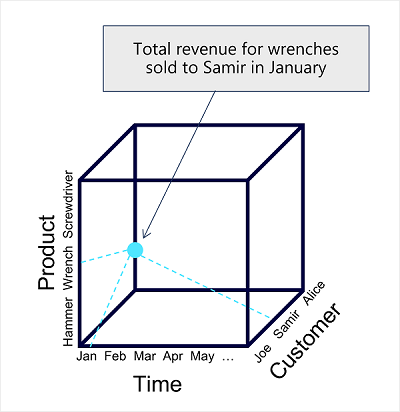
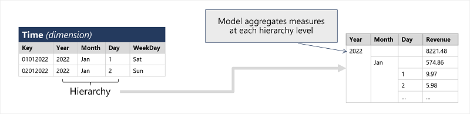

# Table of Contents 

# Contents: Power BI

  * [Part 1: Create and use analytics reports with Power BI](https://learn.microsoft.com/en-us/training/paths/create-use-analytics-reports-power-bi/)

  * [Part 2: Model data in Power BI](https://learn.microsoft.com/en-us/training/paths/model-power-bi/)

## 

## Describe core concepts of data modeling

- Analytical models enable you to structure data to support analysis. Models are based on related tables of data and define the numeric values that you want to analyze or report (known as measures) and the entities by which you want to aggregate them (known as dimensions). For example, a model might include a table containing numeric measures for sales (such as revenue or quantity) and dimensions for products, customers, and time. This would enable you aggregate sale measures across one or more dimensions (for example, to identify total revenue by customer, or total items sold by product per month). Conceptually, the model forms a multidimensional structure, which is commonly referred to as a cube, in which any point where the dimensions intersect represents an aggregated measure for those dimensions.)

    

- **Although we commonly refer to an analytical model as a cube, there can be more (or fewer) than three dimensions – it’s just not easy for us to visualize more than three!**

- This type of schema, where a fact table is related to one or more dimension tables, is referred to as a star schema (imagine there are five dimensions related to a single fact table – the schema would form a five-pointed star!). 

    

- One final thing worth considering about analytical models is the creation of attribute hierarchies that enable you to quickly drill-up or drill-down to find aggregated values at different levels in a hierarchical dimension. 

    

## Connection Types

| Connection Type | Strengths | Drawbacks |
| --- | --- | --- |
| Import Data or Scheduled Refresh | - Loads data into Power BI, allowing for quick data manipulation and visualization.   - Can refresh data on a schedule.  - Data retention in a pbix | - Consumes memory and disk space.   - Data is not real-time. |
| DirectQuery | - Does not consume memory or disk space in Power BI.   - Allows for ‘near real-time’ data.   - Slow and schema only retention in a pbix | - Performance depends on the source system.   - Some Power BI features are not available. |
| Live Connection | - Allows you to connect to an existing semantic model.   - Data can be updated without accessing the report.| - You cannot create new measures or calculated columns.   - Some Power BI features are not available.   - Live Connection is not able to create a semantic model.  |
| Composite Model | - Combines the benefits of both DirectQuery and Import Data.   - Allows for a mix of import and DirectQuery tables in the same report. | - Can be complex to set up and manage.   - Some Power BI features are not available. |
| Dataflow | - Unifies data from various sources, prepares it for consumption, and publishes it for users to consume in Power BI.   - Promotes reusability of underlying data elements.   - Persists data in your own Azure Data Lake Gen 2 storage. | - Dataflows might not be available for all U.S. Government DoD customers.   - Deleted datasources aren't removed from the dataflow datasource page.   - The current maximum depth is 32.   - Shared dataflows have a refresh limit of two hours per entity, and three per dataflow. |
