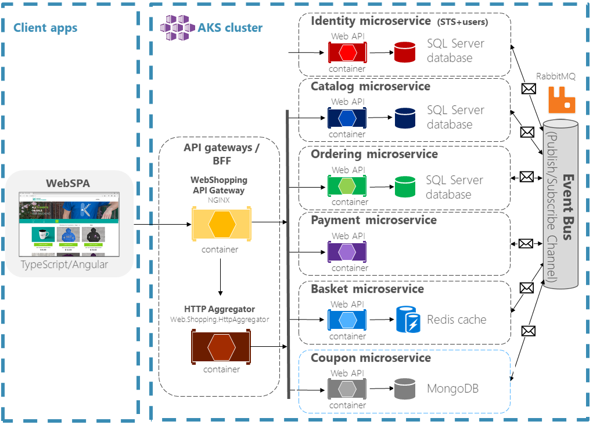
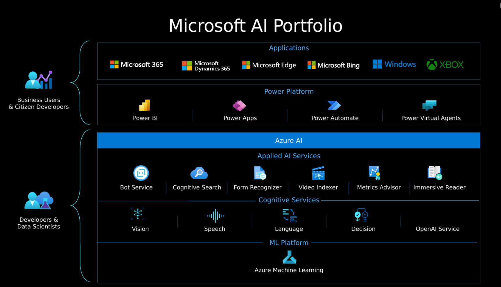

# <strong>Microsoft Build: Challenge 2023</strong>

🪟🍭🖥️ This document is a concise summary of the Microsoft Build Challenge. It condenses the written content into key points that I will review later.

> [Skills Challenge Registration](https://www.microsoft.com/en-US/cloudskillschallenge/build/registration/2023)

## Part 1 - Azure

[Microsoft Build: Cloud Development Challenge](Azure.md) - 36 Chapters

  

## Part 2 - .NET

[Microsoft Build: .NET Challenge](dotNET.md) - 33 Chapters

  

---

@WIP

## Part 3 - Azure AI

[Microsoft Build: Azure AI Challenge](AzureAI.md) - 22 Chapters

  

@TODO

## Part 4 - Power Platform Developer

[Microsoft Build: Power Platform Developer Challenge](PPF.md) - 22 Chapters

## Part 5 - DevOps

[Microsoft Build: DevOps Challenge](DevOps.md) - 51 Chapters

## Part 6 - Microsoft 365 Developer

[Microsoft Build: Microsoft 365 Developer Challenge](M365dev.md) - 20 Chapters
