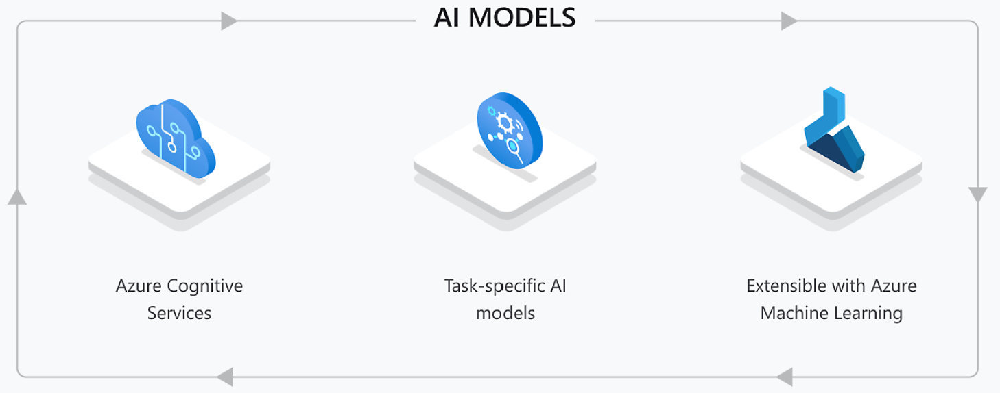
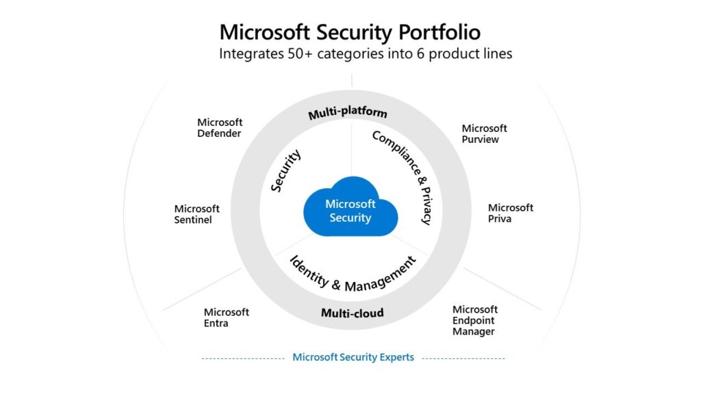
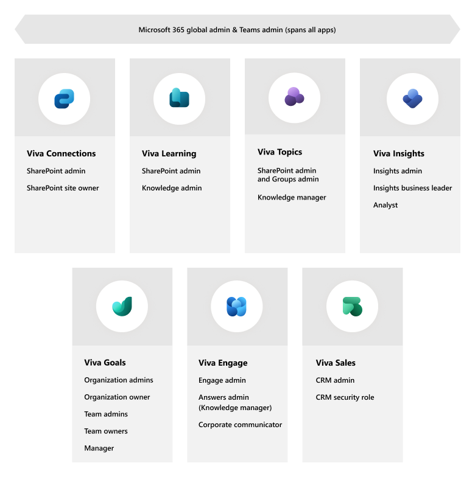
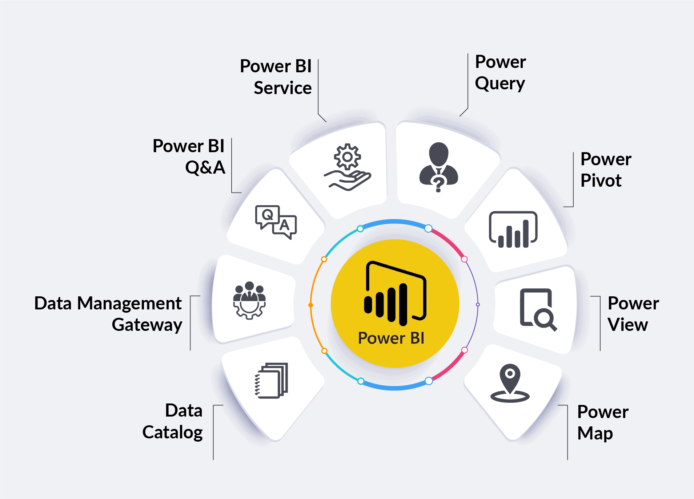

# <strong>Microsoft Build: Challenge 2023</strong>

🪟🍭🖥️ This document is a concise summary of the Microsoft Build Challenge. It condenses the written content into key points that I will review later.

> [Skills Challenge Registration](https://www.microsoft.com/en-US/cloudskillschallenge/build/registration/2023)

> Challenge Details
> There are 8 challenges available. The challenge ends on June 20, 2023 at 4:00 PM (16:00) UTC.

## Part 1 - Azure

[Microsoft Build: Cloud Development Challenge](Azure.md) - 36 Chapters

  

## Part 2 - .NET

[Microsoft Build: .NET Challenge](dotNET.md) - 33 Chapters

  

## Part 3 - Azure AI

[Microsoft Build: Azure AI Challenge](AzureAI.md) - 22 Chapters

  

## Part 4 - Power Platform Developer

[Microsoft Build: Power Platform Developer Challenge](PPF.md) - 22 Chapters

  

## Part 5 - DevOps

[Microsoft Build: DevOps Challenge](DevOps.md) - 51 Chapters

  

## Part 6 - Microsoft 365 Developer

[Microsoft Build: Microsoft 365 Developer Challenge](M365dev.md) - 20 Chapters

  

## Part 7 - Azure Cosmos DB Developer

[Microsoft Build: Azure Cosmos DB Developer Challenge](Cosmos.md) - 30 Chapters

## Part 8 - Developer Tools

[Microsoft Build: Developer Tools Challenge](DevTool.md) - 24 Chapters

# <strong>Microsoft Learn AI Skills Challenge 2023</strong>

  

## Part 1 - Machine Learning

[Machine Learning](./AIChallenge/MachineLearning.md) - 13 Chapters

## Part 2 - Cognitive Services

[Cognitive Services](./AIChallenge/CognitiveServices.md) - 19 Chapters

## Part 3 - Machine Learning Operations (MLOps)

[Machine Learning Operations (MLOps)](./AIChallenge/MLOps.md) - 15 Chapters

## Part 4 - AI Builder

[AI Builder](./AIChallenge/AIBuilder.md) - 18 Chapters

# <strong>Microsoft Learn: Notes</strong>

## Part 1 - Security, Compliance, and Identity

[Microsoft Security, Compliance, and Identity Fundamentals](Security.md)

  

## Part 2 - Viva Suite

[Viva Suite](Viva.md)

  

## Part 3 - Power BI

[Power BI](PowerBI.md)

  

The image @cite: [k21academy](https://k21academy.com/microsoft-azure/data-analyst/what-is-power-bi/)
