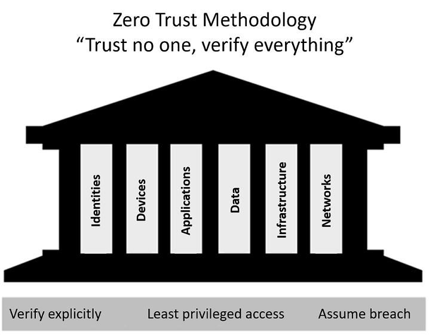
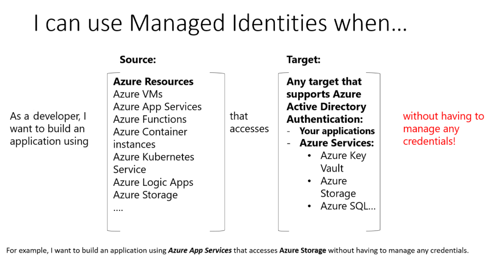
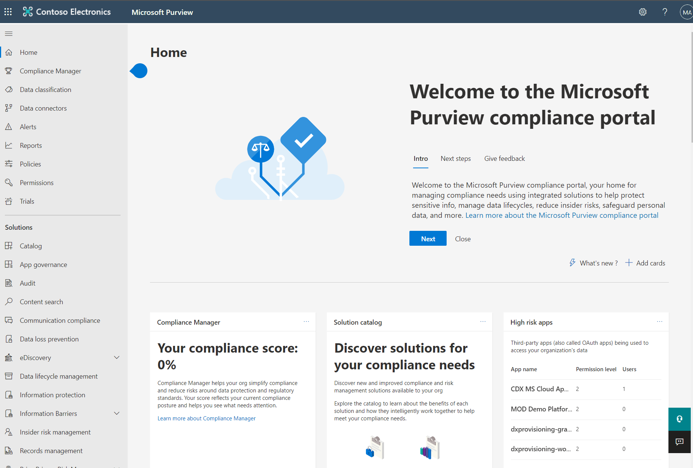

# Table of Contents 

<!-- TOC start (generated with https://github.com/derlin/bitdowntoc) -->

  * [Describe the concepts of security, compliance, and identity](#describe-the-concepts-of-security-compliance-and-identity)
  * [Describe the capabilities of Microsoft security solutions](#describe-the-capabilities-of-microsoft-security-solutions)
    + [Azure](#azure)
    + [Microsoft Sentinel](#microsoft-sentinel)
    + [Microsoft 365 Defender](#microsoft-365-defender)
  * [Describe the capabilities of Microsoft compliance solutions](#describe-the-capabilities-of-microsoft-compliance-solutions)
    + [Service Trust Portal](#service-trust-portal)
    + [Microsoft Purview compliance portal](#microsoft-purview)
        - The URL for the portal is https://compliance.microsoft.com1. You can also visit https://web.purview.azure.com to access the Microsoft Purview governance portal.
    + [Azure governance capabilities](#azure-governance-capabilities)

<!-- TOC end -->

# Contents: Microsoft Security, Compliance, and Identity Fundamentals

  * [Part 1: Describe the concepts of security, compliance, and identity](https://learn.microsoft.com/en-us/training/paths/describe-concepts-of-security-compliance-identity/)

  * [Part 2: Describe the capabilities of Microsoft Azure Active Directory, part of Microsoft Entra](https://learn.microsoft.com/en-us/training/paths/describe-capabilities-of-microsoft-identity-access/)

  * [Part 3: Describe the capabilities of Microsoft security solutions](https://learn.microsoft.com/en-us/training/paths/describe-capabilities-of-microsoft-security-solutions/)

  * [Part 4: Describe the capabilities of Microsoft compliance solutions](https://learn.microsoft.com/en-us/training/paths/describe-capabilities-of-microsoft-compliance-solutions/)

## Describe the concepts of security, compliance, and identity

- The shared responsibility model

    

- Layers of security

    

- Confidentiality, Integrity, Availability (CIA)

    

- Zero Trust guiding principles

    

    - The Zero Trust model has three principles which guide and underpin how security is implemented. These are: verify explicitly, least privilege access, and assume breach.

        1. Verify explicitly. Always authenticate and authorize based on the available data points, including user identity, location, device, service or workload, data classification, and anomalies.
        1. Least privileged access. Limit user access with just-in-time and just-enough access (JIT/JEA), risk-based adaptive policies, and data protection to protect both data and productivity.
        1. Assume breach. Segment access by network, user, devices, and application. Use encryption to protect data, and use analytics to get visibility, detect threats, and improve your security.

    - Six foundational pillars
    In the Zero Trust model, all elements work together to provide end-to-end security. These six elements are the foundational pillars of the Zero Trust model:

        1. Identities may be users, services, or devices. When an identity attempts to access a resource, it must be verified with strong authentication, and follow least privilege access principles.
        1. Devices create a large attack surface as data flows from devices to on-premises workloads and the cloud. Monitoring devices for health and compliance is an important aspect of security.
        1. Applications are the way that data is consumed. This includes discovering all applications being used, sometimes called Shadow IT because not all applications are managed centrally. This pillar also includes managing permissions and access.
        1. Data should be classified, labeled, and encrypted based on its attributes. Security efforts are ultimately about protecting data, and ensuring it remains safe when it leaves devices, applications, infrastructure, and networks that the organization controls.
        1. Infrastructure, whether on-premises or cloud based, represents a threat vector. To improve security, you assess for version, configuration, and JIT access, and use telemetry to detect attacks and anomalies. This allows you to automatically block or flag risky behavior and take protective actions.
        1. Networks should be segmented, including deeper in-network micro segmentation. Also, real-time threat protection, end-to-end encryption, monitoring, and analytics should be employed.

- Symmetric and Asymmetric

    - Two top-level types of encryption: symmetric and asymmetric. Symmetric encryption uses the same key to encrypt and decrypt the data. Asymmetric encryption uses a public key and private key pair. Either key can encrypt data, but a single key can’t be used to decrypt encrypted data. To decrypt, you need a paired key. Asymmetric encryption is used for things such accessing sites on the internet using the HTTPS protocol and electronic data signing solutions. Encryption may protect data at rest, or in transit.

        

- Hashing

    - Hashing uses an algorithm to convert text to a unique fixed-length value called a hash. Each time the same text is hashed using the same algorithm, the same hash value is produced. That hash can then be used as a unique identifier of its associated data.

    - Hashing is different to encryption in that it doesn't use keys, and the hashed value isn't subsequently decrypted back to the original.

        

- Government agencies and industry groups have issued regulations to help protect and govern the use of data. From personal and financial information to data protection and privacy, organizations can be accountable for meeting dozens of regulations to be compliant. Listed below are some important concepts and terms that relate to data compliance.

    1. Data residency - When it comes to compliance, data residency regulations govern the physical locations where data can be stored and how and when it can be transferred, processed, or accessed internationally. These regulations can differ significantly depending on jurisdiction.

    1. Data sovereignty - Another important consideration is data sovereignty, the concept that data, particularly personal data, is subject to the laws and regulations of the country/region in which it's physically collected, held, or processed. This can add a layer of complexity when it comes to compliance because the same piece of data can be collected in one location, stored in another, and processed in still another; making it subject to laws from different countries/regions.

    1. Data privacy - Providing notice and being transparent about the collection, processing, use, and sharing of personal data are fundamental principles of privacy laws and regulations. Personal data means any information relating to an identified or identifiable natural person. Privacy laws previously referenced "PII" or "personally identifiable information" but the laws have expanded the definition to any data that is directly linked or indirectly linkable back to a person. Organizations are subject to, and must operate consistent with, a multitude of laws, regulations, codes of conduct, industry-specific standards, and compliance standards governing data privacy.

- Authentication
Authentication is the process of proving that a person is who they say they are. When someone purchases an item with a credit card, they may be required to show an additional form of identification. This proves that they are the person whose name appears on the card. In this example, the user may show a driver’s license that serves as a form of authentication and proves their ID.

- Authorization
Once you authenticate a user, you'll need to decide where they can go, and what they're allowed to see and touch. This process is called authorization.

- Four pillars of an identity infrastructure

    -  Identity is a concept that spans an entire environment, so organizations need to think about it broadly. There's a collection of processes, technologies, and policies for managing digital identities and controlling how they're used to access resources. These can be organized into four fundamental pillars that organizations should consider when creating an identity infrastructure.

        1. Administration. Administration is about the creation and management/governance of identities for users, devices, and services. As an administrator, you manage how and under what circumstances the characteristics of identities can change (be created, updated, deleted).
        1. Authentication. The authentication pillar tells the story of how much an IT system needs to know about an identity to have sufficient proof that they really are who they say they are. It involves the act of challenging a party for legitimate credentials.
        1. Authorization. The authorization pillar is about processing the incoming identity data to determine the level of access an authenticated person or service has within the application or service that it wants to access.
        1. Auditing. The auditing pillar is about tracking who does what, when, where, and how. Auditing includes having in-depth reporting, alerts, and governance of identities.

- With modern authentication, all services, including all authentication services, are supplied by a central identity provider. Information that's used to authenticate the user with the server is stored and managed centrally by the identity provider.

    - With a central identity provider, organizations can establish authentication and authorization policies, monitor user behavior, identify suspicious activities, and reduce malicious attacks.

    - Another fundamental capability of an identity provider and “modern authentication” is the support for single sign-on (SSO). With SSO, the user logs in once and that credential is used to access multiple applications or resources. When you set up SSO between multiple identity providers, it's called federation.

    - Active Directory (AD) is a set of directory services developed by Microsoft as part of Windows 2000 for on-premises domain-based networks. The best-known service of this kind is Active Directory Domain Services (AD DS). It stores information about members of the domain, including devices and users, verifies their credentials, and defines their access rights. A server running AD DS is a domain controller (DC).

    - AD DS is a central component in organizations with on-premises IT infrastructure. AD DS gives organizations the ability to manage multiple on-premises infrastructure components and systems using a single identity per user. AD DS doesn't, however, natively support mobile devices, SaaS applications, or line of business apps that require modern authentication methods.

    - Azure Active Directory is the next evolution of identity and access management solutions. It provides organizations with an Identity as a Service (IDaaS) solution for all their apps across cloud and on-premises. In this course, we'll focus on Azure AD, Microsoft’s cloud-based identity provider.

- The concept of Federation

    - Federation enables the access of services across organizational or domain boundaries by establishing trust relationships between the respective domain’s identity provider. With federation, there's no need for a user to maintain a different username and password when accessing resources in other domains.

            

    - The simplified way to think about this federation scenario is as follows:

        1. The website, in domain A, uses the authentication services of Identity Provider A (IdP-A).
        1. The user, in domain B, authenticates with Identity Provider B (IdP-B).
        1. IdP-A has a trust relationship configured with IdP-B.
        1. When the user, who wants to access the website, provides his/her credentials to the website, the website trusts the user and allows access. This access is allowed because of the trust that is already established between the two identity providers.

    - **With federation, trust isn't always bidirectional.** Although IdP-A may trust IdP-B and allow the user in domain B to access the website in domain A, the opposite isn't true, unless that trust relationship is configured.

    ## Describe the capabilities of Microsoft Azure Active Directory, part of Microsoft Entra

    - Microsoft Entra is a product family that encompasses all of Microsoft’s identity and access capabilities, including Microsoft Azure Active Directory (Azure AD).

    - Microsoft Azure Active Directory (Azure AD), part of Microsoft Entra, is Microsoft’s cloud-based identity and access management service. Organizations use Azure AD to enable their employees, guests, and others to sign in and access the resources they need, including:

        1. Internal resources, such as apps on your corporate network and intranet, and cloud apps developed by your own organization.
        1. External services, such as Microsoft Office 365, the Azure portal, and any SaaS applications used by your organization.

             
    
    - Azure AD is available in four editions: Free, Office 365 Apps, Premium P1, and Premium P2.

        1. Azure Active Directory Free. The free version allows you to administer users and create groups, synchronize with on-premises Active Directory, create basic reports, configure self-service password change for cloud users, and enable single sign-on across Azure, Microsoft 365, and many popular SaaS apps. The free edition is included with subscriptions to Office 365, Azure, Dynamics 365, Intune, and Power Platform.

        1. Office 365 Apps. The Office 365 Apps edition allows you to do everything included in the free version, **plus self-service password reset for cloud users, and device write-back, which offers two-way synchronization between on-premises directories and Azure AD.** The Office 365 Apps edition of Azure Active Directory is included in subscriptions to Office 365 E1, E3, E5, F1, and F3.

        1. Azure Active Directory Premium P1. The Premium P1 edition includes all the features in the free and Office 365 apps editions. It also supports **advanced administration, such as dynamic groups, self-service group management, Microsoft Identity Manager (an on-premises identity and access management suite) and cloud write-back capabilities, which allow self-service password reset for your on-premises users.**

        1. Azure Active Directory Premium P2. P2 offers all the Premium P1 features, and Azure Active Directory Identity Protection to help provide risk-based Conditional Access to your apps and critical company data. P2 also gives you **Privileged Identity Management to help discover, restrict, and monitor administrators and their access to resources, and to provide just-in-time access when needed.**
    
    - Azure AD identity types

        1. Azure AD manages different types of identities: users, service principals, managed identities, and devices. 

        1. User: A user identity is a representation of something that's managed by Azure AD. Employees and guests are represented as users in Azure AD. If you have several users with the same access needs, you can create a group. You use groups to give access permissions to all members of the group, instead of having to assign access rights individually.

            - Azure AD business-to-business (B2B) collaboration, a feature within External Identities, includes the capability to add guest users. With B2B collaboration, an organization can securely share applications and services with guest users from another organization.

        1. Service principal: A service principal is, essentially, an identity for an application. For an application to delegate its identity and access functions to Azure AD, the application must first be registered with Azure AD to enable its integration. Once registered, a service principal is created in each Azure AD tenant where the application is used. The service principal enables core features such as authentication and authorization of the application to resources that are secured by the Azure AD tenant.

            - For the service principals to be able to access resources secured by the Azure AD tenant, application developers must manage and protect the credentials. 

        1. Managed identity: **Managed identities are a type of service principal that are automatically managed in Azure AD** and eliminate the need for developers to manage credentials. Managed identities provide an identity for applications to use when connecting to Azure resources that support Azure AD authentication and can be used without any extra cost.

             

            - There are two types of managed identities: system-assigned and user-assigned.

                |                              |                                                                                                                                                                               |                                                                                                                                                                                                                                                                                                                                                              |
                |------------------------------|-------------------------------------------------------------------------------------------------------------------------------------------------------------------------------|--------------------------------------------------------------------------------------------------------------------------------------------------------------------------------------------------------------------------------------------------------------------------------------------------------------------------------------------------------------|
                |**Property**                  |**System-assigned managed identity**                                                                                                                                           |**User-assigned managed identity**                                                                                                                                                                                                                                                                                                                            |
                |Creation                      |Created as part of an Azure resource, such as an Azure virtual machine or Azure App Service.                                                                                   |Created as a standalone Azure resource.                                                                                                                                                                                                                                                                                                                       |
                |Lifecycle                     |Shared lifecycle with the Azure resource. When the parent resource is deleted, the managed identity is also deleted.                                                           |Independent life cycle. Must be explicitly deleted.                                                                                                                                                                                                                                                                                                           |
                |Sharing across Azure resources|Cannot be shared. Associated with a single Azure resource.                                                                                                                     |Can be shared. A user-assigned managed identity can be associated with more than one Azure resource.                                                                                                                                                                                                                                                          |
                |Common use cases              |Workloads that are contained within a single Azure resource. Workloads for which you need independent identities, such as an application that runs on a single virtual machine.|Workloads that run on multiple resources and which can share a single identity. Workloads that need preauthorization to a secure resource as part of a provisioning flow. Workloads where resources are recycled frequently, but permissions should stay consistent. For example, a workload where multiple virtual machines need to access the same resource.|
        
        1. Device: A device is a piece of hardware, such as mobile devices, laptops, servers, or printers. A device identity gives administrators information they can use when making access or configuration decisions. Device identities can be set up in different ways in Azure AD.

            - Azure AD registered devices. The goal of Azure AD registered devices is to provide users with support for bring your own device (BYOD) or mobile device scenarios. In these scenarios, a user can access your organization’s resources using a personal device. Azure AD registered devices register to Azure AD without requiring an organizational account to sign in to the device. Supported operating systems for Azure AD registered devices include Windows 10 and above, iOS, Android, and macOS.
            - Azure AD joined. An Azure AD joined device is a device joined to Azure AD through an organizational account, which is then used to sign in to the device. Azure AD joined devices are generally owned by the organization. Supported operating systems for Azure AD joined devices include Windows 10 or greater (except Home edition) and Windows Server 2019 Virtual Machines running in Azure.
            - Hybrid Azure AD joined devices. Organizations with existing on-premises Active Directory implementations can benefit from the functionality provided by Azure AD by implementing hybrid Azure AD joined devices. These devices are joined to your on-premises Active Directory and Azure AD requiring organizational account to sign in to the device
            - Registering and joining devices to Azure AD gives users Single Sign-on (SSO) to cloud-based resources. Additionally, devices that are Azure AD joined benefit from the SSO experience to resources and applications that rely on on-premises Active Directory.

    - There are two different **Azure AD External Identities**: B2B and B2C.

        1. B2B collaboration allows you to share your apps and resources with external users.
        1. B2C is an identity management solution for consumer and customer facing apps.

    - **Hybrid identities**, Microsoft offers several ways to authenticate.

        1. Azure AD Password hash synchronization: Azure AD password hash synchronization is the simplest way to enable authentication for on-premises directory objects in Azure AD. Users can sign in to Azure AD services by using the same username and password that they use to sign in to their on-premises Active Directory instance. **Azure AD handles users' sign-in process.**

            - The Active Directory domain service (AD DS) stores passwords in the form of a hash value representation, of the actual user password. With Azure AD password hash synchronization, the password hash is extracted from the on-premises Active Directory instance using Azure AD Connect. Some extra security is applied to the password hash and then it's synchronized to the Azure Active Directory authentication service.

                 

        1. Azure AD pass-through authentication: Azure AD pass-through authentication allows users to sign in to both on-premises and cloud-based applications using the same passwords, like password hash synch. **A key difference, however, is when users sign in using Azure AD, pass-through authentication validates users' passwords directly against your on-premises Active Directory. Password validation doesn't happen in the cloud.** This can be an important factor for organizations wanting to enforce their on-premises Active Directory security and password policies.

             

        1. Federated authentication. Federation is recommended as an authentication **for organizations that have advanced features not currently supported in Azure AD, including sign-on using smart cards or certificates, sign-on using on-premises multi-factor authentication (MFA) server, and sign-on using a third party authentication solution.**

            - In federated authentication, Azure AD hands off the authentication process to a separate trusted authentication system, such as on-premises Active Directory Federation Services (AD FS), to validate the user’s password. This sign-in method ensures that all user authentication occurs on-premises.

            - Federated authentication uses Azure AD Connect but also requires additional servers to support federation, resulting in a larger infrastructure footprint.

            - Organizations that decide to use Federation with Active Directory Federation Services (AD FS), can optionally set up password hash synchronization as a backup in case their AD FS infrastructure fails.

                 

- Authentication methods available in Azure AD

    1. Password
    1. Phone
        1. SMS-based authentication. Short message service (SMS) 
        1. Voice call verification. Users can use voice calls as a secondary form of authentication
    1. OATH (Open Authentication) is an open standard that specifies how time-based, one-time password (TOTP) codes are generated. One-time password codes can be used to authenticate a user. 
    1. Passwordless authentication
        - The end-goal for many organizations is to remove the use of passwords as part of sign-in events. When a user signs in with a passwordless method, credentials are provided by using methods like biometrics with Windows Hello for Business, or a FIDO2 security key. 
        - **Windows Hello for Business** replaces passwords with strong two-factor authentication on devices. This two-factor authentication is a combination of a key or certificate tied to a device and something that the person knows (a PIN) or something that the person is (biometrics). 
        - **Fast Identity Online (FIDO)** is an open standard for passwordless authentication. FIDO allows users and organizations to leverage the standard to sign in to their resources using an external security key or a platform key built into a device, eliminating the need for a username and password.
        - **Microsoft Authenticator app**: As a passwordless authentication method, the Microsoft Authenticator app can be used as a primary form of authentication to sign in to any Azure AD account or as an additional verification option during self-service password reset (SSPR) or Azure AD Multi-Factor Authentication events.

- Multi-factor authentication (MFA) in Azure AD

    - The following additional forms of verification, described in the previous unit, can be used with Azure AD Multi-Factor Authentication:

        1. Microsoft Authenticator app
        1. Windows Hello for Business
        1. FIDO2 security key
        1. OATH hardware token (preview)
        1. OATH software token
        1. SMS
        1. Voice call
        
- Self-service password reset (SSPR) 

    - Self-service password reset (SSPR) is a feature of Azure AD that allows users to change or reset their password, without administrator or help desk involvement.

    - If a user's account is locked or they forget the password, they can follow a prompt to reset it and get back to work. This ability reduces help desk calls and loss of productivity when a user can't sign in to their device or an application.

    - Self-service password reset works in the following scenarios:

        1. Password change: when a user knows their password but wants to change it to something new.
        1. Password reset: when a user can't sign in, such as when they forget the password, and want to reset it.
        1. Account unlock: when a user can't sign in because their account is locked out.

    - To use self-service password reset, users must be:

        1. Assigned an Azure AD license. Refer to the Learn More section of the summary and resources unit for a link to the Licensing requirements for Azure Active Directory self-service password reset.
        1. Enabled for SSPR by an administrator.
        1. Registered, with the authentication methods they want to use. Two or more authentication methods are recommended in case one is unavailable.

    - The following authentication methods are available for SSPR:

        1. Mobile app notification
        1. Mobile app code
        1. Email
        1. Mobile phone
        1. Office phone
        1. Security questions

- Azure AD Password Protection helps you defend against password spray attacks. Most password spray attacks submit only a few of the known weakest passwords against each of the accounts in an enterprise. This technique allows the attacker to quickly search for an easily compromised account and avoid potential detection thresholds.

- Hybrid security: For hybrid security, admins can integrate Azure AD Password Protection within an on-premises Active Directory environment. A component installed in the on-premises environment receives the global banned password list and custom password protection policies from Azure AD.

- Conditional Access is a feature of Azure AD that provides an extra layer of security before allowing authenticated users to access data or other assets. Conditional Access is implemented through policies that are created and managed in Azure AD.

- Azure AD built-in and custom roles are a form of RBAC in that Azure AD roles control access to Azure AD resources. This is referred to as Azure AD RBAC.

- Entitlement management is an identity governance feature that enables organizations to manage the identity and **access lifecycle at scale.** Entitlement management automates access request workflows, access assignments, reviews, and expiration.

- **Entitlement management, a feature of Azure AD Premium P2, uses access packages to manage access to resources.**

- **Azure AD access reviews**: Azure Active Directory (AD) access reviews enable organizations to efficiently manage group memberships, access to enterprise applications, and role assignment. Regular access reviews ensure that only the right people have access to resources. 

    - Access reviews are helpful when:
        1. You have too many users in privileged roles, such as global administrator.
        1. When automation isn't possible, such as when HR data isn't in Azure AD.
        1. You want to control business critical data access.
        1. Your governance policies require periodic reviews of access permissions.

- Privileged Identity Management (PIM) is a service in Azure Active Directory (Azure AD) that enables you to manage, control, and monitor access to important resources in your organization. These include resources in Azure AD, Azure, and other Microsoft online services such as Microsoft 365 or Microsoft Intune. PIM mitigates the risks of excessive, unnecessary, or misused access permissions. 

- **Privileged Identity Management is a feature of Azure AD Premium P2.**

- PIM reduces the chance of a malicious actor getting access by minimizing the number of people who have access to secure information or resources. By time-limiting authorized users, it reduces the risk of an authorized user inadvertently affecting sensitive resources. PIM also provides oversight for what users are doing with their administrator privileges.

- Identity Protection provides organizations with three reports that they can use to investigate identity risks in their environment. These reports are the **risky users, risky sign-ins, and risk detections.** Investigation of events is key to understanding and identifying any weak points in your security strategy.

- **Identity Protection is a feature of Azure AD Premium P2.****

## Describe the capabilities of Microsoft security solutions

### Azure

- Azure DDoS Protection: Azure DDoS Protection identifies an attacker's attempt to overwhelm the network. It blocks traffic from the attacker, ensuring that it doesn't reach Azure resources. Legitimate traffic from customers still flows into Azure without any interruption of service.
- Azure Firewall is a managed, cloud-based network security service that protects your Azure virtual network (VNet) resources from attackers. You can deploy Azure Firewall on any virtual network but the best approach is to use it on a centralized virtual network. 

    - Azure Firewall comes with many features, including but not limited to:

        1. Built-in high availability and availability zones: High availability is built in so there's nothing to configure. Also, Azure Firewall can be configured to span multiple availability zones for increased availability.
        1. **Network and application level filtering**: Use IP address, port, and protocol to support fully qualified domain name filtering for outbound HTTP(s) traffic and network filtering controls.
        1. Outbound SNAT and inbound DNAT to communicate with internet resources: Translate the private IP address of network resources to an Azure public IP address (source network address translation or SNAT) to identify and allow traffic originating from the virtual network to internet destinations. Similarly, inbound internet traffic to the firewall public IP address is translated (Destination Network Address Translation or DNAT) and filtered to the private IP addresses of resources on the virtual network.
        1. **Multiple public IP addresses**: These addresses can be associated with Azure Firewall.
        Threat intelligence: Threat intelligence-based filtering can be enabled for your firewall to alert and deny traffic from/to known malicious IP addresses and domains.
        1. Integration with Azure Monitor: Integrated with Azure Monitor to enable collecting, analyzing, and acting on telemetry from Azure Firewall logs.

- Web Application Firewall (WAF) provides centralized protection of your web applications from common exploits and vulnerabilities. A centralized WAF helps make security management simpler, improves the response time to a security threat, and allows patching a known vulnerability in one place, instead of securing each individual web application. 

- Azure VNet enables organizations to segment their network. Organizations can create multiple VNets per region per subscription, and multiple smaller networks (subnets) can be created within each VNet.

- Azure Network Security groups: Network security groups (NSGs) let you filter network traffic to and from Azure resources in an Azure virtual network; for example, a virtual machine. An NSG consists of rules that define how the traffic is filtered. You can associate only one network security group to each virtual network subnet and network interface in a virtual machine. The same network security group, however, can be associated to as many different subnets and network interfaces as you choose.

    - Inbound and outbound security rules: An NSG is made up of inbound and outbound security rules. NSG security rules are evaluated by priority using five information points: source, source port, destination, destination port, and protocol to either allow or deny the traffic. By default, Azure creates a series of rules, three inbound and three outbound rules, to provide a baseline level of security. 

- What is the difference between Network Security Groups (NSGs) and Azure Firewall?

    - **They both protect Virtual Network resources.** **The Azure Firewall service complements network security group functionality. Together, they provide better "defense-in-depth" network security.** Network security groups provide distributed network layer traffic filtering to limit traffic to resources within virtual networks in each subscription. Azure Firewall is a fully stateful, centralized network firewall as-a-service, which provides network and application-level protection across different subscriptions and virtual networks.
            
- Azure Bastion is a service you deploy that lets you connect to a virtual machine using your browser and the Azure portal. The Azure Bastion service is a fully platform-managed PaaS service that you provision inside your virtual network. Azure Bastion opens the RDP/SSH connection to your Azure virtual machine using private IP on your VM. **You don't need a public IP.**

- Azure Bastion deployment is per virtual network with support for virtual network peering, not per subscription/account or virtual machine.

- Just-in-time (JIT) access allows lock down of the inbound traffic to your VMs, reducing exposure to attacks while providing easy access to connect to VMs when needed. **JIT requires Microsoft Defender for servers to be enabled on the subscription.**

- Cloud security posture management (CSPM) is a relatively new class of tools designed to improve your cloud security management. It assesses your systems and automatically alerts security staff in your IT department when a vulnerability is found. CSPM uses tools and services in your cloud environment to monitor and prioritize security enhancements and features.

    - CSPM uses a combination of tools and services:

        1. Zero Trust-based access control: Considers the active threat level during access control decisions.
        1. Real-time risk scoring: To provide visibility into top risks.
        Threat and vulnerability management (TVM): Establishes a holistic view of the organization's attack surface and risk and integrates it into operations and engineering decision-making.
        1. Discover risks: To understand the data exposure of enterprise intellectual property, on sanctioned and unsanctioned cloud services.
        1. Technical policy: Apply guardrails to audit and enforce the organization's standards and policies to technical systems.
        1. Threat modeling systems and architectures: Used alongside other specific applications.

- Microsoft Defender for Cloud is a tool for **security posture management** and threat protection.

- Visibility and hardening recommendations: The central feature in Microsoft Defender for Cloud that enables you to achieve those goals is **secure score**.

- Cloud workload protection (CWP): 
The second pillar of cloud security is cloud workload protection. Through cloud workload protection capabilities, Microsoft Defender for Cloud is able to detect and resolve threats to resources, workloads, and services.

- Microsoft cloud security benchmark is the successor of Azure Security Benchmark (ASB), which was rebranded in October 2022. It is currently in public preview. [Link](https://github.com/MicrosoftDocs/SecurityBenchmarks/tree/master/Microsoft%20Cloud%20Security%20Benchmark)

### Microsoft Sentinel

- What is security information and event management (SIEM)?
A **SIEM** system is a tool that an organization uses to **collect data** from across the whole estate, including infrastructure, software, and resources. It does analysis, looks for correlations or anomalies, and generates alerts and incidents.

- What is security orchestration automated response (SOAR)?
A **SOAR** system **takes alerts** from many sources, such as a SIEM system. The SOAR system then triggers action-driven automated workflows and processes to run security tasks that mitigate the issue.

- **Microsoft Sentinel** is a scalable, cloud-native SIEM/SOAR solution that delivers intelligent security analytics and threat intelligence across the enterprise. 

     

- Using the Microsoft Sentinel integration with Azure Monitor Workbooks allows you to monitor data and provides versatility in creating custom workbooks.

### Microsoft 365 Defender

- **Microsoft 365 Defender** is an enterprise defense suite that protects against sophisticated cyberattacks. 

     

    Microsoft 365 Defender suite protects:

    1. Identities with Microsoft Defender for Identity and Azure AD Identity Protection - Microsoft Defender for Identity uses Active Directory signals to identify, detect, and investigate advanced threats, compromised identities, and malicious insider actions directed at your organization.

        - Microsoft Defender for Identity is a cloud-based security solution. It uses your on-premises Active Directory data (called signals) to identify, detect, and investigate advanced threats, compromised identities, and malicious insider actions directed at your organization.

        - Microsoft Defender for Identity provides security professionals managing hybrid environments functionality to:

            1. Monitor and profile user behavior and activities.
            1. Protect user identities and reduce the attack surface.
            1. Identify and investigate suspicious activities and advanced attacks across the cyberattack kill-chain.
            1. Provide clear incident information on a simple timeline for fast triage

    1. Endpoints with Microsoft Defender for Endpoint - Microsoft Defender for Endpoint is a unified endpoint platform for preventative protection, post-breach detection, automated investigation, and response.

        - Microsoft Defender for Endpoint includes:

        1. Threat and vulnerability management: A risk-based approach to the discovery, prioritization, and remediation of endpoint vulnerabilities and misconfigurations. It uses sensors on devices to avoid the need for agents or scans, and prioritizes vulnerabilities.
        1. Attack surface reduction: The attack surface reduction set of capabilities provides the first line of defense in the stack. By ensuring configuration settings are properly set and exploit mitigation techniques are applied, the capabilities resist attacks and exploitation. This set of capabilities also includes network protection and web protection, which regulate access to malicious IP addresses, domains, and URLs; helping prevent apps from accessing dangerous locations
        1. Next generation protection: Brings together machine learning, big data analysis, in-depth threat resistance research, and the Microsoft cloud infrastructure to protect devices in your enterprise organization.
        1. Endpoint detection and response: Provides advanced attack detections that are near real time and actionable. Security analysts can prioritize alerts, see the full scope of a breach, and take response actions to remediate threats.
        1. Automated investigation and remediation: The automated investigation feature uses inspection algorithms and processes used by analysts (such as playbooks) to examine alerts and take quick remediation action to resolve breaches. This process significantly reduces the volume of alerts that must be investigated individually.
        1. Microsoft Threat Experts: A managed threat hunting service that provides Security Operation Centers (SOCs) with monitoring and analysis tools to ensure critical threats don’t get missed.
        Management and APIs: Provides APIs to integrate with other solutions.

    1. Applications with Microsoft Defender for Cloud Apps - Microsoft Defender for Cloud Apps is a comprehensive cross-SaaS solution that brings deep visibility, strong data controls, and enhanced threat protection to your cloud apps.

         

        - **Office 365 Cloud App Security** is a subset of Microsoft Defender for Cloud Apps that provides enhanced visibility and control for Office 365. Office 365 Cloud App Security includes threat detection based on user activity logs, discovery of Shadow IT for apps with similar functionality to Office 365 offerings, control app permissions to Office 365, and apply access and session controls.

    1. Email and collaboration with Microsoft Defender for Office 365 - Defender for Office 365 safeguards your organization against malicious threats posed by email messages, links (URLs), and collaboration tools.

        - Office 365 Plan 1
        1. Safe Attachments: Checks email attachments for malicious content.
        1. Safe Links: Links are scanned for each click. A safe link remains accessible, but malicious links are blocked.
        1. Safe Attachments for SharePoint, OneDrive, and Microsoft Teams: Protects your organization when users collaborate and share files by identifying and blocking malicious files in team sites and document libraries.
        1. Anti-phishing protection: Detects attempts to impersonate your users and internal or custom domains.
        1. Real-time detections: A real-time report that allows you to identify and analyze recent threats.

        - Office 365 Plan 2
        1. Threat Trackers: Provide the latest intelligence on prevailing cybersecurity issues, and allow an organization to take countermeasures before there's an actual threat.
        1. Threat Explorer: A real-time report that allows you to identify and analyze recent threats.
        1. Automated investigation and response (AIR): Includes a set of security playbooks that can be launched automatically, such as when an alert is triggered, or manually. A security playbook can start an automated investigation, provide detailed results, and recommend actions that the security team can approve or reject.
        1. Attack Simulator: Allows you to run realistic attack scenarios in your organization to identify vulnerabilities. These simulations test your security policies and practices, as well as train your employees to increase their awareness and decrease their susceptibility to attacks.
        1. Proactively hunt for threats with advanced hunting in Microsoft 365 Defender: Advanced hunting is a query-based threat hunting tool that lets you explore up to 30 days of raw data. You can proactively inspect events in your network to locate threat indicators and entities.
        1. Investigate alerts and incidents in Microsoft 365 Defender: Microsoft Defender for Office 365 P2 customers have access to Microsoft 365 Defender integration to efficiently detect, review, and respond to incidents and alerts.

    1. Microsoft 365 Defender portal

        

        - You must be assigned an appropriate role, such as Global Administrator, Security Administrator, Security Operator, or Security Reader in Azure Active Directory to access the Microsoft 365 Defender portal. 

        1. Incidents and alerts
        1. Threat analytics

            

        1. Secure Score

        - **Differences between secure score in Microsoft 365 Defender and Microsoft Defender for Cloud:** There's a secure score for both Microsoft 365 Defender and Microsoft Defender for Cloud, but they're subtly different. Secure score in Microsoft Defender for Cloud is a measure of the security posture of your Azure subscriptions. Secure score in the Microsoft 365 Defender portal is a measure of the security posture of the organization across your apps, devices, and identities.

## Describe the capabilities of Microsoft compliance solutions

### Service Trust Portal

- The Service Trust Portal (STP) is Microsoft's public site for publishing audit reports and other compliance-related information associated with Microsoft’s cloud services. STP users can download audit reports produced by external auditors and gain insight from Microsoft-authored whitepapers that provide details on how Microsoft cloud services protect your data, and how you can manage cloud data security and compliance for your organization.

- The [Service Trust Portal](https://servicetrust.microsoft.com/) landing page includes content that is organized into the following categories:

    1. Certifications, Regulations, and Standards
    1. Reports, Whitepapers, and Artifacts
    1. Industry and Regional Resources
    1. Resources for your Organization

- Microsoft Priva helps you meet these challenges so you can achieve your privacy goals. Priva's capabilities are available through two solutions: **Priva Privacy Risk Management**, which provides visibility into your organization's data and policy templates for reducing risks; and **Priva Subject Rights Requests**, which provides automation and workflow tools for fulfilling data requests.

    

    - Priva Subject Rights Requests: In accordance with certain privacy regulations around the world, individuals (or data subjects) may make requests to review or manage the personal data about themselves that companies have collected. These requests are sometimes also referred to as data subject requests (DSRs), data subject access requests (DSARs), or consumer rights requests. 

### Microsoft Purview

- The **Microsoft Purview compliance portal** brings together all of the tools and data that are needed to help understand and manage an organization’s compliance needs.

    - The compliance portal is available to customers with a Microsoft 365 SKU with one of the following roles:

    1. Global administrator
    1. Compliance administrator
    1. Compliance data administrator

    

- **Microsoft Purview Compliance Manager** is a feature in the Microsoft Purview compliance portal that helps admins to manage an organization’s compliance requirements with greater ease and convenience. 

    1. Prebuilt assessments based on common regional and industry regulations and standards. Admins can also use custom assessment to help with compliance needs unique to the organization.
    1. Workflow capabilities that enable admins to efficiently complete risk assessments for the organization.
    1. Step-by-step improvement actions that admins can take to help meet regulations and standards relevant to the organization. Some actions will also be managed for the organization by Microsoft. Admins will get implementation details and audit results for those actions.
    1. Compliance score, which is a calculation that helps an organization understand its overall compliance posture by measuring how it's progressing with improvement actions.

    1. **Compliance Manager** uses several data elements to help manage compliance activities; **controls, assessments, templates, and improvement actions.**
    1. A control is a requirement of a regulation, standard, or policy. It defines how to assess and manage system configuration, organizational process, and people responsible for meeting a specific requirement of a regulation, standard, or policy.
    1. An assessment is a grouping of controls from a specific regulation, standard, or policy. Completing the actions within an assessment helps to meet the requirements of a standard, regulation, or law. For example, an organization may have an assessment that, when completed, helps to bring the organization’s Microsoft 365 settings in line with ISO 27001 requirements.
    1. Templates: 
    Compliance Manager provides templates to help admins to quickly create assessments. 
    1. Templates
    Compliance Manager provides templates to help admins to quickly create assessments. 

    1. What is the difference between Compliance Manager and compliance score?

        - Compliance Manager is an end-to-end solution in the Microsoft Purview compliance portal to enable admins to manage and track compliance activities. Compliance score is a calculation of the overall compliance posture across the organization. The compliance score is available through Compliance Manager.

        - Compliance Manager gives admins the capabilities to understand and increase their compliance score, so they can ultimately improve the organization’s compliance posture and help it to stay in line with compliance requirements.

- **Microsoft Purview Information Protection** discovers, classifies, and protects sensitive and business-critical content throughout its lifecycle across your organization. It provides the tools to know your data, protect your data, and prevent data loss.

- **Microsoft Purview Data Lifecycle Management** manages your content lifecycle using solutions to import, store, and classify business-critical data so you can keep what you need and delete what you don't. It gives organizations the capabilities to govern their data, for compliance or regulatory requirements.

- Information protection and data lifecycle management work together to classify, protect, and govern your data where it lives, and wherever it goes.

    

- Data classification capabilities

    - Admins can enable their organization to know its data through data classification capabilities and tools in the Microsoft Purview compliance portal, such as **sensitive information types, trainable classifiers, content explorer, and activity explorer.**

    - Microsoft Purview includes many built-in sensitive information types based on patterns that are defined by a regular expression (regex) or a function. Examples include: Credit card numbers, Passport or identification numbers, Bank account numbers, Health service numbers

    - Trainable classifiers use artificial intelligence and machine learning to intelligently classify your data. They're most useful classifying data unique to an organization like specific kinds of contracts, invoices, or customer records. 

    - The content explorer is available as a tab in the data classification pane of compliance portal. It enables administrators to gain visibility into the content that has been summarized in the overview pane.

    - Access to content explorer is highly restricted because it makes it possible to read the contents of scanned files. There are two roles that grant access to content explorer: **Content explorer list viewer. / Content explorer content viewer.**

    - Activity explorer provides visibility into what content has been discovered and labeled, and where that content is. It makes it possible to monitor what's being done with labeled content across the organization. Admins gain visibility into document-level activities like label changes and label downgrades 

- Sensitivity labels and policies: Admins can enable their organization to protect its data, through capabilities and tools such as sensitivity labels and policies in the Microsoft Purview compliance portal.

- Microsoft Purview Data Loss Prevention (DLP) is a way to protect sensitive information and prevent its inadvertent disclosure. 

- DLP policies protect content through the enforcement of rules that consist of:

    1. Conditions that the content must match before the rule is enforced.
    1. Actions that the admin wants the rule to take automatically when content that matches the conditions has been found.
    1. Locations where the policy will be applied, such as Exchange, SharePoint, OneDrive, and more.

    
    
    **Data loss prevention capabilities have been extended to Microsoft Teams chat and channel messages, including messages in private channels.**

    

- Retention labels and policies help organizations to manage and govern information by ensuring content is kept only for a required time, and then permanently deleted. 

    - Retention settings work with the following different workloads:
        1. SharePoint and OneDrive
        1. Microsoft Teams
        1. Yammer
        1. Exchange

    - Retention policies are used to assign the same retention settings to content at a site level or mailbox level.
    - Retention labels are used to assign retention settings at an item level, such as a folder, document, or email.

- **Microsoft Purview Records Management** helps an organization look after their legal obligations.

    1. Labeling content as a record.
    1. Establishing retention and deletion policies within the record label.
    1. Triggering event-based retention.
    1. Reviewing and validating disposition.
    1. Proof of records deletion.
    1. Exporting information about disposed items.

- **Microsoft Purview Insider Risk Management** is a solution that helps minimize internal risks by enabling an organization to detect, investigate, and act on risky and malicious activities. Insider risk management is available in the Microsoft Purview compliance portal.

    - Insider risk management workflow

        

        1. Triage - New activities that need investigation automatically generate alerts that are assigned a Needs review status. Reviewers in the organization can quickly identify these alerts and scroll through each to evaluate and triage. 
        1. Investigate - Cases are created for alerts that require deeper review and investigation of the details and circumstances around the policy match. 

- **Communication compliance in the Microsoft Purview compliance portal** helps minimize communication risks by enabling organizations to detect, capture, and take remediation actions for inappropriate messages. Predefined and custom policies in communication compliance make it possible to scan internal and external communications for policy matches so they can be examined by chosen reviewers.

    - Communication compliance enables reviewers to investigate scanned emails, and messages across Microsoft Teams, Exchange Online, Yammer, or third-party communications in an organization, taking appropriate remediation actions to make sure they're compliant with the organization's message standards.

- **Microsoft Purview Information Barriers** is supported in Microsoft Teams, SharePoint Online, and OneDrive for Business.

    - Information barriers are policies that admins can configure to prevent individuals or groups from communicating with each other. When information barrier policies are in place, people who shouldn't communicate with other specific users can't find, select, chat, or call those users. With information barriers, checks are in place to prevent unauthorized communication.

    - In Microsoft Teams, information barrier policies determine and prevent the following kinds of unauthorized communications:

        1. Searching for a user
        1. Adding a member to a team
        1. Starting a chat session with someone
        1. Starting a group chat
        1. Inviting someone to join a meeting
        1. Sharing a screen
        1. Placing a call
        1. Sharing a file with another user
        1. Access to file through sharing link

- Microsoft Purview provides three **eDiscovery** solutions: **Content search, eDiscovery (Standard), and eDiscovery (Premium).**

    

    1. Content Search. Use the Content search tool to search for content across Microsoft 365 data sources and then export the search results to a local computer.
    1. eDiscovery (Standard). The eDiscovery (Standard) solution builds on the basic search and export functionality of Content search by enabling you to create eDiscovery cases and assign eDiscovery managers to specific cases. 
    1. eDiscovery (Premium). The eDiscovery (Premium) solution builds on the existing capabilities in eDiscovery (Standard). In addition, eDiscovery (Premium) provides an end-to-end workflow to identify, preserve, collect, review, analyze, and export content that's responsive to your organization's internal and external investigations. 

- Microsoft Purview provides two **auditing** solutions: Audit (Standard) and Audit (Premium).

    

    1. Audit (Standard). Audit (Standard) provides you the ability to log and search for audited activities and power your forensic, IT, compliance, and legal investigations. Audit (Standard) is turned on by default for all organizations with the appropriate subscription. 
    1. Audit (Premium). Audit (Premium) builds on the capabilities of Audit (Standard). Audit (Premium) provides audit log retention policies and longer retention of audit records. 

    - **It can take anywhere from 30 minutes to 24 hours after an event occurs for the corresponding audit log record to be returned in the results of an audit log search.**

### Azure governance capabilities

- Azure Policy evaluates whether the properties of resources match with business rules. These business rules are described using JSON format, and referred to as policy definitions. 

- **What’s the difference between Azure Policy and Azure role-based access control (RBAC)?**

    -  It’s important not to confuse Azure Policy and Azure RBAC. You use Azure Policy to ensure that the **resource state** is compliant to your organization’s **business rules**, no matter who made the change or who has permission to make changes. Azure Policy will evaluate the state of a resource, and act to ensure the resource stays compliant.

    - Azure RBAC focuses instead on managing user actions at different scopes. Azure RBAC manages who has **access to Azure resources**, what they can do with those resources, and what areas they can access. If actions need to be controlled, then you would use Azure RBAC. If an individual has access to complete an action, but the result is a non-compliant resource, Azure Policy still blocks the action.

    - Azure RBAC and Azure Policy should be used together to achieve full scope control in Azure.

- Azure Blueprints are a declarative way to orchestrate the deployment of various resource templates and other artifacts such as:

    - Role Assignments, Policy Assignments, Azure Resource Manager templates (ARM templates), Resource Groups

- The **Microsoft Purview governance portal** provides a unified data governance service that helps you manage your on-premises, multicloud, and software-as-a-service (SaaS) data. The Microsoft Purview governance portal allows you to:

    1. Create a holistic, up-to-date map of your data landscape with automated data discovery, sensitive data classification, and end-to-end data lineage.
    1. Enable data curators to manage and secure your data estate.
    1. Empower data consumers to find valuable, trustworthy data.

        
    
        1. Data Map: 
        Microsoft Purview Data Map provides the foundation for data discovery and data governance. By scanning registered data sources, Azure Purview Data Map is able to capture metadata about enterprise data, to identify and classify sensitive data. Microsoft Purview supports Azure data sources and various data source categories including databases, file storage, and applications and services from third parties.

        1. Data Catalog: 
        With the Microsoft Purview Data Catalog, business and technical users can quickly and easily find relevant data using a search experience with filters based on various lenses like glossary terms, classifications, sensitivity labels and more.

        1. Data Estate Insights: 
        With the Microsoft Purview Data Estate Insights, data officers and security officers can get a bird’s eye view and at a glance understand what data is actively scanned, where sensitive data is, and how it moves.

        1. Data Sharing and Data Policy (preview): 
        Microsoft Purview Data Sharing enables organizations to securely share data both within your organization or cross organizations with business partners and customers.

        - Access policies in Microsoft Purview enable you to manage access to different data systems across your entire data estate. For example, if a user needs read access to an Azure Storage account that has been registered in Microsoft Purview, you can grant this access directly in Microsoft Purview by creating a data access policy through the Policy management app in the Microsoft Purview governance portal.
- 