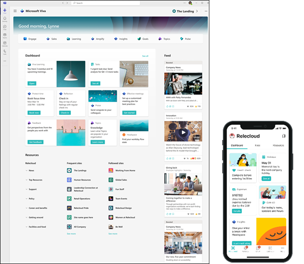
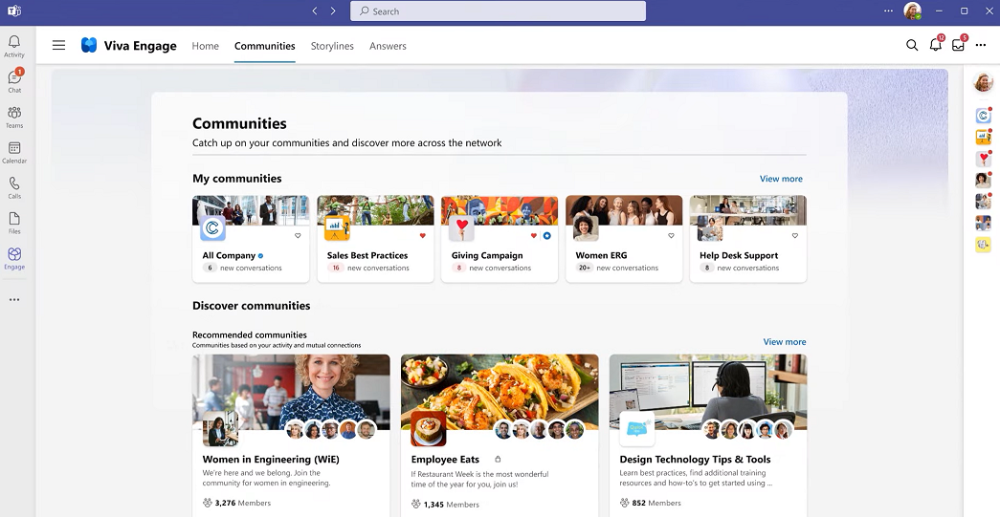
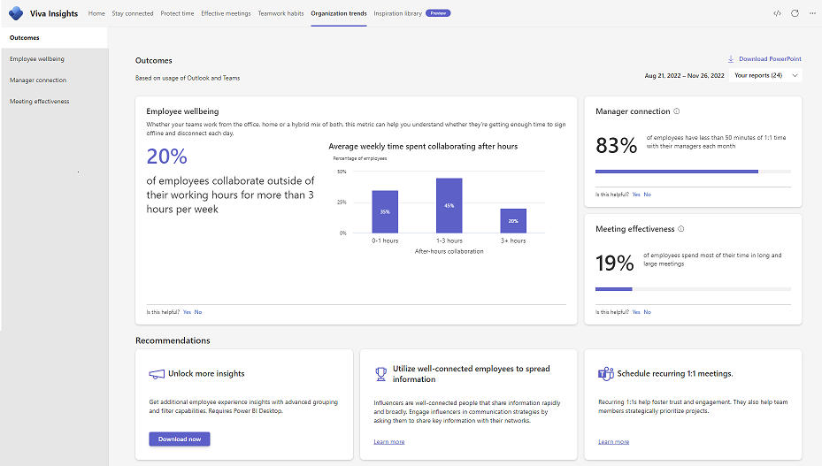
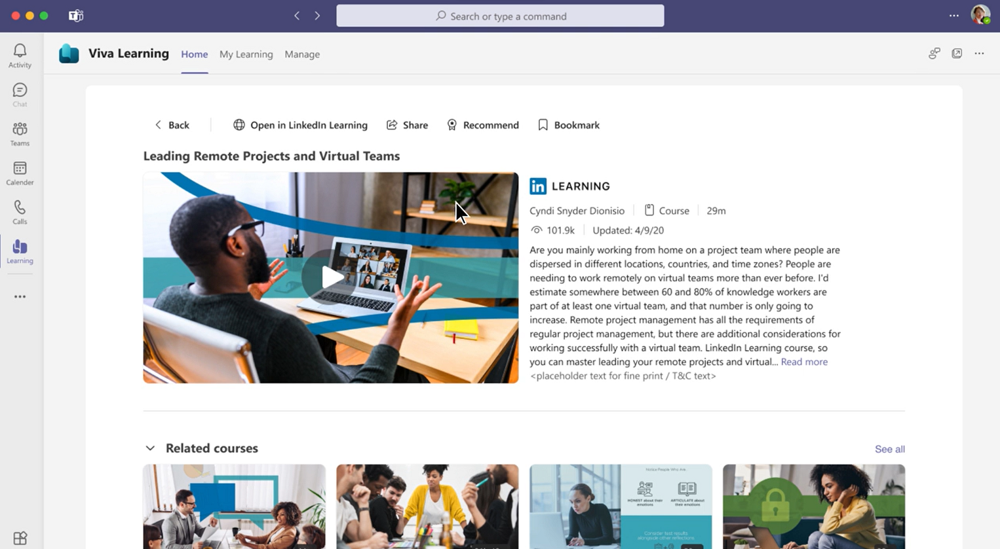
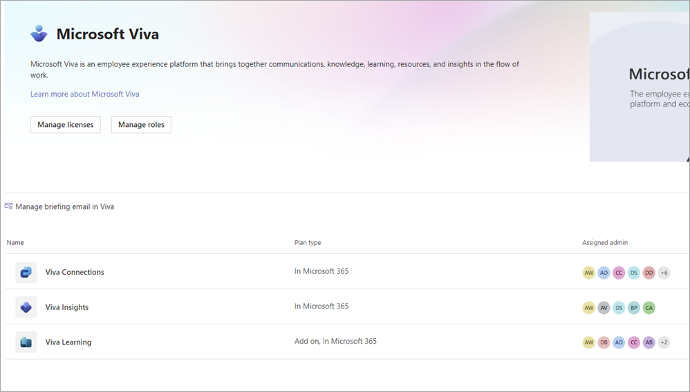

## Microsoft Viva

- Connection: Keep everyone informed, included, and inspired (Viva Connections and Viva Engage)

- Insight: Improve productivity and well-being with actionable insights (Viva Insights)

- Purpose: Align people's work to the team's or organization's goals (Viva Goals)

- Growth: Help employees learn, grow and succeed (Viva Learning and Viva Topics)

    |                   |                                                                                                                                                                                                                                                 |                                                                                                                                                                                                                                                                                                                                                                                                                                                                                                                                                                                                                                                                      |
    |-------------------|-------------------------------------------------------------------------------------------------------------------------------------------------------------------------------------------------------------------------------------------------|----------------------------------------------------------------------------------------------------------------------------------------------------------------------------------------------------------------------------------------------------------------------------------------------------------------------------------------------------------------------------------------------------------------------------------------------------------------------------------------------------------------------------------------------------------------------------------------------------------------------------------------------------------------------|
    |**Experience area**|**Business scenario**                                                                                                                                                                                                                            |**Action**                                                                                                                                                                                                                                                                                                                                                                                                                                                                                                                                                                                                                                                            |
    |**Connection**     |As a large healthcare group with over 33,000 employees, Lamna needs to ensure all employees are well informed, connected, and engaged.                                                                                                           |- The Lamna leadership assigned a steering committee, including various stakeholders, to work on the adoption of Viva.- The Office of Communications works with the Office of Information Technology to set Viva Connections as the Viva hub to integrate all other Viva apps. Lamna uses Viva Connections to send news and updates to employees through Feeds. Employees can access tools at Viva Connections Dashboard and Resources.- To encourage collaboration and networking, Lamna Communications Office works with other departments to set up communities for employees with Viva Engage, to encourage employees to ask questions, share ideas, and pictures.|
    |**Insight**        |Lamna Healthcare wants to make sure its employees build good work habits that are both productive and sustainable.                                                                                                                               |- Lamna’s Office of Information Technology sets up Viva Insights for employees to access it from within Teams or using a web browser.- Individual employees book time for concentration, take necessary breaks, hold effective meetings, stay connected with colleagues, and disconnect from work during their off-hours.- Managers can use [Teamwork habits](https://learn.microsoft.com/en-us/viva/insights/org-team-insights/teamwork-habits) to help schedule one-on-ones with team members, understand the health of their team and follow up on tasks.                                                                                                         |
    |**Purpose**        |The leadership of Lamna Healthcare has started tracking objectives and key results (OKRs), giving teams throughout the organization clarity of purpose and establishing transparency between teams about progress, contributions, and alignment. |- The senior leadership team identifies the organization’s objectives and key results.- Team leaders work with their teams to identify their own OKRs. Individual employees can also set their personal OKRs to align with their teams’.                                                                                                                                                                                                                                                                                                                                                                                                                            |
    |**Growth**         |According to the responses to a recent organizational-wide survey, over 70% of Lamna Healthcare employees think that the opportunity for professional learning and development is one of the top reasons to continue working at Lamna Healthcare.|- The Office of the Chief Learning Officer sets up a centralized place where its employees can find and consume learning content that supports their job and career development.- The Office of the Chief Knowledge Officer sets up the Topic center. Knowledge Managers work with each department to review and edit topics related to various Lamna projects, events, locations, people, and resources.                                                                                                                                                                                                                                                             |

- Viva Connections and Viva Engage both connect and inform people, but each has a different role. Viva Connections is the “home” for Microsoft Viva. It acts as the gateway to your employee experience. It brings curated personalized information and resources to each employee. Viva Engage powers the social layer of Microsoft Viva and Microsoft 365. Viva Engage connects you with leaders, colleagues, and communities.

    |                                                                    |                                             |                                                 |
    |--------------------------------------------------------------------|---------------------------------------------|-------------------------------------------------|
    |**Viva Connections only**                                           |**Shared**                                   |**Viva Engage only**                             |
    |- Digital tool set- Personalized news feed- Easy access to resources|- Organizational news- Engagement- Connection|- Leadership profiles- Stories- Networking/social|

    - Viva Connections
    
        
    
    - Viva Engage

        

- Viva Insights provides data-driven insights and targeted recommendations to foster productivity and wellbeing. With Viva Insights, your organization can gather and access information like:

    1. Personal Insights that are visible only to each employee. Personal Insights includes things like briefing emails in Outlook or information on their personal Viva Insights app in Teams or on the web. This way, people across the organization can learn more about how they work personally, and get recommendations to protect their time, focus, and productivity.
    1. Teamwork habits that provide a better understanding of how you work in teams, including your team meeting habits, impact on others' quiet hours, and whether you're getting enough one-on-one time with teammates.
    1. Organizational trends enable leadership and senior managers to see how their working culture might be affecting the overall well-being and work productivity of their people.

    - Viva Insights

        

- Viva Goals creates a clear structure to align people's work to the team's or organization's goals. You can set, track, and manage goals for your organization, and align your teams and individuals to those goals at a scale. To enable this, Viva Goals introduces the concept of **objectives and key results (OKR) framework**.

    

- Both Viva Learning and Viva Topics support learning and growth for employees in your organization. Viva Learning aggregates and curates learning content, such as courses, videos, eBooks, and audio from various sources and platforms.

- Viva Learning serves as your gateway to aggregate formal learning content from multiple sources, Viva Topics curates information using AI on topics in your organization and provides it when you need it. The topics can be about the following types:

    - Project
    - Event
    - Organization
    - Location
    - Product
    - Creative work
    - Field of study

    As you read content stored in Microsoft 365, topics will be highlighted inline. When you hover over the topic name, you’ll see more information shown in a topic card.

    For instance, when new employees join the organization, it’s challenging to understand various terms and acronyms used by the organization. New employees often have trouble finding project files and people to contact for questions and information. Viva Topics can automatically collect and provide access to information in this way so that employees can engage with their work earlier and more efficiently.

    You can access the Microsoft Viva Topic Center by opening the Viva Topics app directly from Teams. However, AI curated Topics are displayed to you in many places, including:

    - Topics highlighted on SharePoint pages
    - Topic answers in search results
    - Search in office applications
    - Topic center

    |                                                                                                     |                                                                                                                    |                                                                                   |
    |-----------------------------------------------------------------------------------------------------|--------------------------------------------------------------------------------------------------------------------|-----------------------------------------------------------------------------------|
    |**Viva Learning only**                                                                               |**Shared**                                                                                                          |**Viva Topics only**                                                               |
    |- External learning resources- Tracked progress- Content curated by knowledge admins- Social learning|- Organization’s internal content- On demand learning and information- Content managed by knowledge managers/admins|- Inline content in Microsoft 365 apps- Content curated and updated real-time by AI|

    - Viva Learning

        

- Identify roles and responsibilities for adoption

    |                                                                                                                                                                                                                                         |                                                                                                               |
    |-----------------------------------------------------------------------------------------------------------------------------------------------------------------------------------------------------------------------------------------|---------------------------------------------------------------------------------------------------------------------------------------------------------------------------------------------------------------------------------------------------------------------------------------------------------------------------------------------------------------------------------------------------------------------------------------------------------------------------------------------------------------------------------------------------------------------------------------------------------------------|
    |**Roles****(Roles with \* are non-technical)**                                                                                                                                                                                           |**Sample tasks**                                                                                                                                                                                        |
    |- \*HR professionals, communication specialists- \* Business owners and managers- SharePoint admin, Microsoft Teams admin- Site owners and authors- \*Champions (early adopters), and executive sponsors- \*Business owners and managers.|- HR professionals, communication coordinators, and specialists work with business owners and managers to identify workflows or processes that can be done in Viva Connections.- Microsoft Teams admin adds Viva Connections as one of the apps in Microsoft Teams.- Site owners and members create and maintain home site and dashboard content.- Executive sponsors, champions help to ensure the smooth adoption of Viva Connections at the organization level.                                                                                                                                                   |
    |- \*Business stakeholders- Microsoft Teams admin- Viva Engage network admin, group admin, and verified admin                                                                                                                             |- Business stakeholders like leadership and communication specialists can help identify how to leverage Viva Engage to support communities across the organization.- Microsoft Teams admin can create a Teams app policy for Viva Engage and pin it for all users across the organization.- Viva Engage admin sets up Viva Engage for the organization and assigns roles for Viva Engage.- Verified admins manage tasks related to security, configure, and make customizations for Viva Engage.- Network admins can configure and manage users and groups.                                                          |
    |- \*The executive leadership team in the organization- Microsoft 365 Enterprise or global admin- Microsoft Teams admin- Insights Administrator- Insights Business Leader                                                                 |- The executive leadership team helps identify who should be involved, and when, for setup and organization-wide adoption.- Global admin assigns roles, licenses, and manages app access.- Microsoft Teams admin can create a Teams app policy for Viva Insights and pin it for all users across the organization.- Insights Administrator sets up the advanced insights app and configures some group-level settings for the Viva Insights app in Teams and on the web.- The executive leadership team is assigned as Insights Business Leaders to view organization-level insights on the Organization trends page.|
    |- \*The Executive Sponsor and OKR Program Lead- Viva Goals admin- Microsoft Teams admin- \*Team leaders                                                                                                                                  |- The executive sponsor and OKR program lead decides how to structure Viva Goals organization(s), teams and individuals based on the organization’s business needs and processes. The executive also sets expectations on how often OKRs are updated across the organization.-Viva Goals admin creates organizations in Viva goals, manages the tenant, and enables integrations.-Microsoft Teams admin can create a Teams app policy for Viva Goals and pin it for all users across the organization.-Team leaders set up, update, and monitor their team’s objectives and key results (OKRs).                    |
    |-Microsoft 365 global admin or SharePoint admin.- Microsoft Teams admin- Knowledge admin- \*HR professionals, learning and professional development specialists, business leaders, and team managers.                                    |-Global admin or knowledge admin incorporate content from SharePoint folders to Viva Learning.-SharePoint admin, knowledge admin, or global admin decide the content sources to use.-Microsoft Teams admin can create a Teams app policy for Viva Learning and pin it for all users across the organization.-HR professionals, learning and professional development specialists, business leaders and team managers help identify existing learning resources, and employee learning needs.-Knowledge admins use the Viva Learning admin tab to decide how content is displayed across the organization.            |
    |-\*Business stakeholders, communication coordinators and specialists-Microsoft 365 global admin or SharePoint admin- Microsoft Teams admin- Knowledge manager                                                                            |- Business stakeholders, knowledge managers, and communication coordinators select rollout strategy and create a communication plan.- SharePoint or global admin sets up Viva Topics in the Microsoft 365 admin center.-Knowledge managers control topics for the topic center, such as creating topics, removing topics, and verifying the validity of topics.                                                                                                                                                                                                                                                      |
    |-\*Sales team leaders- Microsoft 365 admin-Microsoft Teams admin                                                                                                                                                                         |- Sales leaders can help identify an adoption strategy for Viva Sales.- Microsoft 365 admin installs Viva Sales using the Microsoft 365 admin center.- Microsoft Teams admin creates an app policy for Viva Sales and pins it in Teams.                                                                                                                                                                               |

- Microsoft Viva admin page experience

  

