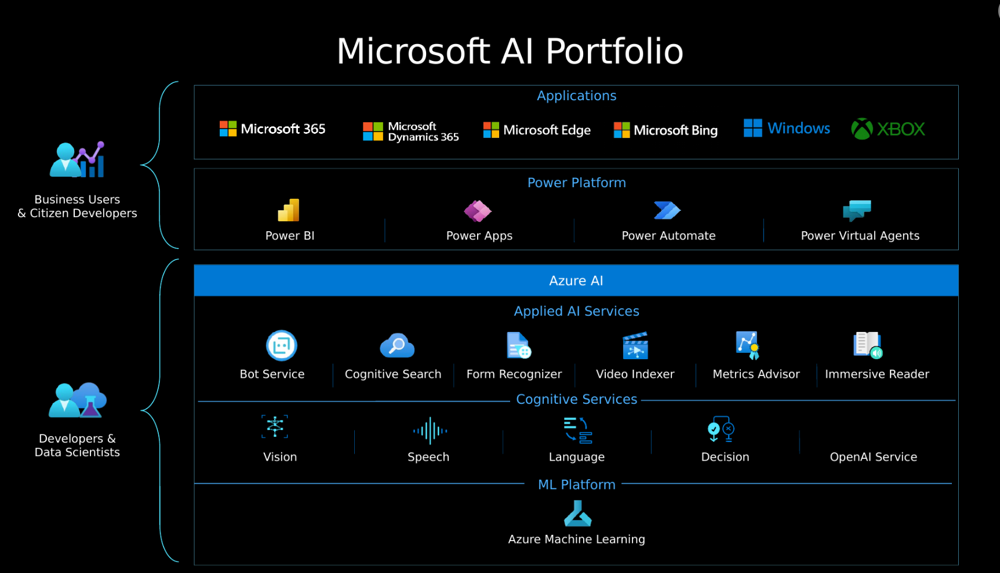
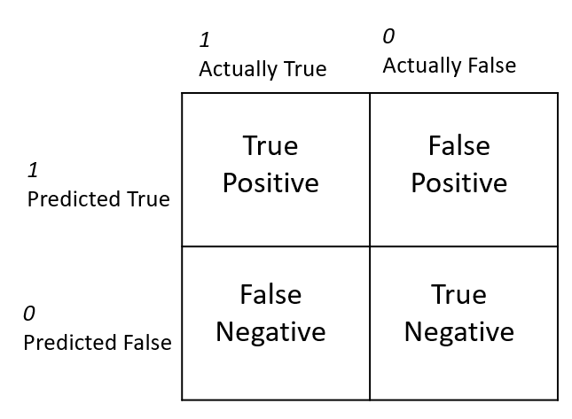
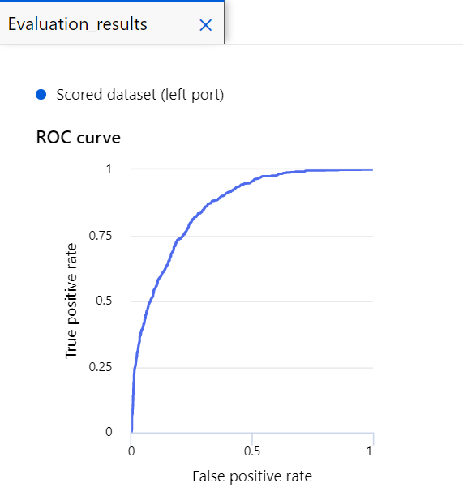
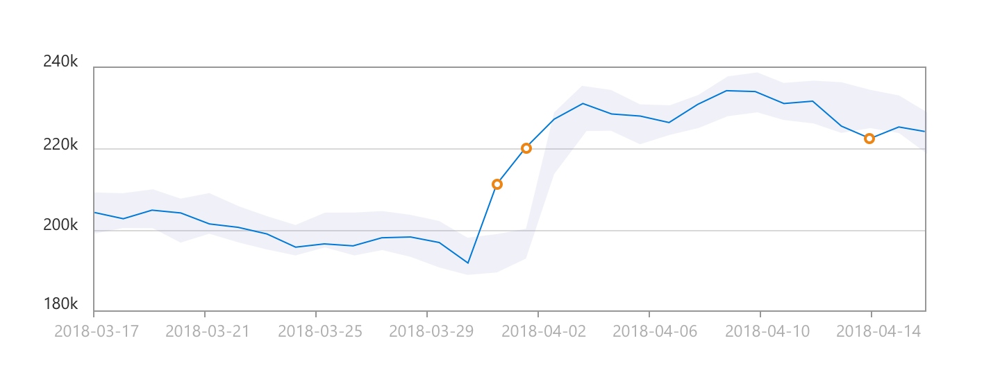
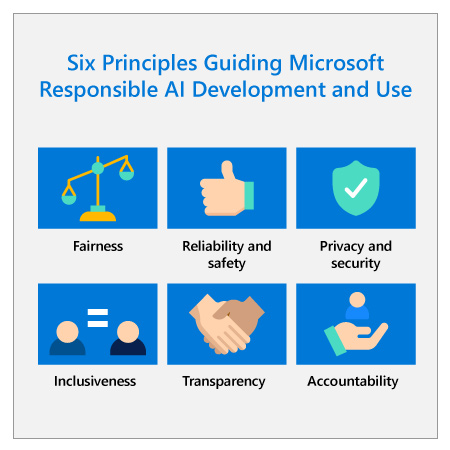
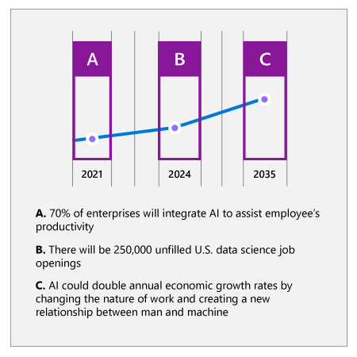
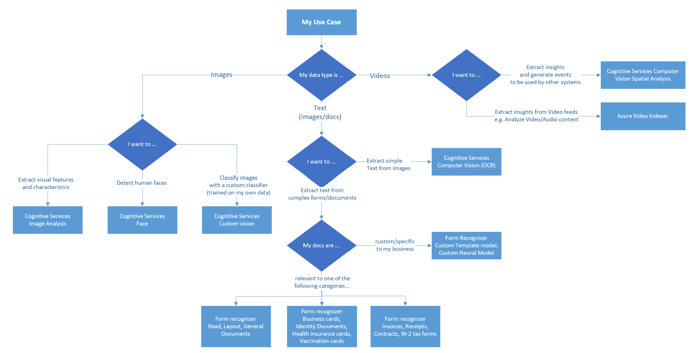
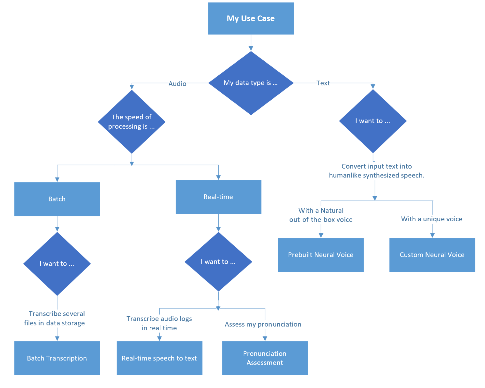
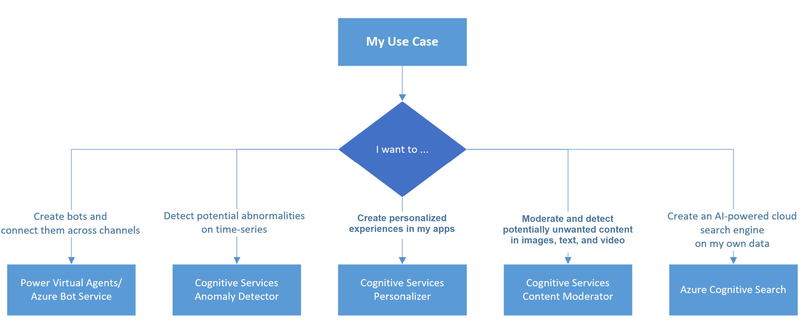

## Azure AI Study Notes

* [Azure AI Fundamentals Exercises](#azure-ai-fundamentals-exercises)
* [What is AI?](#what-is-ai)
* [Azure Open AI](#azure-open-ai)
* [Types of machine learning](#types-of-machine-learning)
* [Azure Machine Learning](#azure-machine-learning)
* [Computer vision ](#computer-vision)
    * [Conversational solutions](#azure-bot-service-and-conversational-solutions)
* [Analyze text with the Language service](#analyze-text-with-the-language-service)
* [Introduction to Anomaly Detector](#introduction-to-anomaly-detector)
    * [Azure AI Document Intelligence](#azure-ai-document-intelligence)
    * [Azure AI Search](#azure-ai-search)
* [Responsible AI](#responsible-ai)
    + [Fairness](#fairness)
    + [Reliability and Safety](#reliability-and-safety)
    + [Privacy and Security](#privacy-and-security)
    + [Inclusiveness](#inclusiveness)
    + [Transparency](#transparency)
    + [Accountability](#accountability)
* [Azure OpenAI Service](#azure-openai-service)
    * [Foundry Tools](#foundry-tools-formerly-cognitive-services)
    * [Secure Foundry Tools](#secure-foundry-tools)
    * [Monitor Foundry Tools](#monitor-foundry-tools)
    * [Deploy Foundry Tools in containers](#deploy-foundry-tools-in-containers)
* [Addressing future labor and workplace needs](#addressing-future-labor-and-workplace-needs)
* [Tips](#tips)

## Contents: Azure AI

1. [Get started with AI on Azure](https://learn.microsoft.com/en-us/training/modules/get-started-ai-fundamentals)
1. [Introduction to Azure OpenAI Service](https://learn.microsoft.com/en-us/training/modules/explore-azure-openai)
1. [Use Automated Machine Learning in Azure Machine Learning](https://learn.microsoft.com/en-us/training/modules/use-automated-machine-learning)
1. [Create a regression model with Azure Machine Learning designer](https://learn.microsoft.com/en-us/training/modules/create-regression-model-azure-machine-learning-designer)
1. [Create a classification model with Azure Machine Learning designer](https://learn.microsoft.com/en-us/training/modules/create-classification-model-azure-machine-learning-designer)
1. [Create a clustering model with Azure Machine Learning designer](https://learn.microsoft.com/en-us/training/modules/create-clustering-model-azure-machine-learning-designer)
1. [Analyze images with the Computer Vision service](https://learn.microsoft.com/en-us/training/modules/analyze-images-computer-vision)
1. [Historical: Build a bot with the Language Service and Azure Bot Service](https://learn.microsoft.com/en-us/training/modules/build-faq-chatbot-qna-maker-azure-bot-service)
1. [Historical: Introduction to Anomaly Detector](https://learn.microsoft.com/en-us/training/modules/intro-to-anomaly-detector)
1. [Analyze receipts with Azure AI Document Intelligence](https://learn.microsoft.com/en-us/training/modules/analyze-receipts-form-recognizer)
1. [Introduction to Azure AI Search](https://learn.microsoft.com/en-us/training/modules/intro-to-azure-search)
1. [Identify guiding principles for responsible AI](https://learn.microsoft.com/en-us/training/modules/responsible-ai-principles)
1. [Get started with Azure OpenAI Service](https://learn.microsoft.com/en-us/training/modules/get-started-openai)
1. [Build natural language solutions with Azure OpenAI Service](https://learn.microsoft.com/en-us/training/modules/build-language-solution-azure-openai)
1. [Apply prompt engineering with Azure OpenAI Service](https://learn.microsoft.com/en-us/training/modules/apply-prompt-engineering-azure-openai)
1. [Analyze text with the Language service](https://learn.microsoft.com/en-us/training/modules/analyze-text-with-text-analytics-service)
1. [Create and consume Cognitive Services](https://learn.microsoft.com/en-us/training/modules/create-manage-cognitive-services)
1. [Secure Cognitive Services](https://learn.microsoft.com/en-us/training/modules/secure-cognitive-services)
1. [Monitor Cognitive Services](https://learn.microsoft.com/en-us/training/modules/monitor-cognitive-services)
1. [Deploy cognitive services in containers](https://learn.microsoft.com/en-us/training/modules/investigate-container-for-use-cognitive-services)
1. [Identify governing practices for responsible AI](https://learn.microsoft.com/en-us/training/modules/responsible-ai-governing-practices)
1. [Discuss practices for responsible AI at Microsoft](https://learn.microsoft.com/en-us/training/modules/microsoft-responsible-ai-practices)
- **Cognitive Services** is now presented in Microsoft Learn as **Foundry Tools**. The tools include Speech, Translator, Language, Document Intelligence, Vision, Azure AI Search, Content Safety, and others. The older name in the historical notes below refers to this evolving set of services. See [Foundry Tools overview](https://learn.microsoft.com/en-us/azure/ai-services/what-are-ai-services).
- Use **Azure AI Search** instead of the former Azure Cognitive Search name. It supports full-text, vector, hybrid, and multimodal retrieval; decide whether a traditional index query or agentic retrieval is appropriate for the application. See [Azure AI Search overview](https://learn.microsoft.com/en-us/azure/search/search-what-is-azure-search).
- Use **Azure AI Document Intelligence** instead of Form Recognizer. For new document-processing development, use the current v4.0 API and migrate retiring API versions before their support dates. See [Document Intelligence overview](https://learn.microsoft.com/en-us/azure/ai-services/document-intelligence/overview).
- Do not start new projects on Anomaly Detector, QnA Maker, LUIS, Metrics Advisor, Personalizer, or Content Moderator. Anomaly Detector retires on **October 1, 2026** and new resources have been blocked since September 2023; migrate existing workloads to [Microsoft Fabric anomaly detection](https://learn.microsoft.com/en-us/fabric/real-time-intelligence/anomaly-detection) or an appropriate open-source or Azure Machine Learning design. Custom question answering remains an existing-workload option only and retires March 31, 2029; direct new knowledge-grounded applications to Microsoft Foundry. Use [Azure AI Content Safety](https://learn.microsoft.com/en-us/azure/ai-services/content-safety/overview), including Prompt Shields where appropriate, instead of Content Moderator.
- Product model availability changes frequently. Avoid treating historical Azure OpenAI examples in these notes as a deployment catalog. For new generative applications, prefer the Foundry v1 [Responses API](https://learn.microsoft.com/en-us/azure/foundry/openai/how-to/responses) where the model and region support it; confirm models, regions, versions, quotas, safety features, and pricing before implementation.

## Azure AI Fundamentals Exercises

- https://microsoftlearning.github.io/AI-900-AIFundamentals/

## What is AI?

- Simply put, AI is the creation of software that imitates human behaviors and capabilities. Key workloads include:
    1. Machine learning - This is often the foundation for an AI system, and is the way we "teach" a computer model to make predictions and draw conclusions from data.
    1. Anomaly detection - The capability to automatically detect errors or unusual activity in a system.
    1. Computer vision - The capability of software to interpret the world visually through cameras, video, and images.
    1. Natural language processing - The capability for a computer to interpret written or spoken language, and respond in kind.
    1. Knowledge mining - The capability to extract information from large volumes of often unstructured data to create a searchable knowledge store.

## Azure OpenAI

- Azure OpenAI's relationship to Azure AI services



- Azure OpenAI supports can be categorized by tasks they support:
    1. Generating Natural Language
    1. Text generation and transformation: generate and edit text
    1. Embeddings: search, classify, and compare text
    1. Generating Code: generate, edit, and explain code
    1. Generating Images: generate and edit images

## Types of machine learning

There are two general approaches to machine learning, supervised and unsupervised machine learning. In both approaches, you train a model to make predictions.

- The supervised machine learning approach requires you to start with a dataset with known label values. Two types of supervised machine learning tasks include regression and classification.
    1. Regression: used to predict a continuous value; like a price, a sales total, or some other measure.
    1. Classification: used to determine a class label; an example of a binary class label is whether a patient has diabetes or not; an example of multi-class labels is classifying text as positive, negative, or neutral.
- The unsupervised machine learning approach starts with a dataset without known label values. One type of unsupervised machine learning task is clustering.
    1. Clustering: used to determine labels by grouping similar information into label groups; like grouping measurements from birds into species.

## Azure Machine Learning

- Azure Machine Learning studio is a web portal for machine learning solutions in Azure. For new automation, use the current CLI v2 or Python SDK v2 and version code, data references, environments, models, and deployment configuration.
- Azure Machine Learning compute
    1. Compute Instances: Development workstations that data scientists can use to work with data and models.
    1. Compute Clusters: Scalable clusters of virtual machines for on-demand processing of experiment code.
    1. Inference Clusters: Deployment targets for predictive services that use your trained models.
    1. Attached Compute: Links to existing Azure compute resources, such as Virtual Machines or Azure Databricks clusters.
- Azure Automated Machine Learning
    1. Azure Machine Learning includes an automated machine learning capability that automatically tries multiple pre-processing techniques and model-training algorithms in parallel. These automated capabilities use the power of cloud compute to find the best performing supervised machine learning model for your data.
    1. Understand the AutoML process
        1. Prepare data: Identify the features and label in a dataset. Pre-process, or clean and transform, the data as needed.
        1. Train model: Split the data into two groups, a training and a validation set. Train a machine learning model using the training data set. Test the machine learning model for performance using the validation data set.
        1. Evaluate performance: Compare how close the model's predictions are to the known labels.
        1. Deploy a predictive service: After you train a machine learning model, you can deploy the model as an application on a server or device so that others can use it.
- Regression is a form of machine learning used to understand the relationships between variables to predict a desired outcome. Regression predicts a numeric label or outcome based on variables, or features. For example, an automobile sales company might use the characteristics of a car (such as engine size, number of seats, mileage, and so on) to predict its likely selling price. In this case, the characteristics of the car are the features, and the selling price is the label.
    1. Evaluate performance
        1. Mean Absolute Error (MAE): The average difference between predicted values and true values. This value is based on the same units as the label, in this case dollars. The lower this value is, the better the model is predicting.
        1. Root Mean Squared Error (RMSE): The square root of the mean squared difference between predicted and true values. The result is a metric based on the same unit as the label (dollars). When compared to the MAE (above), a larger difference indicates greater variance in the individual errors (for example, with some errors being very small, while others are large).
        1. Relative Squared Error (RSE): A relative metric between 0 and 1 based on the square of the differences between predicted and true values. The closer to 0 this metric is, the better the model is performing. Because this metric is relative, it can be used to compare models where the labels are in different units.
        1. Relative Absolute Error (RAE): A relative metric between 0 and 1 based on the absolute differences between predicted and true values. The closer to 0 this metric is, the better the model is performing. Like RSE, this metric can be used to compare models where the labels are in different units.
        1. Coefficient of Determination (R2): This metric is more commonly referred to as R-Squared, and summarizes how much of the variance between predicted and true values is explained by the model. **The closer to 1 this value is, the better the model is performing.**
- Classification is an example of a supervised machine learning technique in which you train a model using data that includes both the features and known values for the label, so that the model learns to fit the feature combinations to the label. Then, after training has been completed, you can use the trained model to predict labels for new items for which the label is unknown.
    1. Using clinical data to predict whether a patient will become sick or not.
    1. Using historical data to predict whether text sentiment is positive, negative, or neutral.
    1. Using characteristics of small businesses to predict if a new venture will succeed.
    1. **Confusion matrix**

        The confusion matrix is a tool used to assess the quality of a classification model's predictions. It compares predicted labels against actual labels.

        

        - True Positive: The model predicts the patient has diabetes, and the patient does actually have diabetes.
        - False Positive: The model predicts the patient has diabetes, but the patient doesn't actually have diabetes.
        - False Negative: The model predicts the patient doesn't have diabetes, but the patient actually does have diabetes.
        - True Negative: The model predicts the patient doesn't have diabetes, and the patient actually doesn't have diabetes.

        Metrics that can be derived from the confusion matrix include:

        - Accuracy: The number of correct predictions (true positives + true negatives) divided by the total number of predictions.
        - Precision: The number of the cases classified as positive that are actually positive: the number of true positives divided by (the number of true positives plus false positives).
        - Recall: The fraction of positive cases correctly identified: the number of true positives divided by (the number of true positives plus false negatives).
        - F1 Score: An overall metric that essentially combines precision and recall.

        Of these metrics, accuracy may be the most intuitive. However, you need to be careful about using accuracy as a measurement of how well a model performs. Using the model that predicts 15% of patients have diabetes, when actually 25% of patients have diabetes, we can calculate the following metrics:

        - The accuracy of the model is: (10+70)/ 100 = 80%.
        - The precision of the model is: 10/(10+5) = 67%.
        - The recall of the model is 10/(10+15) = 40%
    1. ROC curve and AUC metric
        - Another term for recall is True positive rate, and it has a corresponding metric named False positive rate, which measures the number of negative cases incorrectly identified as positive compared between the number of actual negative cases.
        - Plotting these metrics against each other for every possible threshold value between 0 and 1 results in a curve, known as the **ROC curve (ROC stands for receiver operating characteristic, but most data scientists just call it a ROC curve).** In an ideal model, the curve would go all the way up the left side and across the top, so that it covers the full area of the chart. The larger the area under the curve, of AUC metric, (which can be any value from 0 to 1), the better the model is performing.

            

- Clustering is a form of machine learning that is used to group similar items into clusters based on their features. For example, a researcher might take measurements of penguins, and group them based on similarities in their proportions.
    1. Clustering is an example of unsupervised machine learning, in which you train a model to separate items into clusters based purely on their characteristics, or features. There is no previously known cluster value (or label) from which to train the model.
    1. Cluster customer attribute data into segments for marketing analysis.
    1. Cluster geographic coordinates into regions of high traffic in a city for a ride-share application.
    1. Cluster written feedback into topics to prioritize customer service changes.
    1. When the experiment run has finished, select Job details. Right click on the Evaluate Model module and select Preview data, then select Evaluation results. These metrics can help data scientists assess how well the model separates the clusters. They include a row of metrics for each cluster, and a summary row for a combined evaluation. The metrics in each row are:
        - Average Distance to Other Center: This indicates how close, on average, each point in the cluster is to the centroids of all other clusters.
        - Average Distance to Cluster Center: This indicates how close, on average, each point in the cluster is to the centroid of the cluster.
        - Number of Points: The number of points assigned to the cluster.
        - Maximal Distance to Cluster Center: The maximum of the distances between each point and the centroid of that point’s cluster. If this number is high, the cluster may be widely dispersed. This statistic in combination with the - Average Distance to Cluster Center helps you determine the cluster’s spread.

## Computer vision

- Computer vision is one of the core areas of artificial intelligence (AI), and focuses on creating solutions that enable AI applications to "see" the world and make sense of it.
    1. Content Organization: Identify people or objects in photos and organize them based on that identification. Photo recognition applications like this are commonly used in photo storage and social media applications.
    1. Text Extraction: Analyze images and PDF documents that contain text and extract the text into a structured format.
    1. Spatial Analysis: Identify people or objects, such as cars, in a space and map their movement within that space.
- You can use either of the following resource types:
    1. Vision: A single-service resource for Azure Vision. Use this resource type when you need isolated billing, policy, or a service-specific SKU.
    1. Foundry resource: A multi-service resource can provide shared authentication, billing, and management for supported Foundry Tools. Confirm each selected tool, feature, and region is supported by the resource type before standardizing on it.
- The Computer Vision service provides many capabilities that you can use to analyze images, including generating a descriptive caption, extracting relevant tags, identifying objects, determining image type and metadata, detecting human faces, known brands, and celebrities, and others.

## Azure Bot Service and conversational solutions

- Bots can be designed to work across multiple channels, including email, social media platforms, and even voice calls. Regardless of the channel used, bots typically manage conversation flows using a combination of natural language and constrained option responses that guide the user to a resolution.
- A knowledge base can contain question-and-answer pairs, documents, and other curated content. The application needs a conversational layer and a channel integration to make this knowledge available to users.
- QnA Maker is retired. Custom question answering in Azure Language remains an existing-workload option but retires March 31, 2029. For new projects, evaluate Microsoft Foundry capabilities and design a migration path for existing question-answering workloads. See [custom question answering lifecycle guidance](https://learn.microsoft.com/en-us/azure/ai-services/language-service/question-answering/overview).
- Azure Bot Service remains a channel and hosting option for applicable workloads, but the Bot Framework SDK and Emulator are archived and no longer serviced after December 31, 2025. For new Teams agents, use the [Teams SDK](https://learn.microsoft.com/en-us/microsoftteams/platform/teams-sdk/) or Microsoft 365 Agents SDK. For managed, tool-using agents, evaluate [Microsoft Foundry Agent Service](https://learn.microsoft.com/en-us/azure/foundry/agents/overview). Select the platform based on required channels, hosting, security, and knowledge-grounding requirements.

## Analyze text with the Language service

- Text analytics is a process where an artificial intelligence (AI) algorithm, running on a computer, evaluates these same attributes in text, to determine specific insights. A person will typically rely on their own experiences and knowledge to achieve the insights. A computer must be provided with similar knowledge to be able to perform the task.
- Determine the language of a document or text (for example, French or English).
- Perform sentiment analysis on text to determine a positive or negative sentiment.
- Extract key phrases from text that might indicate its main talking points.
- Identify and categorize entities in the text. Entities can be people, places, organizations, or even everyday items such as dates, times, quantities, and so on.

## Introduction to Anomaly Detector (retiring)



- In the graphic depicting the time series data, there is a light shaded area that indicates the boundary, or sensitivity range. The solid blue line is used to indicate the measured values. When a measured value is outside of the shaded boundary, an orange dot is used to indicate the value is considered an anomaly.
- Anomaly Detector is a retiring service that enabled time-series anomaly detection. New Anomaly Detector resources can't be created, and the service retires **October 1, 2026**. Treat the following behavior as historical and complete migration planning now. Use [Microsoft Fabric anomaly detection](https://learn.microsoft.com/en-us/fabric/real-time-intelligence/anomaly-detection) or the open-source anomaly-detector project according to the workload.
- The Anomaly Detector service identifies anomalies that exist outside the scope of a boundary. The boundary is set using a sensitivity value. By default, the upper and lower boundaries for anomaly detection are calculated using concepts known as expectedValue, upperMargin, and lowerMargin. The upper and lower boundaries are calculated using these three values. If a value exceeds either boundary, it will be identified as an anomaly. You can adjust the boundaries by applying a marginScale to the upper and lower margins as demonstrated by the following formula.
- **upperBoundary = expectedValue + (100 - marginScale) * upperMargin**
- The Anomaly Detector service accepts data in JSON format. You can use any numerical data that you have recorded over time.
- The Anomaly Detector service supports batch processing of time series data and last-point anomaly detection for real-time data.
- Batch detection involves applying the algorithm to an entire data series at one time. The concept of time series data involves evaluation of a data set as a batch. Use your time series to detect any anomalies that might exist throughout your data. This operation generates a model using **your entire time series data**, with each point analyzed using the same model.
- Real-time detection uses streaming data by comparing previously seen data points to the last data point to determine if your latest one is an anomaly. This operation generates a model using the data points you send, and determines if the target (current) point is an anomaly.

## Azure AI Document Intelligence

- Azure AI Document Intelligence digitizes fields from forms by applying OCR and document understanding to extract text, structure, tables, and key-value pairs.
- Document Intelligence supports automated document processing through prebuilt models, including receipt and invoice models, and custom extraction and classification models.
- Use the following guidelines to get the best results when using a custom model.
    1. Images must be JPEG, PNG, BMP, PDF, or TIFF formats
    1. File size must be less than 50 MB
    1. Image size between 50 x 50 pixels and 10000 x 10000 pixels
    1. For PDF documents, no larger than 17 inches x 17 inches

## Azure AI Search

- Azure AI Search provides the infrastructure and tools to build search and retrieval solutions over structured, semi-structured, and unstructured content.
- Data ingestion: Azure AI Search indexes JSON documents. Use a supported indexer or push serialized JSON through an API or SDK; choose the ingestion method based on source support, freshness, and operational requirements.
- Full text search and analysis: Azure AI Search supports both simple and full Lucene query syntax.
- AI-powered search: Azure AI Search can enrich and structure content at indexing or query time, including chunking, vectorization, and supported AI transformations.
- Multi-lingual: Azure AI Search offers language analyzers. Validate supported languages and analyzer behavior for the intended index and query pattern.
- Geo-enabled: Azure AI Search supports geo-search filtering based on proximity to a physical location.
- Configurable user experience: Azure AI Search has features such as autocomplete, suggesters, pagination, hit highlighting, semantic ranking, and vector or hybrid retrieval.
- The data format that Azure AI Search indexes is JSON. Regardless of where the data originates, the application or indexer must provide indexable JSON documents.
- You can attach a skillset that applies a sequence of AI skills to enrich the data, making it more searchable.
- Index Schema

    ```json
    {
    "name": "index",
    "fields": [
        {
        "name": "content", "type": "Edm.String", "analyzer": "standard.lucene", "fields": []
        }
        {
        "name": "keyphrases", "type": "Collection(Edm.String)", "analyzer": "standard.lucene", "fields": []
        },
        {
        "name": "imageTags", "type": "Collection(Edm.String)", "analyzer": "standard.lucene", "fields": []
        },
    ]
    }
    ```

- Use an indexer to build an index
    1. Push method: JSON data is pushed into a search index via either the REST API or the .NET SDK. Pushing data has the most flexibility as it has no restrictions on the data source type, location, or frequency of execution.
    1. Pull method: Search service indexers can pull data from popular Azure data sources, and if necessary, export that data into JSON if it isn't already in that format.
- AI enrichment can create structured output for retrieval. Design the index schema, enrichment pipeline, source permissions, and retention controls together so that the application returns only content the caller is authorized to access.
- query sample: `coffee (-"busy" + "wifi")`

## Responsible AI



###     Fairness
- Understand the scope, spirit, and potential uses of the AI system by asking questions such as, how is the system intended to work? Who is the system designed to work for? Will it work for everyone equally? How can it harm others?
- Attract a diverse pool of talent. Ensure the design team reflects the world in which we live by including team members that have different backgrounds, experiences, education and perspectives.
- Identify bias in datasets by evaluating where the data came from, understanding how it was organized, and testing to ensure it is represented. Bias can be introduced at every stage in creation, from collection to modeling to operation.
- Identify bias in machine learning algorithms by leveraging tools and techniques that improve the transparency and intelligibility of models. Examples of these tools can be found in the next unit.
- Leverage human review and domain expertise. Train employees to understand the meaning and implications of AI results to ensure that they are ultimately accountable for decisions that leverage AI, especially when AI is used to inform consequential decisions about people. Finally, include relevant subject matter experts (such as those with consumer credit expertise for a credit scoring AI system) in the design process and in deployment decisions.
- Research and employ best practices, analytical techniques, and tools from other institutions and enterprises to help detect, prevent, and address bias in AI systems.

### Reliability and Safety
- Understand your organization’s AI Maturity by taking Microsoft’s AI Ready Assessment accessible from the link in the resources section. Use the results to determine which AI technologies will fit your organization’s current maturity level and how your organization can best take advantage of AI.
- Develop processes for auditing AI systems in order to evaluate the quality and suitability of data and models, monitor ongoing performance, and verify that systems are behaving as intended based on established performance measures.
- Provide detailed explanation of system operation including design specifications, information about training data, training failures that occurred and potential inadequacies with training data, and the inferences and significant predictions generated.
- Design for unintended circumstances such as accidental system interactions, the introduction of malicious data, or cyberattacks.
- Involve domain experts in the design and implementation processes, especially when AI is being used to help make consequential decisions about people.
- Conduct rigorous testing during AI system development and deployment to ensure that systems can respond safely to unanticipated circumstances, don’t have unexpected performance failures, and don’t evolve in unexpected ways. AI systems involved in high-stakes scenarios that affect human safety or large populations should be tested both in lab and real-world scenarios.
- Evaluate when and how an AI system should seek human input for impactful decisions or during critical situations. Consider how an AI system should transfer control to a human in a manner that is meaningful and intelligible. Design AI systems to ensure humans have the necessary level of input on highly impactful decisions.
- Develop a robust feedback mechanism for users to report performance issues so that they can be resolved quickly.

### Privacy and Security
- Comply with relevant data protection, privacy, and transparency laws like GDPR or the California Privacy Act by investing resources in developing compliance technologies and processes or working with a technology leader during the development of AI systems. Develop processes to continually check that the AI systems are satisfying all aspects of these laws.
- Design AI systems to maintain the integrity of personal data so that they can only use personal data during the time it’s required and for the defined purposes that have been shared with customers. Delete inadvertently collected personal data or data that is no longer relevant to the defined purpose.
- Protect AI systems from bad actors by designing AI systems in accordance with secure development and operations foundations, using role-based access, and protecting personal and confidential data that is transferred to third parties. Design AI systems to identify abnormal behaviors and to prevent manipulation and malicious attacks. Learn more about how to protect against new AI-specific security threats by reading our paper, Securing the Future of Artificial Intelligence and Machine Learning at Microsoft accessible in the resources section of this module.
- Design AI systems with appropriate controls for customers to make choices about how and why their data is collected and used.
- Ensure your AI system maintains anonymity by de-identifying personal data.
- Conduct privacy and security reviews for all AI systems.
- Research and implement industry best practices for tracking relevant information about customer data, accessing and using that data, and auditing access and use.

### Inclusiveness
- Comply with laws regarding accessibility and inclusiveness such as the Americans with Disabilities Act, the Communications and Video Accessibility Act, and the European Union laws and U.S. regulations that mandate the procurement of accessible technology.
- Use the Inclusive Design toolkit, available in the resources section of this module, to help system developers understand and address potential barriers in a product environment that could unintentionally exclude people.
- Have people with disabilities test your systems to help you determine whether the system can be used as intended by the broadest possible audience.
- Consider commonly used accessibility standards to help ensure your system is accessible for people of all abilities.

### Transparency
- Share key characteristics of datasets to help developers understand if a specific dataset is appropriate for their use case. For more information on tools and techniques for increasing transparency, please see the next unit, Governance and external engagements.
- Improve model intelligibility by leveraging simpler models and generating intelligible explanations of the model’s behavior. Techniques to simplify models without sacrificing accuracy and tools to generate explanations of model’s behaviors can be found in the next unit.
- Train employees on how to interpret AI outputs and ensure that they remain accountable for making consequential decisions based on the results.

### Accountability
- Set up internal review boards to provide oversight and guidance on the responsible development and deployment of AI systems.
- Ensure your employees are trained to use and maintain the solution in a responsible and ethical manner and understand when the solution may require additional technical support.
- Keep humans with requisite expertise in the loop by reporting to them and involving them in decisions about model execution. When automation of decisions is required, ensure they are able to inspect, identify, and resolve challenges with model output and execution.
- Put in place a clear system of accountability and governance to conduct remediation or correction activities if models are seen as behaving in an unfair or potentially harmful manner.

## Azure OpenAI Service

- Azure OpenAI Service brings generative models to Azure with enterprise identity, networking, governance, and observability integration. Model availability varies by region and deployment, so select the deployed model from the current [Foundry model catalog](https://learn.microsoft.com/en-us/azure/foundry/foundry-models/concepts/models-sold-directly-by-azure) rather than copying a historical model-family list.
- For new model applications, use the Foundry v1 **Responses API** where it is supported. It unifies current conversational, stateful, tool, and multimodal scenarios. Chat Completions can remain in compatible existing applications, but legacy text completions should not be selected for new designs.

### Responses API with Microsoft Entra ID

Install the supported Python packages:

```bash
pip install openai azure-identity
```

Use a deployment name in `model`, a v1 endpoint, and Microsoft Entra authentication. Assign the calling identity a suitable Azure AI role before running the application.

```python
from azure.identity import DefaultAzureCredential, get_bearer_token_provider
from openai import OpenAI

token_provider = get_bearer_token_provider(
    DefaultAzureCredential(),
    "https://ai.azure.com/.default",
)

client = OpenAI(
    base_url="https://YOUR-RESOURCE-NAME.openai.azure.com/openai/v1/",
    api_key=token_provider(),
)

response = client.responses.create(
    model="MODEL_DEPLOYMENT_NAME",
    instructions="You are a helpful assistant that answers concisely.",
    input="Does Azure OpenAI support multiple languages?",
)

print(response.output_text)
```

Use `previous_response_id` for a stateful follow-up when stored response data is appropriate for the workload. For sensitive or stateless designs, explicitly choose `store=False` and manage the required context yourself.

- Response quality from large language models (LLMs) in Azure OpenAI depends on the quality of the prompt provided. Improving prompt quality through various techniques is called prompt engineering.
- Prompt engineering is the process of designing and optimizing prompts to better utilize LLMs. **Providing relevant, specific, unambiguous, and well structured prompts can help the model better understand the context and generate more accurate responses.**
- For existing applications, Chat Completions remains a migration consideration; use the Responses API for new multi-turn state, tools, and current Foundry capabilities when supported in the required model and region.
- Try adjusting these parameters with the same prompt to see how they impact the response. It's recommended to change either temperature or top_p at a time, but not both.
- A specific technique for formatting instructions is to split the instructions at the beginning or end of the prompt, and have the user content contained within --- or ### blocks.

```
Translate the text into French

---
What's the weather going to be like today?
---
```

- Prompt design should state the task, relevant context, desired output format, constraints, and evaluation criteria. Ask for concise, user-facing rationale when useful, but validate outputs with tests, grounding, and human review rather than relying on an unverified explanation.

## Foundry Tools (formerly Cognitive Services)

|            |          |               |                 |
|------------|----------|---------------|-----------------|
|**Language**|**Speech**|**Vision**     |**Decision**     |
|Language    |Speech    |Vision          |Safety and retrieval |
|Translator  |          |Document Intelligence|Content Safety|
|Azure AI Search|       |Face           |Microsoft Foundry|

- Azure Document Intelligence: an OCR and document-understanding service that extracts text, structure, tables, and fields from forms and documents.
- Azure Metrics Advisor and Azure Anomaly Detector are retiring services. Use current Microsoft Fabric or Azure monitoring and analytics guidance for new anomaly-monitoring solutions. Content Moderator is retired; use Azure AI Content Safety for text or image moderation and LLM prompt protection.
- Video Indexer and Foundry Tools should be evaluated against current availability, privacy, and regional requirements before use.
- Azure Immersive Reader: A reading solution that supports people of all ages and abilities.
- Azure Bot Service: A cloud service for delivering conversational AI solutions, or *bots*.
- Azure AI Search: a cloud-scale search and retrieval solution that supports full-text, vector, hybrid, and multimodal search.

## Secure Foundry Tools

- You can regenerate keys by using the visual interface in the Azure portal, or by using the az cognitiveservices account keys regenerate Azure command-line interface (CLI) command.
- Protect keys with Azure Key Vault
- Prefer Microsoft Entra authentication and managed identities for supported services. Where keys remain necessary, store them in Azure Key Vault and rotate them without embedding them in code or configuration files.
- Apply network access restrictions and private networking where the selected service supports them. Verify service-specific network, private endpoint, and container support in Microsoft Learn because capabilities differ by tool and region.

## Monitor Foundry Tools

- Microsoft Azure provides alerting support for resources through the creation of alert rules. You use alert rules to configure notifications and alerts for your resources based on events or metric thresholds.
- Azure Monitor collects metrics for Azure resources at regular intervals so that you can track indicators of resource utilization, health, and performance. The specific metrics gathered depend on the Azure resource.
- Azure Log Analytics - a service that enables you to query and visualize log data within the Azure portal.
- Azure Storage - a cloud-based data store that you can use to store log archives (which can be exported for analysis in other tools as needed).

## Deploy Foundry Tools in containers

- Container deployment
    1. A Docker* server.
    1. An Azure Container Instance (ACI).
    1. An Azure Kubernetes Service (AKS) cluster.
- Some Foundry Tools provide container images in Microsoft Container Registry. Verify the current container support matrix, billing requirements, region, and service lifecycle before designing an on-premises or disconnected deployment.
- For the Language service, each of the three core features maps to a separate image:
    1. Key Phrase Extraction:	mcr.microsoft.com/azure-cognitive-services/keyphrase
    1. Language Detection:	mcr.microsoft.com/azure-cognitive-services/language
    1. Sentiment Analysis v3 (English):	mcr.microsoft.com/azure-cognitive-services/sentiment:3.0-en

## Addressing future labor and workplace needs



## Tips

- How to choose Azure Cognitive Service for Vision / Speech service / Decision APIs
1. Vision

    

1. Speech

    

1. Decision APIs

    
