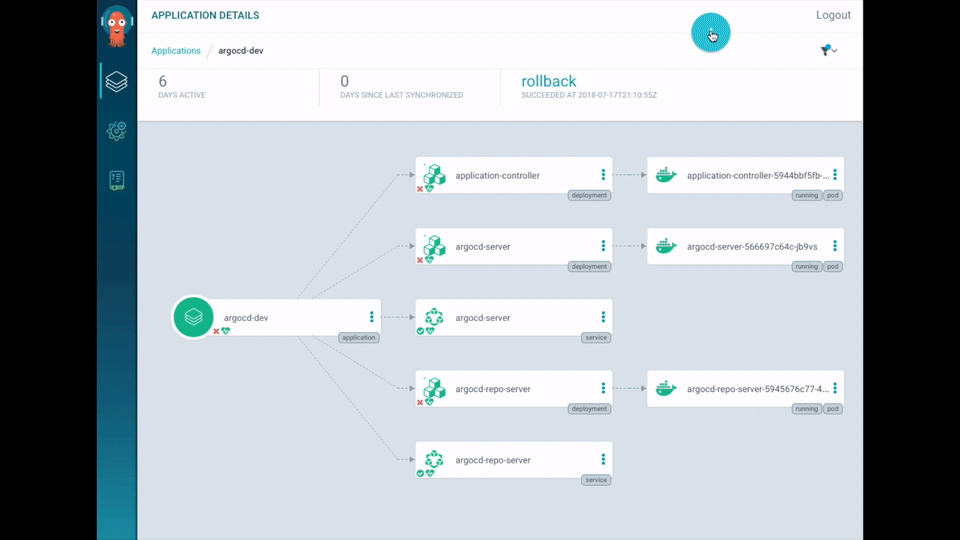
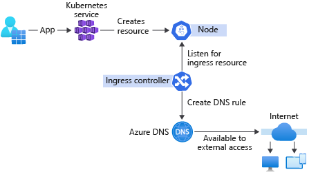

## GitHub Study Notes

## Contents: GitHub

1. [Introduction to GitHub](https://learn.microsoft.com/en-us/training/modules/introduction-to-github)
1. [Migrate your repository by using GitHub best practices](https://learn.microsoft.com/en-us/training/modules/migrate-repository-github)
1. [Upload your project by using GitHub best practices](https://learn.microsoft.com/en-us/training/modules/upload-project-github)
1. [Manage repository changes by using pull requests on GitHub](https://learn.microsoft.com/en-us/training/modules/manage-changes-pull-requests-github)
1. [Settle competing commits by using merge conflict resolution on GitHub](https://learn.microsoft.com/en-us/training/modules/resolve-merge-conflicts-github)
1. [Search and organize repository history by using GitHub](https://learn.microsoft.com/en-us/training/modules/search-organize-repository-history-github)
1. [Manage an InnerSource program by using GitHub](https://learn.microsoft.com/en-us/training/modules/manage-innersource-program-github)
1. [Communicate effectively on GitHub by using Markdown](https://learn.microsoft.com/en-us/training/modules/communicate-using-markdown)
1. [Maintain a secure repository by using GitHub best practices](https://learn.microsoft.com/en-us/training/modules/maintain-secure-repository-github)
1. [Automate DevOps processes by using GitHub Apps](https://learn.microsoft.com/en-us/training/modules/automate-devops-github-apps)
1. [Automate GitHub by using GitHub Script](https://learn.microsoft.com/en-us/training/modules/automate-github-using-github-script)
1. [Manage software delivery by using a release based workflow on GitHub](https://learn.microsoft.com/en-us/training/modules/release-based-workflow-github)
1. [Build continuous integration (CI) workflows by using GitHub Actions](https://learn.microsoft.com/en-us/training/modules/github-actions-ci)
1. [Build and deploy applications to Azure by using GitHub Actions](https://learn.microsoft.com/en-us/training/modules/github-actions-cd)
1. [Implement a code workflow in your build pipeline by using Git and GitHub](https://learn.microsoft.com/en-us/training/modules/implement-code-workflow)
1. [Introduction to cloud-native apps on Azure](https://learn.microsoft.com/en-us/training/modules/introduction-to-cloud-native-apps)
1. [Orchestrate containers for cloud-native apps with AKS](https://learn.microsoft.com/en-us/training/modules/cloud-native-apps-orchestrate-containers)
1. [Build a basic cloud-native service using PostgreSQL and Node.js](https://learn.microsoft.com/en-us/training/modules/cloud-native-build-basic-service)
1. [Stream internet-of-things (IoT) data to a cloud-native app with IoT Central](https://learn.microsoft.com/en-us/training/modules/cna-stream-iot-data)
1. [Build an IoT service for your cloud-native apps by using IoT Central](https://learn.microsoft.com/en-us/training/modules/cna-build-iot-service)
1. [Deploy and maintain cloud-native apps with GitHub actions and Azure Pipelines](https://learn.microsoft.com/en-us/training/modules/cna-deploy-maintain)
1. [Authenticate and authorize multi-tenant apps using Microsoft Entra ID](https://learn.microsoft.com/en-us/training/modules/cna-set-up-azure-ad-use-scale)
1. [Create an open-source program by using GitHub best practices](https://learn.microsoft.com/en-us/training/modules/create-open-source-program-github)
1. [Contribute to an open-source project on GitHub](https://learn.microsoft.com/en-us/training/modules/contribute-open-source)

### Study-note sections

- [GitHub platform and Git](#github-platform-and-git)
- [Collaboration and planning](#collaboration-and-planning)
- [Repository migration and history](#repository-migration-and-history)
- [Secure repositories and supply chains](#secure-repositories-and-supply-chains)
- [Automate with GitHub Actions](#automate-with-github-actions)
- [Integrations, packages, and releases](#integrations-packages-and-releases)
- [GitHub Copilot and responsible AI](#github-copilot-and-responsible-ai)
- [Administration and identity](#administration-and-identity)
- [Open source and InnerSource](#open-source-and-innersource)
- [Cloud-native delivery concepts](#cloud-native-delivery-concepts)

## GitHub platform and Git

- GitHub is a development platform for hosting and reviewing code, managing work, automating software delivery, and collaborating through Git repositories.
- Git is a distributed version control system (DVCS). It records history locally, supports isolated branches, and synchronizes with remote repositories. Git can be used without GitHub; GitHub adds collaboration, governance, automation, and hosted services around Git repositories.
- GitHub.com is GitHub's cloud service; GitHub Enterprise Server is the self-hosted option. Both use Git as the core technology and provide web, command-line, desktop, and API experiences for collaboration.
- Key features provided by GitHub include:
    1. Issues
    1. Discussions
    1. Pull requests
    1. Notifications
    1. Labels
    1. Actions
    1. Forks
    1. Projects
### GitHub Flow

GitHub Flow is a lightweight, branch-based workflow. Keep the default branch deployable and use a short-lived branch for each independent change:

1. Create a descriptive branch from the current default branch.
1. Make a small, coherent change; test it; then commit with a meaningful message.
1. Push the branch and open a draft pull request when early feedback is useful.
1. Link the pull request to its issue, describe the change and validation, and request appropriate reviewers.
1. Address review feedback and required checks, then merge using the repository's configured strategy.
1. Delete the merged branch. The pull request and commit history remain available for traceability.

Keep a branch focused on one outcome. Do not rewrite history that teammates may already have based work on. If a force push is explicitly needed on a shared branch, use `--force-with-lease`, communicate first, and follow the repository policy.

### Everyday Git commands

```bash
git switch main
git pull --ff-only
git switch -c fix/validation-message
git status
git add <files>
git commit -m "Fix validation message"
git push -u origin fix/validation-message
```

Use `git fetch` to update remote-tracking branches without altering the current branch. Use `git log`, `git diff`, and `git show` to inspect changes before acting. `git revert` creates a compensating commit and is generally safer than rewriting a published branch.

## Collaboration and planning

- Use **issues** to describe bugs, tasks, and decisions. Include the problem, acceptance criteria, labels, owner, priority, and links to related pull requests or discussions.
- Use **GitHub Projects** to plan across issues and pull requests. Views, fields, filters, and workflows make backlog, board, and roadmap views reflect the same work items.
- Use **discussions** for questions, proposals, and community conversation that should not yet be tracked as an actionable issue.
- Use pull-request templates and saved replies to make expected context, testing evidence, and review standards consistent.
- Manage notifications deliberately: subscribe where a response is needed, use participating or mentioned filters, and avoid relying on email as the only work queue.

### Codespaces and development environments

GitHub Codespaces provides a cloud-hosted development environment that can open in a browser or supported editor. Define repeatable tooling, extensions, ports, and setup tasks in `devcontainer.json`; keep setup scripts idempotent and never bake credentials into the image or repository. Codespaces availability, included usage, and advanced governance controls depend on the account plan, so confirm the current plan before standardizing it.

### Markdown on GitHub

GitHub Flavored Markdown (GFM) extends Markdown with GitHub-oriented features such as task lists, tables, alerts, mentions, issue and pull-request references, and fenced code blocks. Use descriptive headings, concise paragraphs, and language-labelled code fences so rendered content is readable and accessible.

## Repository migration and history

- **GitHub Importer** imports an externally accessible Git repository's source code and commit history into GitHub.com. It does not migrate associated issues or pull requests, does not support non-Git systems such as Subversion, Mercurial, or TFVC, and does not move Git LFS objects automatically.
- For a non-Git source, select and test a conversion or migration route appropriate to the source system. Preserve a verified backup, validate authors, branches, tags, large files, and history in a trial migration, and plan issues, pull requests, permissions, CI, secrets, and integrations separately.

### Source-code migration tools

For conversions from other source-control systems, commonly used tools include:

1. **Subversion:** `git-svn` or `svn2git`.
1. **Mercurial:** `hg-fast-export`.
1. **Team Foundation Version Control (TFVC):** `git-tfs`.

Confirm compatibility with the source-system version and the target Git version, and validate the converted history before the production cutover.

- For a Git-to-Git migration, compare commit counts and refs, run builds and tests from the new remote, move LFS objects when applicable, then communicate the cutover and retire write access to the old remote.

### Merge conflicts and history maintenance

1. Update the local view of the base branch before beginning a change and before opening a pull request. Integrate it into the feature branch through the team's chosen merge or rebase workflow.
1. When Git identifies a conflict, understand both intended changes, edit the result deliberately, remove conflict markers, run focused tests, stage the resolved files, and continue the merge or rebase.
1. Do not resolve a conflict by indiscriminately accepting one side. Ask the affected authors when the intended behavior is unclear.
1. A rebase writes new commits based on a new parent. Use it for unshared work or only when the repository workflow explicitly permits it.

### Search and traceability

- Search can target code, repositories, issues, pull requests, commits, users, packages, and more. Use qualifiers such as `repo:`, `org:`, `is:`, `label:`, `author:`, and `path:` to constrain results. See the [GitHub search syntax](https://docs.github.com/en/search-github/github-code-search/understanding-github-code-search-syntax).
- Use the **blame** view or `git blame` to connect a line to its historical commit. Use it to gather context rather than assign fault, then inspect the linked commit, pull request, and issue.

## Secure repositories and supply chains

### Security policy and governance

- Publish `SECURITY.md` so reporters know how to disclose a vulnerability responsibly. Use private security advisories to coordinate a fix before publishing details and remediation guidance.
- Use repository rulesets for branch, tag, and push controls. Rulesets can layer with branch protection, target patterns, run in evaluation or active modes, and make policies visible to readers. Typical protected-default-branch controls include pull requests, required reviews and status checks, linear history where appropriate, signed commits when required, and blocked force pushes.
- Add `CODEOWNERS` for sensitive paths and configure required code-owner review through the applicable ruleset or branch protection. Keep ownership entries current so reviews do not become a delivery bottleneck.

### Dependency, secret, and code security

| Control | Purpose and practice |
| --- | --- |
| Dependency graph and Dependabot | Inventory dependencies, review alerts, and use security updates or controlled version-update pull requests. Validate updates with CI rather than auto-merging blindly. |
| Secret scanning and push protection | Detect committed credentials and, where available, block them before they reach the remote. If a secret is exposed, revoke or rotate it immediately; deleting the file or commit alone does not make the credential safe. |
| Code scanning and CodeQL | Analyze code for security vulnerabilities and errors. Run scanning on pull requests and the default branch, triage alerts by exploitability and reachability, and track remediation to closure. |
| Dependency review and SBOM | Review dependency changes before merge and export an SBOM when a consumer or compliance process requires it. Availability varies by plan and repository visibility. |
| Artifact attestations | Establish build provenance and integrity for published software. Verify plan and repository-visibility requirements before adopting it. |

Security features and entitlements vary by plan, repository visibility, and GitHub Enterprise deployment. Review the [GitHub security features matrix](https://docs.github.com/en/code-security/getting-started/github-security-features) before making a control mandatory.

## Integrations, packages, and releases

### Choose the integration identity

| Option | Use when | Key practice |
| --- | --- | --- |
| GitHub App | A service or automation needs its own least-privilege organization or repository identity. | Prefer granular permissions and short-lived installation access tokens. Protect the private key used to sign the JWT that requests those tokens. |
| OAuth App | An application needs to act on behalf of a signed-in user. | Request the narrowest scopes, document consent, and treat the user-granted token as sensitive. |
| Fine-grained personal access token | A user-owned script or tool requires API access. | Restrict owner, repository access, permissions, and expiration; replace it with a GitHub App for shared or durable automation. |
| `GITHUB_TOKEN` | A workflow needs to act in its own repository during a run. | Declare the minimum `permissions` at workflow or job level; use a GitHub App when its permissions are insufficient. |

### Packages and releases

- Use **GitHub Packages** to publish and consume versioned packages close to the source repository. Protect publishing with CI, permissions, package retention policy, and immutable versioning appropriate to the ecosystem.
- A Git tag identifies a specific commit. A GitHub release adds release notes, assets, and distribution metadata to a tag. Generate release notes where helpful, but review them and maintain a clear upgrade path and rollback plan.
- Use semantic versioning only when its compatibility rules fit the product. Otherwise, publish and document an explicit versioning and support policy.
- `git cherry-pick` applies selected commits to another branch. Use it deliberately for a targeted fix; record the original pull request or issue so the two histories remain understandable.
- Workflow artifacts are build outputs retained under a configurable policy. Do not assume a universal retention duration, and do not treat an artifact store as a release channel or long-term backup.

## Automate with GitHub Actions

GitHub Actions automates work in response to events such as pushes, pull requests, schedules, releases, and manual dispatches. A workflow is a YAML file in `.github/workflows`; it contains one or more jobs, and each job runs steps on a selected runner. Actions can be JavaScript, Docker container, or composite actions.

### Secure workflow design

1. Trigger only on the events and branches required. Treat pull requests from forks and all untrusted inputs as untrusted.
1. Start with `permissions: {}` or an explicitly read-only baseline, then grant each job only the `GITHUB_TOKEN` permissions it needs.
1. Pin third-party actions to full commit SHAs and keep an update process for those pins. Review the source, owner, and required permissions before adoption.
1. Store sensitive values as secrets, avoid echoing them, and scope them through environments when a deployment requires approvals or branch restrictions.
1. Use GitHub-hosted runners by default. Isolate self-hosted runners from untrusted code and treat their host, network, and workspace as production infrastructure.
1. Use OpenID Connect (OIDC) with Azure workload identity federation instead of a long-lived Azure credential. Restrict the federated credential to known repository, branch, tag, or environment claims and grant only the Azure role required.

For Azure OIDC, the workflow or job needs `id-token: write`; that permission only permits requesting an OIDC token, not direct write access to cloud resources. Environment protection rules add an important second control for deployments.

### GitHub Script

`actions/github-script` supplies an authenticated Octokit REST client as `github` and workflow context as `context`, allowing small API automations to remain in the workflow. Keep the required `GITHUB_TOKEN` permissions explicit.

```yaml
name: Comment on new issue

on:
    issues:
        types: [opened]

permissions:
    issues: write

jobs:
    comment:
        runs-on: ubuntu-latest
        steps:
            - uses: actions/github-script@3a2844b7e9c422d3c10d287c895573f7108da1b3 # v9.0.0
                with:
                    github-token: ${{ secrets.GITHUB_TOKEN }}
                    script: |
                        await github.rest.issues.createComment({
                            issue_number: context.issue.number,
                            owner: context.repo.owner,
                            repo: context.repo.repo,
                            body: "Thanks for opening this issue."
                        });
```

### Build, test, and deploy

- Build continuous integration around each pull request: restore dependencies, build, run tests and quality checks, publish diagnostics, and protect the default branch with required checks.
- Keep delivery workflows separate from broad CI when approval, environment, or cloud permissions differ. Use GitHub environments to limit deployment branches, require approvals or protection rules, and scope environment secrets.
- Use reusable workflows for organization-standard build, security, and deployment logic. Use composite, JavaScript, or Docker actions only when a reusable workflow is not the right abstraction; document inputs, outputs, permissions, and supported runner environments.
- At enterprise scale, govern which actions and reusable workflows are allowed, manage runner groups and usage, and monitor failed, slow, or unexpectedly privileged workflows.

## Cloud-native delivery concepts

- A cloud-native delivery pipeline commonly builds a container image, runs tests and security checks, publishes the image to a registry, records provenance, and deploys an immutable image reference to a protected environment.
- Kubernetes provides declarative deployment, scaling, and service discovery. `kubectl` is one interface for applying and inspecting resources; deployment automation should remain reproducible and reviewable through source control.
- GitOps tools such as Argo CD continuously compare the declared Kubernetes state in Git with the cluster and synchronize according to policy. They complement GitHub Actions: an Action can validate and update the desired-state repository, while the GitOps controller applies that approved state to the cluster.

        

- An Ingress resource and its controller route external HTTP(S) traffic to Kubernetes Services based on host and path rules. They do not inherently create public DNS records; a load balancer, DNS provider, or DNS controller must supply that integration.

        

- CQRS separates commands, which change system state, from queries, which return information. Use it when independently optimizing write and read models solves a real domain or scale problem; it adds consistency and operational complexity.
- Azure IoT Central can simplify secure device management, telemetry ingestion, and integration for suitable IoT solutions. Confirm current product capabilities, regional availability, and the analytics architecture before selecting it. Azure Time Series Insights is retired; evaluate supported time-series analytics options such as Azure Data Explorer or Microsoft Fabric.

## Open source and InnerSource

- **Open source** contributors consume, contribute to, and maintain projects. Before opening a repository, choose a license, state the supported contribution workflow, publish a code of conduct and `CONTRIBUTING.md`, document maintainership and release practices, and publish `SECURITY.md`.
- Make a first contribution by reading the repository's contribution guidance, selecting a well-scoped issue, creating a focused branch or fork, testing the change, and responding constructively to review feedback. Maintainers should set clear expectations for issue triage, reviews, and community behavior.
- **InnerSource** applies these transparent open-source patterns to an organization's internal projects. Improve discoverability, onboarding, contribution guidance, review responsiveness, and reuse, while retaining the organization's access and compliance controls.
- Mature programs progress from ad hoc practices to managed, defined, measured, and continually improved practices. Measure outcomes that matter—such as contribution lead time, review responsiveness, reuse, and contributor experience—rather than counting activity alone.

## GitHub Copilot and responsible AI

GitHub Copilot helps with code completion, chat, code explanation, tests, refactoring, pull-request assistance, and agentic tasks. Product availability and capabilities vary by plan, policy, client, and deployment; verify the current entitlement before designing a workflow around a feature.

### Use Copilot effectively

1. Provide a clear goal, relevant constraints, expected behavior, language or framework context, and acceptance criteria. Break complex requests into reviewable steps.
1. Add repository guidance through documentation and supported Copilot customization mechanisms so suggestions reflect the project's architecture, standards, testing, and security requirements.
1. Use Spaces or other approved context features to collect the authoritative material needed for a task; exclude secrets, customer data, and other information that policy does not allow to be shared.
1. Treat every suggestion as untrusted code: understand it, run tests and linters, review dependencies and licenses, check for security flaws, and use normal pull-request review.
1. Agent mode and cloud coding agents can investigate a codebase, make multi-file changes, run tools, and iterate. Give them bounded tasks and permission scope, inspect the diff and output, and retain human accountability for merges and deployments.
1. Use MCP servers only from trusted, governed sources. Review the server's data access and tool capabilities before connecting it to Copilot.

### Responsible AI checklist

- Define the human decision owner and a validation path before using AI output in a product or engineering process.
- Evaluate quality and reliability with representative tests; do not infer correctness, security, accessibility, or legal clearance from a fluent response.
- Protect privacy and confidential data. Follow organizational data handling, retention, and approved-tool policies.
- Consider fairness, inclusiveness, transparency, and accountability when AI features affect users. Provide appropriate user disclosure, feedback, monitoring, and escalation paths.
- Report material defects, unsafe behavior, or misuse through the organization's incident and product feedback processes.

## Administration and identity

- Design the organization hierarchy, teams, repository visibility, roles, and outside-collaborator access around least privilege. Periodically remove inactive access and review ownership of critical repositories.
- Use a supported identity provider with SAML single sign-on, SCIM provisioning, and team synchronization where the GitHub plan and enterprise design support them. Test joiner, mover, leaver, guest, break-glass, and recovery scenarios before broad enforcement.
- GitHub Enterprise can centrally manage policy, billing, audit, and security controls across organizations. Enterprise Managed Users may be appropriate when the organization needs identities provisioned and controlled through its identity provider.
- Establish policy for allowed Actions, GitHub Apps, OAuth Apps, personal access tokens, Codespaces, runners, repository creation, fork behavior, data residency, and audit-log retention.
- Plan selection matters: security and deployment controls, actions minutes, package storage, Codespaces usage, and enterprise identity options differ by plan. Confirm capabilities in the current [GitHub plans](https://docs.github.com/en/get-started/learning-about-github/githubs-plans) documentation rather than relying on old quotas or feature matrices.

### Curriculum cross-reference

The learning paths at the start of this note map to the major exercises here: Foundations covers Git, GitHub products, Projects, Codespaces, Markdown, collaboration, InnerSource, security, administration, identity, pull requests, and search; Actions covers workflow automation, CI/CD, GitHub Script, Packages, custom actions, and enterprise governance; Advanced Security covers Dependabot, secret scanning, CodeQL, and security policies; and Copilot Fundamentals covers responsible use, prompting, customization, Spaces, reviews, agent mode, coding agents, MCP, and language-specific workflows.

    

- Ingress controllers provide the capability to deploy and expose your applications to the world, without the need to configure network-related services.
- Ingress controllers allow requests to be served from a single DNS output. When a new service is deployed, ingress controllers create a DNS record for you.

    

- CQRS separates the models for reading and writing data. This process involves dividing a system's operations into two separate categories:
    1. Commands that change the state of a system.
    1. Queries that only return results, without affecting the state of the system.
- Azure IoT Central is a fully managed cloud service that simplifies implementing a range of IoT capabilities, including telemetry collection, processing, analytics, and secure device management. Confirm the current service roadmap and regional availability before choosing it for a new solution.
    1. Helps you minimize custom development efforts and administrative overhead.
    1. Allows you to use cloud agility and scalability.
    1. Supports built-in integration with many other Azure services.
    1. Helps you bridge the gap between IoT devices and cloud-native applications, which accelerates their integration.
    1. Promotes reusability by:
        1. Using templates.
        1. Combining several platform as a service (PaaS) Azure IoT services, such as IoT Hub, into an easy-to-use software as a service (SaaS) offering. Azure Time Series Insights is retired; evaluate current analytics options such as Azure Data Explorer, Azure Data Explorer dashboards, or Microsoft Fabric for time-series analysis.
- Open-source goals

    To recap, there are three dimensions to participation in open-source software:

    1. Consumers, who study or use the repositories of others.
    1. Contributors, who are actively involved in the improvement of the repositories of others.
    1. Producers, who build and maintain their own repositories that are open to others.

    There are five process levels within each dimension.

    

    1. Ad hoc, which have no process in place. Success depends on individual efforts.
    1. Managed, which have a partially documented process. Success depends on discipline.
    1. Defined, which have a documented, standardized, and integrated process. Success depends on automation.
    1. Measured, which have a quantitatively managed process. Success depends on measuring metrics against business goals.
    1. Optimized, which have a process that is continually and reliably improving through both incremental and innovative changes. Success depends on reducing the risk of change.
- Head to GitHub search

You can also use GitHub search to explore topics and related projects. Head to GitHub search, and enter your topic word. [Head to GitHub search](https://github.com/search)
