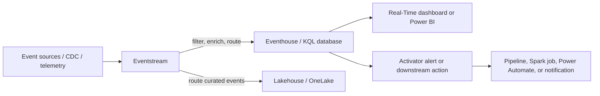

## Microsoft Fabric Study Notes

Microsoft Fabric is a software-as-a-service analytics platform for end-to-end data work: ingestion, transformation, engineering, real-time analytics, data science, warehousing, databases, semantic modeling, and reporting. Its workloads share a common platform rather than requiring each team to assemble and operate separate analytics services.

> **Study-note status:** Fabric capabilities, regions, capacity requirements, and preview features change frequently. Confirm availability, licensing, and supportability in [Microsoft Fabric documentation](https://learn.microsoft.com/en-us/fabric/) before building a production solution.

## Contents: Microsoft Fabric

- [Core platform concepts](#core-platform-concepts)
- [Select Fabric workloads by outcome](#select-fabric-workloads-by-outcome)
- [Choose ingestion and replication patterns](#choose-ingestion-and-replication-patterns)
- [Design the data product and lakehouse layers](#design-the-data-product-and-lakehouse-layers)
- [Choose a lakehouse, warehouse, or SQL database](#choose-a-lakehouse-warehouse-or-sql-database)
- [Build real-time analytics solutions](#build-real-time-analytics-solutions)
- [Serve analytics with semantic models and Direct Lake](#serve-analytics-with-semantic-models-and-direct-lake)
- [Build data science workflows](#build-data-science-workflows)
- [Organize data with OneLake](#organize-data-with-onelake)
- [Govern security and collaboration](#govern-security-and-collaboration)
- [Deploy and operate Fabric solutions](#deploy-and-operate-fabric-solutions)
- [Start a proof of concept](#start-a-proof-of-concept)
- [Microsoft Learn resources](#microsoft-learn-resources)

## Core platform concepts

Fabric brings multiple analytics experiences together on a shared software-as-a-service foundation:

- **OneLake** is the tenant-wide, logical data lake used by Fabric workloads. It is built on Azure Data Lake Storage and provides a shared namespace for data and artifacts.
- **Workspaces** are collaboration and access boundaries. A workspace contains items such as lakehouses, warehouses, notebooks, pipelines, semantic models, reports, and eventstreams.
- **Items** are the individual Fabric artifacts that implement a solution. Treat item ownership, dependencies, credentials, permissions, and lifecycle as explicit design concerns.
- **Capacities** provide the compute resources that run Fabric workloads. Capacity assignment determines which Fabric experiences and features a workspace can use.
- **Power BI** is a Fabric workload for semantic models, reports, dashboards, and governed business intelligence. Its detailed modeling guidance is in [Power BI study notes](powerbi.md).
- **Microsoft Purview** capabilities are integrated into Fabric for discovery, governance, sensitivity labels, auditing, and policy-aware data use.
- **Copilot** is embedded in supported Fabric experiences to assist with authoring, exploration, queries, code, and analysis. It respects the available Fabric and tenant controls, but is not supported on trial capacities; require an F2-or-higher or P capacity, confirm supported region and cross-geography data-processing settings, and assess capacity consumption before enablement.
- **Microsoft Foundry integration** enables AI and machine-learning scenarios that connect Fabric data with Foundry models and tools. Define identity, data boundaries, evaluation, and operating ownership before treating an AI capability as part of a data product.

The central design advantage is reuse: a pipeline can ingest data, a lakehouse or warehouse can prepare it, a semantic model can govern metrics, and Power BI can visualize it while the artifacts remain discoverable and governed in one platform. See [What is Microsoft Fabric?](https://learn.microsoft.com/en-us/fabric/get-started/microsoft-fabric-overview).

## Select Fabric workloads by outcome

Choose the workload based on the problem, the skills of the delivery team, the data latency requirement, and the operational model—not just on the source technology.

| Outcome | Typical Fabric workload or item | Design considerations |
| --- | --- | --- |
| Ingest, orchestrate, and transform data from cloud or on-premises sources | Data Factory pipelines, dataflows, and Power Query | Define ownership, credentials, refresh or trigger behavior, retry handling, and source-to-target lineage. |
| Prepare large-scale data with Spark and notebooks | Data Engineering lakehouse and notebooks | Use version-controlled notebooks, parameterize paths, track data quality, and separate experimentation from production transformations. |
| Provide governed SQL analytics | Data Warehouse or a lakehouse SQL analytics endpoint | Establish a dimensional or other intentional serving model, workload concurrency expectations, and appropriate access controls. |
| Build and operationalize predictive analysis | Data Science notebooks and experiments | Keep features, experiments, models, validation data, and approval steps traceable. Integrate with Azure Machine Learning where its lifecycle capabilities are required. |
| Analyze telemetry, logs, or events in near real time | Real-Time Intelligence, eventstreams, and KQL databases | State the latency objective, retention policy, event schema, late-arrival handling, and downstream action or alerting path. |
| Model metrics and build reports | Power BI semantic models and reports | Use a star schema, explicit measures, controlled relationships, and workspace-aware row-level security. |
| Build transactional applications or replicate operational data to analytics | Fabric SQL database and Mirroring | Clarify the operational source of truth, replication latency, recovery requirements, and how analytical consumers will use the replicated data. |
| Unify business semantics, metrics, and automation across data products | Fabric IQ (preview) | Evaluate ontology, plan, data-agent, and operations-agent capabilities only after confirming preview status, capacity, region, governance, and supportability. |

A lakehouse is a strong choice when teams need files, Delta tables, Spark processing, and SQL analytics over the same data. A warehouse is a strong choice when a SQL-first team needs an analytical relational serving layer. The following sections turn this selection into an implementable design.

## Choose ingestion and replication patterns

Data movement is an architectural decision because it determines latency, data ownership, operational complexity, and cost. Select the simplest pattern that meets the source, freshness, transformation, and recovery requirements.

| Requirement | Recommended pattern | Why | Validate before production |
| --- | --- | --- | --- |
| Bring source tables into OneLake continuously for analytics, with minimal transformation | Mirroring | Database mirroring replicates an analytical copy into OneLake-backed Delta tables and avoids a custom ingestion pipeline. Metadata mirroring uses shortcuts to expose source data in place, while open mirroring accepts Delta-formatted changes from an application. | Supported source and mirroring type, replication lag, source-region and gateway behavior, retention, schema changes, and whether the replica's read-only shape meets the need. |
| Land raw batch data with configurable scheduling, incremental loads, column mapping, or upsert behavior | Copy job | Provides a managed ingestion path without the full orchestration overhead of a pipeline. | Initial-load duration, incremental strategy, watermark or CDC behavior, schema evolution, error handling, and destination ownership. |
| Coordinate multiple activities, custom extraction logic, validations, transformations, notifications, and dependencies | Data Factory pipeline with Copy activity | Pipelines provide control flow and orchestration for metadata-driven or multi-step workflows. | Idempotency, retry rules, alerting, parameters, secrets, dependency order, and how the workflow resumes after a partial failure. |
| Ingest data in motion and route it in seconds | Eventstream | Supports streaming ingestion, no-code transformations, routing, and real-time destinations. | Event schema, partition/key design, late or duplicate events, expected rate, retention, and operational action rules. |
| Reuse supported data without copying it | OneLake shortcut or metadata mirroring | References data in place and can reduce ETL, storage, and duplication. | Source availability, source authorization, performance from the consuming engine, cross-tenant governance, and the impact if the source changes. |

### Copy, mirror, or shortcut?

Use this decision sequence:

1. **Can the consumer safely use the source data in place?** If yes, evaluate a OneLake shortcut. It preserves a single source of truth but shifts availability, permission, and latency dependencies to the source.
2. **Does Fabric need a near-real-time analytical replica of an operational database?** If yes, evaluate mirroring. It is for analytics; do not treat the mirrored data as the operational system of record. Confirm capacity and storage implications for the chosen mirroring type and source.
3. **Do you need scheduled batch ingestion with incremental behavior but little orchestration?** Use a copy job.
4. **Do you need branching, dependencies, custom SQL, validation, retries, or multiple destinations?** Use a pipeline and model the workflow explicitly.
5. **Do records arrive continuously and must be acted on immediately?** Use Eventstream and Real-Time Intelligence instead of trying to force a batch pipeline into a streaming role.

For database and open mirrored databases created after mid-June 2025, the default Delta retention is one day; older mirrored databases default to seven days. Set and test retention deliberately when Delta time travel, recovery analysis, or mirroring-storage cost matters.

For all paths, document the data contract: source owner, extraction method, update cadence, primary key or event identifier, expected schema, permitted late arrival, sensitive fields, and the behavior when source availability or schema changes. Microsoft Learn's [data movement decision guide](https://learn.microsoft.com/en-us/fabric/data-factory/decision-guide-data-movement) compares these patterns in detail.

### Pipeline design checklist

For a production pipeline, make the failure and replay path as intentional as the success path:

- Parameterize workspace-specific paths, connection identifiers, dates, source objects, and target objects; do not hard-code production-only values into notebook or pipeline logic.
- Design **idempotent** loads. A rerun after a timeout must not silently duplicate data or leave a partially updated curated table.
- Persist a load audit with run ID, source watermark, start/end timestamps, rows read/written/rejected, schema version, and outcome.
- Separate copy, validation, transformation, publication, and notification activities so failures are diagnosable and reruns can be scoped.
- Quarantine malformed records rather than silently dropping them. Publish data-quality counts and a link to the rejected records for the source owner.
- Make incremental logic explicit. A watermark can miss updates if source clocks, time zones, or late changes are mishandled; CDC or a source-provided change version is often safer when available.
- Define the retry boundary. Retrying a transient copy can be correct; retrying a non-idempotent write without cleanup can corrupt the target.

## Design the data product and lakehouse layers

An end-to-end Fabric solution should expose a governed data product, not merely a collection of files and notebooks. Start with the business decision, then define the data contract, transformations, serving layer, security boundary, and operational ownership.

### A practical layered pattern

Use a layered architecture when data arrives from multiple sources or needs repeatable quality controls. Names vary, but the responsibilities should be clear:

| Layer | Purpose | Typical contents | Rules |
| --- | --- | --- | --- |
| Landing / bronze | Preserve raw source fidelity and enable replay. | Files, raw tables, ingestion audit, source metadata. | Do minimal transformation; retain source identifiers and ingestion time; restrict broad consumer access. |
| Standardized / silver | Make data reliable and reusable. | Typed Delta tables, deduplicated entities, conformed reference data, quality results. | Enforce schema, resolve keys, handle deletes and late data, publish quality metrics. |
| Curated / gold | Serve a defined analytical or operational use case. | Dimensional facts/dimensions, aggregates, feature tables, semantic-model-ready tables. | State grain, ownership, SLA, definitions, permitted consumers, and deprecation process. |

This pattern does not mean every source needs three physical copies. Use shortcuts, mirroring, or a single curated table where they meet the contract. The key is that raw, validated, and consumer-facing data have different ownership and quality expectations.

### Define table contracts

For each curated table, record at least:

- **Business purpose and owner:** What decision or process does the table support, and who approves definition changes?
- **Grain:** For example, one row per order line, customer-day, device-minute, or accounting posting. Grain prevents invalid joins and misleading aggregations.
- **Keys and change behavior:** Natural/business key, surrogate key if used, delete behavior, late-arrival behavior, and whether the table is append-only or mutable.
- **Freshness target:** Expected update interval and the maximum tolerated delay, separately for source availability and publication time.
- **Quality rules:** Uniqueness, referential integrity, null thresholds, value-domain rules, reconciliation totals, and how violations are surfaced.
- **Security classification:** Sensitive columns, required labels, row/column restrictions, and permitted sharing paths.
- **Schema evolution policy:** Which changes are additive, breaking, or require a new version; who receives notice; and how long the previous version remains available.

### Delta table maintenance

Fabric lakehouses and warehouses use Delta tables in OneLake. Delta tables make the data reusable across Spark, SQL, Power BI, and other Fabric workloads, but a table still requires intentional maintenance.

- Favor stable, query-friendly curated schemas over exposing raw semi-structured source payloads directly to analysts.
- Partition only when it improves a documented access pattern. Excessively small files or excessive partitions can harm both Spark and downstream Direct Lake performance.
- Keep table schemas compatible with the target engine. For example, test nested/complex types, binary values, and high-cardinality strings before committing to a Direct Lake serving pattern.
- Manage data-retention requirements separately from operational file cleanup. Retention, recoverability, and legal hold are business controls, not just storage-cost settings.
- Test table changes with representative scale. A transformation that works on a small notebook sample can create inefficient files, long-running jobs, or semantic-model guardrail failures at production volume.
- For Import semantic models on supported Premium P or Fabric F capacities, evaluate **OneLake integration** before duplicating an ingestion path. It exports Import tables as Delta tables during model refresh so downstream Fabric workloads can consume them through shortcuts. Treat the exported tables as refresh-cadenced copies, validate RLS/OLS access behavior, and account for the three-day Delta-version retention.

## Choose a lakehouse, warehouse, or SQL database

These options overlap because each participates in OneLake. Select based on the data shape, primary development experience, transaction needs, and serving contract.

| Decision point | Lakehouse | Warehouse | SQL database in Fabric |
| --- | --- | --- | --- |
| Primary development experience | Apache Spark, notebooks, Python/Scala/R, files, and Delta tables | T-SQL and relational warehouse development | Transactional T-SQL application development based on Azure SQL Database capabilities |
| Best data shape | Structured and unstructured data, varied source formats, engineering and science workloads | Structured, curated analytical data for SQL-first consumers | Operational OLTP data that also needs integrated analytics |
| Write/transaction model | Spark and ingestion tools write Delta tables; the SQL analytics endpoint is read-only for lakehouse data | Full warehouse DDL/DML and multi-table ACID transactions | Transactional database operations with automatic analytical replication to OneLake |
| Common serving use | Data engineering, feature preparation, staging, notebook workloads, SQL exploration | Enterprise data marts, star/snowflake schemas, governed SQL analytics | Operational data store, translytical patterns, application APIs, reverse ETL targets |
| Important limitation to remember | SQL analytics endpoint is not a full writable warehouse | Do not use it as an ungoverned raw-file landing zone | Do not mix operational write expectations with analytical workloads without performance and recovery design |

### Lakehouse implementation pattern

1. Attach or create the lakehouse in a development workspace.
2. Land raw data through a pipeline, copy job, notebook, Dataflow Gen2, mirroring, or shortcut.
3. Use notebooks or Spark job definitions to produce validated Delta tables in the standardized and curated layers.
4. Expose curated Delta tables to analysts through the SQL analytics endpoint, a governed semantic model, or an approved shortcut.
5. Monitor file layout, job duration, table growth, schema changes, and consumer query performance.

Lakehouses automatically include a SQL analytics endpoint for read-only T-SQL analysis of Delta tables. Use a warehouse rather than the endpoint when the serving layer needs full T-SQL DML and multi-table transaction capabilities. See [Lakehouse overview](https://learn.microsoft.com/en-us/fabric/data-engineering/lakehouse-overview).

### Warehouse implementation pattern

1. Define the analytical grain and dimensional model before bulk loading. A warehouse is most effective when the fact/dimension roles and metric definitions are deliberate.
2. Load with supported T-SQL, pipelines, dataflows, Spark, or cross-database patterns such as `COPY INTO`, `CTAS`, and `INSERT ... SELECT`, according to the source and transformation needs.
3. Use schemas, views, stored procedures, functions, and permissions to make the consumer contract clear.
4. Keep raw landing transformations outside the reporting-facing star schema. A consumer should not need to understand staging tables to build a report.
5. Test concurrency, cross-database queries, load windows, and semantic-model query patterns with production-like volume.

Use a warehouse for SQL-first analytical workloads, particularly when the solution needs relational DDL/DML, multi-table ACID transactions, and curated reporting structures. See [Fabric Data Warehouse](https://learn.microsoft.com/en-us/fabric/data-warehouse/data-warehousing).

### SQL database implementation pattern

Use SQL database in Fabric for operational and translytical scenarios, not as a replacement for every existing operational system.

- It is a developer-friendly transactional database based on the Azure SQL Database engine.
- Data is automatically replicated into OneLake in analytics-ready form, separating downstream analytics from transactional activity.
- Use it for an operational data store, reverse ETL target, application/API backend, or a translytical application that needs both transactional and analytical access.
- For intelligent application scenarios, evaluate built-in vector data types, semantic search, and retrieval-augmented generation patterns only after validating application security, model integration, capacity, and query behavior.
- Use Microsoft Entra authentication, database/item permissions, auditing, and an explicit backup/recovery and deployment plan. Treat schema changes as application releases.

See [SQL database in Fabric](https://learn.microsoft.com/en-us/fabric/database/sql/overview) for current capabilities and limitations.

## Build real-time analytics solutions

Real-time does not mean merely frequent refresh. Use Real-Time Intelligence when the system needs to react to events as they occur: telemetry, logs, device signals, clickstreams, operational thresholds, or near-real-time business events.

The **Real-Time hub** is the tenant-wide entry point for discovering, ingesting, managing, and consuming streams and KQL tables. Use it to find available sources and route streams to eventstreams, KQL databases, and approved downstream actions; do not treat it as a replacement for an event contract, retention policy, or access design.

### Reference flow

### Design the event contract

Before creating an eventstream, define:

- A stable event identifier or deduplication key.
- Event time, ingestion time, producer/source, schema version, partitioning/correlation keys, and a payload classification.
- Expected event rate, burst profile, maximum accepted delay, ordering assumptions, and retention requirements.
- Handling for malformed, duplicate, late, and out-of-order events.
- The exact action threshold and human escalation path. Do not automate a destructive action solely because an alert can be configured.

Eventstreams support no-code transformations and routing, while eventhouses and KQL databases are optimized for time-based event analytics. Use Real-Time hub to discover and manage streams, KQL for detailed investigation, dashboards for operational views, and Activator for approved event-driven actions. See [Real-Time hub](https://learn.microsoft.com/en-us/fabric/real-time-hub/real-time-hub-overview) and [Real-Time Intelligence](https://learn.microsoft.com/en-us/fabric/real-time-intelligence/overview).

### Batch-to-real-time boundary

Keep the real-time and historical paths compatible but independent:

- Land the event stream in an eventhouse for fast operational queries and retain a governed historical representation in OneLake where cross-workload analytics requires it.
- Do not force a business user to query raw events for a monthly KPI. Create a curated aggregate or semantic model designed for that consumer.
- Do not use a batch refresh to implement a safety or service-level alert whose decision must happen in seconds.
- Reconcile real-time operational counts with the curated daily analytical model; explain late data, corrections, and retention differences explicitly.

## Serve analytics with semantic models and Direct Lake

A semantic model is the governed business layer between curated data and reports. It should encode metric definitions, relationships, security behavior, and terminology once so reports do not reimplement them independently. See [Power BI study notes](powerbi.md) for detailed dimensional-modeling, DAX, relationship, refresh, and report-performance guidance.

### Choose the semantic-model storage mode

| Storage mode | Use when | Main trade-off |
| --- | --- | --- |
| Import | A self-service or departmental model needs the broadest modeling freedom and the source can refresh on an acceptable schedule. | Data is copied into the model and refresh consumes time, memory, and capacity. |
| Direct Lake on OneLake | Curated Delta tables in Fabric must support large-scale, low-latency interactive analysis without an Import copy. | Requires a Fabric capacity and well-maintained Delta tables; test capacity guardrails and security behavior. |
| Direct Lake on SQL endpoints | Lakehouse or warehouse SQL-endpoint tables and views are the intended source. | Some scenarios fall back to DirectQuery; view and security patterns can affect performance and behavior. |
| DirectQuery | The source must remain authoritative at query time or Fabric does not hold the analytical data. | Every visual can query the source, so source performance, concurrency, and query design become user-experience constraints. |
| Composite model | A solution needs a controlled mixture, such as Direct Lake facts plus a small imported reference table. | Cross-source relationships, security, and query movement must be tested explicitly. |

### Direct Lake checklist

Direct Lake is not a generic default. It is strongest for IT-led lake-centric analytics where curated Delta tables in OneLake already exist and query speed plus fast data visibility matter.

- Prepare data upstream in lakehouse or warehouse tables; do not expect the semantic model to become the primary data-engineering layer.
- Create a clean star schema and use supported data types. Validate one-side relationship uniqueness and exact data-type matches before production.
- Optimize Delta tables and file layout for the expected query patterns. Poorly organized Delta tables can cause guardrail failures, paging, or fallback behavior.
- Decide whether Direct Lake on OneLake or Direct Lake on SQL endpoints matches the required views, security model, and fallback behavior.
- Calculated tables that reference Direct Lake data are supported in preview for Direct Lake on OneLake, but not for Direct Lake on SQL endpoints. Keep calculations upstream when portability, general availability, or predictable capacity behavior is required.
- Test semantic-model RLS and the chosen source/OneLake/SQL security mechanism using real user identities. Do not assume SQL endpoint RLS automatically applies in every Direct Lake mode.
- Measure with representative concurrent reports and refresh/framing activity on the target capacity; a successful small proof of concept does not validate a high-concurrency production workload.

Direct Lake uses the VertiPaq engine after loading Delta data into memory and can provide Import-like interactive performance without copying the full data volume into an Import model. It has capacity guardrails and important security/feature constraints, so prototype it before committing. See [Direct Lake overview](https://learn.microsoft.com/en-us/fabric/fundamentals/direct-lake-overview).

## Build data science workflows

Use Fabric Data Science when the data science team benefits from working directly against governed data in OneLake and the outcome is batch enrichment, experimentation, model tracking, or predictive insights that feed analytics. Use Azure Machine Learning alongside or instead of Fabric when its deployment, registry, managed endpoint, or broader MLOps capabilities are required.

### Repeatable workflow

1. **Formulate the decision.** State the prediction or optimization target, decision owner, cost of error, fairness/safety constraints, and baseline that the model must beat.
2. **Create a reproducible feature dataset.** Record source table versions, filters, labels, feature definitions, observation time, and the prevention of data leakage.
3. **Explore and prepare in notebooks.** Use Spark/Python, Data Wrangler, or approved transformations. Commit code and dependencies; do not leave the only working logic in an interactive notebook state.
4. **Track experiments.** Record parameters, code revision, data version, metrics, artifacts, and environment with MLflow experiments and runs.
5. **Validate before registering or publishing.** Use temporal or holdout validation as appropriate, inspect errors by key cohorts, and compare against a non-model baseline.
6. **Score and publish.** Write predictions and model metadata to a controlled OneLake table. Include model version, score time, source snapshot, and confidence/quality indicators when meaningful.
7. **Monitor drift and value.** Measure input distribution changes, data quality, outcome feedback, model performance, latency, and business impact. Define a retraining and rollback trigger.

Predictions should be a governed data product: they need an owner, freshness target, acceptable-use policy, security classification, and a documented distinction between a prediction and a business decision. Fabric supports notebooks, MLflow tracking, model artifacts, batch scoring, and publishing predictions to OneLake for Power BI consumption. See [Fabric Data Science](https://learn.microsoft.com/en-us/fabric/data-science/data-science-overview).

## Organize data with OneLake

OneLake is the shared logical data lake underpinning Fabric. Its hierarchy starts with the tenant, then workspaces, then items such as lakehouses. Design this hierarchy deliberately:

- Use **domains** and workspaces to align ownership, lifecycle, and access boundaries. Do not make a workspace a catch-all location for unrelated data products.
- Name items consistently so users can distinguish environments, source systems, and curated products. Include a clear owner and business description for shared items.
- Use **OneLake shortcuts** when data can be reused in place from supported internal or external storage instead of being copied. Review source access, data residency, egress cost, reliability, and query behavior before using shortcuts as a production dependency.
- Treat lakehouse folders, files, and tables as governed assets. Prefer open formats, including Delta tables where appropriate, and avoid undocumented file-level dependencies.
- Use the **OneLake Catalog** to discover data products and assess governance state. Its Explore, Govern, and Secure experiences support item discovery, recommended governance actions, and central review of workspace and OneLake security roles. Keep descriptions, endorsements, lineage, and sensitivity information current for shared assets.

OneLake unifies data access; it does not eliminate the need for data ownership, retention, quality checks, or a clear contract between producers and consumers. See [What is OneLake?](https://learn.microsoft.com/en-us/fabric/onelake/onelake-overview) and [OneLake shortcuts](https://learn.microsoft.com/en-us/fabric/onelake/onelake-shortcuts).

### OneLake security design

Use workspace roles for collaboration and use item/data permissions to constrain access to the actual data. They solve different problems.

1. Begin with minimal workspace roles. Give users the ability to create or administer items only where their job requires it.
2. For supported Lakehouse, mirrored database, and mirrored catalog data, create OneLake security roles for the exact tables or folders that a group may read or write.
3. Review default roles. A user in `DefaultReader` can retain broad access even if a new narrow role is added; remove broad access before relying on the narrow role.
4. If a SQL analytics endpoint must enforce OneLake roles, configure the endpoint for **User's identity access mode** and test through the same engine and identity that consumers use.
5. Apply row or column restrictions only after validating the business need, reporting behavior, and cross-engine result. Avoid duplicating unmanaged security logic across notebooks, SQL views, and reports.

OneLake security roles can apply table, folder, row, and column restrictions across Fabric experiences for supported items. See [Get started with OneLake security](https://learn.microsoft.com/en-us/fabric/onelake/security/get-started-onelake-security).

## Govern security and collaboration

Security is an end-to-end responsibility across tenant settings, capacity, workspace roles, item permissions, data source credentials, and sharing paths.

- Apply least privilege to workspace roles. Use Viewer for read-only consumption where possible; higher roles can create, modify, share, or manage items and must be governed accordingly.
- Use Microsoft Entra security groups instead of direct user assignments for durable access management. Review membership and privileged roles regularly.
- Secure the data source as well as Fabric. A workspace role alone does not replace source-system authorization, credential rotation, network controls, or data classification.
- Apply and respect sensitivity labels, endorsement, lineage, and auditing. Confirm how labels and permissions behave when data is exported, shared, or consumed from a semantic model.
- Separate development, test, and production. Avoid using the Default workspace or personal workspaces as a production boundary.
- Test row-level security, object-level security, and single sign-on behavior with representative users, including guest users where applicable. For semantic-model details, see [Power BI study notes](powerbi.md).
- External data sharing creates a read-only, live OneLake shortcut in a consumer tenant. Provider-tenant RLS, sensitivity, and Purview policies do **not** flow across the tenant boundary; the consumer tenant must apply its own access, governance, residency, and compliance controls. Review the recipient-tenant exposure model before enabling a share.

Use the [Fabric administration documentation](https://learn.microsoft.com/en-us/fabric/admin/) and [Microsoft Purview in Fabric guidance](https://learn.microsoft.com/en-us/fabric/governance/) to confirm current tenant controls and governance capabilities.

## Deploy and operate Fabric solutions

Capacity is a shared operational resource, not simply a licensing selection. Design for workload contention and predictable service behavior.

### Environment and release strategy

Use separate development, test, and production workspaces. A workspace is both a collaboration and a security boundary, so an environment should not be simulated only by a naming suffix inside one broadly writable workspace.

| Concern | Development | Test | Production |
| --- | --- | --- | --- |
| Purpose | Build and explore | Validate integration, security, performance, and release candidate | Serve supported users and business processes |
| Data | Synthetic, masked, or bounded sample | Representative and controlled | Approved production data only |
| Access | Contributors and engineers | Testers, release owners, limited contributors | Least-privilege operators and consumers |
| Changes | Frequent, branch-based | Promoted and validated | Approved, traceable, reversible |
| Monitoring | Developer diagnostics | Release and load validation | SLA, freshness, security, capacity, and incident monitoring |

Treat the following as deployable assets: pipelines, notebooks, environments, lakehouses/warehouses where supported, SQL definitions, semantic models, reports, eventstreams, and configuration metadata. Git integration is workspace-level and supported-item coverage changes over time; verify support for every required item before making Git the only recovery mechanism. See [Fabric Git integration](https://learn.microsoft.com/en-us/fabric/cicd/git-integration/intro-to-git-integration).

### Release checklist

Before promoting to production, verify:

- Source connections, credentials, network rules, and gateway dependencies are valid for the target environment.
- Parameters reference target workspace/item IDs and not development assets.
- Schema migrations are backward-compatible or coordinated with all consumers.
- Data-quality rules, load audit, retries, and failure notifications work in the target environment.
- Workspace roles, item permissions, OneLake roles, RLS/OLS, sensitivity labels, and sharing settings match the approved design.
- Capacity load testing covers concurrent ingestion, Spark, warehouse, semantic-model, and report activity that will coexist.
- A release owner has approved the change and a rollback path has been rehearsed.

### Capacity planning and monitoring

Capacity units are shared across workloads. Size a capacity from observed behavior, not an assumed number of users or a single report's duration.

1. Run a representative workload on a trial or nonproduction capacity.
2. Use the **Microsoft Fabric Capacity Metrics app** to identify utilization, throttling, rejected queries, background versus interactive operations, and the items consuming the most CUs.
3. Inspect peak timepoints, not just daily averages. A scheduled Spark job or semantic-model refresh can interfere with interactive reports even when average usage appears low.
4. Change workload scheduling, data model/table layout, query design, or SKU based on the observed bottleneck.
5. Re-measure after each material change and establish alerting/runbooks for sustained pressure or production throttling.

The Metrics app exposes health, compute, storage, timepoint, and item-level views. Capacity planning guidance recommends using observed utilization and timepoint details to select a SKU. See [Capacity Metrics app](https://learn.microsoft.com/en-us/fabric/enterprise/metrics-app) and [plan your capacity size](https://learn.microsoft.com/en-us/fabric/enterprise/plan-capacity).

### Licensing and workspace implications

Separate capacity requirements from per-user permissions:

- A Fabric **F capacity** or Fabric trial capacity is needed for non-Power BI Fabric items such as lakehouses, warehouses, notebooks, and pipelines.
- Power BI Premium Per User provides Power BI premium features but does not itself create a Fabric capacity for non-Power BI items.
- Power BI viewing requirements depend on the workspace type, capacity SKU, and workspace role. On an F64-or-larger capacity, a user with a free Fabric license and Viewer role can view Power BI content; smaller F SKUs have different per-user licensing requirements.
- Trial capacity is useful for experimentation but is not a production continuity plan. A standard trial lasts 60 days; after expiry, non-Power BI items become inactive and remain recoverable in OneLake for seven days if the workspace is reassigned to a supported paid capacity. Trial capacities don't support Copilot or several AI experiences.

Consult [Fabric licenses and capacities](https://learn.microsoft.com/en-us/fabric/enterprise/licenses) before committing to an access model.

### Admin baseline

Fabric tenant settings can change the effective security and deployment model. Before a production rollout, explicitly review and scope:

- Who can create Fabric items, workspaces, trial capacities, and additional/preview workloads.
- Git synchronization, service-principal API access, and deployment-pipeline permissions.
- External data sharing, guest access, export/download, publish-to-web, and cross-tenant sharing.
- Sensitivity-label application, inheritance, and export behavior.
- Private Link, public-internet access, workspace inbound/outbound rules, encryption, and OneLake external-access settings.
- Copilot/AI feature enablement and the stated data-processing geography for the selected capacity and features.

Use security groups to scope tenant settings rather than enabling powerful features for every user by default. See the [Fabric tenant settings index](https://learn.microsoft.com/en-us/fabric/admin/tenant-settings-index).

## Start a proof of concept

A focused proof of concept should answer architecture questions, not merely demonstrate that a visual can be built.

1. Select one prioritized analytical use case and a bounded sample of representative data.
2. Create a nonproduction workspace on a suitable Fabric-enabled capacity or trial capacity.
3. Ingest or expose data through a deliberate pattern, then document lineage, expected freshness, and data quality checks.
4. Build one curated analytical layer and a semantic model or report that answers the target business question.
5. Test security, refresh or event latency, capacity impact, failure behavior, and support ownership.
6. Measure actual costs, performance, adoption, and data-quality results against the success criteria.
7. Decide whether to scale, change the architecture, or stop before expanding to additional domains.

A Fabric trial capacity can be useful for learning and proofs of concept, but verify its feature limits, trial duration, retention behavior, and region before creating it. A trial lasts 60 days; items are retained for seven days after expiry and can be reactivated by assigning the workspace to a supported paid capacity. Select the capacity region deliberately: moving Fabric items between regions requires deleting the existing Fabric items first. See [Fabric trial capacity](https://learn.microsoft.com/en-us/fabric/fundamentals/fabric-trial).

## Microsoft Learn resources

- [What is Microsoft Fabric?](https://learn.microsoft.com/en-us/fabric/fundamentals/microsoft-fabric-overview)
- [Microsoft Fabric decision guide](https://learn.microsoft.com/en-us/fabric/fundamentals/decision-guide)
- [Data movement decision guide](https://learn.microsoft.com/en-us/fabric/data-factory/decision-guide-data-movement)
- [Lakehouse versus Warehouse decision guide](https://learn.microsoft.com/en-us/fabric/fundamentals/decision-guide-lakehouse-warehouse)
- [Fabric Data Factory](https://learn.microsoft.com/en-us/fabric/data-factory/data-factory-overview)
- [Lakehouse overview](https://learn.microsoft.com/en-us/fabric/data-engineering/lakehouse-overview)
- [Fabric Data Warehouse](https://learn.microsoft.com/en-us/fabric/data-warehouse/data-warehousing)
- [Real-Time Intelligence](https://learn.microsoft.com/en-us/fabric/real-time-intelligence/overview)
- [Mirroring in Fabric](https://learn.microsoft.com/en-us/fabric/mirroring/overview)
- [Direct Lake overview](https://learn.microsoft.com/en-us/fabric/fundamentals/direct-lake-overview)
- [Fabric Data Science](https://learn.microsoft.com/en-us/fabric/data-science/data-science-overview)
- [What is OneLake?](https://learn.microsoft.com/en-us/fabric/onelake/onelake-overview)
- [OneLake security](https://learn.microsoft.com/en-us/fabric/onelake/security/get-started-onelake-security)
- [OneLake Catalog](https://learn.microsoft.com/en-us/fabric/governance/onelake-catalog-overview)
- [Real-Time hub](https://learn.microsoft.com/en-us/fabric/real-time-hub/real-time-hub-overview)
- [External data sharing](https://learn.microsoft.com/en-us/fabric/governance/external-data-sharing-overview)
- [Fabric security and governance](https://learn.microsoft.com/en-us/fabric/governance/)
- [Fabric administration](https://learn.microsoft.com/en-us/fabric/admin/)
- [Fabric Git integration](https://learn.microsoft.com/en-us/fabric/cicd/git-integration/intro-to-git-integration)
- [Fabric Capacity Metrics app](https://learn.microsoft.com/en-us/fabric/enterprise/metrics-app)
- [Plan Fabric capacity](https://learn.microsoft.com/en-us/fabric/enterprise/plan-capacity)
- [Microsoft Fabric training](https://learn.microsoft.com/en-us/training/fabric/)
