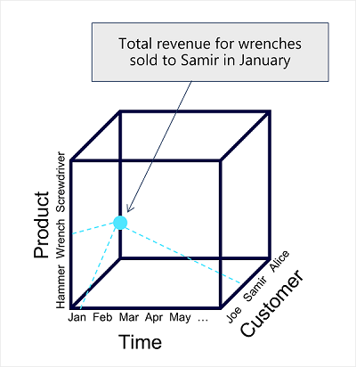
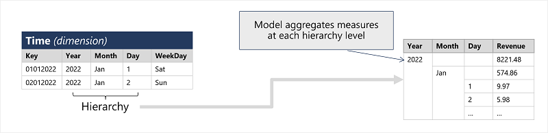

## Power BI Study Notes

- [Model a semantic model](#model-a-semantic-model)
- [Choose measures, calculated columns, and Power Query](#choose-measures-calculated-columns-and-power-query)
- [Design dates and relationships](#design-dates-and-relationships)
- [Plan refresh and gateways](#plan-refresh-and-gateways)
- [Secure and govern semantic models](#secure-and-govern-semantic-models)
- [Measure report performance](#measure-report-performance)

## Contents: Power BI

> **Modernization note:** Prefer Import mode for the richest modeling and interactive performance unless latency, data volume, source-enforced security, governance, or architecture requires another mode. Current alternatives include Direct Lake, hybrid tables, aggregations, incremental refresh, DirectQuery, and live connections to governed semantic models. See [DirectQuery guidance](https://learn.microsoft.com/en-us/power-bi/connect-data/desktop-directquery-about).

* [Part 1: Create and use analytics reports with Power BI](https://learn.microsoft.com/en-us/training/paths/create-use-analytics-reports-power-bi/)
* [Part 2: Model data in Power BI](https://learn.microsoft.com/en-us/training/paths/model-power-bi/)

## Describe core concepts of data modeling

- Analytical models enable you to structure data to support analysis. Models are based on related tables of data and define the numeric values that you want to analyze or report (known as measures) and the entities by which you want to aggregate them (known as dimensions). For example, a model might include a table containing numeric measures for sales (such as revenue or quantity) and dimensions for products, customers, and time. This would enable you aggregate sale measures across one or more dimensions (for example, to identify total revenue by customer, or total items sold by product per month). Conceptually, the model forms a multidimensional structure, which is commonly referred to as a cube, in which any point where the dimensions intersect represents an aggregated measure for those dimensions.)

    

- **Although we commonly refer to an analytical model as a cube, there can be more (or fewer) than three dimensions – it’s just not easy for us to visualize more than three!**
- This type of schema, where a fact table is related to one or more dimension tables, is referred to as a star schema (imagine there are five dimensions related to a single fact table – the schema would form a five-pointed star!).

    

- One final thing worth considering about analytical models is the creation of attribute hierarchies that enable you to quickly drill-up or drill-down to find aggregated values at different levels in a hierarchical dimension.

    

## Connection Types

| Connection Type | When to use it | Key considerations |
| --- | --- | --- |
| Import | Default choice for interactive reports and rich modeling. Data is loaded into the semantic model cache and reflects source changes after refresh. | Plan refresh, model size, gateway needs for on-premises data, and sensitivity or residency requirements. |
| DirectQuery | Source data changes too frequently for import, full ingestion is impractical, or source-enforced security must remain authoritative. | Each visual queries the source. Keep Power Query transformations foldable, target responsive source queries, limit page complexity, and assess concurrency, caching, and gateway latency. |
| Live connection | Reuse a centrally governed Power BI semantic model or Analysis Services model without duplicating its semantic logic. | The upstream semantic model remains authoritative; local modeling is limited until a local model is added. Respect source permissions and row-level security. |
| Composite semantic model | Combine Import, DirectQuery, Direct Lake, or remote semantic-model tables where a single connection mode is insufficient. | Cross-source relationships and data movement can affect security and performance. Use low-cardinality relationship keys and review permissions, source queries, and model-chain limits. See [composite model guidance](https://learn.microsoft.com/en-us/power-bi/transform-model/desktop-composite-models). |
| Direct Lake and hybrid tables | Use Direct Lake for supported Fabric lakehouse or warehouse scenarios; use hybrid tables when recent data needs DirectQuery latency while historical data remains imported. | Evaluate capacity, source support, and governance. Direct Lake on OneLake supports calculated tables that reference Direct Lake data in preview; Direct Lake on SQL endpoints does not. These options often reduce the need for a fully DirectQuery model. |
| OneLake integration | An Import semantic model on a supported Premium P or Fabric F capacity needs to make its imported tables reusable by Fabric workloads. | Model refresh exports Import tables as Delta tables in OneLake. This is a refresh-cadenced copy, not Direct Lake; validate permissions, RLS/OLS behavior, and the three-day Delta-version retention before downstream consumption. |
| Dataflows | Reuse data preparation logic across teams and semantic models. | Configure ownership, refresh, credentials, gateways, data lineage, and workspace access. Verify current licensing and Fabric or Power BI capabilities for the tenant. |

## Model a semantic model

Use a star schema for most analytical semantic models. It separates **dimension tables**, which describe entities used to filter and group data, from **fact tables**, which record events or observations and provide values to summarize.

- A dimension table should have a unique key and descriptive attributes, such as product name, category, customer, geography, or date.
- A fact table should have a clearly stated grain, such as one row per sales-order line or one row per daily inventory snapshot. Its foreign keys identify the dimensions, and its numeric columns are candidates for aggregation.
- Prefer one-to-many relationships from a dimension to a fact table. Clean duplicate, null, or unmatched key values at the source or in Power Query rather than using relationship settings to hide data-quality issues.
- Keep the model understandable for report authors. Hide technical keys, apply meaningful names and descriptions, and organize measures in display folders or a dedicated measure table.
- Use many-to-many relationships only when the business grain requires them. A bridge, also called a factless fact table, is frequently a clearer and more controllable design for relating two dimensions.

This separation improves usability and performance: dimensions filter and group; facts summarize. See [star schema guidance](https://learn.microsoft.com/en-us/power-bi/guidance/star-schema).

## Choose measures, calculated columns, and Power Query

Use the calculation mechanism that matches when and where a value should be produced:

| Need | Preferred approach | Reason |
| --- | --- | --- |
| Clean, split, type, join, or reshape source data | Power Query | Transform before loading so the semantic model contains a consistent reusable shape. |
| Dynamic aggregation that responds to report filters | DAX measure | A measure is evaluated at query time and returns a scalar result in the current filter context. |
| A row-level attribute required by relationships, slicers, grouping, or visual axes | Source column, Power Query custom column, or DAX calculated column | The value must exist as a column, but calculated columns can add model size or query/refresh cost. |
| A reusable business metric | Explicit DAX measure | It controls aggregation behavior and creates a governed definition for report authors. |

Examples:

```dax
Net Sales = SUM(Sales[NetSalesAmount])

Average Selling Price = DIVIDE([Net Sales], SUM(Sales[Quantity]))
```

Use `DIVIDE()` where a denominator could be zero, and keep measures focused on a single business definition. A calculated column evaluates for each row, whereas a measure evaluates in the filter context of a visual. For additional guidance, see [measures in Power BI](https://learn.microsoft.com/en-us/power-bi/transform-model/desktop-measures) and [calculated columns](https://learn.microsoft.com/en-us/power-bi/transform-model/desktop-calculated-columns).

## Design dates and relationships

Create or connect to a consistent date table for time intelligence. A model date table needs a date or date-time column with unique, nonblank, contiguous dates that span full years. Prefer an organization-owned date dimension when one exists; otherwise, generate a governed date table and mark it as a date table when required by the chosen time-intelligence approach.

- Auto date/time is suitable for simple exploration. A dedicated date table is better for governed models, multiple fact tables, fiscal calendars, and consistent calculations.
- For role-playing dates such as order, ship, and delivery date, use active relationships where possible. Separate role-specific date tables can be clearer than relying on multiple inactive relationships and `USERELATIONSHIP()` measures.
- Match relationship-column data types exactly. Remove the time component when relating business dates; a hidden time value can prevent expected matches.
- Use single-direction filters by default. Bi-directional filters and many-to-many relationships can create ambiguous paths, increase query cost, and complicate row-level security.

See [date table guidance](https://learn.microsoft.com/en-us/power-bi/guidance/model-date-tables) and [relationship guidance](https://learn.microsoft.com/en-us/power-bi/transform-model/desktop-relationships-understand).

## Plan refresh and gateways

Refresh behavior depends on storage mode. Import semantic models need data refresh because they hold a point-in-time copy. DirectQuery, Direct Lake, and live connection models query their underlying source during report interactions; their operational needs are different from Import refresh.

- Use scheduled or on-demand refresh for Import tables. Review refresh history and configure failure notifications for an owner and support contact.
- Use incremental refresh for large, append-heavy fact tables. Create case-sensitive `RangeStart` and `RangeEnd` date-time parameters, apply filters that fold to the source, and set a retention and refresh window that meets the business requirement.
- Use an enterprise on-premises data gateway for shared or production on-premises sources. Place all required source definitions for one semantic model on the same gateway connection, and separate Import refresh workloads from latency-sensitive DirectQuery workloads when appropriate.
- Use cloud-native connections for Fabric-native sources such as lakehouses and warehouses. Gateways are for supported external on-premises or non-Fabric sources; they are not a substitute for Fabric capacity, Direct Lake, or source-security design.
- Plan capacity for Import refresh: the service can need a second in-memory copy of a model while refreshing. Remove unused columns and rows before increasing refresh frequency.
- Source schema changes require a schema refresh and can break visuals, DAX, relationships, and row-level security. Test schema changes before production deployment.

See [data refresh in Power BI](https://learn.microsoft.com/en-us/power-bi/connect-data/refresh-data) and [incremental refresh guidance](https://learn.microsoft.com/en-us/power-bi/connect-data/incremental-refresh-overview).

## Secure and govern semantic models

Security must be designed at the data source, semantic model, workspace, and sharing layers.

- Apply least privilege to workspace access. Row-level security (RLS) restricts data for Viewer users; it doesn't restrict workspace Admin, Member, or Contributor roles because those roles can edit the semantic model.
- Define RLS roles in Power BI Desktop or web modeling, publish the semantic model, assign users or supported Microsoft Entra groups in the service, and validate the result before release.
- Use dynamic RLS only with a tested identity mapping. For example, a user-mapping table can filter by `USERPRINCIPALNAME()`. Test with actual guest users because cross-tenant identity formats can differ.
- RLS filters rows, not columns. Use object-level security when column or table metadata must be hidden.
- For DirectQuery with source single sign-on, understand where authorization is enforced and test with production-like identities. Composite models require an additional review because query values can move between sources.

See [row-level security guidance](https://learn.microsoft.com/en-us/fabric/security/service-admin-row-level-security).

## Measure report performance

Optimize the model before optimizing visuals: reduce unnecessary columns and high-cardinality attributes, keep relationships simple, and use the storage mode that fits the workload. Then measure actual report behavior.

1. Open **Performance Analyzer** in Power BI Desktop or when editing a report in the service.
2. Start recording, refresh the relevant visual or interaction, and identify the slowest component.
3. Compare DAX query, DirectQuery, visual display, and other durations to determine whether the bottleneck is the model, source, visual, or rendering path.
4. Copy the visual query for focused inspection, simplify the visual or DAX, verify query folding for DirectQuery, and retest.

For DirectQuery reports, reduce source load by limiting visuals per page, applying selective filters early, minimizing unnecessary cross-filtering, and ensuring the underlying source supports interactive query patterns. See [Performance Analyzer guidance](https://learn.microsoft.com/en-us/power-bi/create-reports/performance-analyzer).
