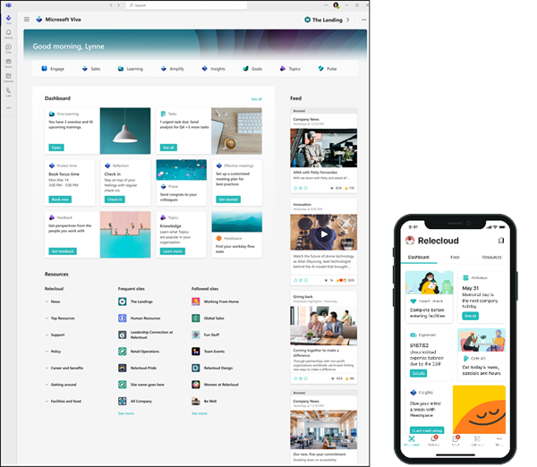
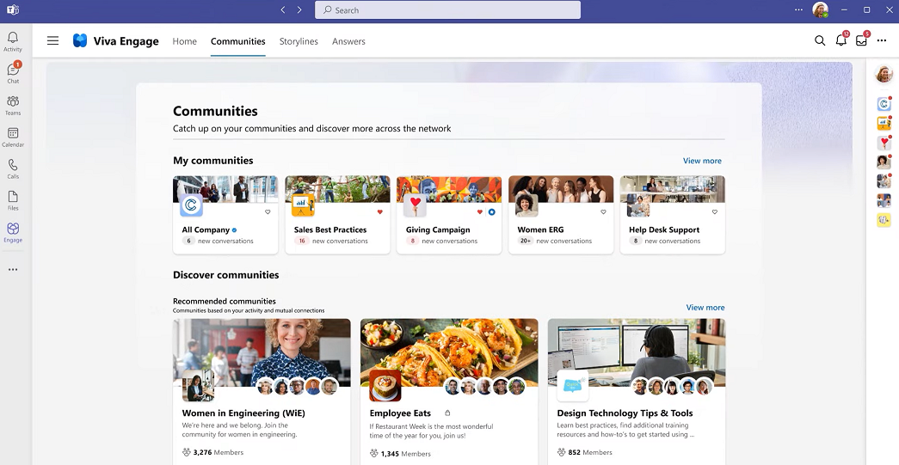
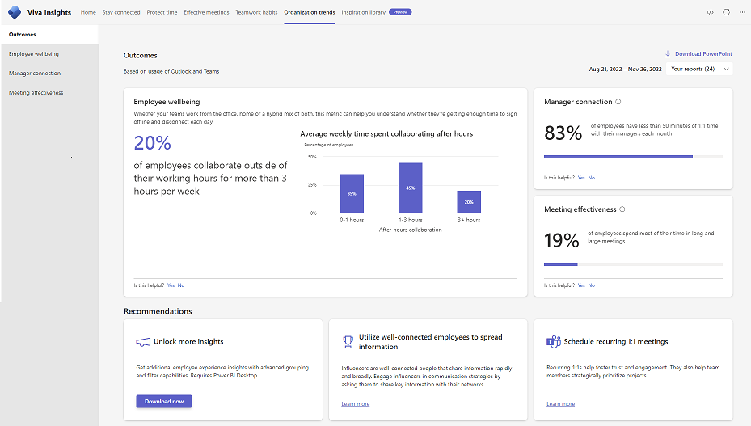
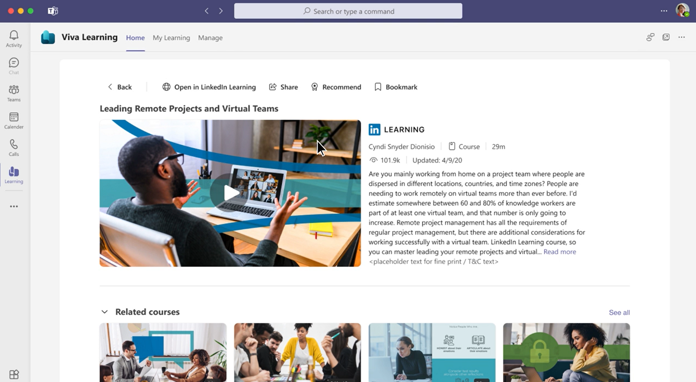
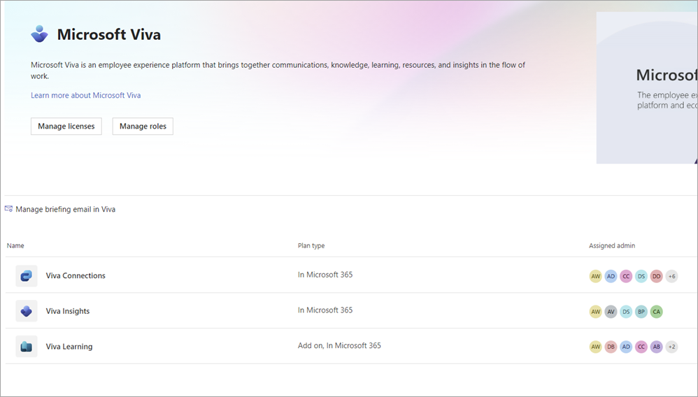

## Microsoft Viva Study Notes

> **Modernization note:** This is a 2023 study note. Microsoft Viva remains the employee experience platform in Microsoft 365 and Teams, but the original four-area model is not a complete current product map. Current Viva products include Amplify, Connections, Engage, Glint, Insights, Learning, and Pulse. Viva Goals retired on December 31, 2025. See [Microsoft Viva on Microsoft Learn](https://learn.microsoft.com/en-us/viva/).

> **Viva Topics retired:** Viva Topics was retired February 22, 2025. Published topic pages became standard SharePoint pages; AI-generated topic pages and automated topic experiences are no longer available. Use SharePoint, Microsoft Search, and Microsoft Copilot for governed knowledge discovery. See [Viva Topics retirement guidance](https://learn.microsoft.com/en-us/microsoft-365/topics/changes-coming-to-topics).

## Contents: Microsoft Viva

1. [Introduction to the Microsoft Viva suite](https://learn.microsoft.com/en-us/training/modules/viva-suite-introduction/)
1. [Get started with Microsoft Viva Connections](https://learn.microsoft.com/en-us/training/modules/viva-connections-get-started/)
1. [Extend Microsoft Viva Connections](https://learn.microsoft.com/en-us/training/paths/m365-extend-viva-connections/)
1. [Introduction to Viva Learning](https://learn.microsoft.com/en-us/training/modules/viva-learning-introduction/)
1. [Introduction to Viva Pulse](https://learn.microsoft.com/en-us/training/modules/viva-pulse-introduction/)
1. [Introduction to Microsoft Viva Glint](https://learn.microsoft.com/en-us/training/modules/viva-glint-introduction-viva-glint/)

**Connection:** Keep everyone informed, included, and inspired (Viva Connections and Viva Engage) 
**Insight:** Improve productivity and well-being with actionable insights (Viva Insights) 
**Purpose:** Historical OKR context only; Viva Goals retired December 31, 2025 
**Growth:** Help employees learn, grow and succeed (Viva Learning; Viva Topics is retired)

|                   |                                                                                                                                                                                                                                                 |                                                                                                                                                                                                                                                                                                                                                                                                                                                                                                                                                                                                                                                                      |
|-------------------|-------------------------------------------------------------------------------------------------------------------------------------------------------------------------------------------------------------------------------------------------|----------------------------------------------------------------------------------------------------------------------------------------------------------------------------------------------------------------------------------------------------------------------------------------------------------------------------------------------------------------------------------------------------------------------------------------------------------------------------------------------------------------------------------------------------------------------------------------------------------------------------------------------------------------------|
|**Experience area**|**Business scenario**                                                                                                                                                                                                                            |**Action**                                                                                                                                                                                                                                                                                                                                                                                                                                                                                                                                                                                                                                                            |
|**Connection**     |As a large healthcare group with over 33,000 employees, Lamna needs to ensure all employees are well informed, connected, and engaged.                                                                                                           |- The Lamna leadership assigned a steering committee, including various stakeholders, to work on the adoption of Viva.- The Office of Communications works with the Office of Information Technology to set Viva Connections as the Viva hub to integrate all other Viva apps. Lamna uses Viva Connections to send news and updates to employees through Feeds. Employees can access tools at Viva Connections Dashboard and Resources.- To encourage collaboration and networking, Lamna Communications Office works with other departments to set up communities for employees with Viva Engage, to encourage employees to ask questions, share ideas, and pictures.|
|**Insight**        |Lamna Healthcare wants to make sure its employees build good work habits that are both productive and sustainable.                                                                                                                               |- Lamna’s Office of Information Technology sets up Viva Insights for employees to access it from within Teams or using a web browser.- Individual employees book time for concentration, take necessary breaks, hold effective meetings, stay connected with colleagues, and disconnect from work during their off-hours.- Managers can use [Teamwork habits](https://learn.microsoft.com/en-us/viva/insights/org-team-insights/teamwork-habits) to help schedule one-on-ones with team members, understand the health of their team and follow up on tasks.                                                                                                         |
|**Purpose (historical)**|The leadership of Lamna Healthcare has started tracking objectives and key results (OKRs), giving teams throughout the organization clarity of purpose and establishing transparency between teams about progress, contributions, and alignment. |Viva Goals retired December 31, 2025. Continue the OKR practice through an approved work-management process rather than a new Viva Goals deployment.|
|**Growth**         |According to the responses to a recent organizational-wide survey, over 70% of Lamna Healthcare employees think that the opportunity for professional learning and development is one of the top reasons to continue working at Lamna Healthcare.|- The Office of the Chief Learning Officer sets up a centralized place where employees can find and consume learning content that supports job and career development.- For knowledge discovery, maintain governed SharePoint content, use Microsoft Search, and enable Microsoft Copilot only over approved, accessible data.|

- Viva Connections and Viva Engage both connect and inform people, but each has a different role. Viva Connections is the “home” for Microsoft Viva. It acts as the gateway to your employee experience. It brings curated personalized information and resources to each employee. Viva Engage powers the social layer of Microsoft Viva and Microsoft 365. Viva Engage connects you with leaders, colleagues, and communities.

    |                                                                    |                                             |                                                 |
    |--------------------------------------------------------------------|---------------------------------------------|-------------------------------------------------|
    |**Viva Connections only**                                           |**Shared**                                   |**Viva Engage only**                             |
    |- Digital tool set- Personalized news feed- Easy access to resources|- Organizational news- Engagement- Connection|- Leadership profiles- Stories- Networking/social|

    - Viva Connections

        

    - Viva Engage

        

- Viva Insights provides data-driven insights and targeted recommendations to foster productivity and wellbeing. With Viva Insights, your organization can gather and access information like:
    1. Personal Insights that are visible only to each employee. Personal Insights includes things like briefing emails in Outlook or information on their personal Viva Insights app in Teams or on the web. This way, people across the organization can learn more about how they work personally, and get recommendations to protect their time, focus, and productivity.
    1. Teamwork habits that provide a better understanding of how you work in teams, including your team meeting habits, impact on others' quiet hours, and whether you're getting enough one-on-one time with teammates.
    1. Organizational trends enable leadership and senior managers to see how their working culture might be affecting the overall well-being and work productivity of their people.
    - Viva Insights

        

- **Historical: Viva Goals.** Viva Goals provided an objectives and key results (OKR) management experience, but it retired on December 31, 2025. Preserve the OKR framework and governance process in an approved work-management solution; do not build new Viva Goals integrations.

    

- Viva Learning aggregates and curates formal learning content from supported providers and organization sources. Plan content ownership, audience targeting, permissions, and lifecycle before publishing learning pathways.
- **Historical: Viva Topics.** The topic-center and automatically curated-topic descriptions from the 2023 material are no longer applicable. Viva Topics was retired February 22, 2025. For a current knowledge-management approach, maintain SharePoint pages and content, apply appropriate permissions and governance, use Microsoft Search for discovery, and use Microsoft Copilot only with approved and accessible data sources.
    - Viva Learning

        

- Identify roles and responsibilities for adoption

    |                                                                                                                                                                                                                                         |                                                                                                               |
    |-----------------------------------------------------------------------------------------------------------------------------------------------------------------------------------------------------------------------------------------|---------------------------------------------------------------------------------------------------------------------------------------------------------------------------------------------------------------------------------------------------------------------------------------------------------------------------------------------------------------------------------------------------------------------------------------------------------------------------------------------------------------------------------------------------------------------------------------------------------------------|
    |**Roles****(Roles with \* are non-technical)**                                                                                                                                                                                           |**Sample tasks**                                                                                                                                                                                        |
    | *HR professionals, communication specialists* Business owners and managers- SharePoint admin, Microsoft Teams admin- Site owners and authors- \*Champions (early adopters), and executive sponsors- \*Business owners and managers.|- HR professionals, communication coordinators, and specialists work with business owners and managers to identify workflows or processes that can be done in Viva Connections.- Microsoft Teams admin adds Viva Connections as one of the apps in Microsoft Teams.- Site owners and members create and maintain home site and dashboard content.- Executive sponsors, champions help to ensure the smooth adoption of Viva Connections at the organization level.                                                                                                                                                   |
    | *Business stakeholders- Microsoft Teams admin- Viva Engage network admin, group admin, and verified admin*                                                                                                                             |- Business stakeholders like leadership and communication specialists can help identify how to leverage Viva Engage to support communities across the organization.- Microsoft Teams admin can create a Teams app policy for Viva Engage and pin it for all users across the organization.- Viva Engage admin sets up Viva Engage for the organization and assigns roles for Viva Engage.- Verified admins manage tasks related to security, configure, and make customizations for Viva Engage.- Network admins can configure and manage users and groups.                                                          |
    | *The executive leadership team in the organization- Microsoft 365 Enterprise or global admin- Microsoft Teams admin- Insights Administrator- Insights Business Leader*                                                                 | The executive leadership team helps identify who should be involved, and when, for setup and organization-wide adoption.- Global admin assigns roles, licenses, and manages app access.- Microsoft Teams admin can create a Teams app policy for Viva Insights and pin it for all users across the organization.- Insights Administrator sets up the advanced insights app and configures some group-level settings for the Viva Insights app in Teams and on the web.- The executive leadership team is assigned as Insights Business Leaders to view organization-level insights on the Organization trends page.|
    | *Microsoft 365 global admin or SharePoint admin.- Microsoft Teams admin- Knowledge admin- HR professionals, learning and professional development specialists, business leaders, and team managers.*                                    |-Global admin or knowledge admin incorporate content from SharePoint folders to Viva Learning.-SharePoint admin, knowledge admin, or global admin decide the content sources to use.-Microsoft Teams admin can create a Teams app policy for Viva Learning and pin it for all users across the organization.-HR professionals, learning and professional development specialists, business leaders and team managers help identify existing learning resources, and employee learning needs.-Knowledge admins use the Viva Learning admin tab to decide how content is displayed across the organization.            |
    |- *Sales team leaders- Microsoft 365 admin-Microsoft Teams admin*                                                                                                                                                                         |- Sales leaders can help identify an adoption strategy for Viva Sales.- Microsoft 365 admin installs Viva Sales using the Microsoft 365 admin center.- Microsoft Teams admin creates an app policy for Viva Sales and pins it in Teams.                                                                                                                                                                               |

- Microsoft Viva admin page experience

  

## Viva product map and selection

The historical Connection, Insight, Purpose, and Growth model remains useful for learning the original suite concepts. Select an individual Viva product based on a specific employee-experience outcome rather than assuming every product is required.

| Product | Primary outcome | Design considerations |
| --- | --- | --- |
| [Viva Connections](https://learn.microsoft.com/en-us/viva/connections/viva-connections-overview) | A branded, personalized entry point to SharePoint news, dashboard resources, and communities in Teams and Microsoft 365. | Establish a governed SharePoint home site, content owners, audience targeting, mobile experience, and lifecycle for dashboard cards. |
| [Viva Engage](https://learn.microsoft.com/en-us/viva/engage/overview) | Communities, leadership communication, questions, stories, and peer engagement. | Define community ownership, moderation, acceptable-use guidance, escalation, and retention expectations. |
| [Viva Insights](https://learn.microsoft.com/en-us/viva/insights/introduction) | Personal, team, and organizational insights that support work habits and well-being. | Understand privacy boundaries, aggregation thresholds, roles, permitted analyses, and how managers will act on findings. |
| [Viva Learning](https://learn.microsoft.com/en-us/viva/learning/) | Discovering, assigning, completing, and sharing learning content in the flow of work. | Select approved providers, define content ownership and metadata, confirm licensing and terms, and measure completion only when it is meaningful. |
| [Viva Pulse](https://learn.microsoft.com/en-us/viva/pulse/introduction-to-viva-pulse) | Short, research-backed team feedback surveys and manager follow-up. | Use a clear feedback purpose, protect respondent privacy, and commit to communicating and acting on results. |
| [Viva Glint](https://learn.microsoft.com/en-us/viva/glint/introduction-viva-glint) | Organization-scale employee engagement, lifecycle feedback, and action planning. | Require an HR-led measurement strategy, survey governance, confidentiality controls, manager enablement, and an action plan. |
| [Viva Amplify](https://learn.microsoft.com/en-us/viva/amplify/overview-viva-amplify) | Coordinated campaigns and communication publishing across Microsoft 365 channels. | Assign campaign owners, approval rules, target audiences, publishing calendar, and outcome measures. |

### Historical products and concepts

- **Viva Goals** retired on December 31, 2025. Keep the business OKR process, but select an approved work-management system and do not create new Viva Goals integrations.
- **Viva Topics** retired on February 22, 2025. Govern knowledge through SharePoint pages and metadata, Microsoft Search, and approved Microsoft Copilot experiences rather than attempting to restore automatic topic curation.
- Older training material may reference Yammer, the four-area suite model, legacy Viva Sales, or product capabilities that have changed. Use it to understand historical context, then confirm the target product's current documentation, licensing, regional availability, and tenant controls.

## Plan, adopt, and govern Viva

An employee-experience rollout is a change program, not merely an app deployment. Start with a measurable employee or business outcome, choose the smallest product set that supports it, and assign accountability for content and follow-up.

1. Define a target outcome such as faster access to workplace resources, stronger community participation, improved learning discovery, or an actionable feedback loop.
1. Identify users, audiences, sponsor, product owner, content owners, administrators, champions, privacy/compliance stakeholders, and support escalation path.
1. Inventory the existing SharePoint sites, communities, learning providers, survey processes, licenses, data classifications, and communication channels that the Viva experience will depend on.
1. Establish governance before launch: authoring and approval rules, audience targeting, moderation, data retention, external sharing, naming, accessibility, records requirements, and lifecycle/deletion decisions.
1. Pilot with a representative group. Test desktop and mobile experiences, guest or frontline-user scenarios where applicable, permissions, notification volume, accessibility, support readiness, and feedback collection.
1. Roll out in stages with clear user communication, enablement, office hours, champion feedback, adoption measures, and a cadence for improving or retiring content and communities.

### Roles and operating model

| Role | Accountable activities |
| --- | --- |
| Executive sponsor | Defines outcome, funds adoption, removes organizational blockers, and visibly supports the change. |
| Business product owner | Owns backlog, success measures, cross-functional decisions, and lifecycle of the employee experience. |
| Communications and HR | Own communication campaigns, employee messaging, community norms, feedback processes, and action follow-up. |
| SharePoint, Teams, and Viva administrators | Configure tenant settings, policies, app availability, permissions, security, service health, and support processes. |
| Site owners, community managers, and learning curators | Maintain content quality, accessibility, targeting, moderation, and retirement of outdated material. |
| Privacy, compliance, and legal stakeholders | Review data use, survey confidentiality, records/retention, employee-data handling, and regional requirements. |
| Champions and managers | Model usage, collect feedback, direct people to help, and turn insight or feedback into local action. |

## Measure outcomes and protect trust

Use a small set of measures tied to the objective. Do not treat raw activity counts as proof of engagement or employee well-being.

| Outcome | Example evidence | Guardrail |
| --- | --- | --- |
| Findability and communication | Time to find a resource, targeted-news reach, task completion, feedback on message clarity | Do not optimize for clicks at the expense of useful, accessible content. |
| Community health | Questions answered, helpful contributions, active community owners, moderation trends | Publish acceptable-use and escalation practices; do not expose sensitive employee discussions. |
| Learning enablement | Discovery success, skill-path completion where relevant, curator review of content quality | Completion is not competence; respect provider terms and learner privacy. |
| Feedback and engagement | Response trends, manager follow-up, documented actions, subsequent feedback | Protect confidentiality and communicate what was heard and changed. |
| Operational quality | Content freshness, broken links, support tickets, accessibility findings, owner coverage | Retire stale pages, cards, campaigns, and communities rather than letting them accumulate. |

Viva Insights, Pulse, and Glint can involve sensitive employee data. Explain the purpose and limits of each analysis, use approved roles and aggregation safeguards, minimize access, avoid using insights to make unsupported employment decisions, and ensure responsible owners act on feedback. Review the target product's current privacy and compliance documentation before collecting or analyzing employee data.
