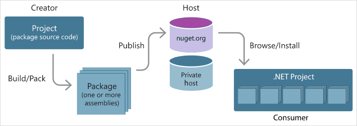
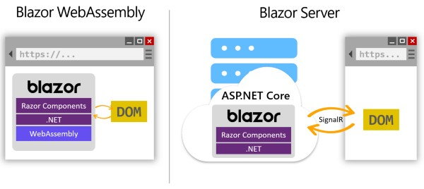
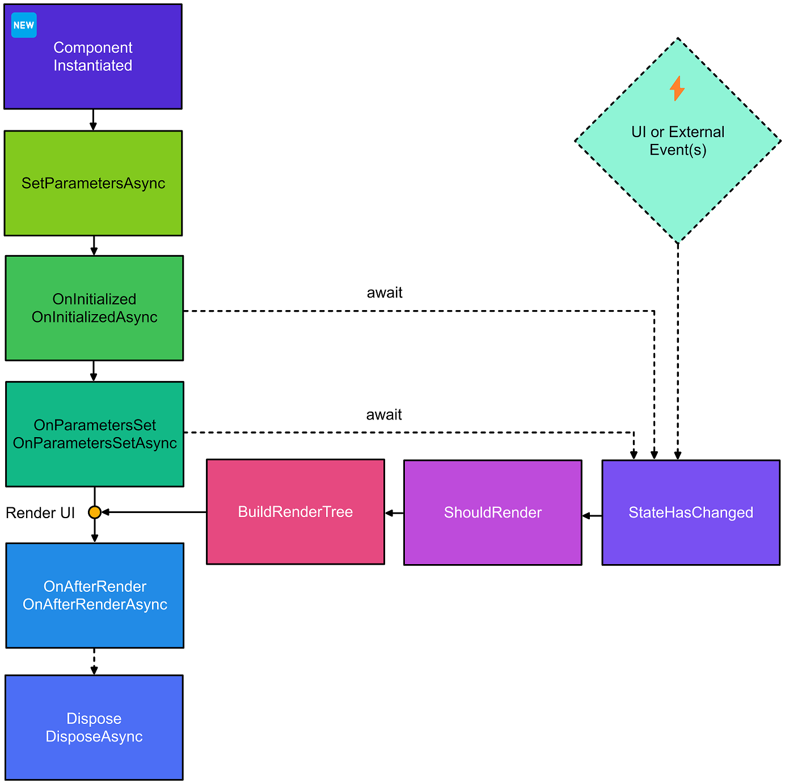
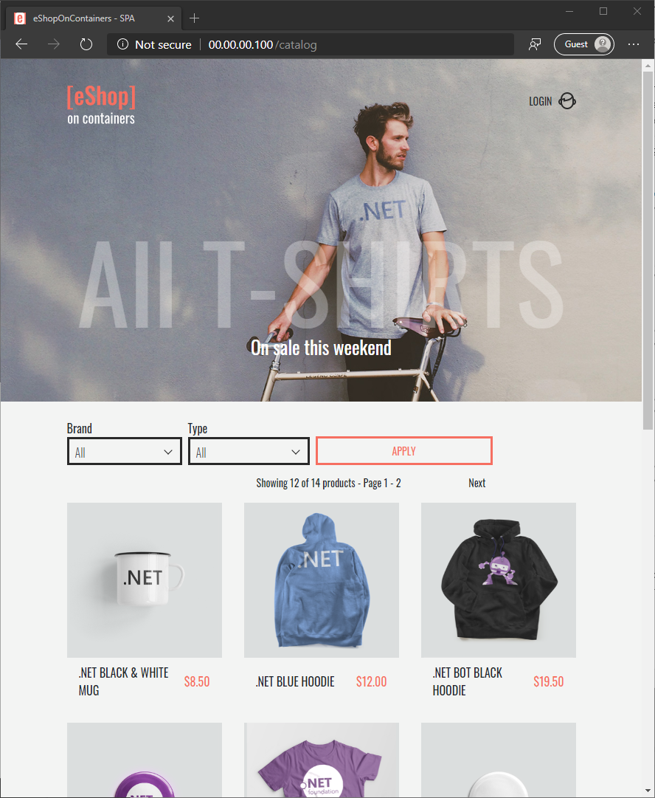

# Table of Contents 

  * [Ensuring accessibility](#ensuring-accessibility)
  * [Razor](#razor)
  * [Rest API](#rest-api)
  * [.NET](#net)
  * [App model](#app-model)
  * [Package](#package)
  * [Web Development with Blazor](#web-development-with-blazor)
  * [ASP.NET](#aspnet)

# Contents: .NET Challenge

As Tim Berners-Lee, the creator of the World Wide Web, once said: "The power of the Web is in its universality. Access by everyone regardless of disability is an essential aspect."

1. [Write your first C# code](https://learn.microsoft.com/enus/training/modules/csharpwritefirst)
1. [Get started with web development using Visual Studio Code](https://learn.microsoft.com/enus/training/modules/getstartedwithwebdevelopment)
1. [Learn the basics of web accessibility](https://learn.microsoft.com/enus/training/modules/webdevelopment101accessibility)
1. [Create a web UI with ASP.NET Core](https://learn.microsoft.com/enus/training/modules/createrazorpagesaspnetcore)
1. [Create a web API with ASP.NET Core controllers](https://learn.microsoft.com/enus/training/modules/buildwebapiaspnetcore)
1. [Publish a web app to Azure with Visual Studio](https://learn.microsoft.com/enus/training/modules/publishazurewebappwithvisualstudio)
1. [Introduction to .NET](https://learn.microsoft.com/enus/training/modules/dotnetintroduction)
1. [Create a new .NET project and work with dependencies](https://learn.microsoft.com/enus/training/modules/dotnetdependencies)
1. [Interactively debug .NET apps with the Visual Studio Code debugger](https://learn.microsoft.com/enus/training/modules/dotnetdebug)
1. [Work with files and directories in a .NET app](https://learn.microsoft.com/enus/training/modules/dotnetfiles)
1. [Introduction to Web Development with Blazor](https://learn.microsoft.com/enus/training/modules/blazorintroduction)
1. [Build a web app with Blazor](https://learn.microsoft.com/enus/training/modules/buildblazorwebassemblyvisualstudiocode)
1. [Interact with data in Blazor web apps](https://learn.microsoft.com/enus/training/modules/interactwithdatablazorwebapps)
1. [Use pages, routing, and layouts to improve Blazor navigation](https://learn.microsoft.com/enus/training/modules/usepagesroutinglayoutscontrolblazornavigation)
1. [Improve how forms and validation work in Blazor web apps](https://learn.microsoft.com/enus/training/modules/blazorimprovehowformswork)
1. [Build rich interactive components with Blazor web apps](https://learn.microsoft.com/enus/training/modules/blazorbuildrichinteractivecomponents)
1. [Build reusable components with Blazor](https://learn.microsoft.com/enus/training/modules/blazorbuildreusablecomponents)
1. [Build Connect Four game with Blazor](https://learn.microsoft.com/enus/training/modules/dotnetconnectfour)
1. [Externalize the configuration of an ASP.NET app by using an Azure key vault](https://learn.microsoft.com/enus/training/modules/aspnetconfigurationbuilder)
1. [Implement logging in a .NET Framework ASP.NET web application](https://learn.microsoft.com/enus/training/modules/aspnetlogging)
1. [Improve session scalability in a .NET Framework ASP.NET web application by using Azure Cache for Redis](https://learn.microsoft.com/enus/training/modules/aspnetsession)
1. [Build a web API with minimal API, ASP.NET Core, and .NET](https://learn.microsoft.com/enus/training/modules/buildwebapiminimalapi)
1. [Use a database with minimal API, Entity Framework Core, and ASP.NET Core](https://learn.microsoft.com/enus/training/modules/buildwebapiminimaldatabase)
1. [Create a full stack application by using React and minimal API for ASP.NET Core](https://learn.microsoft.com/enus/training/modules/buildwebapiminimalspa)
1. [Build your first microservice with .NET](https://learn.microsoft.com/enus/training/modules/dotnetmicroservices)
1. [Deploy a .NET microservice to Kubernetes](https://learn.microsoft.com/enus/training/modules/dotnetdeploymicroserviceskubernetes)
1. [Create and deploy a cloudnative ASP.NET Core microservice](https://learn.microsoft.com/enus/training/modules/microservicesaspnetcore)
1. [Implement resiliency in a cloudnative ASP.NET Core microservice](https://learn.microsoft.com/enus/training/modules/microservicesresiliencyaspnetcore)
1. [Instrument a cloudnative ASP.NET Core microservice](https://learn.microsoft.com/enus/training/modules/microservicesloggingaspnetcore)
1. [Implement feature flags in a cloudnative ASP.NET Core microservices app](https://learn.microsoft.com/enus/training/modules/microservicesconfigurationaspnetcore)
1. [Use managed data stores in a cloudnative ASP.NET Core microservices app](https://learn.microsoft.com/enus/training/modules/microservicesdataaspnetcore)
1. [Understand API gateways in a cloudnative ASP.NET Core microservices app](https://learn.microsoft.com/enus/training/modules/microservicesapigatewayaspnetcore)
1. [Deploy a cloudnative ASP.NET Core microservice with GitHub Actions](https://learn.microsoft.com/enus/training/modules/microservicesdevopsaspnetcore)

## Ensuring accessibility

1. Contrast checkers

Someone who is color-blind might not be able to differentiate between colors, or might have difficulty working with colors that are similar to one another. The World Wide Web Consortium (W3C), the standards organization for the web, established a [rating system for color contrast](https://www.w3.org/TR/UNDERSTANDING-WCAG20/visual-audio-contrast-contrast.html).

Choosing the right colors to ensure that your page is accessible to all can be tricky to do by hand. You can use the following tools to both generate appropriate colors and test your site to ensure compliance:

- Palette generation tools:
  - [Adobe Color](https://color.adobe.com/create/color-accessibility), an interactive tool for testing color combinations
  - [Color Safe](http://colorsafe.co/), a tool for generating text colors based on a selected background color
- Compliance checkers:
  - Browser extensions to test a page:

    - [Edge: WCAG Color contrast checker](https://microsoftedge.microsoft.com/addons/detail/wcag-color-contrast-check/idahaggnlnekelhgplklhfpchbfdmkjp)

    - [Firefox: WCAG Contrast checker](https://addons.mozilla.org/firefox/addon/wcag-contrast-checker/)

    - [Chrome: Colour Contrast Checker](https://chrome.google.com/webstore/detail/colour-contrast-checker/nmmjeclfkgjdomacpcflgdkgpphpmnfe)

  - Applications:

    - [Colour Contrast Analyser (CCA)](https://www.tpgi.com/color-contrast-checker/)

2. ARIA attributes

Someone who's using a screen reader would only hear the words _description_ and _order_ repeated without context.

To support these types of scenarios, HTML supports a set of attributes known as [Accessible Rich Internet Applications (ARIA)](https://developer.mozilla.org/docs/Web/Accessibility/ARIA). You can use these attributes to provide more information to screen readers.

For example, you can use aria-label to describe a link when the format of the page doesn't allow you to. The description for _widget_ might be set as:

```html
<a href="#"aria-label="Widget description">description</a>
```

3. [Web Development for Beginners](https://github.com/microsoft/Web-Dev-For-Beginners)

## Razor

1. Tutorial

https://github.com/MicrosoftDocs/mslearn-create-razor-pages-aspnet-core

```
dotnet --list-sdks
cd Contosopizza
dotnet watch
```
Ctrl + R : Reload

```
dotnet new page --name PizzaList --namespace ContosoPizza.Pages --output Pages
```

Observe the combination of HTML, Razor Syntax, and C# code in the file.

- Razor Syntax is denoted by @ characters.
- C# code is enclosed in @{ } blocks. Take note of the directives at the top of the file:
- The @page directive specifies that this file is a Razor page.
- The @model directive specifies the model type for the page (in this case, IndexModel, which is defined in Pages/Index.cshtml.cs).

- The code sets the value of the Title item within the ViewData dictionary to "Home page".
- The ViewData dictionary is used to pass data between the Razor page and the IndexModel class.
- At runtime, the Title value is used to set the page's `<title>` element.

2. Separation of concerns: 

    Razor Pages enforces separation of concerns with a C# PageModel class, encapsulating data properties and logic operations scoped to its Razor page, and defining page handlers for HTTP requests. 
    The PageModel class is a partial class that is automatically generated by the ASP.NET Core project template. The PageModel class is located in the Pages folder and is named after the Razor page. For example, the PageModel class for the Index.cshtml Razor page is named IndexModel.cs.

3. Use Razor Pages in your ASP.NET Core app when you:

- Want to generate dynamic web UI.
- Prefer a page-focused approach.
- Want to reduce duplication with partial views.

    Razor Pages simplifies ASP.NET Core page organization by keeping related pages and their logic together in their own namespace and directory.

4. `Tag helpers` are used to address the inefficiencies of context switching between HTML and C#. Most of ASP.NET Core's built-in Tag helpers extend standard HTML elements. Tag helpers provide extra server-side attributes for HTML elements, making the elements more robust.

There are four tag helpers you should know for this project: <em>Partial, Label, Input, and Validation Summary Message</em>.

Use an asp-for attribute to specify a PageModel property. 

```html
<partial name="_ValidationScriptsPartial" />
```
```html
<label asp-for="Foo.Id" class="control-label"></label>
```
```html
<input asp-for="Foo.Id" class="form-control" />
```
```html
<div asp-validation-summary="All"></div>
```

## Rest API

Representational State Transfer (REST) is an architectural style for building web services. REST requests are made over HTTP. They use the same HTTP verbs that web browsers use to retrieve webpages and send data to servers. The verbs are:

- GET: Retrieve data from the web service.
- POST: Create a new item of data on the web service.
- PUT: Update an item of data on the web service.
- PATCH: Update an item of data on the web service by describing a set of instructions about how the item should be modified. The sample application in this module doesn't use this verb.
- DELETE: Delete an item of data on the web service.

Build and test the web API

```cmd
dotnet new webapi -f net6.0
```

Build and test the web API
```cmd
dotnet run
```

Build the web API
```
dotnet build
```

 .NET HTTP REPL command-line tool that you'll use to make HTTP requests to the web API.
 ```
 dotnet tool install -g Microsoft.dotnet-httprepl
 httprepl https://localhost:{PORT}
 connect https://localhost:{PORT}
 exit
 ```

 ASP.Net Core Controller

 ```csharp
 using Microsoft.AspNetCore.Mvc;

namespace ContosoPizza.Controllers;

[ApiController]
[Route("[controller]")]
public class WeatherForecastController : ControllerBase
{
    private static readonly string[] Summaries = new[]
    {
        "Freezing", "Bracing", "Chilly", "Cool", "Mild", "Warm", "Balmy", "Hot", "Sweltering", "Scorching"
    };

    private readonly ILogger<WeatherForecastController> _logger;

    public WeatherForecastController(ILogger<WeatherForecastController> logger)
    {
        _logger = logger;
    }

    [HttpGet(Name = "GetWeatherForecast")]
    public IEnumerable<WeatherForecast> Get()
    {
        return Enumerable.Range(1, 5).Select(index => new WeatherForecast
        {
            Date = DateTime.Now.AddDays(index),
            TemperatureC = Random.Shared.Next(-20, 55),
            Summary = Summaries[Random.Shared.Next(Summaries.Length)]
        })
        .ToArray();
    }
}
 ```

Visual Studio

- Press F5 to build the project and run in debug mode.

- Press Ctrl+F5 to build the project and run without attaching the debugger.

Razor is an ASP.NET syntax used to create dynamic web pages with C#. 

```asp.net
@page
@model PrivacyModel
@{
    ViewData["Title"] = "Privacy Policy";
}
<h1>@ViewData["Title"]</h1>

<p>Use this page to detail your site's privacy policy.</p>
```

The @page directive is telling ASP.NET to process this file as a Razor page.

The @model directive is telling ASP.NET to tie this Razor page with a C# class called PrivacyModel.

## .NET

.NET is an ecosystem for application development

## App model

| **App model** | **Framework** | **Notes** |
| --- | --- | --- |
| Web | ASP.NET Core | The framework for building server-side logic. |
| --- | --- | --- |
| Web | ASP.NET Core MVC | The framework for building server-side logic for web pages or web APIs. |
| Web | ASP.NET Core Razor Pages | The framework for building server-generated HTML. |
| Web client | Blazor | Blazor is a part of ASP.NET Core. Its two modes allow for either Document Object Model (DOM) manipulation via sockets as a communication vehicle for running server-side code, or a WebAssembly implementation for running compiled C# on a browser. |
| Desktop | WinForms | A framework for building "battleship gray" Windows-style applications. |
| Desktop | Windows Presentation Foundation (WPF) | A framework for building dynamic desktop applications that conform to different form factors. WPF allows form elements to perform movement, fades, glides, and other effects with the help of a rich library of animations. |
| Mobile | Xamarin | Allows .NET developers to build apps for iOS and Android devices. |

[.NET Videos](https://dotnet.microsoft.com/en-us/learn/videos)

.NET has the fastest web framework on the planet according to [TechEmpower benchmarks](https://www.techempower.com/benchmarks/#section=data-r19&hw=ph&test=plaintext&a=2?azure-portal=true), an independent, open-source set of web performance benchmarks that measure dozens of languages and application frameworks.

## package

A package dependency is a third-party library. It's a piece of reusable code that accomplishes something and can be added to your application. 



`https://www.nuget.org/packages/<package name>.` 

`dotnet add package <package name>`

```bash
-| bin/
---| Debug/
------| net3.1
--------| <files included in the dependency>
```

`dotnet list package`

`dotnet list package --include-transitive`

`dotnet remove package <name of dependency>`

Create a console application

`dotnet new console -f net6.0`

- Versioning

Major version: I'm OK with updating to the latest major version as soon as it's out. I accept the fact that I might need to change code on my end.

Minor version: I'm OK with a new feature being added. I'm not OK with code that breaks.

Patch version: The only updates I'm OK with are bug fixes.

- NuGet version ranges

```bash
1.0	x >= 1.0	Minimum version, inclusive
(1.0,)	x > 1.0	Minimum version, exclusive
[1.0]	x == 1.0	Exact version match
(,1.0]	x ≤ 1.0	Maximum version, inclusive
(,1.0)	x < 1.0	Maximum version, exclusive
[1.0,2.0]	1.0 ≤ x ≤ 2.0	Exact range, inclusive
(1.0,2.0)	1.0 < x < 2.0	Exact range, exclusive
[1.0,2.0)	1.0 ≤ x < 2.0	Mixed inclusive minimum and exclusive maximum version
(1.0)	invalid	invalid
```

`dotnet list package`

`dotnet list package --outdated`

- Logging and tracing 

```csharp
using System.Diagnostics;

Console.WriteLine("This message is readable by the end user.");
Trace.WriteLine("This is a trace message when tracing the app.");
Debug.WriteLine("This is a debug message just for developers.");
Debug.WriteIf(count == 0, "Count should not be 0.");
```

- Work with the file system

```csharp
using System.IO;
using System.Collections.Generic;

// List all content in a directory and all subdirectories
// Find all *.txt files in the stores folder and its subfolders
IEnumerable<string> allFilesInAllFolders = Directory.EnumerateFiles("stores", "*.txt", SearchOption.AllDirectories);

Console.WriteLine(Directory.GetCurrentDirectory());

string docPath = Environment.GetFolderPath(Environment.SpecialFolder.MyDocuments);

Console.WriteLine(Path.Combine("stores","201")); // outputs: stores/201

Console.WriteLine(Path.GetExtension("sales.json")); // outputs: .json

Directory.CreateDirectory(Path.Combine(Directory.GetCurrentDirectory(), "stores","201","newDir"));

bool doesDirectoryExist = Directory.Exists(filePath);

File.WriteAllText(Path.Combine(Directory.GetCurrentDirectory(), "greeting.txt"), "Hello World!");

File.ReadAllText($"stores{Path.DirectorySeparatorChar}201{Path.DirectorySeparatorChar}sales.json");
```

## Web Development with Blazor

Blazor is a user-interface framework built on .NET and Razor. Blazor applications can run on a server as part of an ASP.NET application, or can be deployed to run in the browser on a user's machine similar to a single-page-application.



- Blazor Server is an implementation of the Blazor user-interface framework as part of the ASP.NET Core web development framework, deployed to a web server. Developing an application with Blazor Server generates HTML on a web server as it is requested by web site visitors, typically using a web browser. That HTML is then delivered to the visitor's browser, and a two-way communication pipeline is maintained using ASP.NET Core SignalR and preferring a Web Sockets connection.

- Blazor WebAssembly, sometimes shortened to Blazor WASM, is an implementation of the Blazor user-interface framework that runs on the HTML 5 standard WebAssembly runtime present in all modern browsers. The binary output of your application, the DLL files, are transmitted to the browser and run with a version of .NET that has been optimized to work with the WebAssembly runtime regardless of the underlying operating system of the device browsing to the website.

| **Criteria** | **You could choose Blazor Server because...** | **You could choose Blazor WebAssembly because...** |
| --- | --- | --- |
| Developers are familiar with .NET | Building applications will feel like a familiar ASP.NET Core application | Building applications will use your existing skills to run natively in the browser |
| --- | --- | --- |
| Need to integrate with existing .NET investments | There is an existing model for integrating with ASP.NET Core applications | Allowing those resources to run natively in the browser gives better interaction and perceived performance than connecting to a web server |
| Existing web servers | Your existing web servers are running ASP.NET Core | You need to deploy your application to any server without need for server-side rendering |
| Complexity of the application | Your application has heavy processing requirements that benefit from distributed applications running in a data center | Your application can benefit from running with native processor speeds on the client |
| Network requirements | Your application will always be connected to a server | Your application can run in 'occasionally connected' mode without requiring constant interaction with a server |
| Code security requirements | Your application is validated or required to run in specific geographic locations that can be enforced with a server | Your application code can run anywhere on any device without this requirement |


Create a new Blazor app
```
dotnet new blazorserver -f net6.0
```

```sh
-| bin
-| Data
-| obj
-| Pages
  -| _Host.cshtml
  -| Counter.razor
  -| Error.cshtml
  -| Error.cshtml.cs
  -| FetchData.razor
  -| Index.razor
-| Properties
-| Shared
  -| MainLayout.razor
  -| MainLayout.razor.css
  -| NavMenu.razor
  -| NavMenu.razor.css
  -| SurveyPrompt.razor
-| wwwroot
-| _Imports.razor
-| App.razor
-| appsettings.Development.json
-| appsettings.json
-| BlazorApp.csproj
-| Program.cs
```

Run the app
```
dotnet watch run
```

Razor

```html
@page "/counter"

<h1>Counter</h1>

<p role="status">Current count: @currentCount</p>

<button class="btn btn-primary" @onclick="IncrementCount">Click me</button>

@code {
    private int currentCount = 0;

    private void IncrementCount()
    {
        currentCount++;
    }
}
```

In this hierarchy of parent and child components, you can share information between them by using component parameters. You start by defining the component parameter in the child component. It's defined as a C# public property and decorated with the [Parameter] attribute:

```html
<h2>New Pizza: @PizzaName</h2>

<p>@PizzaDescription</p>

@code {
    [Parameter]
    public string PizzaName { get; set; }
    
    [Parameter]
    public string PizzaDescription { get; set; } = "The best pizza you've ever tasted."
}
```

Data binding

Use data binding to connect an HTML element to a field, property, or expression. This way, when the value changes, the HTML element is automatically updated. 

```html
@page "/"

<h1>My favorite pizza is: @favPizza</h1>

<p>
    Enter your favorite pizza:
    <input @bind="favPizza" />
</p>

@code {
    private string favPizza { get; set; } = "Margherita"
}
```

```bash
git clone https://github.com/MicrosoftDocs/mslearn-interact-with-data-blazor-web-apps.git BlazingPizza
```

Navigation

```bash
git clone https://github.com/MicrosoftDocs/mslearn-blazor-navigation.git BlazingPizza
```

Route parameters

```csharp
@page "/FavoritePizzas/{favorite}"

<h1>Choose a Pizza</h1>

<p>Your favorite pizza is: @Favorite</p>

@code {
	[Parameter]
	public string Favorite { get; set; }
}
```

```csharp
@inject NavigationManager NavigationManager
```

Layout

Layout components don't include a @page directive because they don't handle requests directly and shouldn't have a route created for them. Instead, the referencing components use the @page directive.

```csharp
@inherits LayoutComponentBase

<header>
	<h1>Blazing Pizza</h1>
</header>

<nav>
	<a href="Pizzas">Browse Pizzas</a>
	<a href="Toppings">Browse Extra Toppings</a>
	<a href="FavoritePizzas">Tell us your favorite</a>
	<a href="Orders">Track Your Order</a>
</nav>

@Body

<footer>
	@new MarkdownString(TrademarkMessage)
</footer>

@code {
	public string TrademarkMessage { get; set; } = "All content is &copy; Blazing Pizzas 2021";
}
```

```csharp
@page "/FavoritePizzas/{favorite}"
@layout BlazingPizzasMainLayout

<h1>Choose a Pizza</h1>

<p>Your favorite pizza is: @Favorite</p>

@code {
	[Parameter]
	public string Favorite { get; set; }
}
```

Event Handling

```bash
git clone https://github.com/MicrosoftDocs/mslearn-use-forms-in-blazor-web-apps.git BlazingPizza
```

EditForm

```csharp
<EditForm Model=@currentForecast>
    <InputNumber @bind-Value=currentForecast.TemperatureC width="5" min="-100" step="5"></InputNumber>
</EditForm>
```

```csharp
<EditForm Model=Order.DeliveryAddress OnValidSubmit=PlaceOrder OnInvalidSubmit=ShowError>
```

Blazor component lifecycle



```bash
git clone https://github.com/MicrosoftDocs/mslearn-build-interactive-components-blazor.git BlazingPizza
```

Razor class libraries

By using Razor class libraries, you can share and reuse user-interface components between Blazor applications. In this module, you'll focus on building and sharing components for Blazor applications.

## ASP.NET

Configuration builders for ASP.NET

Implement logging in an ASP.NET web app

Store session state information in an ASP.NET web app

```
git clone https://github.com/dotnet-architecture/eShopModernizing.git
```

log4net

```xml
<log4net>
  <root>
    <level value="ALL" />
    <appender-ref ref="file" />
  </root>
  <appender name="file" type="log4net.Appender.RollingFileAppender">
    <file value="logFiles\myapp.log" />
    <appendToFile value="true" />
    <rollingStyle value="Size" />
    <maxSizeRollBackups value="5" />
    <maximumFileSize value="10MB" />
    <staticLogFileName value="true" />
    <layout type="log4net.Layout.PatternLayout">
      <conversionPattern value="%date [%thread] %property{activity} %level %logger - %property{requestinfo}%newline%message%newline%newline" />
    </layout>
  </appender>
</log4net>
```

Swagger

```csharp
using Microsoft.OpenApi.Models;

var builder = WebApplication.CreateBuilder(args);

builder.Services.AddEndpointsApiExplorer();
builder.Services.AddSwaggerGen(c =>
{
     c.SwaggerDoc("v1", new OpenApiInfo {
         Title = "PizzaStore API",
         Description = "Making the Pizzas you love",
         Version = "v1" });
});

var app = builder.Build();
app.UseSwagger();
app.UseSwaggerUI(c =>
{
   c.SwaggerEndpoint("/swagger/v1/swagger.json", "PizzaStore API V1");
});

app.MapGet("/", () => "Hello World!");

app.Run();
```

- https://github.com/DamianEdwards/MinimalApiPlayground 


- [Create a full stack application by using React and minimal API for ASP.NET Core](https://learn.microsoft.com/en-us/training/modules/build-web-api-minimal-spa/)

```bash
git clone https://github.com/microsoftdocs/mslearn-dotnet-kubernetes
```

- Cloud Native Microservice: eShopOnContainers Solution architecture



Solution diagram


```bash
https://github.com/dotnet-architecture/eshoponcontainers
```

[Free e-book: .NET Microservices: Architecture for Containerized .NET Applications](https://learn.microsoft.com/en-us/dotnet/architecture/microservices/)

To implement code-based resiliency, this module uses Polly, which is a .NET library for resilience and transient failure handling. 

Some popular service mesh options for Kubernetes clusters include Linkerd, Istio, and Consul. 

[Video](https://aka.ms/microservices-video): Implement microservices patterns with .NET and Docker containers

- Enable Azure Monitor for Containers

```sh
az aks enable-addons \
    --addons monitoring \
    --name eshop-learn-aks \
    --resource-group eshop-learn-rg \
    --query provisioningState
```